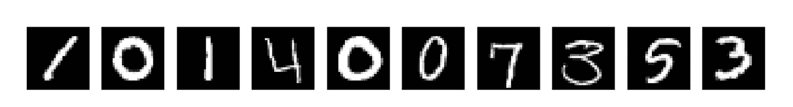
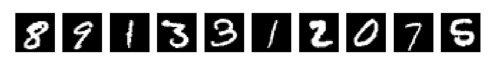
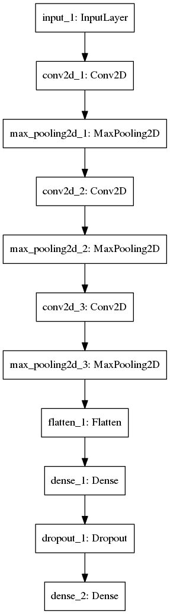
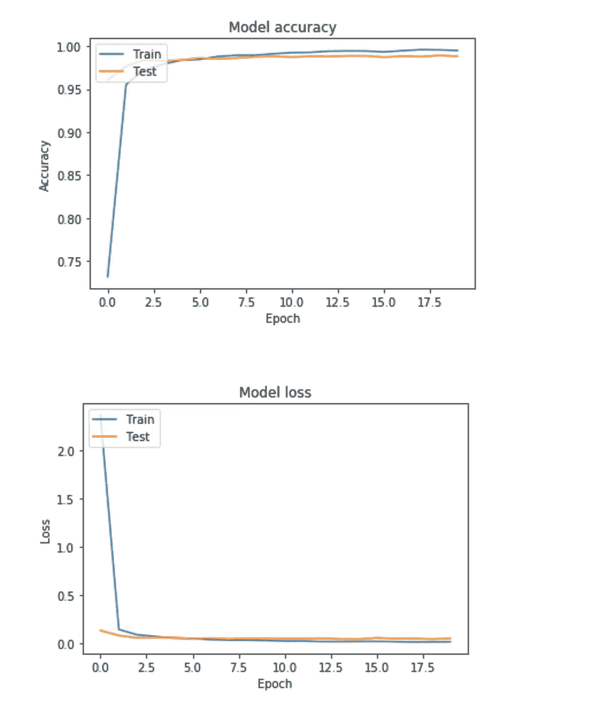
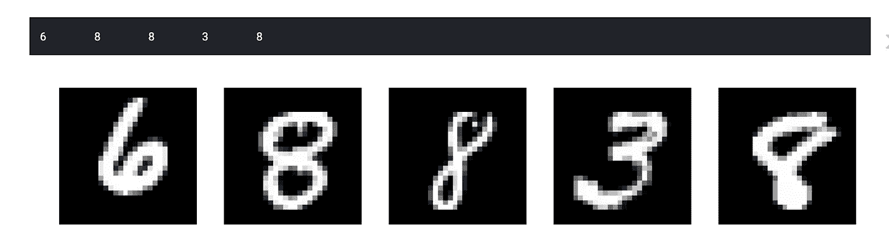
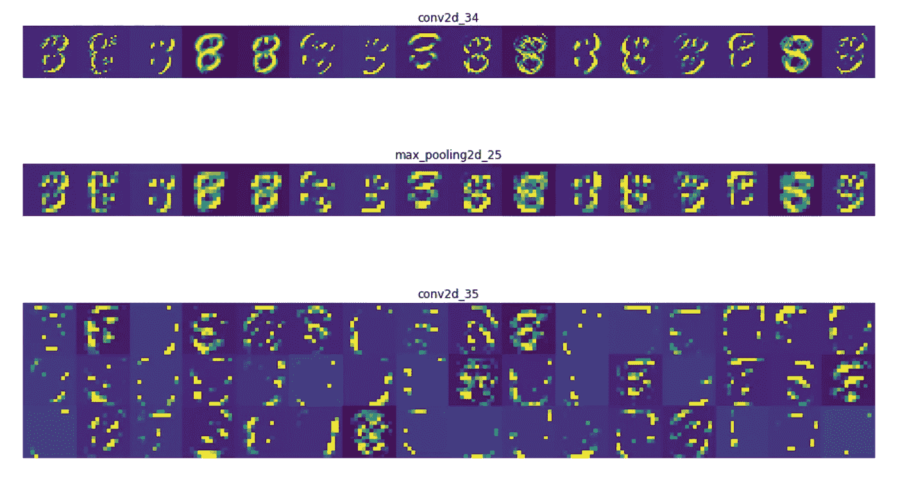
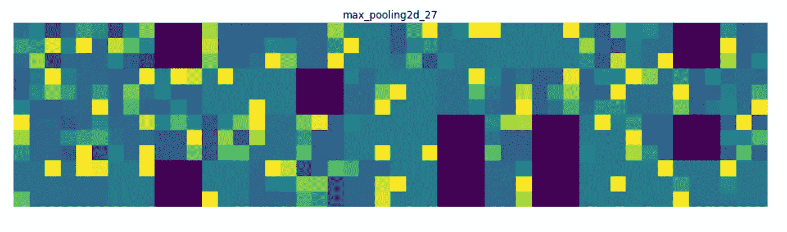

# 可视化在 MNIST 数据集上训练的 CNN 的中间激活

> 原文：<https://towardsdatascience.com/visualizing-intermediate-activations-of-a-cnn-trained-on-the-mnist-dataset-2c34426416c8?source=collection_archive---------11----------------------->

在本文中，我们不仅要使用 Keras 和 Python 训练一个卷积神经网络来分类手写数字，还要可视化卷积神经网络的中间激活，以便深入了解每一层学习图像的哪些特征。

我们将使用 MNIST 数据集，它可以在 Kaggle 上的[这里](https://www.kaggle.com/c/digit-recognizer/overview)找到。该数据集在训练集中包含 42000 行，在测试集中包含 24000 行。每行包含 784 个像素值，表示包含从 0 到 9 的手写单数数字的 28 x 28 图像。

让我们深入研究代码。

首先，我们必须导入所有模块:

```
import numpy as np
import pandas as pd
import os
import matplotlib.pyplot as plt
from keras.layers import Dense, Dropout, Flatten
from keras.layers import Conv2D, MaxPooling2D, Input
from keras.models import Model
from sklearn.model_selection import train_test_split
```

现在，让我们将 CSV 文件加载到一个[熊猫](https://pandas.pydata.org/)数据帧中，并使用 [numpy](https://www.numpy.org/) 将它们重新整形为 28 x 28 x 1 的图像。

> 注意:所有图像都是灰度图像，因此它们只有一个通道

```
train_df = pd.read_csv("../input/train.csv")
test_df = pd.read_csv("../input/test.csv")train_labels = train_df['label']
train_dataset = train_df.drop('label',axis=1)X = np.array(train_dataset).reshape(train_df.shape[0],28,28,1)
Y = np.array(train_labels).reshape(train_df.shape[0],1)
```

让我们来看看我们的一些训练图像:

```
f, axes = plt.subplots(2, 10, sharey=True,figsize=(20,20))for i,ax in enumerate(axes.flat):
    ax.axis('off')
    ax.imshow(X[i,:,:,0],cmap="gray")
```



## 构建我们的 CNN 架构

我们将使用 [Keras Functional API](https://keras.io/models/model/) 来构建我们的 CNN 模型。我从 Chris Deotte 的 [Kaggle 笔记本](https://www.kaggle.com/cdeotte/how-to-choose-cnn-architecture-mnist)中获得了 CNN 架构的灵感。

```
def model():

    inputs = Input(shape=(28,28,1))
    x = Conv2D(24,kernel_size=(3,3),padding='same',activation="relu")(inputs)
    x = MaxPooling2D(pool_size=(2, 2))(x)
    x = Conv2D(48, (3, 3), padding='same',activation='relu')(x)
    x = MaxPooling2D(pool_size=(2, 2))(x)
    x = Conv2D(64, (3, 3), padding='same',activation='relu')(x)
    x = MaxPooling2D(pool_size=(2, 2))(x)
    x = Flatten()(x)
    x = Dense(128, activation='relu')(x)
    x = Dropout(0.25)(x)
    output = Dense(num_classes,activation="softmax")(x)

    model = Model(inputs,output)

    model.compile(loss='categorical_crossentropy', 
              optimizer='adam', 
              metrics=['accuracy'])

    return model
```



现在是训练的时候了:

```
X_train, X_test, y_train, y_test = train_test_split(X,Y_one_hot,test_size=0.20, random_state=42)epochs = 20
batch_size=256

model = model()
history = model.fit(X_train,y_train,
         epochs=epochs,
         batch_size=batch_size,
         validation_data=(X_test,y_test))
```

*这最终给出了 99.50%的训练准确度和 98.83%的验证准确度。*

> 注意:我们本可以在验证准确性方面做得更好，使用数据增强并对 Dropout 和 BatchNorm 层进行试验**但是**本文的重点不是获得极高的准确性，而是能够深入了解网络的每一层实际上在学习什么，对于这项任务，我们的模型将做得很好。

让我们快速绘制一张我们的训练和验证准确性以及损失的图表:



## 让模型旋转一下

```
figure = plt.figure(figsize=(20,20))for i in range(5):
    figure.add_subplot(1,5,i+1)
    plt.imshow(test_images[i+50,:,:,0],cmap="gray")
    plt.axis("off")
    print(np.squeeze(np.argmax(model.predict(test_images[i+50].reshape(1,28,28,1)),axis=1),axis=0),end="\t")
```



如我们所见，我们的模型给出了相当不错的结果。

## 可视化中间激活

我们期待已久的时刻。

我们首先要决定哪一层的激活我们想要可视化，并建立我们的激活模型。

```
layer_outputs = [layer.output for layer **in** model.layers[1:7]]
activation_model = Model(inputs=model.input,outputs=layer_outputs)
```

我们现在从测试数据集中选择一个随机图像，我们将在其上使用我们的激活模型。

```
img = test_images[51].reshape(1,28,28,1)fig = plt.figure(figsize=(5,5))
plt.imshow(img[0,:,:,0],cmap="gray")
plt.axis('off')
```


我们现在使用我们的激活模型来输出所选层的激活。

```
activations = activation_model.predict(img)
```

是时候用一些 [matplotlib](https://matplotlib.org/) 魔法将它们可视化了。🙂

```
layer_names = []
for layer in model.layers[1:7]:
    layer_names.append(layer.name) # Names of the layers, so you can have them as part of your plot

images_per_row = 16for layer_name, layer_activation in zip(layer_names, activations): # Displays the feature maps
    n_features = layer_activation.shape[-1] # Number of features in the feature map
    size = layer_activation.shape[1] #The feature map has shape (1, size, size, n_features).
    n_cols = n_features // images_per_row # Tiles the activation channels in this matrix
    display_grid = np.zeros((size * n_cols, images_per_row * size))
    for col in range(n_cols): # Tiles each filter into a big horizontal grid
        for row in range(images_per_row):
            channel_image = layer_activation[0,
                                             :, :,
                                             col * images_per_row + row]
            channel_image -= channel_image.mean() # Post-processes the feature to make it visually palatable
            channel_image /= channel_image.std()
            channel_image *= 64
            channel_image += 128
            channel_image = np.clip(channel_image, 0, 255).astype('uint8')
            display_grid[col * size : (col + 1) * size, # Displays the grid
                         row * size : (row + 1) * size] = channel_image
    scale = 1\. / size
    plt.figure(figsize=(scale * display_grid.shape[1],
                        scale * display_grid.shape[0]))
    plt.title(layer_name)
    plt.grid(False)
    plt.imshow(display_grid, aspect='auto', cmap='viridis')
```



由此我们可以推断出几点:

*   第一层几乎保留了图像的全部形状，也保留了图像中的大部分信息
*   随着我们深入网络，我们可以看到激活变得更加复杂和抽象。它开始对边缘、曲线和角度等高级特征进行编码。
*   此外，随着我们深入研究，我们可以看到我们的许多过滤器没有被激活，这表明我们的模型正在达到其学习能力。

我们已经成功地可视化了选定的中间激活中的每个通道，并且希望我已经能够给出 CNN 中不同层如何在图像中找出不同模式的基本理解。