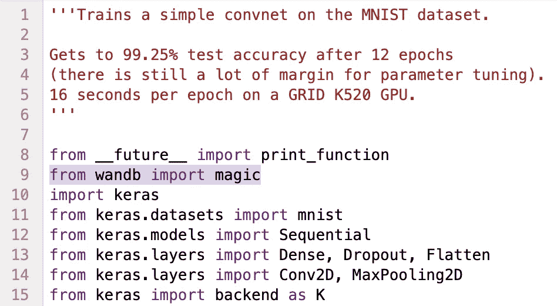

# Keras 模型的轻量级可视化

> 原文：<https://towardsdatascience.com/visualizing-keras-models-49d591931209?source=collection_archive---------19----------------------->

我喜欢 Keras 让构建神经网络变得简单明了。将 Keras 连接到 Tensorboard 并不难，但我总觉得对于许多经常想快速浏览底层模型的 Keras 用户来说，重量级解决方案过于复杂。

有了 wandb，您只需一行额外的 python 代码就可以可视化您的网络性能和架构。

为了展示这是如何工作的，我修改了 [Keras examples](https://github.com/keras-team/keras) 目录中的几个脚本。

要安装 wandb，只需运行“pip install wandb ”,我的所有 Keras 示例都将为您工作。

**1。简单的 CNN** ‍

我从必备的 mnist_cnn.py 开始。

我在下面添加了来自 wandb import magic 的*——你也可以看看我的 [mnist_cnn.py](https://github.com/lukas/keras/blob/master/examples/mnist_cnn.py) 从 Keras 示例中派生出来的一行代码。*

现在，当模型运行时，wandb 在后台启动一个进程，保存相关指标并将它们传输到 wandb。可以去[https://app . wandb . ai/l2k 2/keras-examples/runs/ovptynun/model](https://app.wandb.ai/l2k2/keras-examples/runs/ovptynun/model)看看我运行的输出。

‍

我可以准确地看到我的模型所标注的数据，并自动查看损耗和精度曲线。

**2。‍国际会议的结果**

接下来，我分叉 [cifar10_resnet.py](https://github.com/lukas/keras/blob/master/examples/cifar10_resnet.py) ，做了同样的一行修改。你可以在[https://app . wandb . ai/l2k 2/keras-examples/runs/ieqy 2e 9h/model](https://app.wandb.ai/l2k2/keras-examples/runs/ieqy2e9h/model)看到一个很好的 resnet 可视化。

在[系统页面](https://app.wandb.ai/l2k2/keras-examples/runs/ieqy2e9h/system)上，我可以看到这个模型使用的我的单个 GPU 比 mnist 例子多一点。

**3。暹罗网** ‍

接下来，我尝试了暹罗网络的例子。在这里，我可能想看看 TensorFlow 图，幸运的是，通过我们的一行代码，我们可以自动检测和托管 TensorBoard。你可以在 https://app.wandb.ai/l2k2/keras-examples/runs/fsc63n6a?找到这款跑鞋 workspace=user-l2k2 。

对于每个模型，这个工具花费了我不到一分钟的时间，增加了很少的计算开销，并且应该适用于您正在处理的任何 Keras 模型。当您想要跟踪更多内容时，您可能希望用以下内容替换该行:

> *导入 wandb*
> 
> *wandb.init(magic=True)*

然后，您可以使用我们的自定义 wandb.log()函数来保存您想要的任何内容。你可以在我们的[文档](http://docs.wandb.com/)中了解更多信息。

我真的希望你觉得这有用！