# 可视化识字率差异

> 原文：<https://towardsdatascience.com/visualizing-literacy-rate-disparity-19f375486965?source=collection_archive---------27----------------------->

——作者[尼格什·普拉贾帕蒂](https://medium.com/u/b96aad8b680d?source=post_page-----19f375486965--------------------------------)、[让·梁](https://medium.com/u/69606dde8b43?source=post_page-----19f375486965--------------------------------)、[约翰·亨特](https://medium.com/u/f3ac20d66b17?source=post_page-----19f375486965--------------------------------)和[亚什·米塔尔](https://medium.com/u/2c6bffa8edc3?source=post_page-----19f375486965--------------------------------)

“为理解而设计”项目[的目标是使用视觉方法向我们的用户传达数据，并牢记两个不同的最终目标。](https://bucknell-hci-2019.github.io/designs/datavis_assn.html)

1.  **清晰的沟通和推理:**这需要构建一系列图表，以提供深入、公正、清晰的数据描述。
2.  **说服性沟通和讲故事:**这需要以引人注目的方式呈现数据，并对用户产生持久的影响。

为了这个项目，我们选择了 1980 年至 2016 年间世界各地成年男性和女性识字率的数据集。我们的最终目标是展示这一时期男女识字率的差异。一些最终的可视化显示如下。

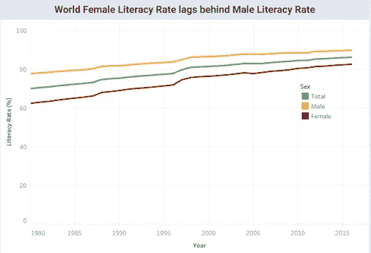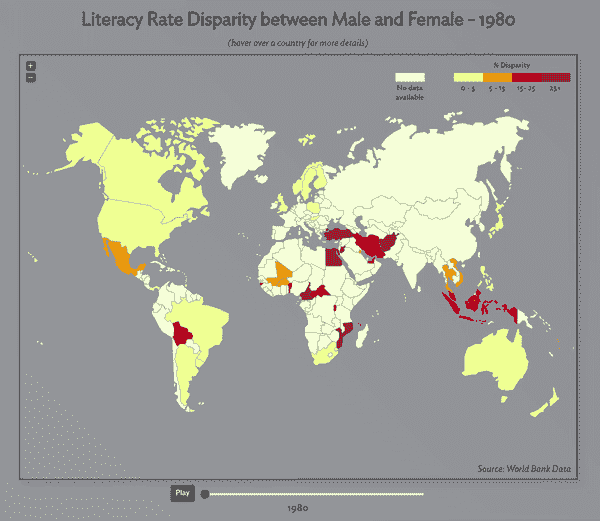

Clear communication mandates simplicity. Persuasion may require sacrificing accuracy.

左边的图表显示了我们清晰的交流和理解的一个可视化。完整的投资组合可点击查看[。右边的视频展示了项目的说服沟通和讲故事部分。你可以在这里](https://public.tableau.com/profile/jean.leong#!/vizhome/HCIDashboardnew_15513218271570/HCIDashboard?publish=yes)与可视化[互动。](https://ymittal.github.io/datavis/)

# 数据选择

数据选择步骤本身就是一个过程。最初，我们很难找到一个好的、有趣的、相对干净的数据集，并提供实验的广度。我们对小组中每个成员感兴趣的不同领域进行了头脑风暴，并初步决定使用美国不同交通方式的死亡率数据。然而，我们很快意识到处理这种特殊数据的复杂性，因为它需要我们组合多个数据表，并需要我们处理太多的变量，这使得这个过程非常混乱。数据数量的差异也是如此之大，以至于我们无法有效地显示任何数据。我们最终决定使用识字率数据集，因为它的格式简单明了，尽管它确实需要我们组合多个来源，这仍然比之前的选项更容易。此外，这些数据似乎对我们所有人都很有吸引力，我们都很兴奋能够参与其中。

## —为什么关注识字率？

全世界的识字率在很大程度上一直在上升，但具体国家的识字率是如何变化的呢？识字率和国家财政状况之间有关联吗？各国识字率的性别均等情况如何？这个因素会影响一个国家的表现吗？这些都是我们遇到的问题，导致我们今天为您创建了数据可视化。识字率或多或少显示了一个特定国家的教育水平，我们希望在识字率和一个国家的总体成功之间建立具体的联系。我们的小组开始创造一些设计，让我们的观众理解我们试图传达的数据，然后推导出这些数据，这样我们的用户就可以看到一个清晰的相关性。

# 5 张设计流程

对于该设计流程，我们决定使用 [5 板材流程](http://fds.design/)的衍生产品。我们所做的基本上是 5 张纸的过程，但范围稍大，合并了一些步骤。5 页设计流程是设计可视化的直观方法。它让我们能够准确地展示我们是如何想出我们的设计，以及是什么影响了我们的设计选择。在开始时，这个过程允许我们扩大项目的范围，随后以一种其他方式很难做到的方式缩小和完善我们的细节。通过下面的表格，你将会看到我们是如何从头脑风暴到设计再到实施的。

## —头脑风暴和筛选想法

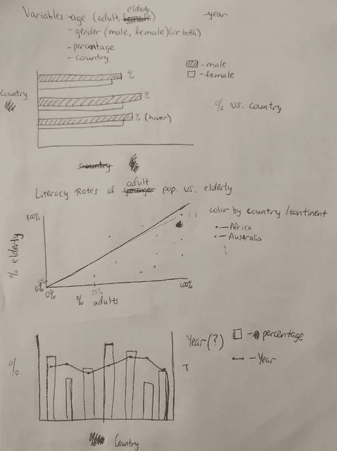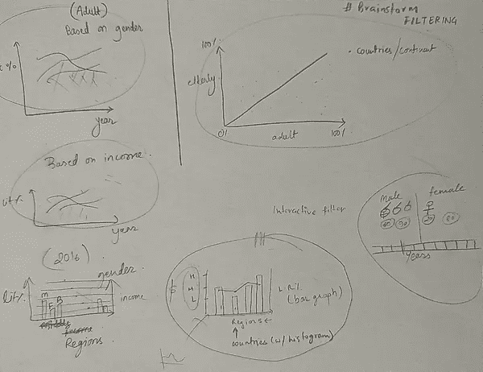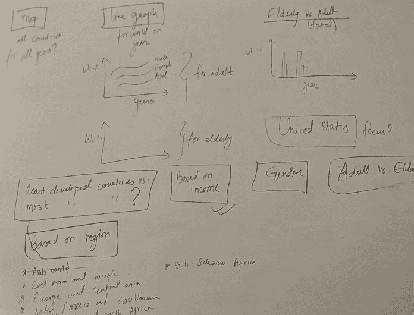

*Brainstorming (without any restrictions) different ways of visualizing our literacy data*

上图展示了我们头脑风暴会议的一些草图。本次会议的目的是**产生尽可能多的想法**关于我们可以清楚地交流数据的方式。如图所示，我们没有把自己局限于考虑一个特定的可视化是否可能被创建。这是为了确保我们从不同的角度看问题。

我们的下一步是**从头脑风暴中过滤我们的想法**。为此，我们问自己这样的问题:

> 每一个想法在多大程度上有效地描述了我们数据的无偏见观点？
> 数据展示对我们的用户来说足够吸引人吗？

这些问题为我们挑选最佳创意提供了必要的基础。

## —构思草图

一旦我们想好了要在演示中表达什么想法，我们就必须选择最好的方式。在这个过程中，我们从 5 张设计流程中获得了灵感。我们为每个想法绘制了潜在的布局，详细说明了它将关注什么以提供对数据的深入理解，并讨论了使用该方法的积极和消极方面。这篇文章[数据可视化—最佳实践和基础](https://www.toptal.com/designers/data-visualization/data-visualization-best-practices)对于找出可视化数据的最佳方式特别有帮助。

例如，为了比较全世界男性和女性的识字率，我们决定使用折线图，因为折线图非常适合于比较多个群体在一段时间内的微小变化。同样，我们使用散点图来显示不同国家的男性和女性识字率，因为散点图非常适合探索两组数据之间的关系。关于我们的说服部分，我们使用地图可视化数据，因为以这种方式显示特定国家的数据在逻辑上最有意义。这也让我们能够发挥创意，设计出有趣的、互动的、也很吸引人的作品。总的来说，我们希望我们所有的数据可视化简洁明了，但仍然能够抓住并保持任何感兴趣的人的眼球。

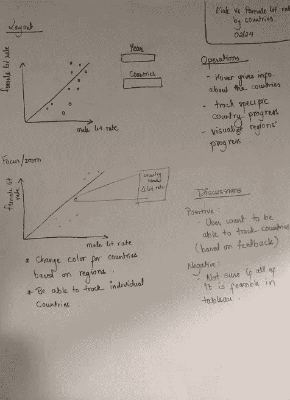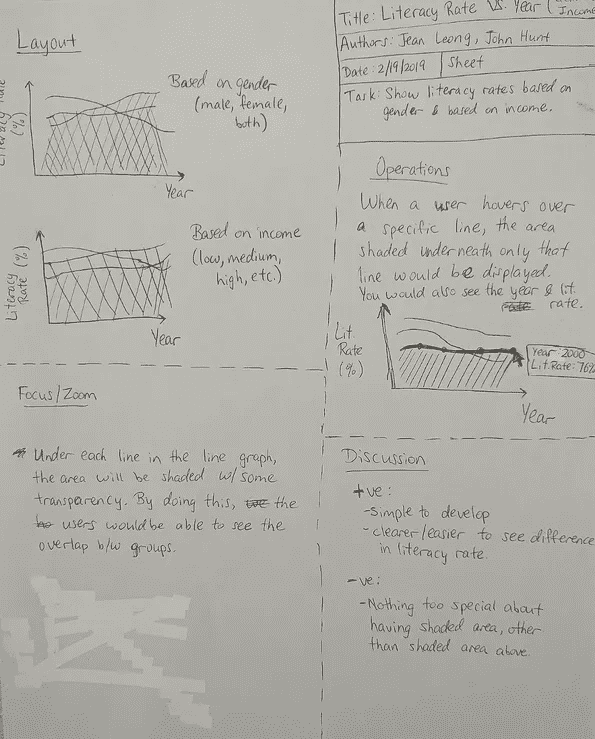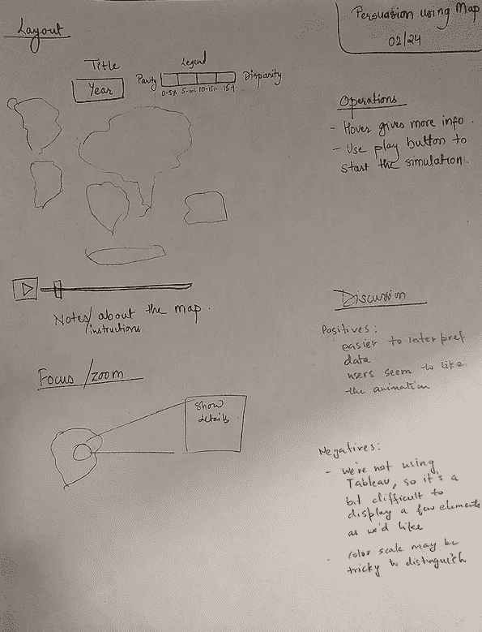

*We discussed the feasibility of our ideas by noting down the pros and cons of the designs.*

# 第一次冲刺——发展

## —数据预处理

我们从世界银行[网站](https://data.worldbank.org)获得了 csv 格式的识字数据。如前所述，数据集相对干净，但我们仍然需要填充缺失的数据。为了能够以更好的方式呈现数据，我们做出了以下重要假设。

*   我们假设一个国家的识字率保持不变，直到下一年的数据观察可用。
*   世界银行的数据集没有主要国家的数据，包括但不限于美国、加拿大、墨西哥和英国。一旦这些国家的成人识字率达到 99%以上，我们就使用[这个](http://www.hbs.edu/businesshistory/Lists/HistoricalData/Attachments/31/literacy.xls) HBS 数据集来估计识字率差异为零。

## —用于理解的表格

我们希望确保我们的用户以一种不难操作的格式接收清晰、准确、易读的数据。为此，我们使用了 Tableau，它使我们能够相对容易和简单地显示我们的数据。当查看我们的 Tableau 仪表板时，用户将看到三个图表，显示我们所有的数据结果以及如何在图表中导航的方向。

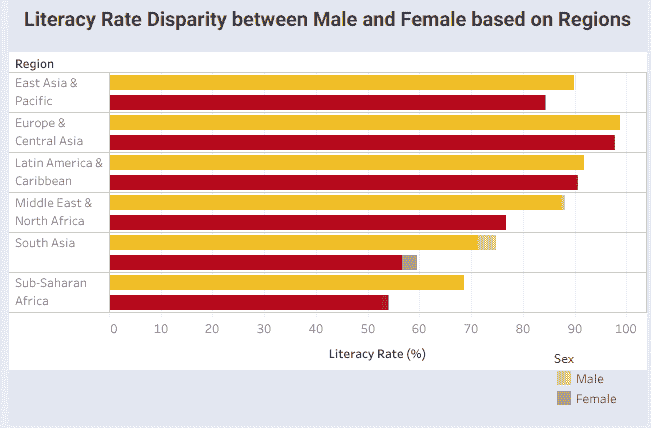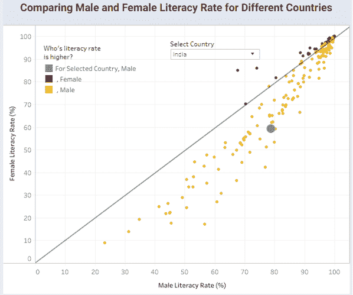

*Tableau offers powerful functionality to add detail to your plots. Tooltips, filters and more.*

我们的第一张图表显示了世界各地识字率的性别差异，我们认为这是我们应该展示的第一件事，因为它很宽泛，包含了性别差异的一般概念。第二，我们显示了世界不同地区的性别差异，这使得我们的用户可以看到性别识字差异，并有更多的地区特异性。在第三个也是最后一个图表上，我们有一个散点图，显示了各个国家不同时期的识字率差异，因此我们的用户可以看到各国在性别识字率差异方面与世界其他国家相比的情况，以及它们如何朝着均等的方向发展。我们希望，通过我们的 Tableau 仪表板，人们将能够与我们的数据进行互动，并就世界上的性别识字差异及其意义得出明确的结论。

## —将 JQVMap 用于动画地图

我们的团队想通过使用 Tableau 之外的工具来挑战自己。我们的目标是

> 表明世界各地识字率的性别差距正在缩小，欠发达地区的差距相对较大

在头脑风暴阶段，我们认为世界地图是展示这一想法的最佳方式。我们的数据世界在他们关于识字率的[博客](https://ourworldindata.org/new-literacy-dataset) [帖子](https://ourworldindata.org/how-is-literacy-measured)中有一些令人着迷的世界地图，所以我们开始寻找工具来重现这些可视化。我们最终使用 JQVMap，一个与 D3 相比学习曲线不太陡峭的 JavaScript 库，来创建如下所示的世界地图。阴影越深，表示男女识字率的差距越大。最初，我们使用默认的蓝色配色方案，但后来我们将其更改为橙红色。我们做出这个选择是因为红色通常与消极联系在一起，而蓝色则与冷漠联系在一起，正如这里的[所支持的](https://betterfigures.org/2015/06/23/picking-a-colour-scale-for-scientific-graphics/)。

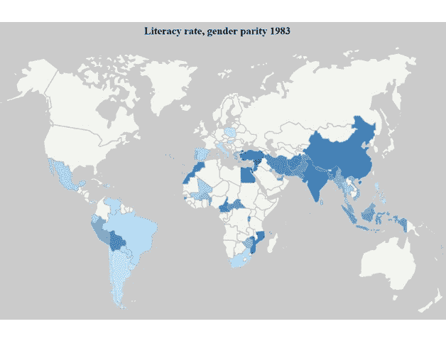

*Evolution of our visualization for persuasion*

我们都同意，我们想要一个随着时间的推移颜色会自动变化的动画地图。我们还添加了一个按钮，可以在需要的时候暂停和恢复动画。在最初的几次迭代之后，我们向一些朋友寻求反馈。他们建议我们添加缩放控件，这样人们可以近距离观察特定的地区或国家。一些人还告诉我们，他们想知道一个国家的确切识字率差距。为了更好的用户体验，我们增加了当有人悬停在某个国家时显示工具提示的功能。

## —结果和反馈

在课堂演示日期间，我们收到了很多来自同行的反馈，这让我们能够对我们的设计进行一些工具性的修改。所要求的改变并不激烈，所以我们没有任何理由来彻底修改设计。这些建议旨在调整我们的视觉效果，使之更直观，更容易得出结论。

> “我希望能提供更多的背景。这是一个有趣的话题。”"如果他们在散点图中记录国家会怎么样？"

大多数反馈都与配色方案和其他视觉变化有关，或者希望在整个可视化过程中跟踪特定的国家。其他人要求在我们的仪表板上的图表上配一段叙述。虽然这些变化需要一些工作，但它们并不太密集，并允许相同的可视化看起来和感觉更好。

# 第二次冲刺——弥补过失

## —设计

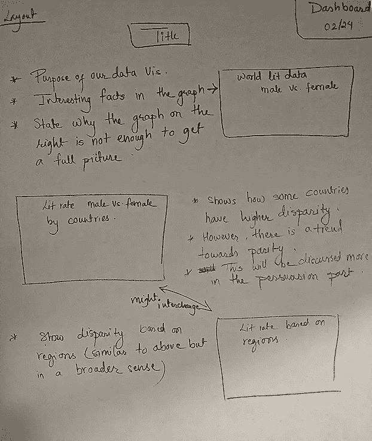

*A layout sheet to guide our dashboard reorganization*

在演示日之后，我们还有一周的时间来修改我们的可视化效果。我们从固化一个**叙述**开始，将 Tableau 仪表盘中的所有三个图表联系起来，这是我们在演示日期间从一个其他小组获得的灵感。

类似地，我们得到的另一个评论是用户可以在散点图上追踪单个国家。我们自己无法做到这一点，所以我们向巴克内尔大学的商业智能架构师 Ken Flerlage 寻求帮助。他能够帮助我们解决这个问题。此外，他给了我们一些改进其他图表的建议。

此后，我们对世界地图可视化做了一些 UI 调整。最大的修改是将图例分成有限的几个类别。在此之前，地图有一个梯度比例作为其图例，这使得我们的用户很难区分橙色和红色的许多阴影。为了解决这个问题，我们使用了专门为制图推荐的调色板**YlOrRd**[这里](http://colorbrewer2.org)。

*A large number of splits has the same problem as a gradient. So we stuck with only four splits with an additional one to represent unavailable data.*

## —样式

我们也对我们的可视化风格做了一些改变，以使它对用户更有吸引力。我们想要一个美观的仪表盘来滚动，同时避免颜色和动画“过头”。我们决定使用无衬线字体 **Roboto** ，因为它既优雅又不分散注意力。至于颜色，我们实现了“交通灯”配色方案，因为这些颜色很容易区分。我们还决定采用这种配色方案，因为色盲的人能够毫不费力地区分这些颜色。(我们使用[这个](https://www.canvasflip.com/color-blind.php)色盲模拟器来确保每个图表对于每种类型的色盲都是可区分的。)

# 最后的话

总之，我们对这个数据可视化项目的结果非常满意。我们认为，我们能够以一种易于理解和容易得出结论的方式来展示我们的数据。整个过程对我们来说很有趣，从选择数据集到实现你看到的所有数据可视化。我们觉得我们的图表和可视化出来的结果很清晰，几乎和我们预想的一模一样。