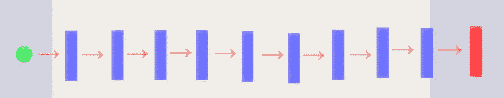
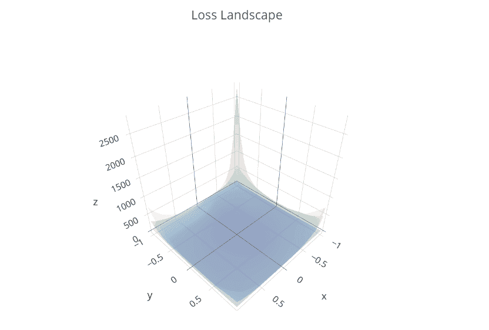

# 可视化深度神经网络的损失情况…..但是我们能相信他们吗？

> 原文：<https://towardsdatascience.com/visualizing-loss-landscape-of-deep-neural-networks-but-can-we-trust-them-3d3ae0cff46e?source=collection_archive---------11----------------------->

## ***我们能相信深度神经网络的损失景观可视化吗？***

Landscape from this [website](https://pixabay.com/illustrations/evening-sun-sunset-backlighting-55067/)

**简介**

最近[开发了一种方法](https://arxiv.org/abs/1712.09913)来可视化深度神经网络的损失情况。我个人认为这是一个巨大的突破，然而，我对创建的可视化的有效性感到有点怀疑。今天，我将研究作者的可视化方法，并介绍一些我认为非常酷的其他方法。

**方法**

创建亏损景观的整个过程非常简单直接。

1.  训练网络
2.  创建随机方向
3.  给固定重量加上不同的扰动量，看看损失值是如何变化的。

唯一需要注意的是这些随机方向是如何产生的。我们来看看作者的方法。

他们的方法被称为“过滤器标准化”,非常容易理解。(这里是[链接](https://github.com/tomgoldstein/loss-landscape)到作者的代码)。基本上，对于四维张量如(64，3，3，3)，我们将匹配关于第一维的范数，因此(64，1，1，1)，在权重的范数和随机方向的范数之间。(用一个更简单的术语来说，我们可以将这理解为匹配权重和随机方向之间的比例)。

以上是运行作者代码时的部分结果。现在我们可以利用张量运算来简化整个过程。(我稍后会展示)

**网络**

**绿球** →输入图像(64，64，3)
**蓝色矩形** →卷积+ ReLU 激活
**红色矩形** →软最大输出

对于这篇文章，我在 CIFAR 10 数据集上训练了三个九层完全卷积神经网络(如上所示)。无任何归一化、批量归一化和[局部响应归一化。](https://prateekvjoshi.com/2016/04/05/what-is-local-response-normalization-in-convolutional-neural-networks/)

并且从上面的图中我们可以看到，批量归一化的网络取得了最高的性能。

从现在起我将把每个网络称为如下的
**正常**:没有任何归一化层的网络
**批量规范**:具有批量归一化层的网络
**局部规范**:具有局部响应归一化层的网络

**滤波归一化**

上面的代码片段展示了如何使用张量运算进行过滤器标准化。

Normal, Batch Norm, Local Norm

Normal, Batch Norm, Local Norm — Log Scale

当我们使用滤波归一化方法来可视化损失景观时，我们可以看到每个景观看起来并没有太大的不同。只有在我们以对数比例显示景观的情况下，我们才能看到，事实上，局部响应归一化的景观要清晰得多。

当我们将这三幅图按原始比例叠加在一起时，我们可以看到它们看起来是多么相似。

**滤波器正交化**

上述方法只是作者方法的简单修改，我们从简单的高斯分布生成随机方向，但是通过 [QR 分解](https://www.tensorflow.org/api_docs/python/tf/linalg/qr)我们使方向正交化。

Normal, Batch Norm, Local Norm

Normal, Batch Norm, Local Norm — Log Scale

当我们将不同维度的方向正交化时，我们可以立即看到创建的损失景观是如何彼此不同的。与作者的方法相比，我们可以看到三个网络之间的损耗情况有所不同。

**正交权重投影**

这与滤波器正交化基本相同，唯一的区别在于，对不同维度的收敛权重执行 ZCA 白化，而不是从高斯分布生成。

Normal, Batch Norm, Local Norm

Normal, Batch Norm, Local Norm — Log Scale

类似于滤波器正交化，我们可以看到生成的可视化之间的一些差异。

**重量的主要方向**

最后一种方法是在不同的维度之间，在它们的第一主方向上扰动权重。

Normal, Batch Norm, Local Norm

Normal, Batch Norm, Local Norm — Log Scale

我们可以清楚地看到所产生的损失情况之间的差异。

**讨论**

我写这篇文章的唯一原因是为了表明，根据我们使用的方向，创造的损失景观可以发生巨大的变化。因此，我们需要质疑生成的损失景观的有效性，它们是否真正反映了训练网络的特征。

**代码**

要访问创建可视化效果的代码，请[点击此处。](https://github.com/JaeDukSeo/Daily-Neural-Network-Practice-3/blob/master/Loss%20LanScape/0%20create%20viz.ipynb)
要查看整篇博文的代码，请[点击此处](https://github.com/JaeDukSeo/Daily-Neural-Network-Practice-3/tree/master/Loss%20LanScape)。

**遗言**

我不想做任何大胆的断言，但似乎不同的方向选择会产生不同的视觉效果。问题仍然存在，哪个方向是最‘正确’的？可有正确的，哪一个揭示了真相？此外，我想提一下名为“[尖锐极小值可以推广到深度网络](https://arxiv.org/abs/1703.04933)的论文，该论文表明已经收敛到尖锐极小值的深度神经网络可以很好地推广，并且该理论不适用于具有 ReLU 激活的网络。就像那篇论文如何证明我们的观察可以根据我们的定义而改变一样，我们应该致力于创造反映真理的定义。

还有更多研究要做，我很期待。如果你希望看到更多这样的帖子，请访问我的[网站](https://jaedukseo.me/)。

**参考**

1.  李，h，徐，z，泰勒，g，斯图德，c，&戈尔茨坦，T. (2017)。可视化神经网络的损失景观。arXiv.org。2019 年 5 月 3 日检索，来自[https://arxiv.org/abs/1712.09913](https://arxiv.org/abs/1712.09913)
2.  tomgoldstein/loss-landscape。(2019).GitHub。检索于 2019 年 5 月 3 日，来自[https://github.com/tomgoldstein/loss-landscape](https://github.com/tomgoldstein/loss-landscape)
3.  [https://prateekvjoshi . com/2016/04/05/what-is-local-response-normalization-in-convolutionary-neural-networks/](https://prateekvjoshi.com/2016/04/05/what-is-local-response-normalization-in-convolutional-neural-networks/)