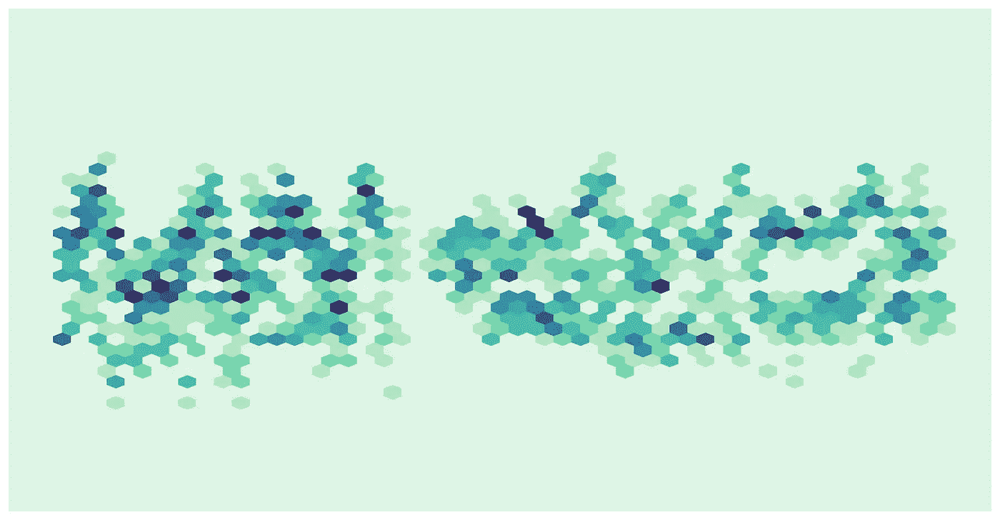
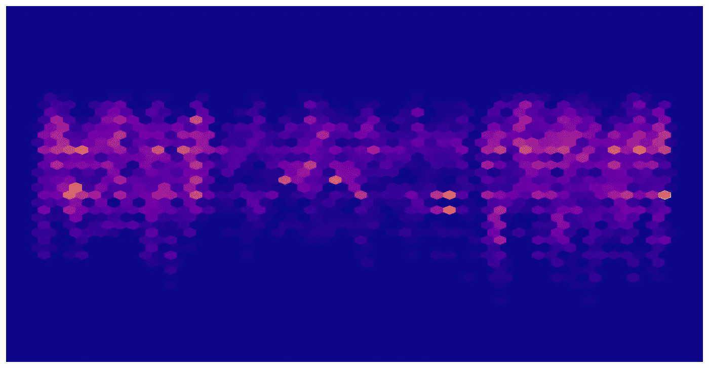
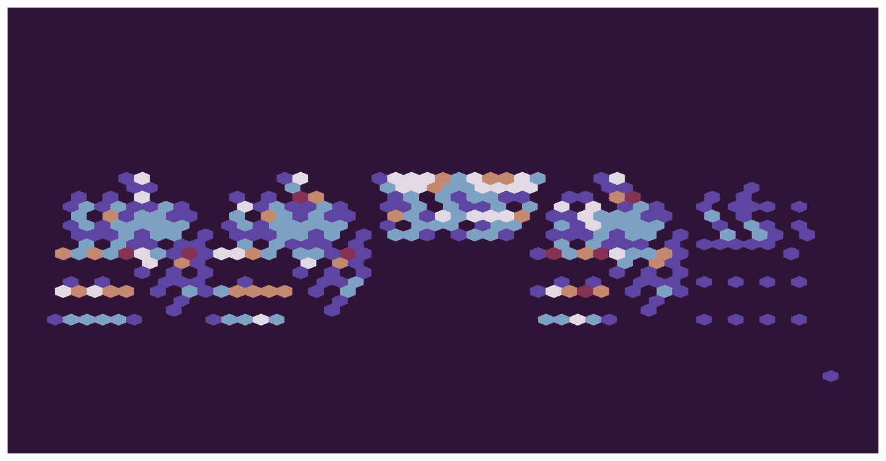
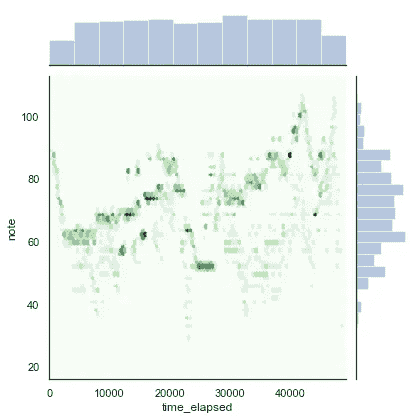
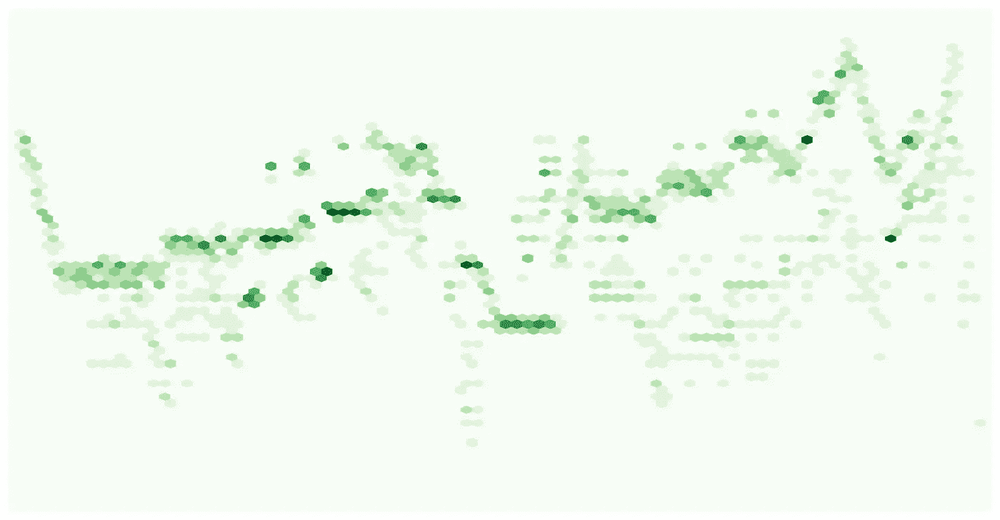
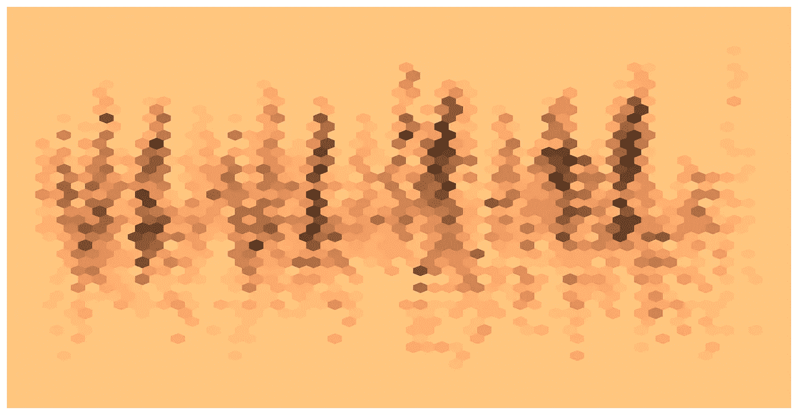
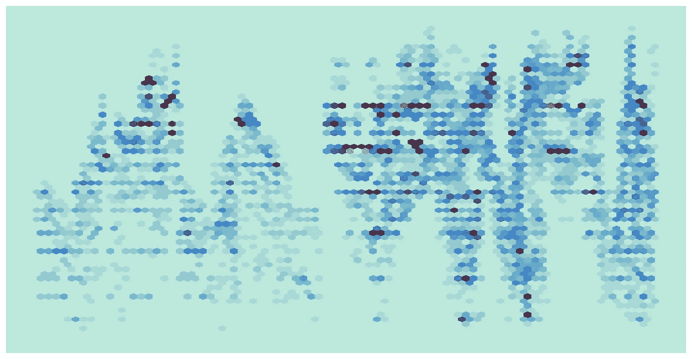

# 可视化音乐表演

> 原文：<https://towardsdatascience.com/visualizing-musical-performance-5da28b96957a?source=collection_archive---------13----------------------->

作为一名音乐家和数据科学家，我对可视化音乐表演的想法很感兴趣。在这篇文章中，我概述了如何可视化来自 [MAESTRO 数据集](https://magenta.tensorflow.org/datasets/maestro)的钢琴演奏录音。示例在整个帖子中提供。下面，我使用 Python 的 Mido、Seaborn 和 Pandas 包，一步一步地布置了在 MAESTRO 数据集中打开、清理和可视化钢琴演奏的说明和代码。文章最后展示了弗朗茨·李斯特的*匈牙利狂想曲第 2 号*和一段音乐录音，这样读者就可以通过视觉观看音乐的展开。还提供了用于创建可视化的完整 Python 脚本的链接。

Joint density plot of Johann Sebastian Bach’s Prelude and Fugue in D Minor, WTC I, BWV 851

# **数据**

[MAESTRO 数据集](https://magenta.tensorflow.org/datasets/maestro)包含来自国际钢琴电子竞赛的超过 200 小时的钢琴演奏。比赛的参与者在雅马哈唱片播放器上表演，这是一种声学钢琴，也可以捕捉和播放乐器数字接口数据。MAESTRO 数据集包含来自参赛者表演的 MIDI 数据以及表演的音频记录。

MIDI 是一种允许数字乐器通过“信息”相互通信的协议。这些信息储存了关于用于回放的乐器类型、要演奏的音符、音符何时开始、音符何时结束等信息。

# 简介:用 Python 打开 MIDI 文件

要在 Python 中打开 MIDI 文件，请安装 mido 包。从 Mido 包中，导入 MidiFile。下面是使用 MidiFile 在 Python 中打开文件的示例代码。对于 MAESTRO 数据，这个过程将创建一个包含两个音轨的 MidiFile 对象。第一轨道包含关于演奏的元数据(例如，作品的拍号)。第二个轨道包含性能消息。

Joint density plot of Wolfgang Amadeus Mozart’s Sonata in D Major

# 阐述:管理数据

下面的步骤是我在这篇文章中用来处理数据以创建可视化效果的。

**步骤 1:** 分离第二个轨迹，然后遍历轨迹提取消息。结果应该是一个消息对象列表。迭代时，省略第一条和最后一条消息。第一个消息是节目消息，最后一个是指示轨道结束的元消息。这两条消息都没有提供关于所演奏的音符的数据。

**步骤 2:** 遍历消息列表，将消息转换为字符串。可以使用基本 python 中的 str()函数或 mido 包中的 format_as_string()方法完成到字符串的转换。

**步骤 3:** 使用将消息字符串分割成包含键和值的子字符串。拆分(“”)。

这将创建一个列表列表。单个列表如下所示:

列表的第一个子字符串只包含一个值(消息类型)。为了将数据转换为字典，必须删除该子字符串。

**第四步:**删除第一个子串，存储在一个列表中，将列表转换为 dataframe。

**步骤 5:** 将列表中的其他子字符串转换成字典，然后转换成 dataframe。=分隔子字符串中的键和值。下面的代码遍历列表和每个子字符串来创建键值对。然后，它将这些键值对存储在一个字典列表中(每个子字符串列表一个字典)。最后，它将字典转换成数据帧。

**步骤 6:** 将属性数据帧(df2)与包含消息类型的数据帧(df1)连接起来。

**步骤 7:** 数据帧中的时间变量表示自最后一条消息以来经过的时间。音符变量表示弹奏的钢琴键。为了绘制数据，需要测量经过的时间来绘制随时间变化的数据。可以使用 Python 的创建 time_elapsed 变量。cumsum()方法。音符变量表示弹奏的钢琴键。绘制注释需要将变量从 string 类型转换为 float 类型。

**步骤 8:** 过滤掉控制消息和 note_off 消息，因为这些消息不会在可视化中使用。控制信息指示延音和弱音踏板何时被按下和释放。控制消息的消息类型等于“控制”。note_off 消息由速度为[0 的 note_on 类型消息指示。](https://www.midi.org/forum/228-writing-midi-software-send-note-off,-or-zero-velocity-note-on)

**步骤 9:** 从数据帧中删除不必要的列。

**步骤 10:**munging 过程的最后一步是在数据帧的开头和结尾添加一行。添加这些行将在可视化的边缘和数据点之间提供一些空间。新的第一行被分配一个音符值 0(钢琴较低音域之外的值)和一个等于最大经过时间值的-0.05 倍的经过时间值。(第一个 note_on 消息的 time_elapsed 值大于 0)。新的最后一行被分配了音符值 127(钢琴上限范围之外的值)和时间流逝值，该时间流逝值等于最大时间流逝值的 1.5 倍。添加这些行还可以生成边缘平滑的可视化效果。

Joint density plot of Edvard Grieg’s Lyric Piece in A Minor, “Waltz,” Op. 12 № 2

# 发展:可视化

为了可视化性能，我使用了 Python 的 Seaborn 包。x 轴代表经过的时间(时间从左到右增加)，y 轴代表从低(下)到高(上)弹奏的音符的音高。这些图使用十六进制箱显示了一段时间内音符的联合密度。颜色用于传达十六进制 bin 中包含的音高和时间段范围内的音符频率。在上图中，较高的频率由较暗的绿色阴影表示。

关节密度图显示了十六进制 bin 定义的范围内的音高频率，以及这些频率如何随着演奏的进行而变化。结果是一个曲线图，该曲线图可视化了音高(y 轴)和音高频率(颜色)随时间(y 轴)的变化。该图包含了所有必要的信息，以及在图中可视化的作品的性能(见下面的匈牙利狂想曲示例演示)。

以下步骤分解了这篇文章中的可视化是如何绘制的。

**步骤 1:** 设置海风风格为“白色”。这一步提供了一个干净的白色背景，在此基础上建立可视化。

**第二步:**定义绘图，x 轴的界限和 y 轴的界限。这就是在 munging 过程的步骤 10 中添加第一行和最后一行有助于可视化的地方。x 轴限制由最短经过时间和最长经过时间定义。这两个数量都由附加行设置。y 轴限制设置为 16 和 113。这样做的原因是为了给图提供平滑的边缘。MIDI 音符值(绘制在 y 轴上)可以取 0 到 127 之间的值。然而，钢琴只有 88 个键，它们的 MIDI 音符值在 21 到 108 之间。第一行和最后一行的音符值被设定在钢琴的可能值范围之外。因此，通过在第一行和最后一行设定的最小和最大音符值内设定 y 轴限制，绘图:

1.  显示钢琴的所有可能值，
2.  不显示第一行和最后一行的人工音符值，
3.  包括每个可视化的边缘与最低和最高音符之间的空间，并且
4.  该空间的颜色与地块的背景颜色相同。

关于 plot 函数的另一个注意事项。gridsize 表示 x 方向上十六进制箱的数量。改变 gridsize 会改变 hex bins 的大小，从而改变绘图中 hexgons 的大小。里姆斯基·科萨科夫的《大黄蜂的飞行》的最终情节如下。

Joint density plot of Rimsky-Korsakov’s Flight of the Bumblebee (with labels and marginal plots)

**第三步:**去掉不需要的剧情元素。为了提供联合密度图的艺术再现，我移除了边缘图、轴和刻度标签以及轴。(注意:删除这些元素是提供有意义的可视化的最佳实践的对立面。)下面的代码删除了轴、边缘图、轴标签和刻度标签。

Joint density plot of Nikolai Rimsky-Korsakov’s Flight of the Bumblebee

# **重述:**

这篇文章介绍了从 MAESTRO 数据集打开、清理和可视化 MIDI 演奏数据的步骤。提供了代码片段来演示这些步骤。使用 Seaborn 的 jointplot 方法可视化性能数据。这些图显示了一段时间内音高的密度(或者，弹奏音符的频率)。其结果是在一幅图像中捕捉一段音乐的艺术描绘。

对于那些有兴趣了解可视化如何与音乐作品的表现相结合的读者，下面是一个例子。可视化是弗朗茨·李斯特的*匈牙利狂想曲№ 2。*视频之后是 Adam Gyorgy 的表演视频。对于对创建自己的可视化感兴趣的读者，我的脚本和文档可以在 [GitHub](https://github.com/DRyanMiller/MIDI_Visualization) 上找到。

Joint density plot of Alban Berg’s Sonata Op. 1

# 尾声:匈牙利狂想曲№ 2

下面是弗朗茨·李斯特的《匈牙利狂想曲 2》的视频以及亚当·乔吉演奏该作品的视频。当你听视频的时候，通过视觉跟随表演。

Joint density plot of Liszt’s Hungarian Rhapsody № 2

# 文献学

柯蒂斯·霍桑、安德烈·斯塔舍克、Adam Roberts、伊恩·西蒙、黄承志、桑德·迪勒曼、埃里希·埃尔森、杰西·恩格尔和道格拉斯·埃克。"使用 MAESTRO 数据集实现因式分解的钢琴音乐建模和生成."在 2019 年国际学习代表大会上。

克拉克一世(2016 年 4 月 25 日)。回复:MIDI 规范【在线讨论组】。检索自[https://www . midi . org/forum/228-writing-midi-software-send-note-off，-or-zero-velocity-note-on](https://www.midi.org/forum/228-writing-midi-software-send-note-off,-or-zero-velocity-note-on) 。