# 使用 Folium 插件在交互式和动画地图上可视化纽约市自行车数据

> 原文：<https://towardsdatascience.com/visualizing-nyc-bike-data-on-interactive-and-animated-maps-with-folium-plugins-c2d7645cd19b?source=collection_archive---------7----------------------->

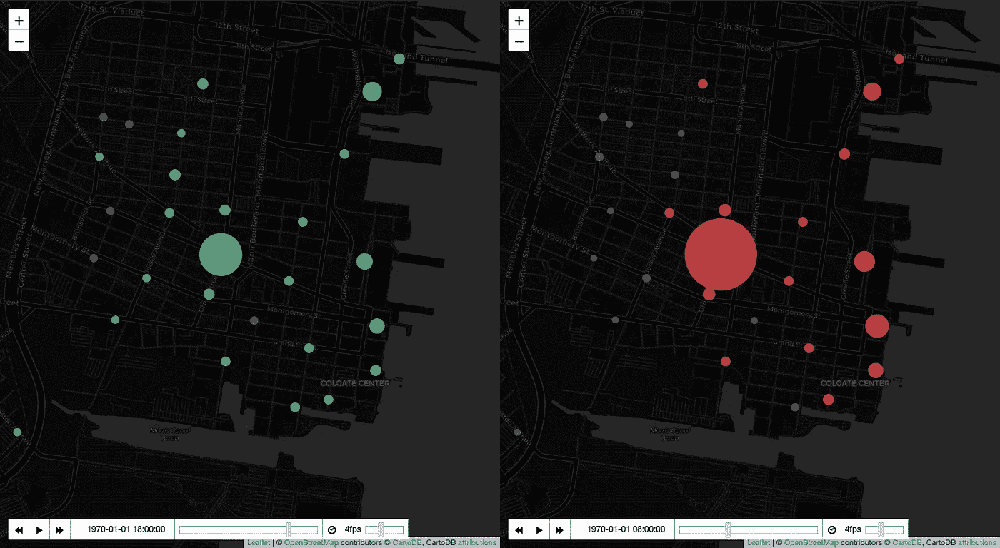

Visualizing NYC Bike Data on interactive and animated maps with Folium plugins

# 当哪里的科学还不够

当分析交通和流动性时，在地图上画图总是很有帮助的。这有助于我们回答问题“*事情在*哪里发生？”

尽管如此，如果我们不考虑**时间**，很多时候分析的结果会发生巨大的变化。也许最明显的例子是在分析通勤模式时:如果你分析一整天，看起来去市中心的人和去相反方向的人大致相同。当你按一天中的时间划分时，你可以看到人们早上(去上班)和下午(回家)的移动方式有很大的不同。

在这种情况下，我们想要加深对特定情况的理解，我们需要在分析中添加第二个变量:**时间**。这将帮助我们在事情发生时回答*。*

> *在我们想要加深对特定情况的理解的情况下，我们需要在分析中加入第二个变量:* ***时间*** *。*

*友情提醒:请帮我鼓掌(或者很多！)当你读完之后如果觉得这篇文章有帮助。*

# 你会在这篇文章中发现什么

在这篇文章中，我们与纽约自行车共享服务的[公开可用数据](https://s3.amazonaws.com/tripdata/index.html)争论，以介绍一些[插件](https://python-visualization.github.io/folium/plugins.html)，它们可以帮助我们在 [Jupyter 笔记本](https://jupyter.org/)中用 Python 的[叶子](https://python-visualization.github.io/folium/)库制作动画、交互式地图。

我们不会关注数据分析工作流程或我们从不同的视觉效果中得到的结论。我们将尝试优化这里显示的代码，以获得我们正在寻找的动画地图。

我们会发现一些例子:

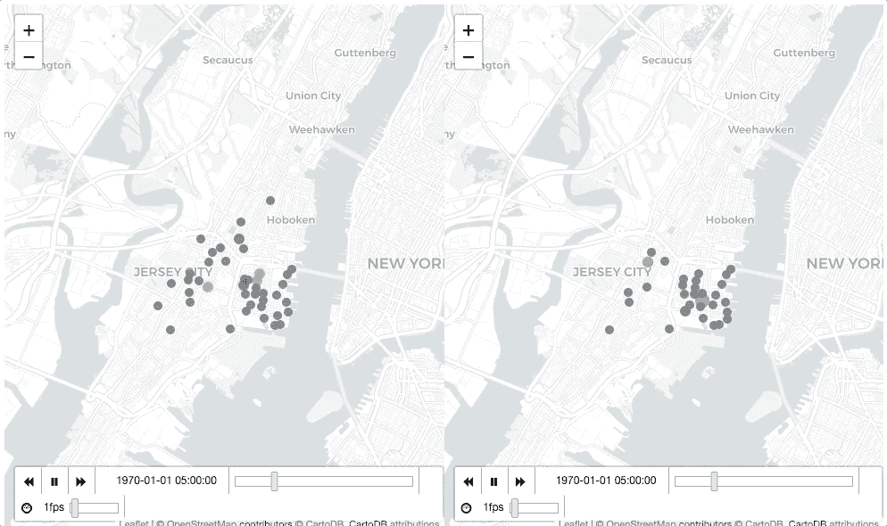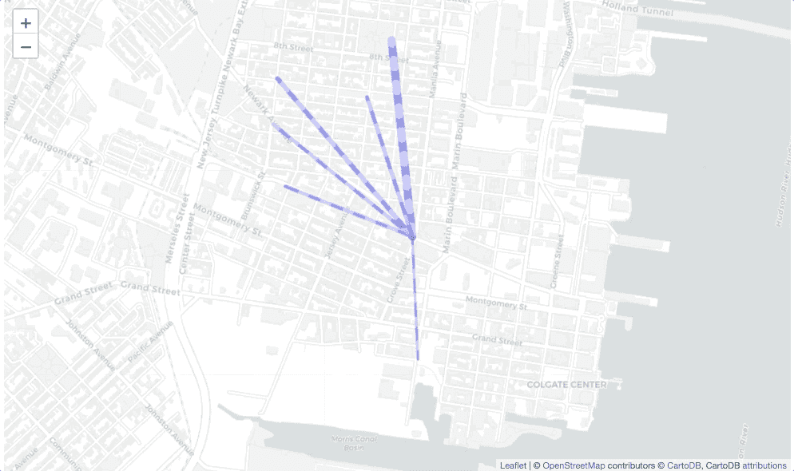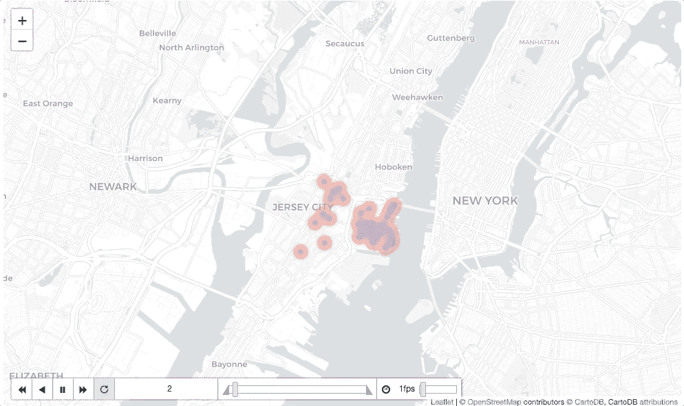

# 导入库

和往常一样，我们做的第一件事是导入我们将使用的 Python 库。

```
import numpy as np 
import pandas as pd 
import geopandas as gpd 
import folium 
import datetime
```

如果您是 Python 用户，您可能已经熟悉了前三个库。如果你开始使用 Python 并且想了解更多，我强烈推荐你阅读杰克·范德普拉斯的名著《Python 数据科学手册》，以获得完整的介绍。它是免费的，你可以直接从你的电脑上阅读。

第四行是导入[leave](https://python-visualization.github.io/folium/)，这是一个将 [Leaflet.js](https://leafletjs.com/) 引入 Python 的库，让我们只用几行代码就能创建交互式地图。

在最后一行，我们导入了 [*datetime*](https://docs.python.org/2/library/datetime.html) 库，这将使我们能够更轻松地处理时间序列。如果你有兴趣了解更多关于如何有效处理时间序列的知识，你可以阅读本书的这一部分。我发现它很有帮助。

# 导入和浏览数据

纽约花旗自行车共享服务的数据是公开的，可以在这里下载。在本笔记本中，我们使用了 2019 年 5 月**月**的数据。

将文件下载到工作目录后，运行以下脚本导入数据:

```
*# Import the file as a Pandas DataFrame*
fp = 'file.csv' 
nyc = pd.read_csv(fp) 
nyc.head()
```

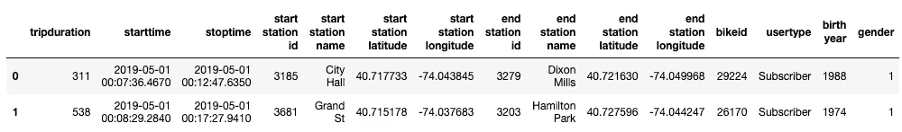

数据看起来很完整。我们对每次旅行都有很多信息:

*   **行程持续时间:**行程的持续时间，以秒为单位。
*   **开始时间:**行程的开始日期和时间。
*   **停止时间:**行程的结束日期和时间。
*   **起点站 id、名称、纬度和经度:**识别和定位起点站的所有有用信息。纬度和经度值在 WGS84 投影(GPS 投影)中，这将使我们以后的工作更容易。
*   **终点站 id、名称、纬度和经度:**识别和定位旅行终点站的所有有用信息。
*   **bikeid:** 旅途中骑过的自行车的 id。
*   **用户类型:**用户是订户(年卡)还是顾客(不同于年卡)。
*   **出生年份**
*   **性别:**表示用户是女性(2)、男性(1)还是未知(0)

对这些变量的完整解释可以在花旗自行车的网页上找到。

# 转换

我们注意到变量**开始时间**和**停止时间**被作为文本(字符串)导入:

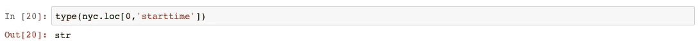

为了让 Pandas 充分发挥时间序列的功能，我们将做以下工作:

1.  将这些变量的类型更改为**日期时间。**
2.  将**start time**定义为数据帧的索引。这将使我们能够更容易地按一天中的时间对值进行透视(分组)。
3.  创建一个名为**【类型】**的新列来帮助我们进行旋转。

```
*# Setting the right format for starttime and stoptime*
nyc['starttime'] = nyc['starttime'].str[:-5]
nyc['stoptime'] = nyc['stoptime'].str[:-5]
nyc['starttime'] = pd.to_datetime(nyc['starttime'])
nyc['stoptime'] = pd.to_datetime(nyc['stoptime'])

*# Define the startime as index and create a new column*
nyc = nyc.set_index('starttime')
nyc['type'] = 'station'
nyc.head(1)
```

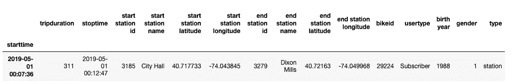

这正是我们想要为每个可视化开始特定转换的格式。我们开始吧！

# 时间戳 GeoJson

这个插件允许我们在交互式叶子地图上绘制数据，并根据时间变量(年、月、日、小时等)制作动画，并且支持任何类型的几何图形(点、线串等)。你唯一要做的就是确保用 geojson 以正确的格式“输入”它。

为此，我们将开始转换数据框。首先，我们计算每个车站每小时的发车次数:

```
*# Aggregate number of trips for each start station by hour of the day*
start = nyc.pivot_table('tripduration', 
                      index = ['start station id', 
                               'start station latitude', 
                               'start station longitude',
                                nyc.index.hour],
                      columns = 'type',
                      aggfunc='count').reset_index() start.head()start.head()
```

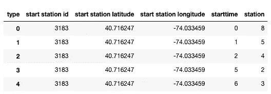

在上面的代码中，我们使用了 pandas[**pivot _ table()**](https://jakevdp.github.io/PythonDataScienceHandbook/03.09-pivot-tables.html)函数来帮助我们以任何我们想要的方式对数据进行分组。注意，我们使用的最后一个索引是**“NYC . index . hour”**。这将获取数据帧的索引，因为它是 **datetime** 格式，所以我们可以获得该值的小时，如上所示。我们可以类似地得到日子或月份。

尽管如此，我们得到的计数是整个月的。为了得到日平均值，我们将除以天数。

```
days = nyc.index.day.max() 
start['station'] = start['station']/days
```

现在，为了方便起见，我们将更改列的名称，并定义我们希望地图上的点具有的颜色。

```
*# Rename the columns*
start.columns = ['station_id', 'lat', 'lon', 'hour', 'count']

*# Define the color*
start['fillColor'] = '#53c688'

*# The stops where less than one daily trip*
*# will have a different color*
start.loc[start['count']<1, 'fillColor'] = '#586065'
start.head(1)
```

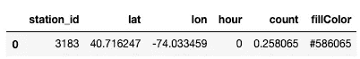

在将数据框转换为我们需要的格式后，我们必须定义一个函数，从其中获取值，并使用正确的属性创建 geojson 以在插件中使用。

```
def create_geojson_features(df):
    features = []

    for _, row in df.iterrows():
        feature = {
            'type': 'Feature',
            'geometry': {
                'type':'Point', 
                'coordinates':[row['lon'],row['lat']]
            },
            'properties': {
                'time': pd.to_datetime(row['hour'], unit='h').__str__(),
                'style': {'color' : ''},
                'icon': 'circle',
                'iconstyle':{
                    'fillColor': row['fillColor'],
                    'fillOpacity': 0.8,
                    'stroke': 'true',
                    'radius': row['count'] + 5
                }
            }
        }
        features.append(feature)
    return features
start_geojson[0]
```

让我们来看看函数:

1.  它获取一个数据帧并遍历其行
2.  它创建一个要素并将几何定义为一个点，从数据框中获取纬度和经度变量
3.  它使用其他变量定义其余的属性:

*   它使用**小时**变量来创建一个**时间**属性。这是最重要的数据动画。
*   创建 **fillColor** 属性需要 **fillColor**
*   它将点的**半径**定义为**计数**变量的函数

一旦定义了函数，我们就可以在数据框中使用它并获得 geojson。

```
start_geojson = create_geojson_features(start) 
start_geojson[0]
```


有了这个，我们现在可以创建我们的第一个互动和动画地图。

```
from folium.plugins import TimestampedGeoJson

nyc_map = folium.Map(location = [40.71958611647166, -74.0431174635887],
                    tiles = "CartoDB Positron",
                    zoom_start = 14)

TimestampedGeoJson(start_geojson,
                  period = 'PT1H',
                  duration = 'PT1M',
                  transition_time = 1000,
                  auto_play = True).add_to(nyc_map)
```

TimestampedGeoJson 插件的参数是:

*   有数据的 geojson
*   **周期:**是动画从第一个值开始的时间步长。例如:' P1M ' 1/月，' P1D ' 1/天，' PT1H ' 1/小时，' PT1M ' 1/分钟。
*   **持续时间:**时间过后，要素将在地图上显示的时间段。如果没有，将显示所有以前的时间。

结果看起来像这样:

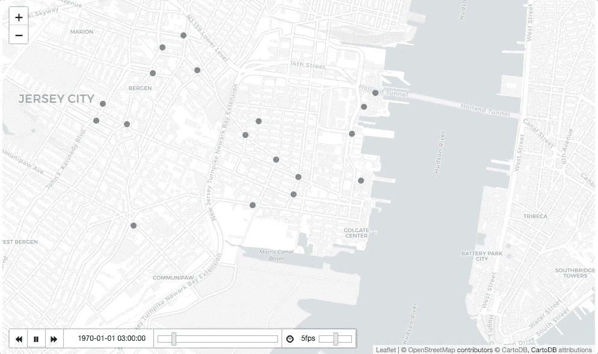

# 双重地图

上面的地图看起来很酷，我们可以清楚地看到，在早高峰，许多行程从市中心周围的地方开始，而在下午，有大量的行程从地图中心的车站开始。

分析一天中不同时间的旅行终点可能是个好主意。更重要的是，并排查看两张地图并尝试识别一种模式可能会很有趣。

**DualMap** 插件可以帮助我们实现这一点。为了使用它，我们将首先运行一个与上面类似的脚本，以获得一天中每个时间*在每个车站结束*的车次。

```
nyc1 = nyc.reset_index().set_index('stoptime')
end = nyc1.pivot_table('tripduration', 
                     index = ['end station id', 
                              'end station latitude', 
                              'end station longitude', 
                              nyc1.index.hour],
                     columns = 'type',
                     aggfunc='count').reset_index()

end['station'] = end['station']/days

end.columns = ['station_id', 'lat', 'lon', 'hour', 'count']
end['fillColor'] = '#e64c4e'
end.loc[end['count']<1, 'fillColor'] = '#586065'
end_geojson = create_geojson_features(end)
```

在这之后，我们只需要创建我们的对偶地图。

```
from folium.plugins import DualMap

dualmap = DualMap(location = [40.71958611647166, -74.0431174635887],
                 tiles = 'cartodbpositron',
                 zoom_start = 14)

TimestampedGeoJson(start_geojson,
                  period = 'PT1H',
                  duration = 'PT1M',
                  transition_time = 1000,
                  auto_play = True).add_to(dualmap.m1)

TimestampedGeoJson(end_geojson,
                  period = 'PT1H',
                  duration = 'PT1M',
                  transition_time = 1000,
                  auto_play = True).add_to(dualmap.m2)

dualmap
```

请注意，我们首先创建对偶地图，然后将 **start_geojson** 添加到左侧地图(m1)，将 **end_geojson** 添加到右侧地图(m2)。

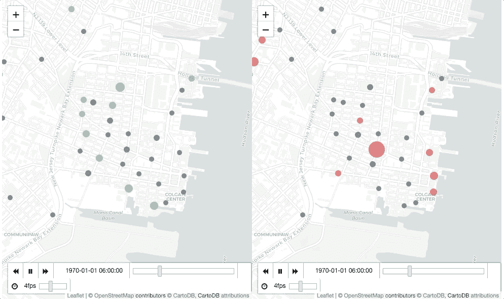

正如我们所猜测的那样，在早上，大部分行程都在地图中间的车站结束(右边地图上的红色圆圈)，而在下午，大部分行程都从那里开始(左边地图上的绿色圆圈),并分布在整个城市。有理由假设那里有一个大的中转站(也许是一个火车站),带着许多人去曼哈顿工作，穿过这座桥。

这是一个很好的例子，说明向空间数据添加**时间**变量可以帮助我们更好地理解某些情况。

# 蚂蚁路径

这个插件帮助我们在地图上制作路径动画。在这种情况下，我们没有每次旅行的确切路径，因此我们将创建从起点到目的地的线。

在开始处理我们的数据之前，让我们看看这个插件需要什么设置。从[现场演示](https://rubenspgcavalcante.github.io/leaflet-ant-path/)中我们可以看到设置包括**权重**(线条粗细)和**延迟**(动画的速度，延迟越高，动画越慢)。在我们的例子中，利用这些设置来更好地表示两个站点之间的活动水平是很有趣的。今后我们将牢记这一点。

从我们之前看到的地图来看，似乎在地图中间有一个很大的车站，可能值得单独分析。我先从筛选与之互动最多的前 6 个站开始。

```
df = nyc.pivot_table('tripduration', 
                     index = ["start station name", 
                              "end station name",],
                     columns = ['type'],
                     aggfunc='count').reset_index().sort_values(by='station', ascending=False)
df.head()
```

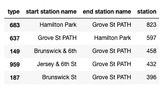

现在，我们可以将这前 6 个站点作为掩码，在接下来的步骤中过滤信息。

```
mask1 = df["start station name"].head(10)
mask2 = df["end station name"].head(10)
mask = mask1.append(mask2)
mask = mask.unique()
```

在用袖扣做了一个关联热图后，我发现最有趣的分析站是“Grove St PATH”(你可以去[笔记本](https://github.com/Bondify/Python/blob/master/Visualizing%20NYC%20Bike%20Data%20on%20interactive%20and%20animated%20maps%20with%20Folium%20plugins.ipynb)找这个的代码，因为这不是本文的目的)。

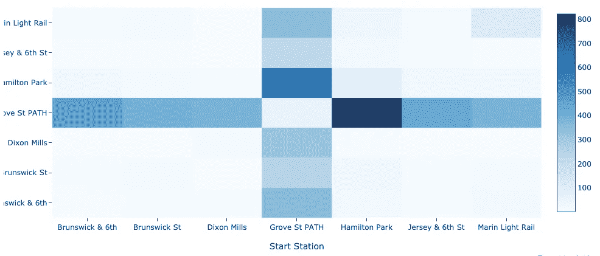

因此，格罗夫圣路径似乎是最有趣的*那里*，但我们也将切片我们的数据一点点，以了解*时*的事情发生。正如我们在盖有时间标记的 geojson 地图上看到的，早上最大的流量是**流向**Grove St PATH，而下午主要的流量是来自 Grove St PATH **的**。**在制作数据动画之前，将我们的数据分成这些时间段似乎会很有用。**

```
*# Assign to each row a period of the day*
nyc['time_of_day'] = pd.cut(nyc.index.hour,
                            [0,6,10,16,20,24],
                            labels = ['am_valley', 'am_peak', 'mid_valley', 'pm_peak', 'pm_valley'], 
                            right=False)

*# Create a different dataframe for each peak*
am = nyc.loc[nyc['time_of_day'] == 'am_peak', :]
pm = nyc.loc[nyc['time_of_day'] == 'pm_peak', :]

*# Filter the trips that end in Grove St PATH during the morning peak*
*# and the trips that start in Grove St PATH during the afternoon peak*
to_st_path = am.loc[(am['end station name'] == 'Grove St PATH') & (am['start station name'].isin(mask)), :]
from_st_path = pm.loc[(pm['start station name'] == 'Grove St PATH') & (pm['end station name'].isin(mask)), :]
```

现在我们已经根据需要过滤了信息，我们将转换数据框来创建插件需要的格式。我将在文章中展示将**转换为 _st_path** 数据帧的过程，但对 **from_st_path** 也是如此。你可以在这里下载整个[笔记本的完整代码。](https://github.com/Bondify/Python/blob/master/Visualizing%20NYC%20Bike%20Data%20on%20interactive%20and%20animated%20maps%20with%20Folium%20plugins.ipynb)

```
to_st_path = to_st_path.pivot_table('tripduration',
                                   index = ['start station name', 
                                            'start station latitude',
                                            'start station longitude',
                                            'end station name',
                                            'end station latitude',
                                            'end station longitude'],
                                   columns = ['type'],
                                   aggfunc='count').reset_index().sort_values(by='station', ascending=False)
```

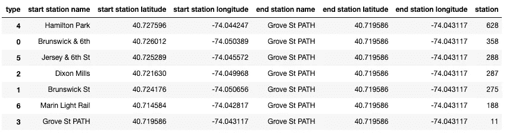

现在我们可以为每一行再创建两个变量:**权重**和**延迟。**都将是**站**的功能。

*   对于体重，我决定在 1 到 10 的范围内。站**越高**就是*越重*。
*   对于**延迟**，我决定在 100 到 800 的范围内进行。**较高的**工位是*较低的*工位(它将移动得更快)。

```
*# Define the weight*
to_st_path['weight'] = to_st_path['station']*10/(to_st_path['station'].max())

*# Get the needed values for interpolating*
a_to_st_path = (800-100)/(to_st_path['station'].min() - to_st_path['station'].max())
b_to_st_path = 100 - to_st_path['station'].max()*a_to_st_path

*# Define the delay interpolating*
to_st_path['delay'] = a_to_st_path*to_st_path['station'] + b_to_st_path
```

对另一个数据框运行相同的代码后，我们现在可以创建一个双地图，显示上午高峰时朝向 Grove St PATH 的活动**和下午**高峰时来自 Grove St PATH 的活动**。**

```
from folium.plugins import DualMap

dualmap = DualMap(location = [to_st_path.loc[0, 'end station latitude'], to_st_path.loc[0, 'end station longitude']],
                         tiles='cartodbpositron',
                         zoom_start=15)

to_st_path.apply(lambda row: folium.plugins.AntPath([(row['start station latitude'],
                                                      row['start station longitude']),
                                                     (row['end station latitude'],
                                                      row['end station longitude'])],
                                                    color='blue',
                                                    weight = row['weight'],
                                                    delay = row['delay']).add_to(dualmap.m1),
                   axis=1)

from_st_path.apply(lambda row: folium.plugins.AntPath([(row['start station latitude'],
                                                        row['start station longitude']),
                                                       (row['end station latitude'],
                                                        row['end station longitude'])],
                                                      color='blue',
                                                      weight = row['weight'],
                                                      delay = row['delay']).add_to(dualmap.m2),
                   axis=1)

dualmap
```

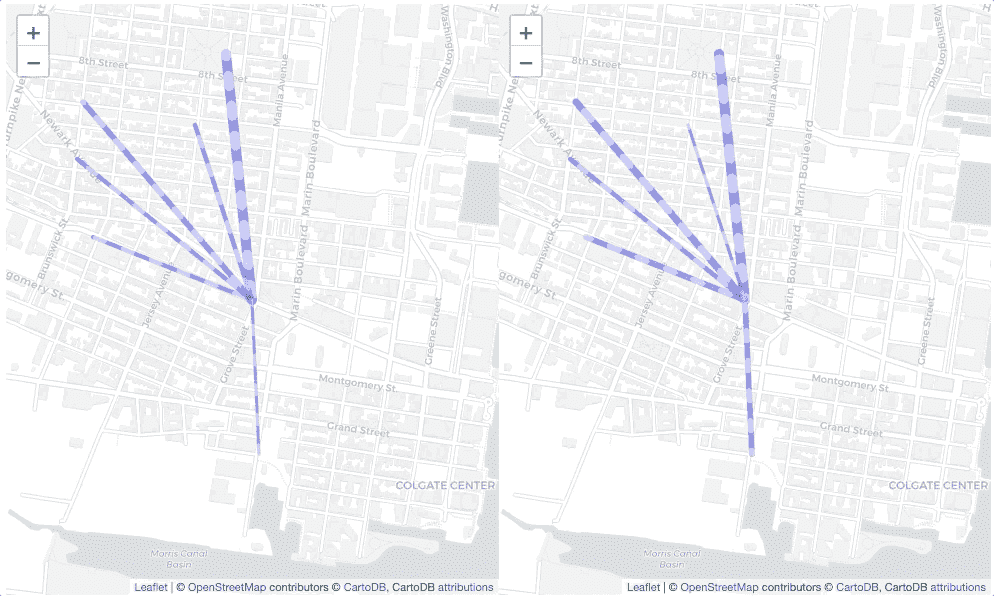

# 热图时间

根据这个插件的[文档](https://python-visualization.github.io/folium/plugins.html)，它需要的输入是一个列表列表:

"**数据**(*[lat，lng]或[lat，lng，weight]* 形式的点列表列表)-您想要绘制的点。外部列表按顺序对应不同的时间步长。(权重在(0，1)范围内，如果没有为点指定权重，则默认为 1)"

也就是说，我们需要为一天中的每个小时创建一个点列表，然后将所有这些列表放入一个新列表中。为此，我们创建了一个函数:

```
*# Create an empty list*
df_hour_list = []

*# Create a series with the different hours of the day*
hours = pd.Series(nyc.index.hour.unique().sort_values())

*# Create a list of points for each hour of the day*
def create_list(hour):
    df_hour_list.append(nyc.loc[nyc.index.hour == hour,
                                ['start station latitude',
                                 'start station longitude']].
                        groupby(['start station latitude', 
                                 'start station longitude']).sum().reset_index().values.tolist())
hours.apply(create_list);
```

之后，我们可以很容易地创建时间热图。

```
from folium.plugins import HeatMapWithTime

*# Add trip events to the map*
map_time = folium.Map(location=location, 
                      tiles="CartoDB Positron", 
                      zoom_start=12)

HeatMapWithTime(df_hour_list, 
                auto_play=True, 
                max_opacity=0.5, 
                gradient = {0.2: '#FBD973', 
                            0.4: '#fa782f', 
                            0.75: '#F16578', 
                            1: '#782890'}).add_to(map_time)
map_time
```


目前就这些了，希望你觉得有用。

如果你觉得它有帮助，请留下一些掌声来帮助我继续下去；)

感谢阅读！

# 参考

[赫尔辛基大学 AutoGIS 课程](https://automating-gis-processes.github.io/2018/index.html)

[杰克·范德普拉斯的 Python 数据科学手册](https://jakevdp.github.io/PythonDataScienceHandbook/)

[用树叶地图可视化空气污染](/visualizing-air-pollution-with-folium-maps-4ce1a1880677)

[How to:follow for maps，heatmaps &时间分析](https://www.kaggle.com/daveianhickey/how-to-folium-for-maps-heatmaps-time-analysis)作者 Dave Ian Hickey

[叶子文档](https://python-visualization.github.io/folium/) [叶子插件文档](https://python-visualization.github.io/folium/plugins.html)

*原载于*[*https://www.linkedin.com*](https://www.linkedin.com/pulse/visualizing-nyc-bike-data-interactive-animated-maps-folium-toso)*。*