# 用矩阵变换可视化主成分分析

> 原文：<https://towardsdatascience.com/visualizing-principal-component-analysis-with-matrix-transforms-d17dabc8230e?source=collection_archive---------5----------------------->

## 理解特征值、特征向量和主分量的指南

主成分分析(PCA)是一种通过识别特征值和特征向量将数据分解成不相关成分的方法。以下内容旨在帮助您直观地了解这些不同的值代表什么以及它们是如何计算的。首先，我将展示如何使用矩阵来转换数据，然后在 PCA 中如何使用这些矩阵。

# 矩阵变换

对于以下各项，我将对这个圆和网格应用矩阵变换:

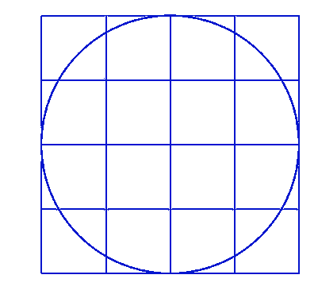

让我们使用这个作为我们的“数据”图像来帮助可视化每个转换发生了什么。图像上的点可以用原点位于圆心的[x，y]坐标来描述，我们可以使用 2D 变换矩阵*来变换这些点。*对于每个示例，我将用蓝色显示转换后的数据图像，用绿色显示原始数据图像。

**缩放矩阵**

比例矩阵是所有非对角元素为零的对角矩阵。

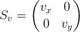

如果对角线元素小于 1，它会使数据图像在该方向变小。如果它大于 1，它会使数据图像在该方向变大。比如我们设*vₓ*= 1.2*vᵧ*= 0.6，就会变宽( *vₓ* > 1)，变短( *vᵧ* < 1)。

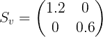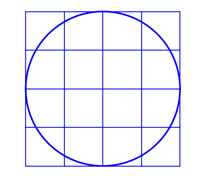

**旋转矩阵**

旋转矩阵将围绕原点旋转数据一个角度 *θ* 而不改变其形状，如下所示:

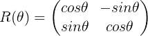

这里我将图像旋转了正 20 度。注意它是逆时针旋转的。

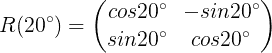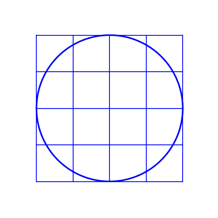

**剪切矩阵**

剪切矩阵通过具有非零的非对角线元素来倾斜轴。

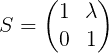

*λ* 越大，剪切力越大。这里，x 值被移动以产生剪切。

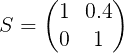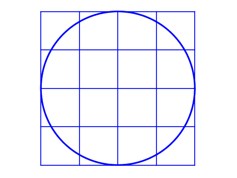

这里，y 值被移动。

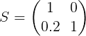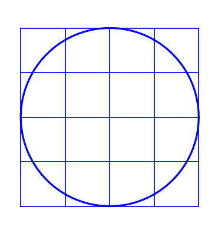

**对称矩阵**

对称矩阵将基本上以相反的方向旋转 x 轴和 y 轴。

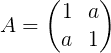

作为对称矩阵只要求每个非对角元素 *i，j* 与元素 *j，i* 相同。

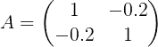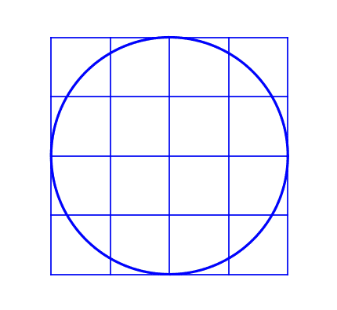

非对角线元素的符号决定了歪斜的方向。而且，对角元素是相互独立的，不管它们的值是多少，矩阵仍然是对称的。

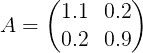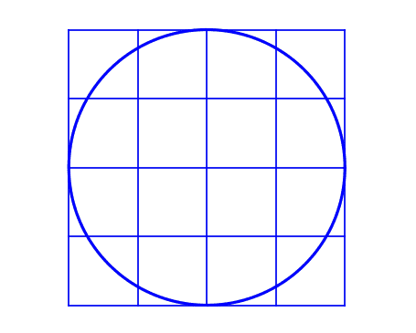

# 矩阵分解

对称矩阵的一个[特性是它们可以分解成三个矩阵，其关系如下:](http://mathworld.wolfram.com/SymmetricMatrix.html)

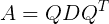

其中 *Q* 是正交矩阵( *Q* ⁻ = *Qᵀ* )，而 *D* 是对角矩阵。

注意旋转矩阵是正交的(*r*(*θ*)⁻=*r(*-*θ*)=*r*(*θ*)*ᵀ*)，缩放矩阵是对角的。这意味着我们的对称矩阵实际上可以用旋转和缩放矩阵的组合来代替:

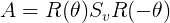

因此，数据图像的对称变换与旋转是一回事，沿 x 轴和 y 轴缩放，然后再旋转回来。这里我将使用三种变换(旋转、缩放、反旋转)来进行与上面对称例子相同的最终变换。

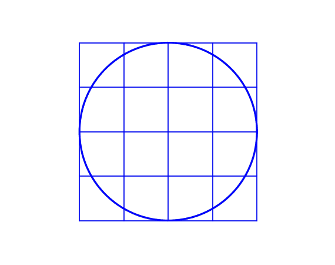

另一种思考方式是对称矩阵 *A* 与缩放矩阵 *Sᵥ* 相同，但它只是以相对于 x 轴和 y 轴的角度 *θ* 进行缩放。一个不是一个对角矩阵的唯一原因是它是一个相对于 x 轴和 y 轴缩放的度量。如果我们创建一组旋转了角度 *θ* 的新轴(如下所示)，并制作一个相对于这些轴测量的缩放矩阵，这将是一个对角矩阵。

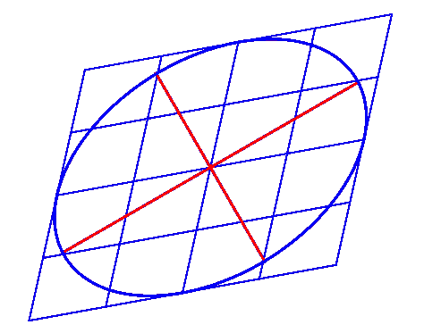

*A* 沿其缩放的这些轴是*主分量轴。*

在相当于 *A* 的对角缩放矩阵中，对角元素是数据沿主分量轴延伸的量。它们描述了数据的形状，告诉我们数据在不同的方向上是变长了还是变短了。那些对角线元素是特征值*。*

*旋转矩阵包含一组给出主分量轴旋转的向量。这些向量就是*特征向量。**

*单个特征值及其对应的特征向量给出了一个*主分量的幅度和方向。**

# *数据示例*

*现在让我们找出一组随机数据点的主成分。*

*让我们制作一些数据，使其以原点为中心(这是矩阵变换正确的必要条件)，并从 x 轴倾斜 30°(因此，斜率为δ*y/*δ*x*=*tan*30°)。*

*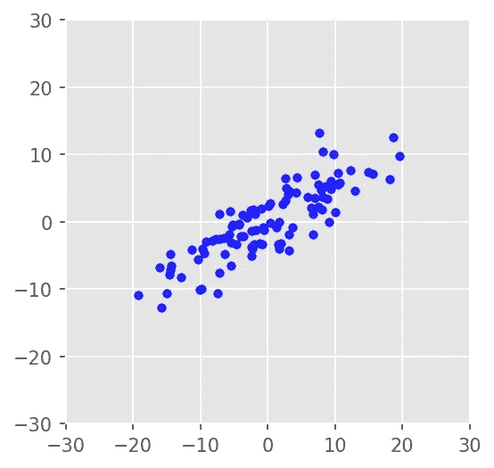*

*一个[协方差矩阵](https://en.wikipedia.org/wiki/Covariance_matrix)显示了数据集中两个矢量元素的协方差。如果两个向量元素一起变化，它们将具有更高的协方差。如果一个元素的变化完全独立于另一个元素，那么它们的协方差会变为零。数据中的斜率意味着 x 和 y 值不是独立的，因此它将具有非零的非对角线值。让我们看看数据的协方差矩阵。*

*注意这个矩阵是对称的。这是因为 *i* 和 *j* 元素的协方差与 *j* 和 *i* 元素的协方差相同(它们是相同的两个元素的协方差)。协方差矩阵 *C* 因此可以分解为:*

*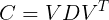*

**V* 是矩阵，其中每列是不同的特征向量， *D* 是特征值的对角矩阵。*

*既然我们知道我们旋转数据的角度，让我们计算我们期望得到的特征向量的值(列 *V* ):*

*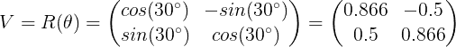*

*接下来，我们来计算特征值。特征值将是沿着主分量轴的数据的方差。我们可以通过用特征向量对数据进行反旋转来测量这些值，然后找出 x 和 y 方向上的方差。*

*这里的数据是反旋转的:*

*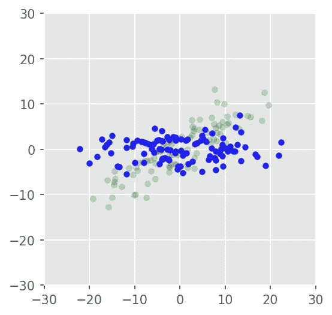*

*x 和 y 方向的方差:*

*x 方向的方差最大，因此数据中的大部分信息都在该分量中。这是*的第一个* *主成分*。进一步的主成分基于它们的方差从最大到最小排序。*

*既然我们已经知道会发生什么，让我们使用 scikit-learn 的 PCA 模块并将结果与我们的进行比较。首先，让我们打印出主成分。(该模块以行的形式返回特征向量，所以我将打印出转置，将它们放入如上所示的列中。)*

*注意这和我们计算的旋转矩阵相似。列是按重要性排序的特征向量，显示第一分量、第二分量等的方向。*

*接下来，让我们打印出解释的差异:*

*这些与我们计算的方差一致。同样，这些组件按从大到小的顺序排列。*

# *查看组件*

*为了更清楚地理解独立的特征向量以及它们如何旋转数据，让我们使用它们来创建图像，以便直观地将主成分与数据进行比较。*

*一般来说，我们可以将一个特征向量乘以任意数，它会给出该点在主分量轴上的 x 和 y 值。让我们使用噪声的三个[标准偏差](https://en.wikipedia.org/wiki/Normal_distribution)作为该数字，它可以通过以下关系使用方差来计算*

*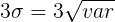*

*使用 3σ处的点可以很好地指示不同主分量的相对噪声。让我们创建一个值为[-3σ，3σ]的数组，对于我们的第一个主成分，它将是*

*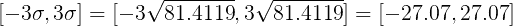*

*然后，我们可以将数组乘以第一特征向量，这将给出这两个值沿第一主分量轴的 x 和 y 分量。*

*类似地，这可以通过改变所使用的指数来对其他主要成分进行。通过在每个主成分的 3σ点之间绘制一条线(通过简单的`plt.plot(x_comp,y_comp)`使用 matplotlib)，我们可以查看它们的噪声范围。*

*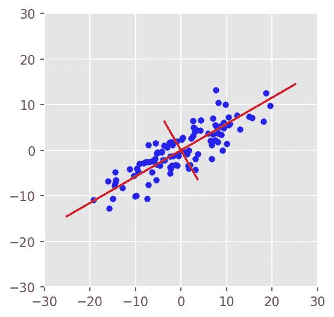*

*简而言之，两条红线表示两个主分量的方向。它们的旋转角度由特征向量计算，它们的长度由特征值确定，以显示沿轴的 3σ噪声范围。*

# *降维*

*为了更好地理解特征值的重要性，让我们在一个降维的例子中使用它们。*

*如果想知道总方差中有多少是由不同的分量解释的，可以用每个特征值除以特征值的总和。*

*这意味着 94.6%的解释方差在第一部分。然而，有一种更快的方法可以得到解释方差的比率:*

*第二主成分占数据中方差信息的 5.4%，可能主要是噪声。如果要进行降维，可以去掉第二个主成分，只保留第一个主成分的信息。*

*首先，我将展示如何用特征向量来实现这一点，然后如何用 scikit-learn 轻松实现这一点。*

*如果我们首先从主分量与 x、y 轴对齐的旋转数据(上面的`rotated_data`)开始，点的 x 分量实际上是第一主分量。我们可以通过使用第一个特征向量，将主分量旋转回原始方向，就像我们在上面绘制 3σ线一样。*

*这是`first_component`和旋转后的数据一起绘制的。*

*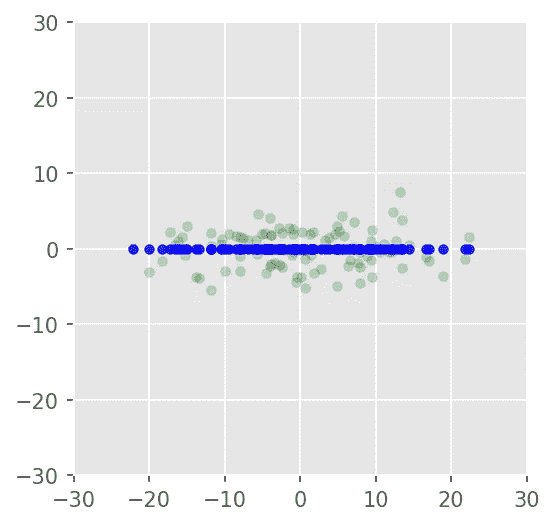*

*这是与原始数据一起绘制的`first_component_xy`。*

*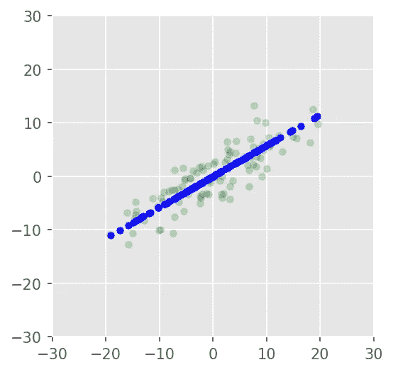*

*数据点现在位于第一主成分轴上。*

*要使用 scikit-learn 获得第一个主成分，只需将成分数设置为 1 并转换数据。*

*数组`first_component`和`first_component_xy`将和上面显示的一样。*

# ***总结***

*与基本矩阵变换相比，主成分分析更容易理解。我们可以将协方差矩阵分解为旋转和缩放矩阵。*

**旋转矩阵*:这些矩阵旋转数据而不改变其形状。类似地，特征向量用于将数据“旋转”到一个新的坐标系中，以便相关的特征与新的轴(主分量轴)对齐。*

**缩放矩阵*:这些对角矩阵沿着不同的坐标轴缩放数据。类似地，特征值的对角矩阵给出了沿着不同主分量轴的数据方差(它们的尺度)的度量。*

*最后，降维与首先旋转具有要与主分量对齐的特征值的数据，然后仅使用具有最大特征值的分量是相同的。*