# 使用 Seaborn 可视化统计图

> 原文：<https://towardsdatascience.com/visualizing-statistical-plots-with-seaborn-6b6e60ce5e71?source=collection_archive---------22----------------------->

这是关于可视化的第二篇文章。你可以阅读第一篇文章，在那里我讨论了使用 matplotlib [进行可视化的基础知识。](/visualization-in-python-matplotlib-c5c2aa2620a)

概括地说，可视化让我们看到数据是如何分布的，检测异常值，并让我们更有效地传达信息。这就是为什么数据科学家/分析师知道如何可视化以及他们有哪些可用选项非常重要。在本文中，我将介绍如何使用 seaborn 来可视化统计图表。

为此，我们将利用 seaborn 自身的一些数据集。这避免了我们必须下载和导入数据集的麻烦。您可以在这个[链接](https://github.com/mwaskom/seaborn-data)中看到可用数据集的完整列表。


Photo by [Luke Chesser](https://unsplash.com/@lukechesser?utm_source=unsplash&utm_medium=referral&utm_content=creditCopyText) on [Unsplash](https://unsplash.com/s/photos/data-visualization?utm_source=unsplash&utm_medium=referral&utm_content=creditCopyText)

我们将从导入所需的库开始。

```
import matplotlib.pyplot as plt
import numpy as np
import seaborn as sns
```

接下来，让我们加载“虹膜”数据集，看看它。

```
iris = sns.load_dataset('iris')
iris.head()
```

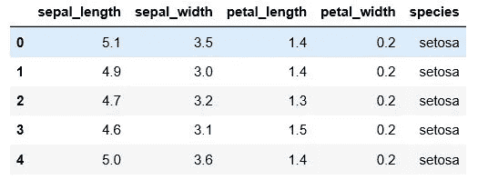

Iris dataset

Iris 数据集包含三种不同物种的花的细节。由于这个数据集主要包含数字列，我们将使用它来探索适合数字数据的可视化。

所以我们能做的第一件事是检查任何一列的分布。

```
sns.set(style = 'darkgrid')
sns.distplot(iris['sepal_length'])
```

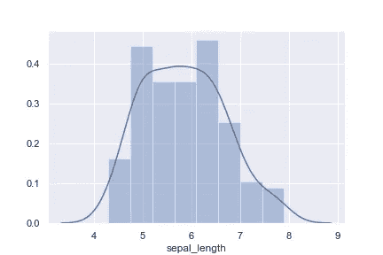

Fig 2

第一行允许您设置图形的样式，第二行构建分布图。这个“distplot”命令在同一个图形中构建直方图和 KDE 图。

但是我们可以选择定制上面的图表，甚至将它们分开。

```
sns.distplot(iris['sepal_length'], kde = False, bins = 30)
```

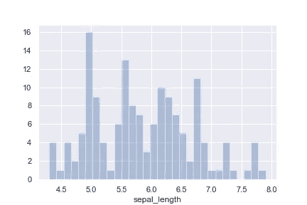

Fig 3

在这里，我们不仅删除了 KDE 图，而且还能够在图中添加更多的箱，以便更好地了解分布情况。这是分别通过“kde”和“bin”参数实现的。

KDE 图可以在 KDE plot 命令的帮助下单独查看。

```
sns.kdeplot(iris['sepal_length'])
```

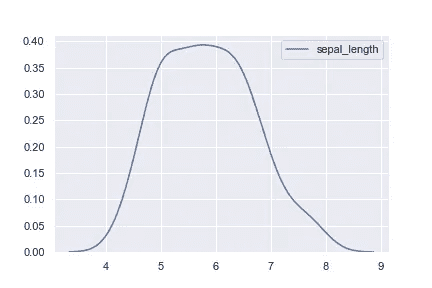

Fig 4

使该图更好的一种方法是能够显示各种数据点的存在，以便更好地理解数据的分布。类似于直方图，但具有小的柱。这是在地毯图的帮助下完成的。

```
sns.kdeplot(iris['sepal_length'])
sns.rugplot(iris['sepal_length'])
```

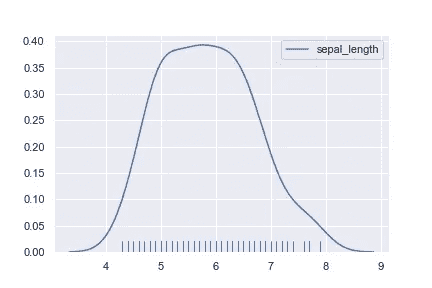

Fig 5

上面的图称为地毯图，给出了点的分布和密度。

仅仅可视化一个变量就够了，如果你想看看两个变量是如何相对于彼此分布的呢？

假设我们想知道花的萼片和花瓣长度之间的关系。在这种情况下，我们可以使用 jointplot 来可视化它。

```
sns.jointplot(x = 'sepal_length', y = 'petal_length', data = iris)
```

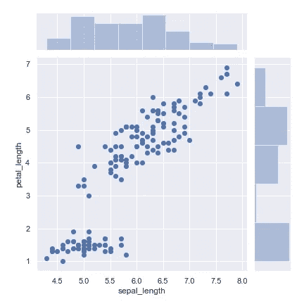

Fig 6

上面的图不仅给出了联合分布，也给出了沿轴的个体分布。从上图可以看出，除了在较低端，两者之间几乎是线性关系。

joinplot 的一个很酷的特性是能够拟合数据的回归线。

```
sns.jointplot(x = 'sepal_length', y = 'petal_length', data = iris, kind = 'reg')
```

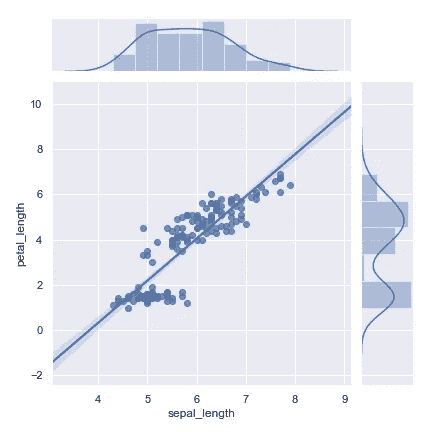

Fig 7

通过将' reg '传递给 kind 参数，我们可以添加一条回归线，并将 kde 图添加到边上的直方图中。

最后，如果我们想一次性快速了解全部数据，我们可以使用 pairplot 函数。

```
sns.pairplot(iris)
```

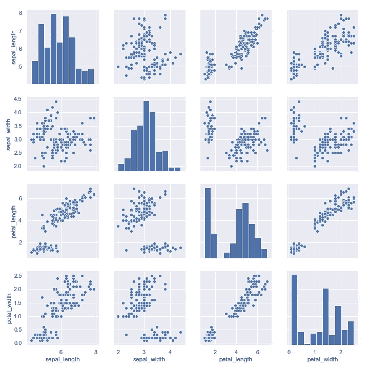

Fig 8

唯一要传递的参数是数据集名称，它将自动为数据中出现的所有数字列构建上面的图。它将每一个数字列与其他数字列相对照，有助于快速浏览数据。

但是上面的图仍然缺少一列 species，这恰好是一个分类列。我们可以在此包含关于分类列的信息吗？

```
sns.pairplot(iris, hue = 'species', palette = 'magma')
```

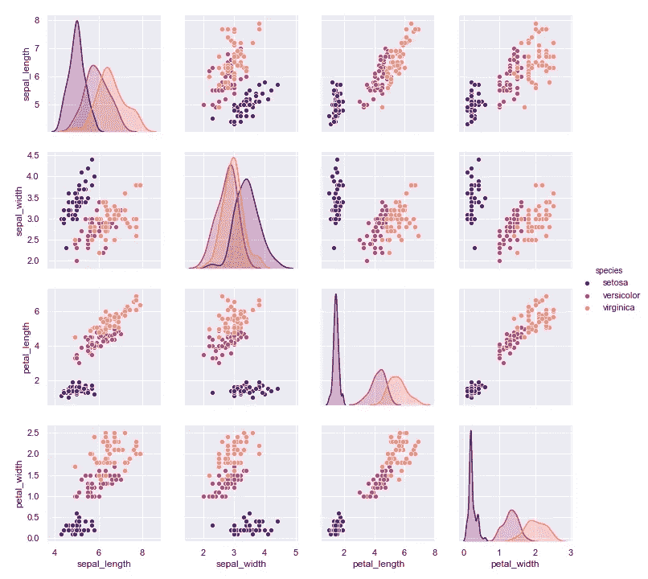

Fig 9

在每个单独的图中，分类数据以颜色方案的形式表示。参数“色调”可用于传递此信息，而“调色板”控制绘图的颜色方案。

现在让我们来看看包含更多分类列的可视化数据。为此，我们将使用“提示”数据集。让我们把它装上来看一看。

```
tips = sns.load_dataset('tips')
tips.head()
```

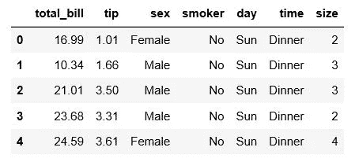

Tips data

“小费”数据集包含就餐者支付的小费及其信息，如账单金额、性别、时间等。让我们从观察小费金额的分布及其与总账单金额的关系开始。

```
sns.distplot(tips['tip'], kde = False, bins = 30)
sns.jointplot(x = 'total_bill', y = 'tip', data = tips, kind = 'kde')
```

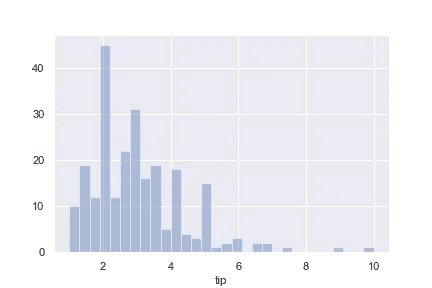

Fig 11

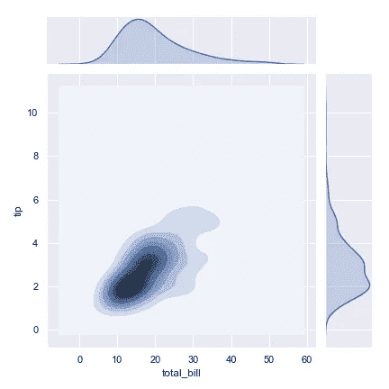

Fig 12

现在让我们看看给的小费是否每天都不同。这可以在箱线图的帮助下完成。

```
sns.boxplot(x = 'day',y = 'tip',  data = tips, palette = 'coolwarm')
```

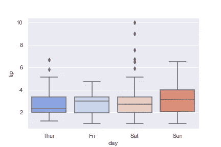

Fig 13

也许我们想通过用餐者的性别进行比较。像在 pairplot 中一样，我们也可以通过“色调”参数来指定

```
sns.boxplot(x = 'day',y = 'tip',  data = tips, hue = 'sex', palette = 'coolwarm')
```

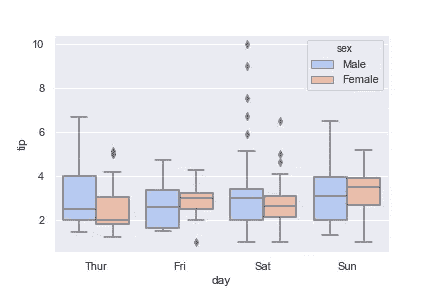

Fig 14

这根据性别为每天创建了两个箱线图。

另一种在小提琴的帮助下可视化上述数据的方法。

```
sns.violinplot(x = 'day',y = 'tip', data = tips, palette = 'rainbow')
```

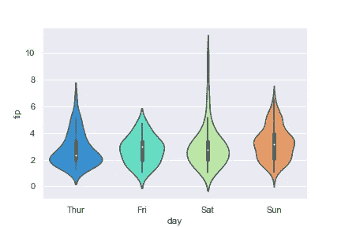

Fig 15

小提琴图可以被认为是盒子图和 kde 图的组合。中间的粗线表示四分位数之间的范围，两边都是顶端的 kde。

类似于盒子情节，我们可以用‘性’来创造两个并排的小提琴情节来比较。但在这种情况下我们有更好的选择。

```
sns.violinplot(x = 'day',y = 'tip',  data = tips, hue = 'sex', split = True, palette = 'rainbow')
```

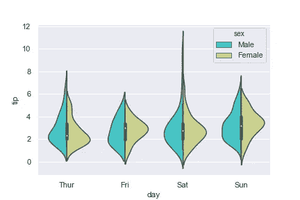

Fig 16

通过将“split”指示为 true，我们能够在中心线的每一侧创建两个不同的 kde。这让我们可以并排看到差异，而不会排挤剧情。

之前我们看到，我们能够使用配对图来查看整个数据，并包括一个分类列。但是在这种情况下，我们有多个分类列。这些可以通过小平面网格整合到绘图中。

```
g = sns.FacetGrid(tips, col="time",  row="smoker")
```

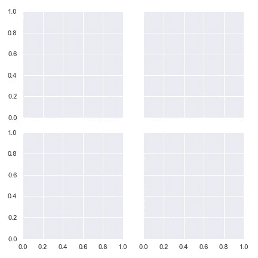

Fig 17

上面的命令创建了一个 2 x 2 的图来说明“时间”和“吸烟者”之间的四种可能性。对于用餐时间和用餐者是否吸烟的每种组合，都有一个曲线图。

在这些图中，我们可以添加数字数据，并比较它们在上述“时间”和“吸烟者”两列中的差异。

```
g = sns.FacetGrid(tips, col="time",  row="smoker")
g = g.map(plt.hist, "tip")
```

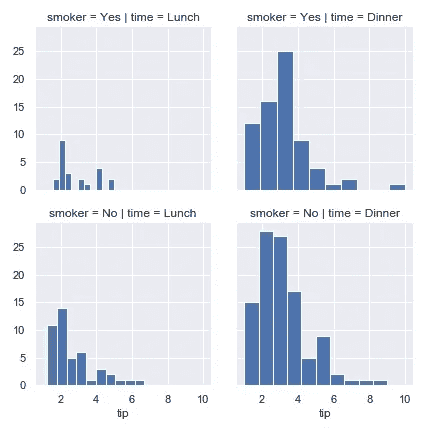

Fig 18

我添加了小费值的分布，以观察它们在“时间”和“吸烟者”之间的差异。每个图的上方有一条线，指示它对应的“时间”和“吸烟者”值。

类似地，我们也可以绘制两个数字列，并查看两者之间以及“时间”和“吸烟者”之间的关系。

```
g = sns.FacetGrid(tips, col="time",  row="smoker",hue='sex')
g = g.map(plt.scatter, "total_bill", "tip").add_legend()
```

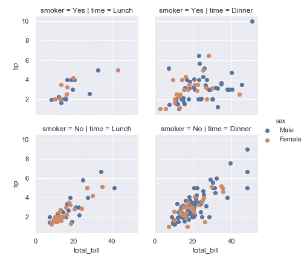

Fig 18

上图显示了小费和账单金额之间的关系，以及“时间”和“吸烟者”之间的关系。此外，每个地块的配色方案也显示了性别。通过使用分面网格，我们可以创建包含多个数字和分类列的图。

最后，我想介绍一下热图和聚类图。

在下图中，我使用了热图来显示所有数值之间的相关性。

```
sns.heatmap(tips.corr(), cmap = 'coolwarm', annot = True)
```

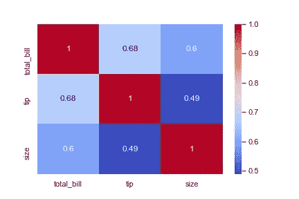

Fig 19

命令“tips.corr”给出了所有数值变量之间的相关性。通过将“不能”表示为真，我们也可以在图上得到相关值。

为了构建聚类图，我首先透视小费数据集，以获得不同日期和性别的小费金额。

```
tip_pivot = tips.pivot_table(values='tip',index='day',columns='sex')
```

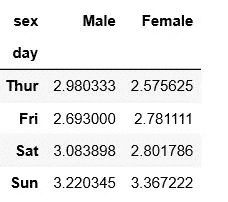

Pivoted table

利用这一点，我可以创建一个关于小费价值和日期之间距离的聚类图。

```
sns.clustermap(tip_pivot, cmap = 'coolwarm', standard_scale = 1)
```

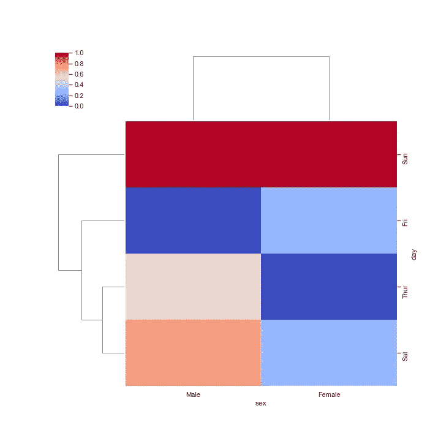

Fig 21

因为只有两种性别，所以没有什么可看的。但是在星期几的例子中，我们看到星期六和星期四被组合在一起，表明这两天给小费的数量相似。

上面的聚类图非常简单，因为每个轴上没有很多类别。当有多个允许辨别相似性和模式的类别时，一个聚类图会非常出色。

这涵盖了一些可以使用 Seaborn 构建的统计图和可视化。希望你觉得有用。

你也可以通过 LinkedIn 与我联系。