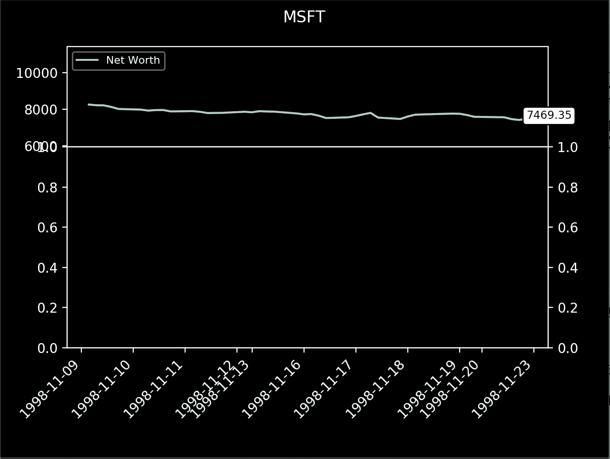

# 使用 Matplotlib 和 Gym 绘制优雅的股票交易代理

> 原文：<https://towardsdatascience.com/visualizing-stock-trading-agents-using-matplotlib-and-gym-584c992bc6d4?source=collection_archive---------3----------------------->

我们将扩展我们在上一个教程中编写的代码，以使用 Matplotlib 呈现环境的可视化效果。如果你没有读过我的第一篇文章 [**从头开始创造定制的健身房环境**](https://medium.com/@notadamking/creating-a-custom-openai-gym-environment-for-stock-trading-be532be3910e) **，**，你应该停下来先读一下。

如果你对`matplotlib`库不熟悉，不用担心。我们将检查每一行，以便您可以创建自己的`gym`环境的自定义可视化。一如既往，本教程的代码将在我的 [**Github**](https://github.com/notadamking/Stock-Trading-Visualization) 上提供。

下面是我们将在本文中创建的内容的预览:


如果看起来很复杂，其实也没那么糟糕。只有几个关于每个`step`的图表更新，注释了一些关键信息。我们开始吧！

# **股票交易可视化**

在上一个教程中，我们编写了一个简单的`render`方法，使用`print`语句显示代理的净值和其他重要指标。让我们将这个逻辑转移到一个名为`_render_to_file`的新方法中，这样我们就可以在必要时将一个会话的交易指标保存到一个文件中。

```
***def*** _render_to_file(*self*, *filename*='render.txt'):
  profit = self.net_worth - INITIAL_ACCOUNT_BALANCE

  file = open(filename, 'a+') file.write(*f*'Step: {self.current_step}\n')
  file.write(*f*'Balance: {self.balance}\n')
  file.write(*f*'Shares held: {self.shares_held} (Total sold: 
    {self.total_shares_sold})\n')
  file.write(*f*'Avg cost for held shares: {self.cost_basis} (Total 
    sales value: {self.total_sales_value})\n')
  file.write(*f*'Net worth: {self.net_worth} (Max net worth: 
    {self.max_net_worth})\n')
  file.write(*f*'Profit: {profit}\n\n') file.close()
```

现在，让我们继续创建新的`render`方法。它将利用我们新的`StockTradingGraph`类，我们还没有写。我们下一步会谈到这个。

```
***def*** render(*self*, *mode*='live', *title*=None, ***kwargs*):
  # Render the environment to the screen **if** mode == 'file':
    self._render_to_file(kwargs.get('filename', 'render.txt'))
  **elif** mode == 'live':
    **if** self.visualization == None:
      self.visualization = StockTradingGraph(self.df, title)

    **if** self.current_step > LOOKBACK_WINDOW_SIZE:        
      self.visualization.render(self.current_step, self.net_worth, 
        self.trades, *window_size*=LOOKBACK_WINDOW_SIZE)
```

我们在这里使用`[kwargs](http://book.pythontips.com/en/latest/args_and_kwargs.html)`将可选的`filename`和`title`传递给`StockTradingGraph`。如果你不熟悉`kwargs`，它基本上是一个向函数传递可选关键字参数的字典。

我们还为可视化传递了`self.trades`,但是还没有定义它，所以让我们开始吧。回到我们的`_take_action`方法，无论何时我们买入或卖出股票，我们现在都要将交易的细节添加到`self.trades`对象中，在我们的`reset`方法中我们已经将它初始化为`[]`。

```
**def** _take_action(self, action):
  ... **if** action_type < 1:
    **...
**    
    **if** shares_bought > 0:
      self.trades.append({'step': self.current_step,
        'shares': shares_bought, 'total': additional_cost,
        'type': "buy"}) **elif** action_type < 2:
    **...** **if** shares_sold > 0:
      self.trades.append({'step': self.current_step,
        'shares': shares_sold, 'total': shares_sold * current_price,
        'type': "sell"})
```

现在，我们的`StockTradingGraph`已经拥有了呈现股票价格历史和交易量所需的所有信息，以及我们代理的净值和它所做的任何交易。让我们开始渲染我们的可视化。

首先，我们将定义我们的`StockTradingGraph`和它的`__init__`方法。在这里我们将创建我们的`pyplot`人物，并设置每个要渲染的支线剧情。`date2num`函数用于将日期重新格式化为时间戳，这在以后的呈现过程中是必要的。

```
**import** numpy **as** np
**import** matplotlib
**import** matplotlib.pyplot **as** plt
**import** matplotlib.dates **as** mdates***def*** date2num(*date*):
  converter = mdates.strpdate2num('%Y-%m-%d')
  **return** converter(date)***class*** **StockTradingGraph**:
  """A stock trading visualization using matplotlib made to render 
    OpenAI gym environments"""***def*** __init__(*self*, *df*, *title*=None):
    self.df = df
    self.net_worths = np.zeros(len(df['Date'])) # Create a figure on screen and set the title
    fig = plt.figure()
    fig.suptitle(title) # Create top subplot for net worth axis
    self.net_worth_ax = plt.subplot2grid((6, 1), (0, 0), *rowspan*=2,     
      *colspan*=1)

    # Create bottom subplot for shared price/volume axis
    self.price_ax = plt.subplot2grid((6, 1), (2, 0), *rowspan*=8, 
      *colspan*=1, *sharex*=self.net_worth_ax) # Create a new axis for volume which shares its x-axis with 
      price
    self.volume_ax = self.price_ax.twinx() # Add padding to make graph easier to view
    plt.subplots_adjust(*left*=0.11, *bottom*=0.24, *right*=0.90, 
      *top*=0.90, *wspace*=0.2, *hspace*=0) # Show the graph without blocking the rest of the program
    plt.show(*block*=False)
```

我们使用`plt.subplot2grid(**...**)`方法首先在我们的数字顶部创建一个子图来呈现我们的净值网格，然后在它下面为我们的价格网格创建另一个子图。`subplot2grid`的第一个参数是子情节的大小，第二个参数是在图中的位置。

为了呈现我们的交易量棒线，我们在`self.price_ax`上调用`twinx()`方法，这允许我们在顶部覆盖另一个共享相同 x 轴的网格。最后，也是最重要的，我们将使用`plt.show(block=False)`将我们的图形渲染到屏幕上。如果您忘记通过`block=False`，您将只能看到呈现的第一步，之后代理将被阻止继续。


接下来，我们来写我们的`render`方法。这将从当前时间步骤中获取所有信息，并在屏幕上实时显示。

```
***def*** render(*self*, *current_step*, *net_worth*, *trades*, *window_size*=40):
  self.net_worths[current_step] = net_worth window_start = max(current_step - window_size, 0)
  step_range = range(window_start, current_step + 1) # Format dates as timestamps, necessary for candlestick graph
  dates = np.array([date2num(x)
    **for** x **in** self.df['Date'].values[step_range]])

  self._render_net_worth(current_step, net_worth, window_size,   
    dates)
  self._render_price(current_step, net_worth, dates, step_range)
  self._render_volume(current_step, net_worth, dates, step_range)
  self._render_trades(current_step, trades, step_range) # Format the date ticks to be more easily read
  self.price_ax.set_xticklabels(self.df['Date'].values[step_range], 
    *rotation*=45, *horizontalalignment*='right') # Hide duplicate net worth date labels
  plt.setp(self.net_worth_ax.get_xticklabels(), *visible*=False) # Necessary to view frames before they are unrendered    
  plt.pause(0.001)
```

在这里，我们保存`net_worth`，然后从上到下渲染每个图形。我们还将使用代理在`self.render_trades`方法中进行的交易来注释价格图表。这里调用`plt.pause()`很重要，否则在最后一帧真正显示在屏幕上之前，下一次调用`render`会清除每一帧。

现在，让我们看看图表的每一种呈现方法，从净值开始。

```
***def*** _render_net_worth(*self*, *current_step*, *net_worth*, *step_range*, 
                      *dates*):
  # Clear the frame rendered last step
  self.net_worth_ax.clear() # Plot net worths
  self.net_worth_ax.plot_date(dates, self.net_worths[step_range], '-
    ', *label*='Net Worth') # Show legend, which uses the label we defined for the plot above
  self.net_worth_ax.legend()
  legend = self.net_worth_ax.legend(*loc*=2, *ncol*=2, *prop*={'size': 8})
  legend.get_frame().set_alpha(0.4) last_date = date2num(self.df['Date'].values[current_step])
  last_net_worth = self.net_worths[current_step] # Annotate the current net worth on the net worth graph
  self.net_worth_ax.annotate('{0*:.2f*}'.format(net_worth),     
    (last_date, last_net_worth),
    *xytext*=(last_date, last_net_worth),
    *bbox*=*dict*(*boxstyle*='round', *fc*='w', *ec*='k', *lw*=1),
    *color*="black",
    *fontsize*="small") # Add space above and below min/max net worth
  self.net_worth_ax.set_ylim(
    min(self.net_worths[np.nonzero(self.net_worths)]) / 1.25,    
    max(self.net_worths) * 1.25)
```

我们只是调用我们的净值支线剧情上的`plot_date(**...**)`来绘制一个简单的线图，然后用代理当前的`net_worth`进行注释，并添加一个图例。



价格图的呈现有点复杂。为了简单起见，我们将使用不同于音量条的方法来渲染 OHCL 条。首先，如果你还没有这个包，你需要`pip install mpl_finance`，因为这个包是我们将要使用的蜡烛图所需要的。然后将这一行添加到文件的顶部。

```
**from** mpl_finance **import** candlestick_ochl **as** candlestick
```

很好，让我们清除前一帧，压缩 OHCL 数据，并向`self.price_ax`子情节渲染一个蜡烛图。

```
***def*** _render_price(*self*, *current_step*, *net_worth*, *dates*, *step_range*):
  self.price_ax.clear() # Format data for OHCL candlestick graph
  candlesticks = zip(dates,
    self.df['Open'].values[step_range],  
    self.df['Close'].values[step_range],
    self.df['High'].values[step_range], 
    self.df['Low'].values[step_range]) # Plot price using candlestick graph from mpl_finance
  candlestick(self.price_ax, candlesticks, *width*=1,
    *colorup*=UP_COLOR, *colordown*=DOWN_COLOR) last_date = date2num(self.df['Date'].values[current_step])
  last_close = self.df['Close'].values[current_step]
  last_high = self.df['High'].values[current_step] # Print the current price to the price axis
  self.price_ax.annotate('{0*:.2f*}'.format(last_close),
    (last_date, last_close),
    *xytext*=(last_date, last_high),
    *bbox*=*dict*(*boxstyle*='round', *fc*='w', *ec*='k', *lw*=1),
    *color*="black",
    *fontsize*="small") # Shift price axis up to give volume chart space
  ylim = self.price_ax.get_ylim()
  self.price_ax.set_ylim(ylim[0] - (ylim[1] - ylim[0])
    * VOLUME_CHART_HEIGHT, ylim[1])
```


我们用股票的当前价格对图表进行了注释，并向上移动图表以防止它与成交量棒线重叠。接下来让我们看看体积渲染方法，这是非常简单的，因为没有注释。

```
***def*** _render_volume(*self*, *current_step*, *net_worth*, *dates*, 
                   *step_range*):
  self.volume_ax.clear() volume = np.array(self.df['Volume'].values[step_range])

  pos = self.df['Open'].values[step_range] - \
    self.df['Close'].values[step_range] < 0
  neg = self.df['Open'].values[step_range] - \
    self.df['Close'].values[step_range] > 0 # Color volume bars based on price direction on that date
  self.volume_ax.bar(dates[pos], volume[pos], *color*=UP_COLOR,
    *alpha*=0.4, *width*=1, *align*='center')
  self.volume_ax.bar(dates[neg], volume[neg], *color*=DOWN_COLOR,
    *alpha*=0.4, *width*=1, *align*='center') # Cap volume axis height below price chart and hide ticks
  self.volume_ax.set_ylim(0, max(volume) / VOLUME_CHART_HEIGHT)
  self.volume_ax.yaxis.set_ticks([])
```

这只是一个简单的条形图，每个条形显示为绿色或红色，这取决于价格在该时间步长内是上升还是下降。


最后，让我们进入有趣的部分:`_render_trades`。在这个方法中，我们将在价格图上绘制一个箭头，在这里代理进行了一笔交易，并标注了交易的总金额。

```
***def*** _render_trades(*self*, *current_step*, *trades*, *step_range*):
  **for** trade **in** trades:
    **if** trade['step'] **in** step_range:
      date = date2num(self.df['Date'].values[trade['step']])
      high = self.df['High'].values[trade['step']]
      low = self.df['Low'].values[trade['step']] **if** trade['type'] == 'buy':
        high_low = low
        color = UP_TEXT_COLOR
      **else**:
        high_low = high
        color = DOWN_TEXT_COLOR total = '{0*:.2f*}'.format(trade['total']) # Print the current price to the price axis   
      self.price_ax.annotate(*f*'${total}', (date, high_low),
        *xytext*=(date, high_low),
        *color*=color,
        *fontsize*=8,
        *arrowprops*=(*dict*(*color*=color)))
```

就是这样！我们现在有了一个在上一篇文章中创建的股票交易环境的漂亮的、实时的可视化效果！太糟糕了，我们仍然没有花太多的时间来教经纪人如何赚钱…我们下次再谈吧！


不算太寒酸！下周，我们将基于本教程的代码[创建不会赔钱的比特币交易机器人](/creating-bitcoin-trading-bots-that-dont-lose-money-2e7165fb0b29)。

[](/creating-bitcoin-trading-bots-that-dont-lose-money-2e7165fb0b29) [## 创造不赔钱的比特币交易机器人

### 让我们使用深度强化学习来制造有利可图的加密货币交易代理

towardsdatascience.com](/creating-bitcoin-trading-bots-that-dont-lose-money-2e7165fb0b29) 

*感谢阅读！一如既往，本教程的所有代码都可以在我的* [*Github*](https://github.com/notadamking/Stock-Trading-Visualization) *上找到。如果您有任何问题或反馈，请在下面留下评论，我很乐意收到您的来信！我也可以通过@notadamking 的*[*Twitter*](https://twitter.com/notadamking)*联系到。*

*你也可以通过下面的链接在* [*Github 赞助商*](https://github.com/users/notadamking/sponsorship) *或者*[*Patreon*](https://www.patreon.com/join/notadamking)*上赞助我。*

[](https://github.com/users/notadamking/sponsorship) [## GitHub 赞助商

### 嗨，我是亚当。我是一名开发人员、作家和企业家，尤其对深度…

github.com](https://github.com/users/notadamking/sponsorship) 

> Github 赞助商目前正在 1:1 匹配所有捐款，最高可达 5000 美元！

[](https://patreon.com/notadamking) [## 亚当·金正在创造改变世界的内容

### 嗨，我是亚当。我是一名开发人员、作家和企业家，尤其对深度…

patreon.com](https://patreon.com/notadamking)