# 可视化自杀率和世界幸福

> 原文：<https://towardsdatascience.com/visualizing-suicide-rates-and-world-happiness-bc4e6411732f?source=collection_archive---------15----------------------->

## *两者有关系吗？*

由[阿纳维](https://anavikajla.com) & [娜塔莉](http://natalie-tcyeh.com/)

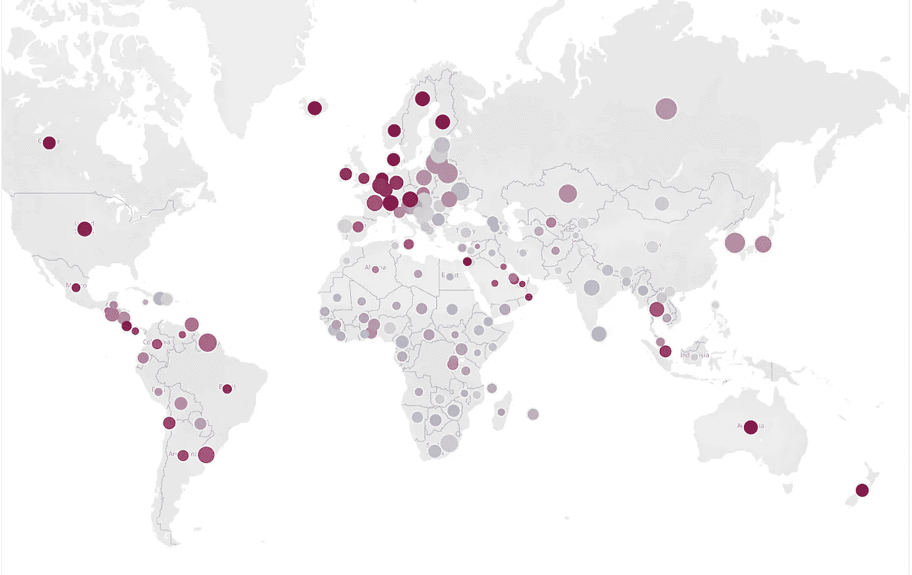

一般来说，一个幸福指数较高的国家的自杀率应该较低。然而，一个相当不为人知的事实是，挪威、芬兰等北欧国家的幸福指数更高，自杀率也更高。

通过这个项目，我们想调查这个异常现象，并通过可视化大量关于这个主题的数据来探索一个国家的自杀率和幸福指数之间是否有关系。我们想看看是否能找到这些矛盾存在的原因，并以历史事件或政府干预的形式揭示它们背后的故事。

# 初始阶段

**背景研究**

我们进行了一次文献回顾，了解到自杀背后的原因可能很多，而且非常复杂。我们很清楚，这个项目的目的不是讨论一个特定国家自杀率背后的原因，而是试图了解这些年来自杀率的变化，并确定可能导致这种变化的潜在因素。例如，如果它与全球趋势有关，如经济危机、历史事件或政府干预(后面会有更多这方面的例子)。

**头脑风暴&素描**

在文献回顾的基础上，我们讨论了一些可能的可视化方法，包括线图、线形图和条形图。这给了我们一个很好的起点来构思随之而来的设计元素。一次头脑风暴会议让我们迅速勾画出一些数据可视化的想法，以尽可能最有效的方式呈现我们的数据。

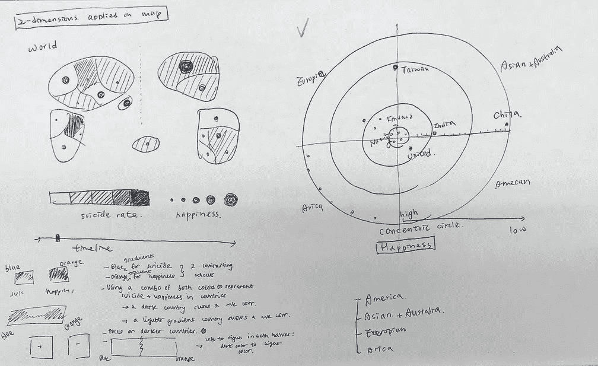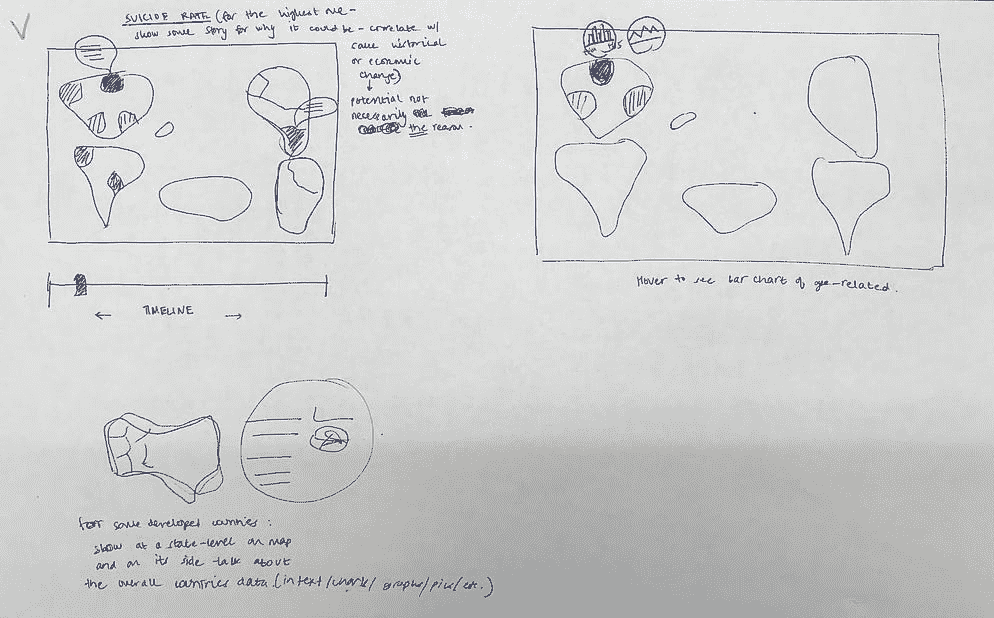

Multi-dimensional World Map & *Interactive Timeline with Historical Event Hover*

# 形象化

最终的可视化效果由 **2 个仪表盘**和它们自己的图形组成——*自杀仪表盘*和*幸福仪表盘*。

他们都是从这种想象开始的:

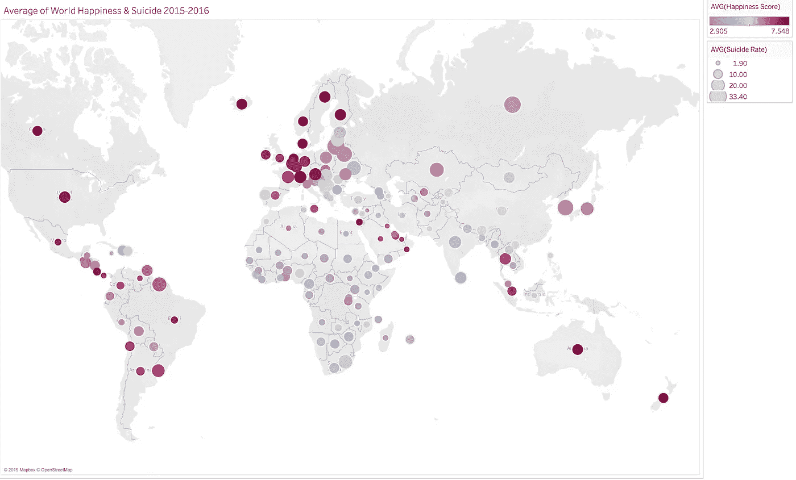

Average of World Happiness & Suicide 2015–2016

> **自杀仪表盘**

从上面的第一张地图中选择一个国家后，接下来的三张图会相应地改变，以获得该国正在发生的事情的详细图片。

1.  **世界幸福感变化&2015-2016 年自杀率(散点图)**

这显示了 2015 年至 2016 年世界幸福和自杀率的变化。深色代表 2016 年，浅色代表 2015 年。用户可以将鼠标悬停在线上，查看是哪个国家，并查看两个指标的值。

用户还可以过滤年份，这样它将只显示所选年份的值。选择两个年份后，用户可以看到两个参数的变化。通过散点图，我们可以很容易地看出没有负相关，这意味着更高的幸福分数并不能保证更低的自杀率，反之亦然。

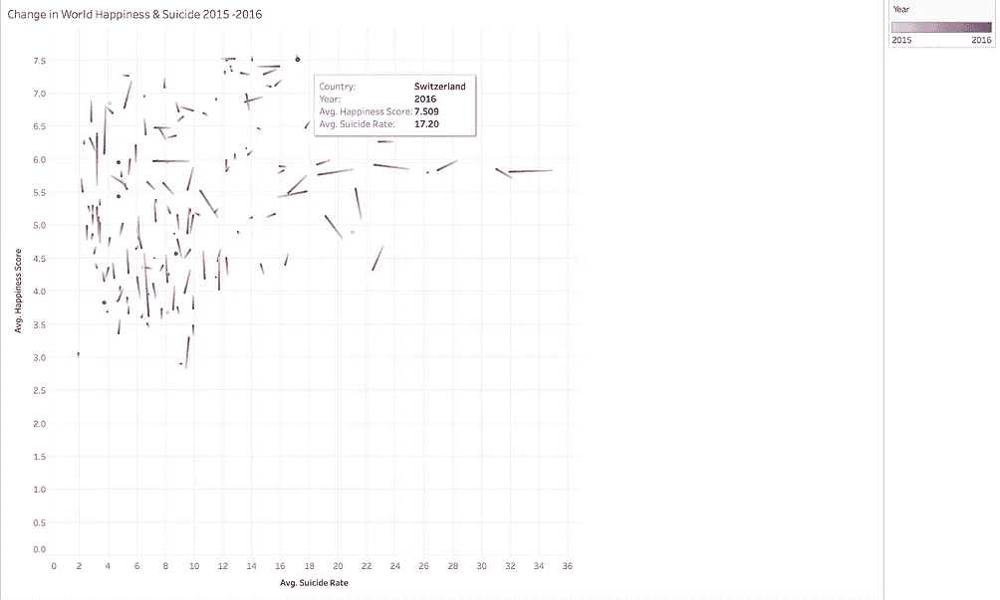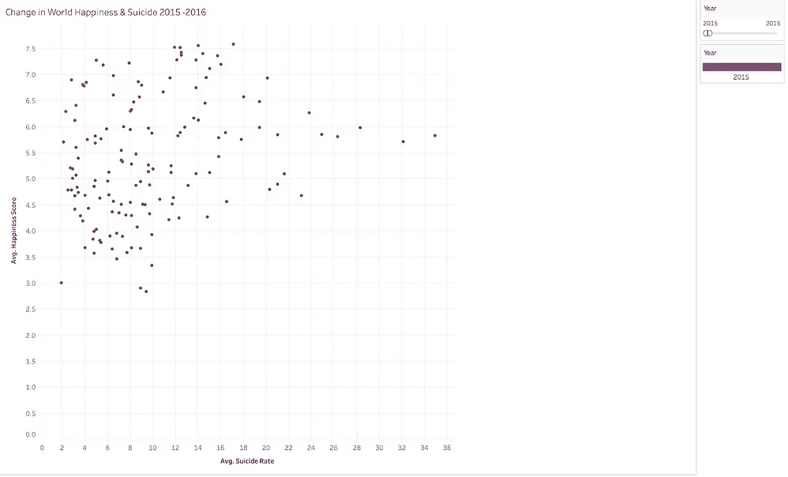

*Scatter plot with Switzerland selected; Scatter plot showing happiness score and suicide rate of the year 2015*

2.**各国自杀率&年龄(折线图)**

为了更深入地了解这些年来自杀率的变化，我们制作了这个折线图。下图显示了从 1985 年到 2016 年的自杀率趋势。用户也可以选择国家，性别和年龄组进行过滤。一个有趣的发现是，从 1985 年到 2016 年，全球女性自杀率通常远低于男性自杀率。

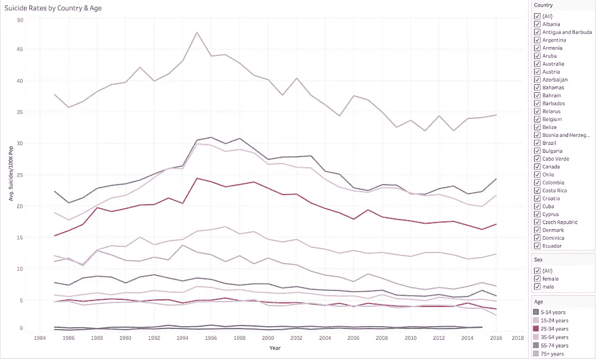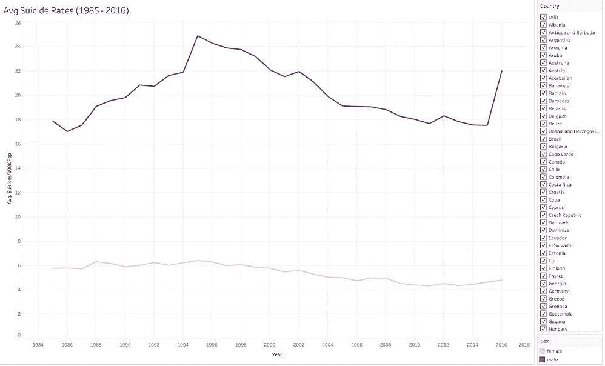

3.**各州自杀率(Choropleth)**

这张图表显示了美国各州的平均自杀率。从图表中，我们可以看出蒙大拿和阿拉斯加的自杀率较高。用户也可以过滤选择年份。

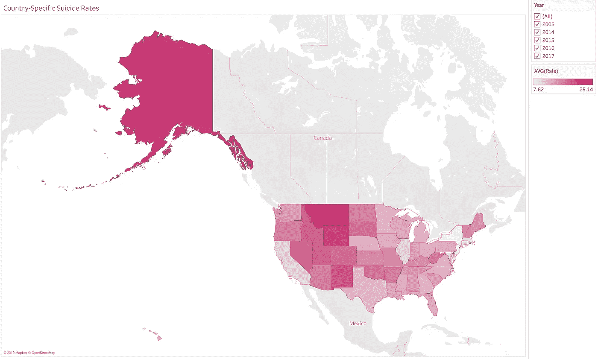

> 幸福仪表板

从上面的第一张地图中选择一个国家后，接下来的两张图会相应地改变，以获得该国正在发生的详细情况。

1.  **2015-2016 年世界幸福指数(堆积条形图)**

这个 viz 显示了 2015-2016 年幸福得分的七个属性的分布。根据《世界幸福报告》，衡量幸福得分的属性包括经济(人均 GDP)、家庭、健康(预期寿命)、慷慨、自由、对政府的信任和反乌托邦残余。该图表显示了每个属性的值，以及它们如何在给定的一年中对一个国家的幸福分数做出贡献。用户可以将鼠标悬停在每个条形上，以查看幸福分数的总值及其对每个属性的分解。用户还可以快速了解哪个国家的幸福指数最高。

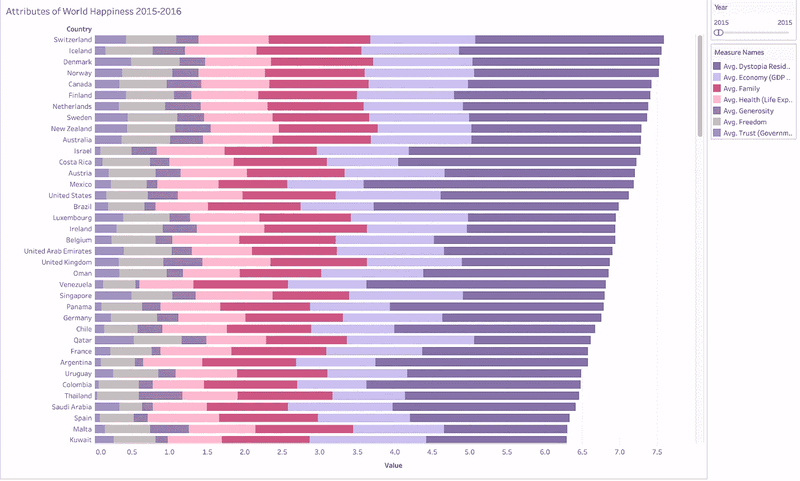

2.**2015-2016 年世界幸福指数(饼状图)**

这些饼状图允许用户按年份比较构成某个国家幸福得分的七个属性的总体贡献。用户可以过滤年份并查看不同年份的值。这与前一个不同，因为它不是数值的平均值，而是给出了各年的清晰图像。

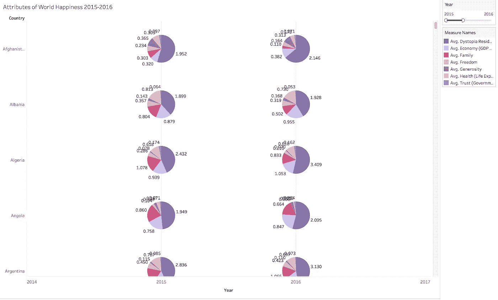

# 有趣的发现

1.  没有证据表明幸福指数高的国家自杀率低，反之亦然。
2.  自杀背后的原因不容易确定。每个国家都有不同的社会和文化背景，导致不同的自杀原因。
3.  几乎每个国家的女性自杀率都比男性低得多。
4.  芬兰是一个高幸福指数和高自杀率国家的典型例子。从数据中，我们发现芬兰的自杀率实际上自 1990 年达到顶峰后大幅下降。经过调查，我们发现这种改善的潜在原因可能是由于 20 世纪 80 年代末发起的全国自杀运动。这有助于提高对精神病治疗的认识和对康复的支持。[1]

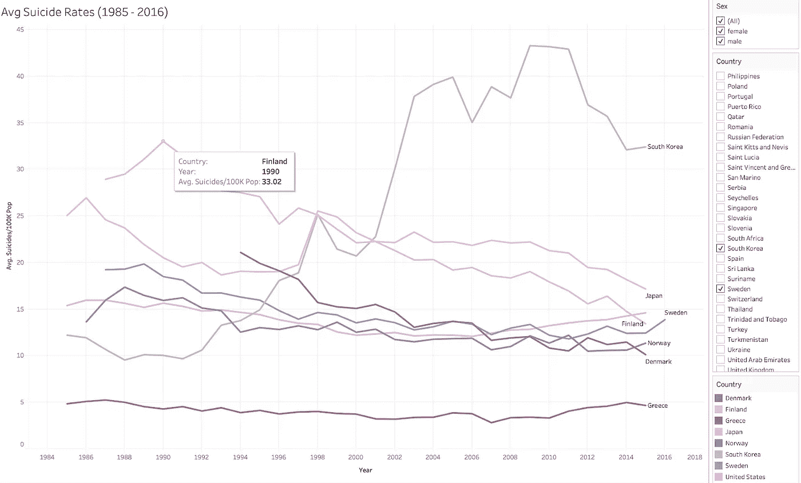

*Line Chart Showing the Trend of Suicide Rate for Denmark, Finland, Greece, Japan, Norway, South Korea, Sweden, and United States*

**5。希腊当前的经济危机激起了我们的兴趣，看看它是否对其自杀率有任何影响。然而，根据这个图像，与我们感兴趣的其他国家相比，希腊这些年的自杀率相对较低。我们发现的另一篇论文证实了这一发现。[2]**

**6。在过去的 15 年里，韩国的自杀率急剧上升，仅仅 10 年后，就从 15/10 万上升到了 40/10 万。这可能有几个潜在的原因，如高失业率和网络欺凌的高发生率。我们发现，韩国政府已经采取行动，如建立当地福利和安全支持系统，为那些试图自杀的人提供善后护理，并根据年龄、性别和社会经济地位量身定制医疗保健计划。[3]**

**7。美国——蒙大拿州的自杀率是美国最高的。从 2016 年的 25.90/100k 上升到 2017 年的 28.90/100k。统计数据显示，蒙大拿州只有不到四分之一的精神卫生保健提供者需要为其居民服务。此外，浓厚的枪支文化、大量饮酒、冬季日照不足和高海拔都导致了高自杀率。[4]2017 年，面临预算短缺，政府削减了该州卫生部门的预算，包括心理健康资金，这进一步加剧了问题。**

# 视频演示

查看我们制作的视频，了解所有的交互和功能！

# 有待改进的领域

1.  **更多“相关事实”**

由于国家数量众多，我们无法调查所有数据的差异，并且只有少数几个国家的信息。此外，如果能够通过包含某种插图或图标，用更多的视觉设计元素来呈现这些数据，那就更好了。然而，即使我们收集了少量的数据，我们仍然得到了一些很好的见解。

**2。更多状态数据**

美国是此次发布中唯一一个拥有各州自杀数据的国家。有了更多的信息，我们将有更多的数据来分析，并找出更多的“相关事实”来支持我们的可视化。此外，这将有助于那些没有大的跳跃或变化的国家。在这种情况下，小的起伏可能是由于几个州的个别变化，这可能更容易指出。

**3。更多最新数据**

我们使用的数据集只到 2016 年。拥有直到 2019 年或至少 2018 年的数据可能会更好，因为这将使我们能够更好地将这些发现与更近期的事件联系起来。

# 谢谢大家！

作者:[阿纳维](https://anavikajla.com) & [娜塔莉](http://natalie-tcyeh.com/)

## 参考

[1]欧盟统计局:芬兰自杀率下降接近欧洲平均水平[https://yle . fi/uutiset/osasto/news/Eurostat _ Falling _ silicon _ rate _ in _ Finland _ nears _ European _ average/10324113](https://yle.fi/uutiset/osasto/news/eurostat_falling_suicide_rate_in_finland_nears_european_average/10324113)

[2]《经济危机期间希腊克里特岛的自杀率:年龄、性别、失业和心理健康服务提供的影响》[https://bmcpsychiatry . biomed central . com/articles/10.1186/s 12888-018-1931-4](https://bmcpsychiatry.biomedcentral.com/articles/10.1186/s12888-018-1931-4)

[3]韩国瞄准高自杀率[https://www . VOA news . com/east-Asia/南朝鲜瞄准高自杀率](https://www.voanews.com/east-asia/south-korea-takes-aim-high-suicide-rate)

[4]蒙大拿州的自杀率是全国最高的。然后预算削减来袭。[https://www . NBC news . com/news/us-news/Montana-have-first-rate-country-then-cuts-hit-n 904246](https://www.nbcnews.com/news/us-news/montana-had-highest-suicide-rate-country-then-budget-cuts-hit-n904246)