# 用 Python 实现流水线中的主成分分析和 SVM

> 原文：<https://towardsdatascience.com/visualizing-support-vector-machine-decision-boundary-69e7591dacea?source=collection_archive---------3----------------------->

## 管道、网格搜索和等高线图

Decision Boundary (Picture: Author’s Own Work, Saitama, Japan)

在之前的一篇文章中，我已经详细描述了关于主成分分析的[和支持向量机(SVM)算法](/dive-into-pca-principal-component-analysis-with-python-43ded13ead21)背后的[数学。在这里，我将结合 SVM、主成分分析和网格搜索交叉验证来创建一个管道，以找到二元分类的最佳参数，并最终绘制一个决策边界来展示我们的算法表现得有多好。你希望在这篇文章中学到/回顾的东西—](/understanding-support-vector-machine-part-1-lagrange-multipliers-5c24a52ffc5e)

*   通过 [Seaborn Library](https://seaborn.pydata.org/) 以有意义的方式联合绘制和表示数据。
*   如果主成分分析中有 2 个以上的成分，如何选择和表示哪 2 个成分比其他成分更相关？
*   使用 PCA 和 SVM 创建管道，通过网格搜索交叉验证找到最佳拟合参数。
*   最后，我们选择 2 个主成分来表示 3d/2d 图中的 SVM 决策边界，使用 [Matplotlib](https://matplotlib.org/) 绘制。

## 1.更好地了解数据集:联合图和 Seaborn

在这里，我使用了 [scikit-learn 癌症数据集](https://scikit-learn.org/stable/modules/generated/sklearn.datasets.load_breast_cancer.html)，这是一个相对简单的数据集，用于研究二元分类，分为恶性和良性两类。让我们来看几行数据帧。

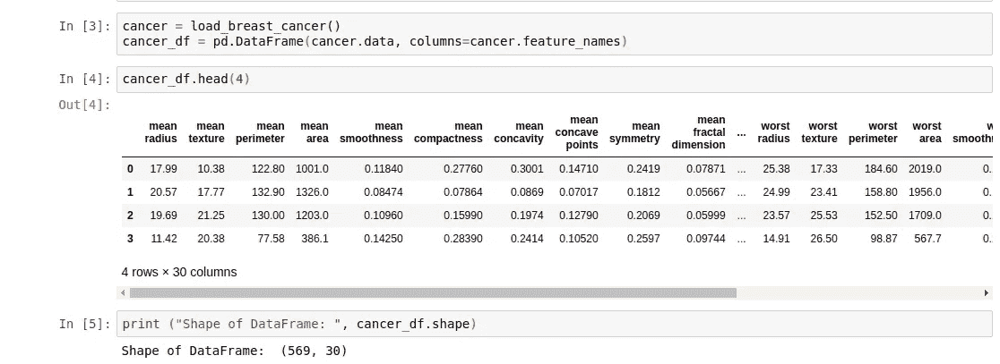

如我们所见，数据集中总共有 569 个样本和 30 个特征，我们的任务是将恶性样本与良性样本进行分类。在确认[没有缺失数据](/data-handling-using-pandas-cleaning-and-processing-3aa657dc9418)后，我们检查特征名称并检查平均特征的相关图。

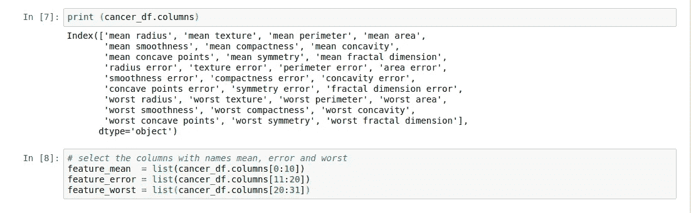

下面是使用 [seaborn 库](https://seaborn.pydata.org/)封装的平均特征的相关图。正如所料，“面积”、“周长”和“半径”高度相关。

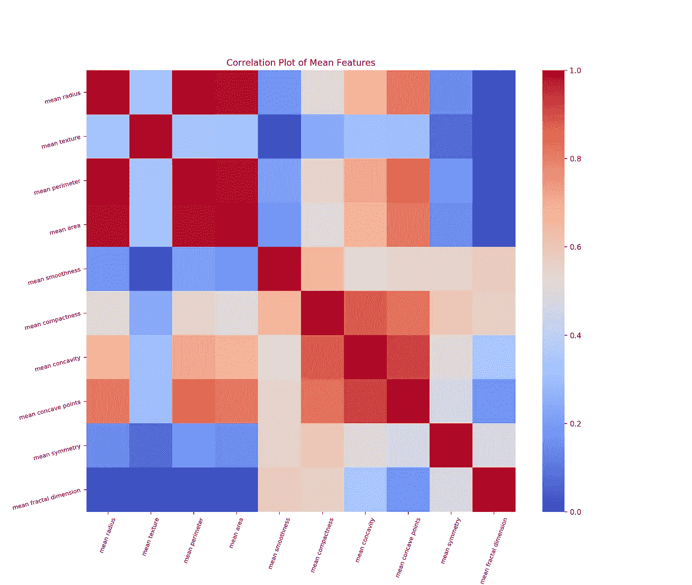

Fig. 1: Correlation plot of mean features.

我们可以使用' [seaborn jointplot](https://seaborn.pydata.org/generated/seaborn.jointplot.html) '来了解各个特征之间的关系。让我们看看下面的两个例子，作为散点图的替代，我选择了 2D 密度图。在右边的面板上，我使用了“十六进制”设置，通过直方图，我们可以了解一个小的六边形区域内的点的数量的集中程度。六边形越暗，落在该区域的点(观察值)越多，这种直觉也可以用绘制在两个特征边界上的直方图来检验。

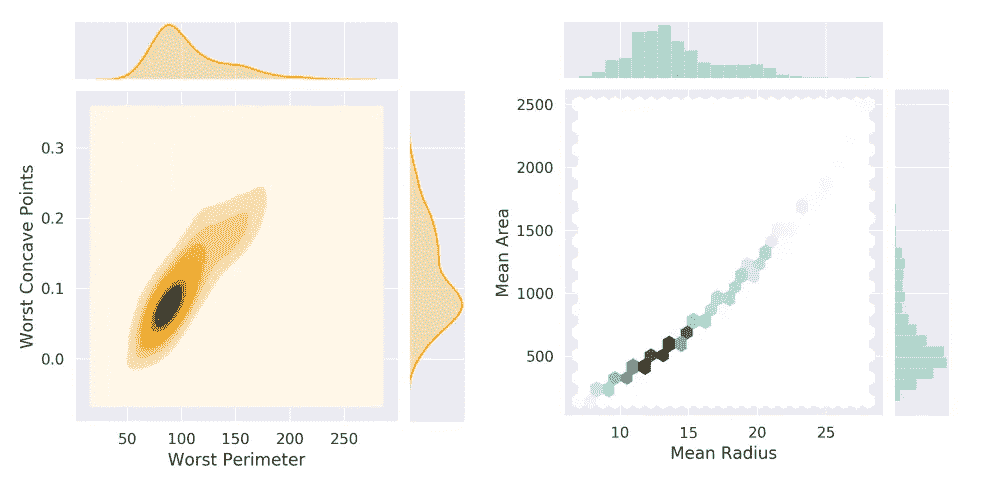

Fig. 2: Joint-plots can carry more info than simple scatter plots.

在左侧，除了绘制在边界上的单个要素的直方图之外，等值线表示 2D 核密度估计(KDE)。不仅仅是离散的直方图，KDE 直方图通常是有用的，你可以在这里找到一个奇妙的解释。

我们还可以绘制一些配对图，以研究哪些特征与区分良性样本和恶性样本更相关。让我们看下面的一个例子——

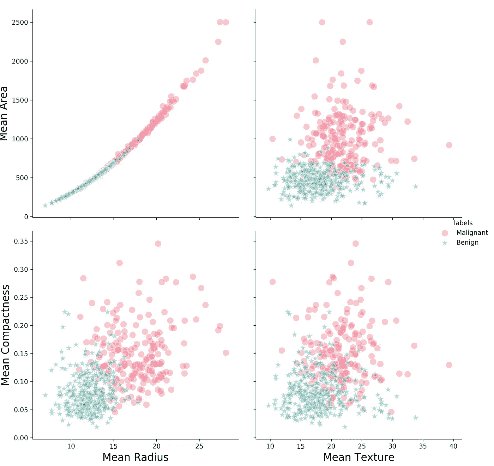

Fig. 3: Pair plots of few features in Cancer data-set. Code can be found in my GitHub.

一旦我们玩够了数据集来探索和理解我们手头的东西，那么，让我们转向主要的分类任务。

## 2.管道、GridSearchCV 和支持向量机:

**2.1*。主成分:***

现在，我们将按照以下步骤，使用 StandardScaler、PCA 和支持向量机创建一个管道—

*   从分割训练集和测试集中的数据集开始

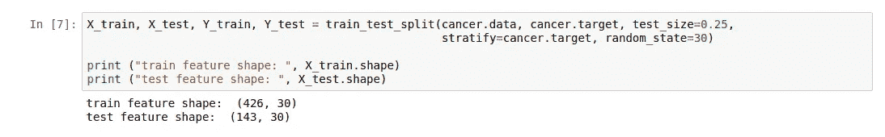

*   检查主成分分析的效果:PCA 以这样一种方式降低特征空间的维度，使得最终特征彼此正交。因为我们在癌症数据集中有 30 个特征，所以可视化 PCA 实际上做什么是很好的。你可以在我关于 PCA 的[另一篇文章中读到更多细节。在应用 PCA 之前，我们通过减去平均值来标准化我们的特征，并使用标准缩放器将其缩放到单位方差。所以，我们从选择 4 个正交分量开始—](/dive-into-pca-principal-component-analysis-with-python-43ded13ead21)

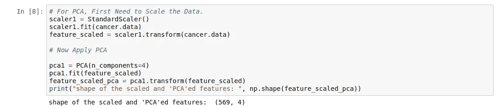

让我们绘制这四个主要成分的癌症数据——

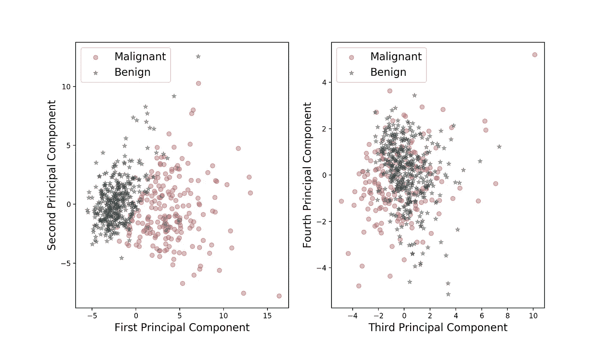

Fig. 4: Which principal components are more relevant?

从图中可以看出，前两个主成分与区分恶性和良性样本更相关。方差比怎么样？

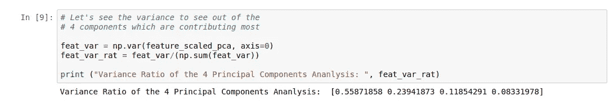

正如预期的那样，前两个因素占总方差的 80%。这与在选择 2 个分量来绘制决策边界之前显示相关，因为您可能有一些具有许多特征的数据集，其中选择 2 个主分量在百分比方差比方面是不合理的。在使用 PCA 和一些分类器创建管道之前，最好检查两个主成分的选择。

***2.2。管道&网格搜索交叉验证:*T3**

一旦我们看到 PCA 对于分类和为分类器绘制决策边界是多么重要，现在，我们用标准缩放器、PCA 和 SVM 创建一个流水线。

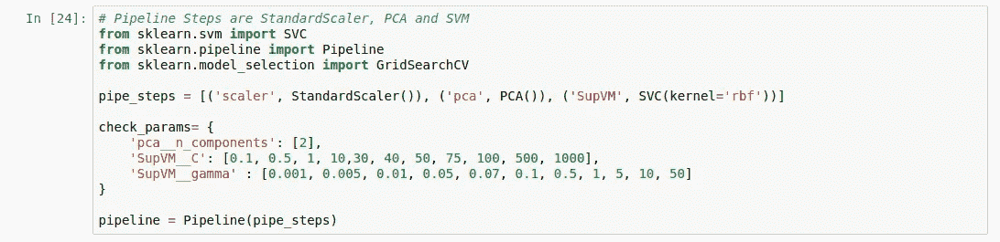

你可以查看更多关于管道和网格搜索交叉验证的细节，那是我单独写的。我选择了 2 个主成分，因为我们的目标是在 2D/3D 图中绘制决策边界，并且使用径向基函数核的 SVM 的最佳参数“C”和“Gamma”是通过固定数量的主成分值获得的。让我们检查一下拟合参数—

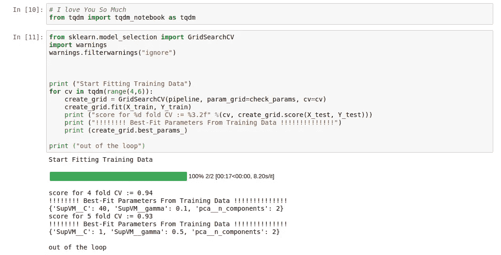

在这里，我们看到，使用 2 个主成分和 4 个交叉验证，我们的管道与 SVM 分类器获得了 94%的准确性。当然，你可以使用不同的值或者使用不同的内核。关于内核函数背后的数学，你可以查看我的另一篇文章。在进入下一部分之前，我们可以通过绘制混淆矩阵来完成分析，从中可以获得精确度、召回率和 F1 分数。

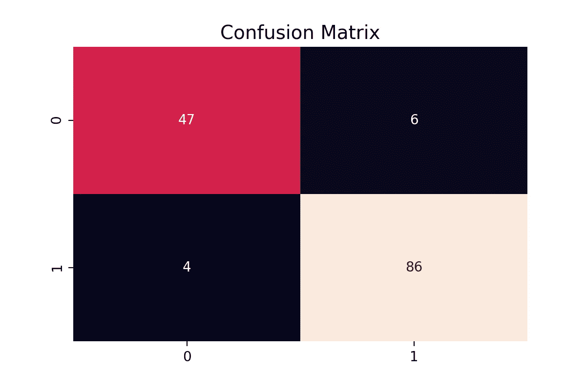

Fig. 5: Confusion Matrix obtained using our pipeline with SVM classifier and RBF kernel.

## 3.地块 SVM 决定边界:

我已经按照 Scikit-Learn 的教程绘制了[最大间隔分离超平面](https://scikit-learn.org/0.20/auto_examples/svm/plot_iris.html)，但是这里使用的不是教程中使用的线性核，而是径向基函数核。我们将使用[决策函数](https://scikit-learn.org/stable/modules/generated/sklearn.svm.SVC.html#sklearn.svm.SVC.decision_function)方法，该方法返回样本中每个类的决策函数。直观上，对于二元分类，我们可以把这种方法想象成它告诉我们，我们在分类器生成的超平面的哪一边，有多远。对于 SVM 决策规则的数学公式，如果你有兴趣，可以查看[我以前的帖子](/understanding-support-vector-machine-part-1-lagrange-multipliers-5c24a52ffc5e)。让我们看看决策函数的轮廓

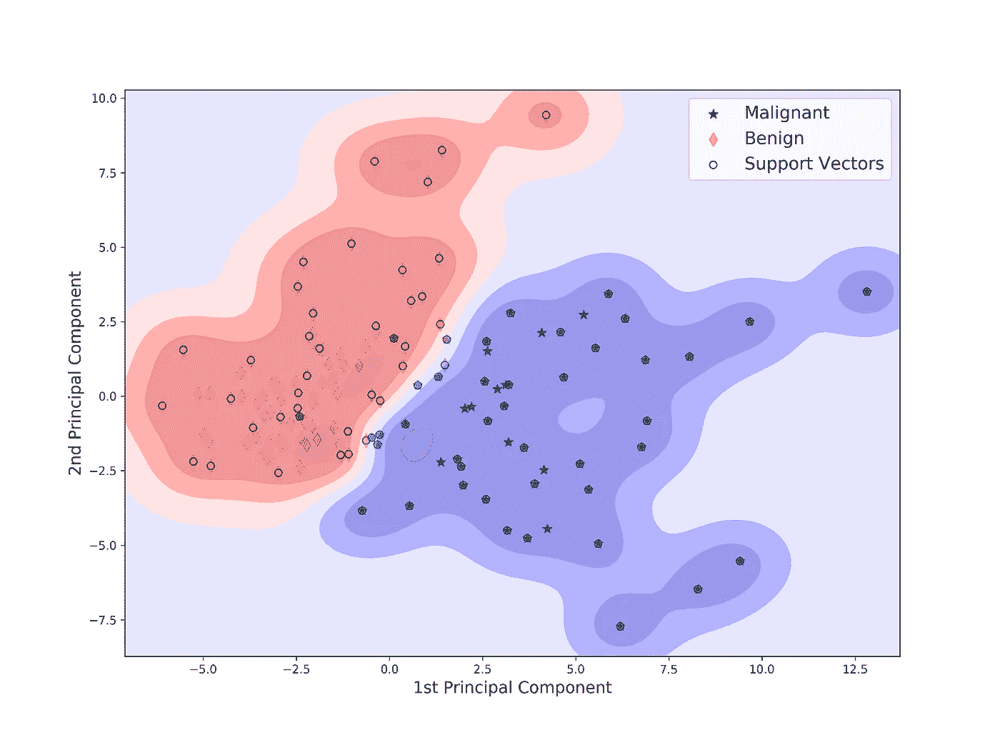

Fig. 6: Decision Function contours with Radial Basis Function kernel is shown here along with the support vectors. Best fit-parameters are obtained from 5 fold grid search cross-validation.

让我们来理解我用来绘制上图的代码

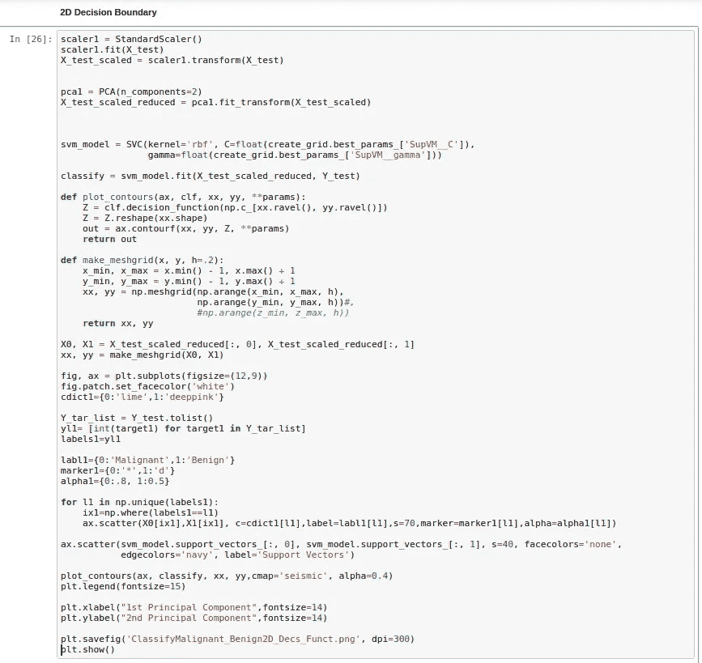

*   从选择 2 个主成分进行主成分分析开始。只有 2 个组件，因为它有助于我们在 2D/3D 绘图中可视化边界。将 2 个以上的组件与决策函数轮廓一起可视化是有问题的！
*   设置具有径向基函数核的 SVM 分类器，并且将“C”、“gamma”参数设置为从网格搜索交叉验证中获得的最佳拟合值。
*   定义一个函数来创建由 x、y(最终选择的主成分)和 Z(SVM 的决策函数)组成的等值线。
*   我们通过函数 make-meshgrid 用一个 x 值数组和一个 y 值数组创建一个矩形网格。检查 [Numpy Meshgrid](https://stackoverflow.com/questions/36013063/what-is-the-purpose-of-meshgrid-in-python-numpy) 的必要性。
*   最后，我们将决策函数绘制为 2D 等高线图，并将支持向量绘制为分散点。

希望这篇文章能帮助你理解建立支持向量机分类器的策略，并有效地使用主成分分析来可视化决策边界。

让我们来看看它的 3D 动画——

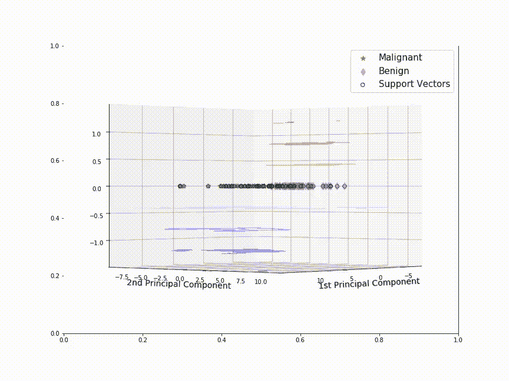

Fig. 7: Decision Function contours as viewed from top. 3D representation for the figure 6.

最后，我强调检查你的理解总是好的，在这里我们可以看到伽马因子如何影响决策函数轮廓。

对于上面的图，我们有γ = 0.5，C = 1。你可以阅读我的[关于 SVM 内核的另一篇文章](/understanding-support-vector-machine-part-2-kernel-trick-mercers-theorem-e1e6848c6c4d)，在那里我已经讨论了增加γ参数如何导致复杂的决策边界。

让我们通过将“C”参数固定为最佳拟合值，使用两个不同的“Gamma”值来检查这一点

*   **为γ = 0.01**

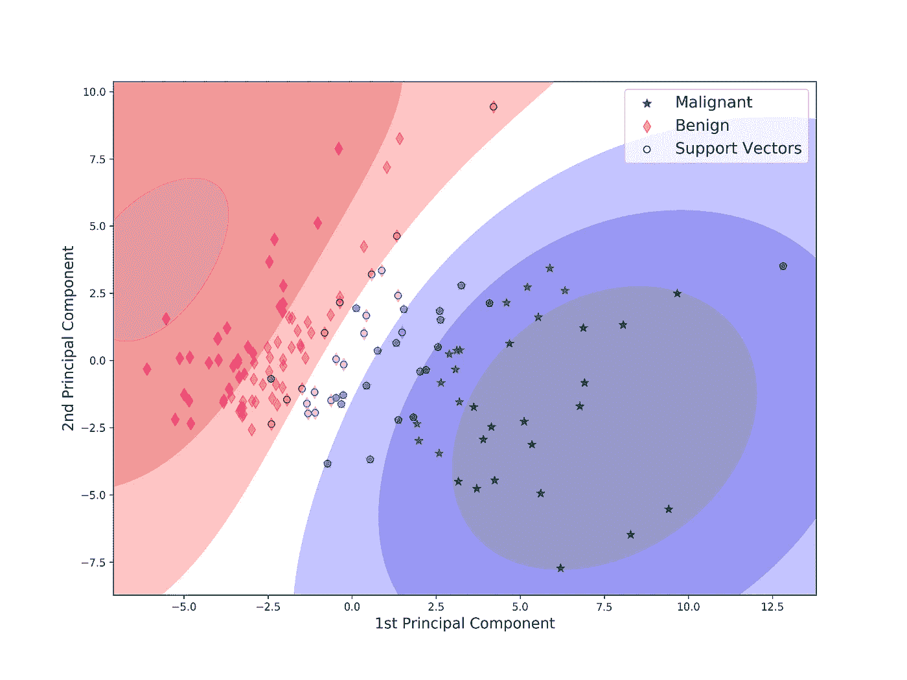

Fig. 8: Decision function contours plotted with low gamma (γ=0.01) value. Can be compared with figure 6, where γ = 0.5.

*   **对于γ = 10.0**

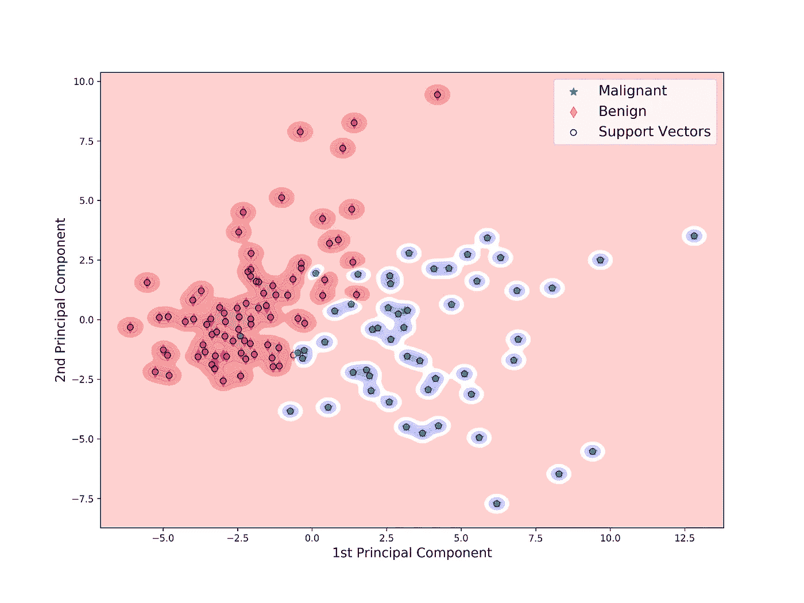

Fig. 9: High gamma parameter is causing extremely complicated decision boundaries.

正如你所看到的，增加伽马参数会产生非常复杂的轮廓。最重要的是，几乎所有高伽马值的样本(每个类别的)都充当支持向量。这无疑是对如此简单、容易分类的癌症数据集的过度拟合。

> “永远检查你的直觉和理解力！!"—匿名

为了进一步阅读，我建议你查看塞巴斯蒂安·拉什卡(Sebastian Raschka)的《用 Python 进行[机器学习》(第 76–88 页，2017 年 9 月第二版)一书中给出的几个精彩演示。](https://www.amazon.com/Python-Machine-Learning-Sebastian-Raschka-ebook/dp/B00YSILNL0)

保持坚强和快乐，干杯！

在 [Github](https://github.com/suvoooo/Machine_Learning/tree/master/SVM_Decision_Boundary) 中找到这篇文章使用的代码。