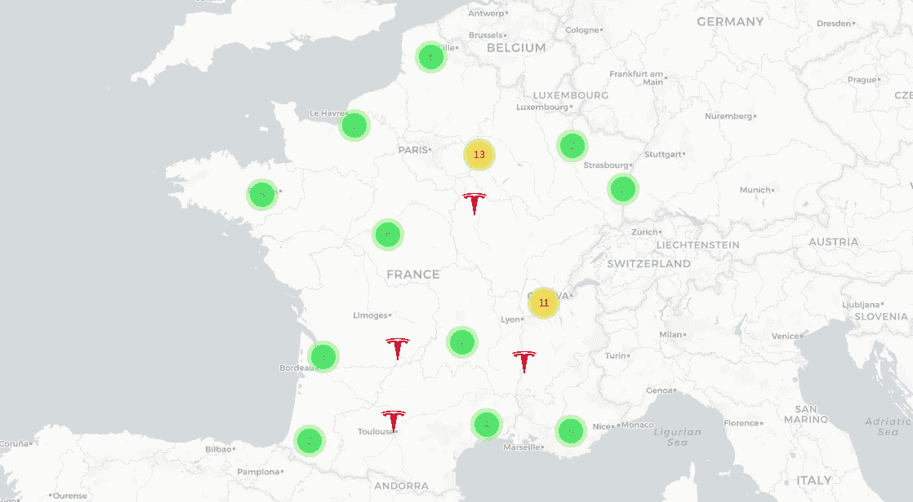
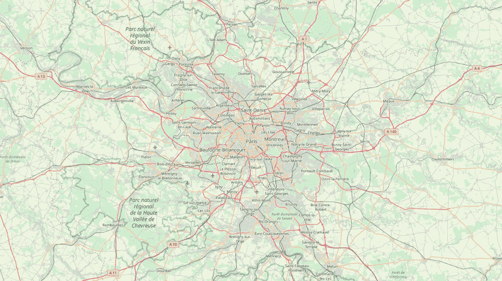
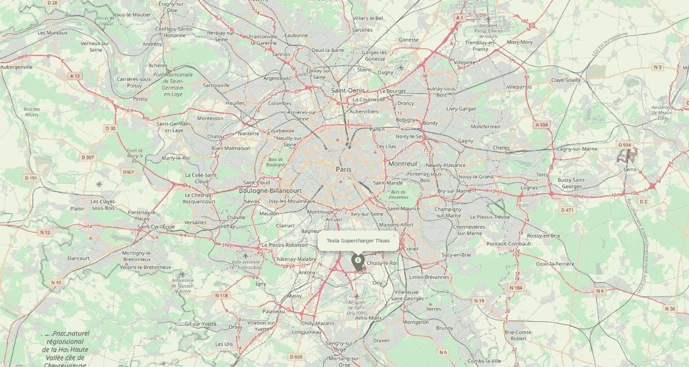
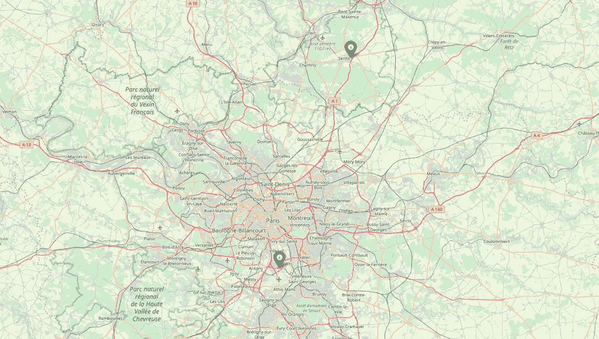
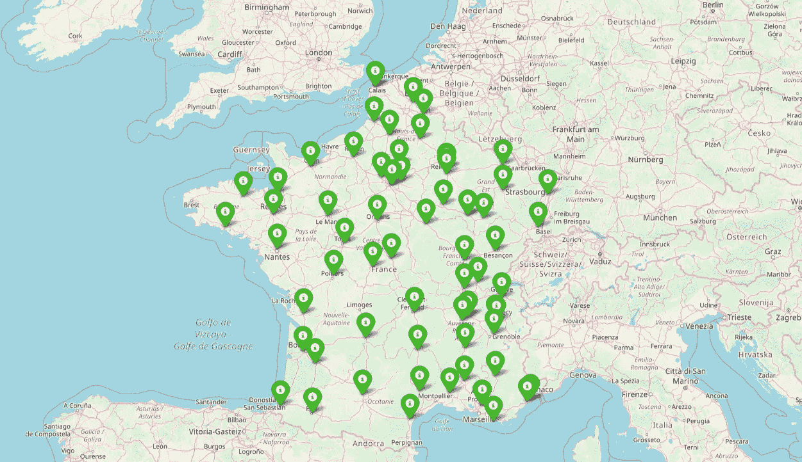
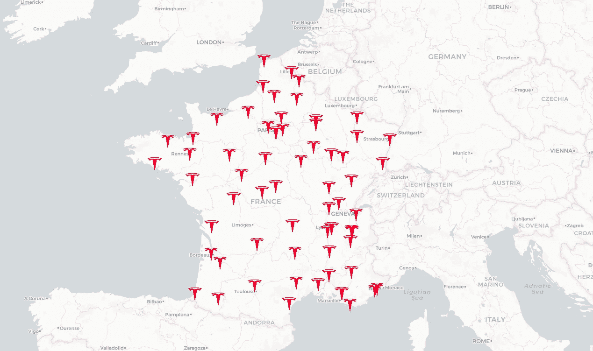

# 在法国可视化特斯拉增压器

> 原文：<https://towardsdatascience.com/visualizing-tesla-superchargers-in-france-8c10894ab3c?source=collection_archive---------22----------------------->

## 从头开始使用 Python 和 Folium 学习可视化

数据可视化不仅仅是科学，它还是一门艺术。根据我们人类大脑的工作方式，以可视化的形式处理信息非常容易。在进入数字地图近 25 年以及许多公司使用机器学习来收集大量数据之后，数据可视化比以往任何时候都更加重要。

在这篇文章中，我们将可视化目前在法国可用的特斯拉超级充电器(充电站)。我们将使用 Python、leav 和 Pandas 来完成这项工作。激动吗？让我们开始吧。



[GitHub](https://github.com/Dhrumilcse/Tesla-Superchargers) / Live map [here](https://dhrumil.xyz/maps/tesla-superchargers/)

# 重要的事情先来

## **数据**

首先，我们正在使用由法国政府提供的[特斯拉](https://medium.com/u/24413768aadb?source=post_page-----352c17e1dc00----------------------)的[特斯拉增压器数据。你可以在上面的链接或者我的](https://www.data.gouv.fr/en/datasets/stations-supercharger-tesla/) [GitHub](https://github.com/Dhrumilcse/Tesla-Superchargers) 库中找到这个数据文件。数据有很多列，但我们将只使用纬度、经度和站名。

## **库**

我们将使用 leav 和 Pandas，所以如果您还没有安装它们，请在您的终端中键入以下命令。

```
pip install foliumpip 
pip install pandas
```

# 步骤 1-创建底图

好了，所有特斯拉和可视化的狂热分子，让我们开始吧。为了可视化增压器的位置，我们当然需要一张地图。否则，我们怎么找到他们？所以，我们做的第一件事是，我们为一个特定的位置(世界上的任何地方)创建一个基础地图。默认情况下，Folium 从打开的街道地图中获取地图数据。好好看看代码。

首先，我们导入[叶子](https://python-visualization.github.io/folium/)库。接下来，我们在`folium.Map()`方法的帮助下创建一个对象——在我们的例子中是*地图—* 。在该方法中，我们传递地图的坐标和缩放级别。最后，不用说，你保存了地图。我从巴黎开始，你不觉得巴黎的地图像个脑细胞吗？还是只有我？无论如何，让我们进入下一步。



Paris (as if this needed description)

# 步骤 2-绘制标记

现在我们已经创建了一个基本地图，我们要绘制我们的增压器的位置。我们如何做到这一点？超级简单。我们使用`folium.Marker()`方法来定义和定制标记。您可以添加参数，如弹出，改变图标，等等。点击此处了解更多信息[。](https://python-visualization.github.io/folium/quickstart.html#Markers)最后，使用`.add_to()`方法，您将标记与您的地图关联起来。

我们在 Thiais 增加了特斯拉增压器作为我们的第一个标记，这是巴黎南郊的一个公社，这就是它的样子。



# 步骤 3 —多个标记

你能画一个标记吗？当然不是。你可能会画出不止一个或者超过 100 个，我们也会这样做。但是在达到 100 之前，让我们试着只做 2。这样我们会对它的工作原理有更多的了解。

如你所见，我们使用了一个`for`循环。是的，只是一个`for`环。编程并不总是复杂的代码，当你掌握了基本知识，你可以做得非常好。所以我们对两个标记进行循环，剩下的就很容易理解了。不是吗？让我们保存地图，看看我们做得怎么样。



Multiple Markers

# 步骤 4 —使用数据

我们的确画了两个标记，那么那些 100 呢？你要一个一个加吗？你可以，但是你愿意吗？肯定不是。因此，我们将使用包含纬度和经度的现有数据文件，并在我们创建的`for`循环中传递它。

我们将使用 Pandas 作为我们的数据操作库。我猜你对熊猫很熟悉，但是如果不熟悉，看看这个 [10 分钟熊猫教程](https://pandas.pydata.org/pandas-docs/stable/getting_started/10min.html)然后回到这里，我等你。

> 编程并不总是复杂的代码，当你掌握了基本知识，你可以做得非常好。

回来了？完美。在用 read_csv 或 read_excel 加载数据之后(我更喜欢在这个教程中使用 excel，因为 csv 文件没有得到正确的维护)，我们提取我们需要的每一列，并将其存储在各自的列表中。在`for`循环中，我们提供相同的列表并从头到尾运行它，而不是手动坐标。运行该文件后，您将在地图上看到以下内容。很整洁，是吧？



All Tesla Supercharging stations in France

# 第 5 步—自定义图标

但是等等，即使它正确地显示了一切，它也没有给人那种“特斯拉”的感觉，你明白我的意思吗？简洁的外观，简约的设计？让我们试着模仿一样的。让我们使用特斯拉图标，而不是这些绿色标记。并尝试使地图背景更清晰或者我应该说最小化？这由你来决定。

要添加自定义图标，首先你要下载一个(透明背景优先)，在`icon_path`中设置图标的路径。之后，在 that 的`CustomIcon()`方法中，提供 icon_path 和图标的大小。你已经准备好了。执行文件并查看更改。



# 步骤 6-通过聚类美化

看起来比以前更好，但我们可以使用一些东西来使它变得更漂亮——集群。让我们把附近的特斯拉增压器聚集起来，这样你就只能看到你想看到的东西。

用叶的`MarkerCluster()`方法，我们可以聚类我们的标记和美化地图。我们只需要做一件不同的事情:在此之前，我们将标记添加到地图，但现在，我们将标记添加到标记聚类，然后将标记聚类添加到地图。

在将所有标记添加到聚类中之后，它看起来比以前更好。


The final visualization/ Live map [here](https://dhrumil.xyz/maps/tesla-superchargers/)

瞧啊。您已经使用 Python 和 have 创建了可视化。没那么难，对吧？

# 尾注

没有合适的资源学习新东西有时会很难。今天，您学习了如何使用 pandas 操作数据，什么是叶，以及如何使用叶用 Python 可视化事物。既然你已经熟悉了 leav，那么就从不同的存储库或 Google Dataset Search 上找到数据集，并可视化你自己的东西。此外，您可以在我的 [GitHub](https://github.com/Dhrumilcse/Tesla-Superchargers) 资源库中找到所有的代码文件、图像和数据。如果你对本教程有任何疑问，我的 [Twitter](https://twitter.com/dhrumilcse) 和 [Linkedin](https://www.linkedin.com/in/dhrumilcse/) DMs 永远开放。或者直接过来打个招呼。