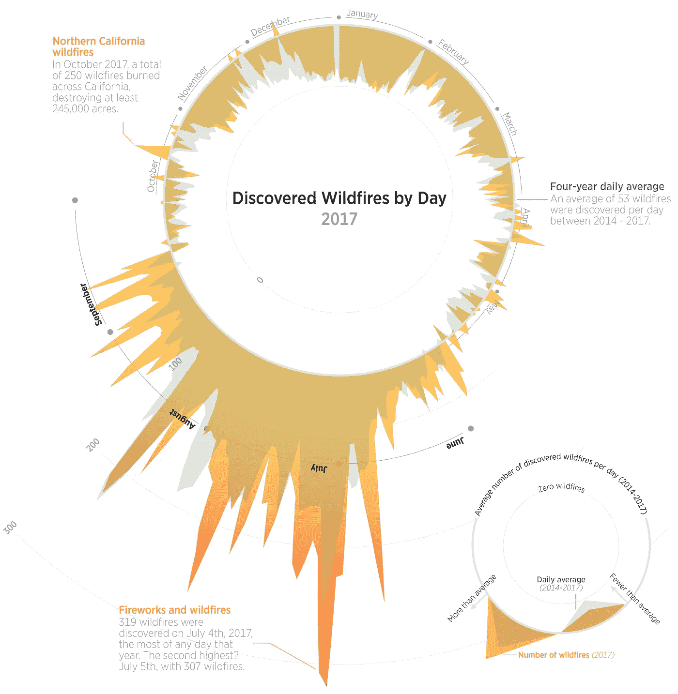
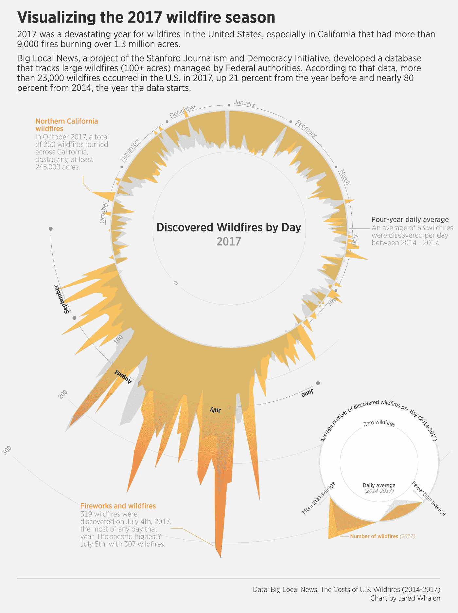

# 可视化 2017 年野火季节

> 原文：<https://towardsdatascience.com/visualizing-the-2017-wildfire-season-2053fe72525f?source=collection_archive---------27----------------------->

2017 年是美国野火灾难性的一年，特别是在加利福尼亚州，发生了 9000 多起火灾，燃烧面积超过 130 万英亩。

斯坦福新闻和民主倡议的一个项目“大地方新闻”开发了一个数据库，用来追踪由联邦政府管理的大面积野火(100 多英亩)。根据该数据，2017 年美国发生了超过 23，000 起野火，比前一年增加了 21%，比数据开始的 2014 年增加了近 80%。

虽然这个数据库并没有全面的显示这个国家的野火情况，但是它显示了野火的增加，T2，专家认为这是全球变暖造成的。



Data from [Big Local News](https://searchworks.stanford.edu/view/xj043rd8767) / Chart by Jared Whalen.

**方法论**

从大型本地新闻[数据集](https://searchworks.stanford.edu/view/xj043rd8767) ( *美国野火的成本(2014–2017*)开始，我按唯一标识符统计记录，并按日期分组。没有事故日期的记录被删除。

工具:R (dplyr，lubridate，ggplot)，Illustrator

**流程**

我是通过 Buzzfeed 的 Jeremy Singer-Vine 每周收集的数据集 [Data is Plural 简讯](https://tinyletter.com/data-is-plural)偶然发现这个数据集的。在四处探索之后，它看起来像是一个有趣的图表。

谈到野火这个话题，我想选择一种视觉上看起来像火焰的图表类型。这让我想起了 Nadieh Bremer 在她的作品 [*The Baby Spike*](https://www.visualcinnamon.com/portfolio/baby-spike) 中的[美丽的可视化，它使用了径向面积图和生动的颜色着色。深受布雷默文章的启发，我想加入一个使用平均值作为基线的径向面积图设计。](https://twitter.com/NadiehBremer)

至于数据，我在 r 中完成了所有的争论和分析。我的主要代码只是对大规模数据集进行精简，然后按日期进行汇总。

```
library(tidyverse)
library(lubridate)# identify unique records
fireData_unique <- fireData %>%
 group_by(INC_IDENTIFIER) %>%
 filter(n() == 1) %>%
 ungroup()
# make field selections and convert dates
fireData_sel <- fireData_unique %>%
 select(INCIDENT_NAME,
 DISCOVERY_DATE) %>% 
 mutate(day = yday(ymd_hms(DISCOVERY_DATE)),
 week = week(ymd_hms(DISCOVERY_DATE)),
 year = year(ymd_hms(DISCOVERY_DATE))
 ) %>%
 # remove records with missing or erroneous dates 
 filter(
 !year %in% c(“2011”, NA)
 ) %>%
 # get count by day
 group_by(day, year) %>%
 summarise(count = n())# create average df
fireData_avg <- fireData_sel %>%
 group_by(day) %>% 
 summarise(mean = mean(count))
```

虽然我在 Illustrator 中做了大量的工作，但大部分繁重的工作来自下面使用 ggplot 的代码。

```
# function to shift baseline by mean
shiftBase = function(x) {
 x — mean(fireData_avg$mean)
}# Make the plot
 ggplot() +
 geom_area(data=filter(fireData_sel, year==2017), aes(x=day, y=count-mean(fireData_avg$mean)), fill=”#FFBF3F”, alpha=1) +
 facet_grid(~year) +
 geom_area(data=fireData_avg, aes(x=day, y=mean-mean(fireData_avg$mean)), fill=”#547C8E”, alpha=0.2) +
 theme_minimal() +
 geom_hline(yintercept=0, color=”#FF9843") +
 coord_polar(start = 0.1) +
  scale_y_continuous(
    breaks=shiftBase(c(0,100,200,300)),
    labels = function(x){
      round(x+mean(fireData_avg$mean),-2)
    },
    limits=c(-150,max(fireData_sel$count))
  )
```

**独立图表**

