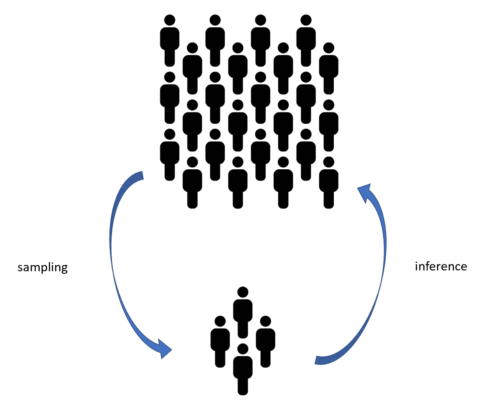
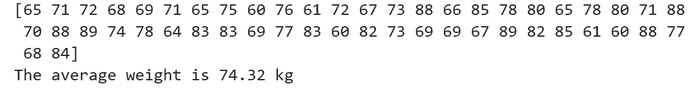
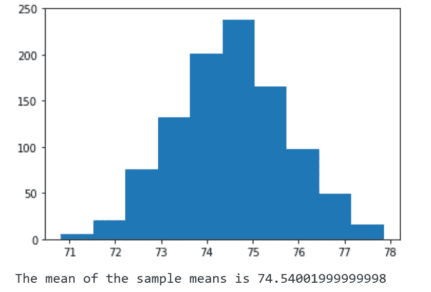
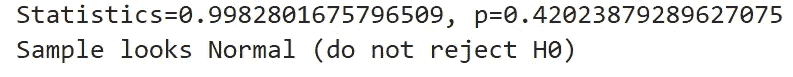

# 用 Python 可视化中心极限定理

> 原文：<https://towardsdatascience.com/visualizing-the-central-limit-theorem-with-python-e89d2ce41788?source=collection_archive---------12----------------------->

每当您处理数据并想要收集一些关于它们的信息时，您可能要检查的第一件事就是它们是否遵循已知的分布。

为什么了解数据分布如此重要？

这个问题的答案依赖于许多统计类型研究的目标，即更多地了解一个目标，通常称为*人口*。*警告*是观察你项目的全部人口通常是不切实际的(甚至是不可能的)。想象一下，也就是说，你想知道年龄在 40 到 50 岁之间的男性的平均体重。你认为你能采访世界上所有具有这些特征的男人吗？

不可能观察到全部人口，这就是我们需要*样本*的原因。抽样程序包括从全部人口中选择一个子集，这个子集最好能代表初始人口。通过这样做，我们希望从样本中包含的信息出发，对我们的目标总体做出推断。



在前面的例子中(找出男性的平均体重)，一种解决方法是从男性子集或样本中收集数据，考虑不同的国籍，这样样本就不会有偏差。因此，我们将获得一个样本平均值，它应该接近总体平均值。

然而，我们怎么能确定这个结果的准确性呢？根据定义，统计学家永远不会确定，这就是为什么我们需要测试我们的结果的稳健性，运行所谓的假设检验。后者允许我们声明我们是否可以拒绝我们的零假设(在我们的例子中，这将是*‘样本均值是真实参数的良好估计’*)。

为了做到这一点，我们需要知道数据的分布。这就是为什么中心极限定理(CLT)如此重要。

CLT 的想法如下:让我们收集大小为 *n* 的 *x* 个样本，并让我们计算每个样本的样本均值。然后，(在我们马上要看到的一些假设下)如果我们绘制所有样本均值，它们应该遵循正态分布。此外，所有样本均值的均值应该几乎等于总体的真实参数。

我提到的那些假设是什么？

*   取样程序必须随机执行
*   样本必须相互独立
*   在不替换样本的情况下进行抽样时，样本量不应超过总体的 10%
*   样本量应该足够大(通常，n=30 的样本量被认为是足够大的，即使它确实取决于初始总体)

如果这些假设被认为是正确的，CLT 允许您对初始人口进行推断。此外，样本越大，样本均值分布的钟形就越明显。

为了充分理解这个定理，让我们用 Python 可视化一下。我要做的是创建男性体重的随机样本(想象他们在 60 到 90 公斤之间)，每个尺寸 n=50。然后，我将多次运行这个模拟，看看样本均值分布是否类似于正态分布。

```
from numpy.random import seed
from numpy.random import randint
from numpy import mean
# seed the random number generator, so that the experiment is #replicable
seed(1)
# generate a sample of men's weights
weights = randint(60, 90, 50)
print(weights)
print('The average weight is {} kg'.format(mean(weights)))
```



现在让我们重复采样模拟 1000 次:

```
import matplotlib.pyplot as plt
# seed the random number generator, so that the experiment is replicable
seed(1)
# calculate the mean of 50 men's weights 1000 times
means = [mean(randint(60, 90, 50)) for _i in range(1000)]
# plot the distribution of sample means
plt.hist(means)
plt.show()
print('The mean of the sample means is {}'.format(mean(means)))
```



根据 CLT，样本均值(74.54)应该是真实参数(未知)的良好估计。

为了确定我们的结果，让我们对数据进行正态性检验。出于这个目的，我将使用夏皮罗-维尔克正态性检验(你可以在这里阅读更多关于这个检验的内容)，这里的假设是:

*H0:数据服从正态分布*

*H1:数据不符合正态分布*

因此，如果我们的样本均值服从正态分布，我们将不拒绝零。

```
from scipy.stats import shapiro
stat, p = shapiro(means)
print('Statistics={}, p={}'.format(stat, p))
alpha = 0.05
if p > alpha:
    print('Sample looks Normal (do not reject H0)')
else:
    print('Sample does not look Normal (reject H0)')
```



由于 p 值远远大于我们的置信水平 *alpha* (具体来说，它大于任何显著水平的 *alpha* )，我们不拒绝 H0。

现在让我们看看，如果我们将样本量从 50 分别增加到 80、90 和 100 会发生什么:


正如你所看到的，样本量 n 越大，p 值越高，我们不拒绝正态零假设的置信度就越高。