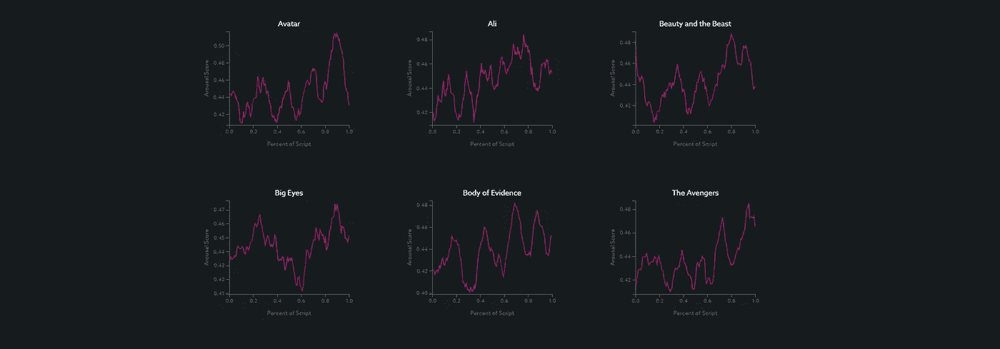
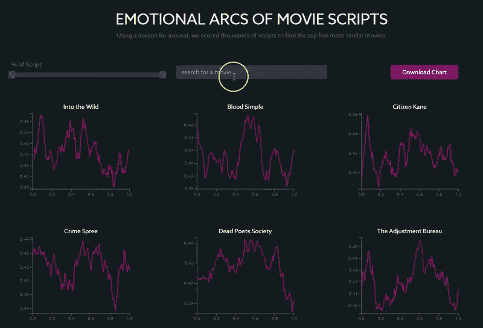

# 使用基于规则的情感分析可视化电影脚本的情感弧线

> 原文：<https://towardsdatascience.com/visualizing-the-emotional-arcs-of-movie-scripts-using-rule-based-sentiment-analysis-1016b4b1af5a?source=collection_archive---------15----------------------->

## 我如何使用 Python、D3 和 Flask 来创建这个[交互式可视化](https://www.moviearcs.com/)

大约 72 年前，广受赞誉的美国作家库尔特·冯内古特想出了一种新颖的方法来用[描绘故事的情节主线](https://www.youtube.com/watch?v=oP3c1h8v2ZQ)，作为他人类学硕士论文的一部分。

根据冯内古特的说法，尽管他的工作最终被芝加哥大学拒绝，“因为它太简单了，看起来太有趣了”，但在来自佛蒙特大学的一组[研究人员决定使用计算方法](http://www.uvm.edu/~cdanfort/research/2016-reagan-epj.pdf)来测试他的假设后，他被忽视的贡献在过去几年里重新受到了一些关注。

他们想出了近 2000 本英文书籍的计算机生成的故事弧线，归类为冯内古特原始论文中概述的六个主要故事弧线之一。其中包括**【破衣烂衫】**【崛起】**【破衣烂衫】**【堕落】**【洞中之人】**【堕落然后崛起】**【伊卡洛斯】**【崛起然后堕落】**【灰姑娘】**【崛起然后堕落然后崛起】**【俄狄浦斯】**(堕落然后崛起然后堕落)。

他们的作品与冯内古特的不同之处在于，他们描绘了故事的情感轨迹，而不仅仅是情节主线。为了做到这一点，他们在每篇文章中滑动 10，000 个单词的窗口，用一个包含 10，000 个独特单词的词汇对故事中数百个点的相对幸福度进行评分，这个词汇按幸福度的 9 分制进行评分，这就产生了用于情感分析的[快乐度计](http://hedonometer.org/index.html)工具。

# 使用唤醒作为行动的代理措施

我使用了一种类似的基于词汇的方法，绘制了一千多个电影剧本的情感弧线，并使用层次聚类法对最相似的剧本进行分组。

然而，由于之前的研究主要关注积极和消极的情绪，而不是上升和下降的行动，以下方法与 UVM 的方法不同，因为它使用了 [NRC 价，唤起和支配词汇](https://saifmohammad.com/WebPages/nrc-vad.html)，它有 20，000 个英语单词的分数，作为故事中行动或冲突的替代措施。具体来说，我用唤醒维度给单词打分，从“平静”或“被动”到“兴奋”或“主动”。

结果是一个[交互式可视化](https://www.moviearcs.com/)，可以用来搜索任何已经在[互联网电影数据库](https://www.imsdb.com/)上发布的剧本，以可视化其情感故事弧(为了唤起)，并找到五个在故事的情感轨迹方面最相似的电影剧本，而不是内容。

例如，在搜索大片《阿凡达》(Avatar)时，你可以看到觉醒在电影接近尾声时达到峰值，约为剧本长度的 90%，这与电影中最紧张和冲突的点相对应(纳威人和人类之间决定地球命运的最终对抗)。

其他具有类似结构的电影，有明确的高潮结尾，包括《美女与野兽》(Beauty and the Beast)、《复仇者联盟》(The Avengers)(2012)和《阿里》(Ali)。

以下是我得出这些结果的过程:

# 使用 VAD 词典抓取文本和评分

利用《美丽的汤》和杰里米·库恩剧本的修订版，我从互联网电影数据库中搜集了所有的电影，使用以下脚本花了大约 20 分钟:

然后我用 NRC VAD 词典创建了一个新词典:

我调整了简单的 labMT 使用脚本[来计算语料库的唤醒分数，而不是快乐，用我自己的 labMT 字典和 labMT 向量来代替:](https://pypi.org/project/labMTsimple/)

考虑到电影脚本平均比书籍短，我将固定窗口大小设置为 1000 个单词，并在每个脚本中滑动，以生成 *n* 唤醒分数，或最终时间序列中的点数。

# 矩阵分解和层次聚类

在实现了 simple labMT 的修订版之后，我使用了奇异值分解来将故事分解到情感弧的正交基上，使用了线性插值来创建等维的词向量，并使用了 [scipy 的层次聚类](https://docs.scipy.org/doc/scipy/reference/cluster.hierarchy.html)来根据情感弧的轨迹来查找和分组最相似的电影脚本。

使用沃德的方法和欧几里德距离作为距离度量，我能够最小化电影脚本簇之间的差异，以达到最准确的观察分段。

# 使用 Flask API 评分，使用 D3 可视化结果

最后，我创建了一个 Flask API 来输出在互联网电影数据库中找到的任何电影的唤醒分数，并返回五个最相似的脚本。

使用一个函数来调用 API 和过滤数据，我使用 D3 内置的 d3.json()方法来加载和解析 json 数据对象，从而可视化结果输出。

你可以在这里[玩最后的交互可视化](https://www.moviearcs.com/)，在这里查看所有的笔记本和代码[。下面让我知道你的想法！](https://github.com/nchibana/moviearcs)