# 可视化卷积神经网络的基础

> 原文：<https://towardsdatascience.com/visualizing-the-fundamentals-of-convolutional-neural-networks-6021e5b07f69?source=collection_archive---------7----------------------->

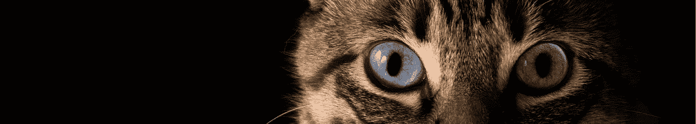

Photo by [Pacto Visual](https://unsplash.com/@pactovisual?utm_source=unsplash&utm_medium=referral&utm_content=creditCopyText) on [Unsplash](https://unsplash.com/?utm_source=unsplash&utm_medium=referral&utm_content=creditCopyText)

## 通过可视化示例理解卷积神经网络背后的主要概念

# 什么是卷积神经网络？

卷积神经网络(CNN)是人工神经网络(ann)的一个子类型，主要用于图像分类。CNN 遵循能够识别模式的结构复制的生物学原理，以识别不同位置的这些模式。它的灵感来自于诺贝尔奖获得者 Hubel 和 Wiesel 在 1962 年发表的“[猫的视觉皮层](https://www.ncbi.nlm.nih.gov/pubmed/14449617)中的感受野、双目互动和功能结构”中提出的猫的视觉系统模型。运用这一灵感的作品之一是 1980 年福岛的[新认知图](https://www.rctn.org/bruno/public/papers/Fukushima1980.pdf)，尽管当时没有使用**卷积**这个词。所以，CNN 在图像识别上非常成功，不是巧合。然而，它们在处理时间数据方面也表现出了良好的效果，例如[时间序列](https://arxiv.org/pdf/1703.04691.pdf)和[语音识别](https://ieeexplore.ieee.org/document/6857341?reload=true)，甚至在应用于[图形](/how-to-do-deep-learning-on-graphs-with-graph-convolutional-networks-7d2250723780)时也是如此。

CNN 在以大约 10%的优势赢得 2012 年比赛 [Imagenet 大规模视觉识别挑战赛](http://www.image-net.org/challenges/LSVRC/)后变得非常受欢迎。 [Alex Krizhevsky](https://qz.com/1307091/the-inside-story-of-how-ai-got-good-enough-to-dominate-silicon-valley/) 和 Ilya Sutskever 在 [Geoffrey Hinton](https://en.wikipedia.org/wiki/Geoffrey_Hinton) 的指导下，提交了以“AlexNet”为名而成名的 CNN 架构。当时，杰弗里·辛顿已经在人工神经网络领域做出了重大的科学贡献。他是 1986 年[反向传播](https://web.stanford.edu/class/psych209a/ReadingsByDate/02_06/PDPVolIChapter8.pdf)算法和 1983 年玻尔兹曼机器的贡献者之一。这些就是杰弗里·辛顿被公认为深度学习之父的部分原因。

# 卷积或互相关

典型的 CNN 由一系列充当特征提取器的卷积层组成，后面是一个分类器，通常是一个[多层感知器(MLP)](https://deepai.org/machine-learning-glossary-and-terms/multilayer-perceptron) ，也称为全连接层(FC 层)，如图 1 所示。

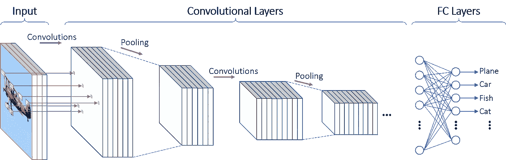

**Figure 1** — Architecture of a basic Convolutional Neural Network.

第一层接收用三个颜色通道(RGB 通道)表示的输入图像。然后，第一层用多个核执行输入图像的卷积，产生第一层的一组**特征图**。每个特征图确定特定特征的强度和位置。由卷积层提取的特征图可以被提交给称为汇集的下采样操作。汇集操作是可选的，因此它可能不会遵循每个卷积层。合并图层的结果是另一组要素地图，地图数量相同，但分辨率降低。下面的卷积层使用来自前一层的特征图来执行更多的卷积并生成新的特征图。来自最后层的特征图是分类器，FC 层的输入。

用星号表示的卷积运算可以描述为:

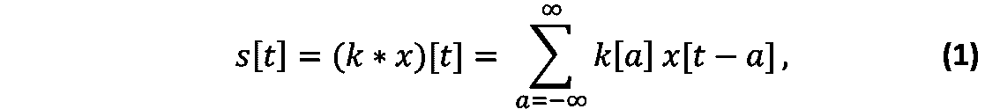

被𝑥某种类型的输入，如传感器信号，𝑡给定的时间，和𝑘的内核应用。

卷积运算的一个重要性质是它是可交换的，这意味着(𝑥∗ 𝑘)=( 𝑘∗𝑥)如下:

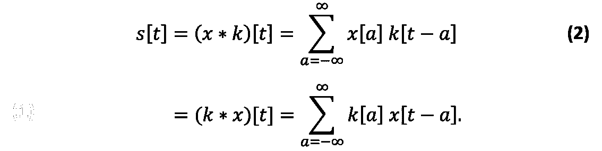

另一方面，由⋆(五角星)表示的互相关运算是不可交换的，可以描述为:

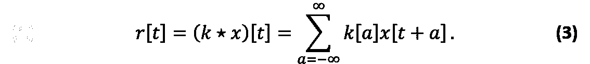

卷积的可交换性来自于内核相对于输入翻转的事实。这种翻转是索引操作的结果。请注意，输入𝑥的索引是𝑎，内核的索引是𝑡−𝑎.尽管可交换性对于编写数学证明是一个有价值的属性，但它与神经网络实现并不相关。事实上，许多机器学习库实现了互相关而不是卷积，并将这两种操作都称为卷积。因此，在训练期间学习的内核与实际实现如等式 1 所述的卷积的库相比将被翻转。在本文中，我们将遵循同样的惯例，称之为互相关卷积。

我们可以将等式 3 用于与 2D 数据(例如灰度图像)的卷积:

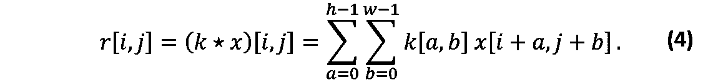

是𝑟[𝑖,𝑗]卷积的离散输出，ℎ是核的高度，𝑤是核的宽度，𝑥[𝑎,𝑏]是灰度图像的补片，而𝑘[𝑖+𝑎，𝑗+𝑏]是核。

换句话说，卷积运算从图像中提取多个像素片，然后乘以内核。内核基本上是一个权重矩阵。从图像中提取的像素块通常被称为**感受野**——在生物学中，感受野是刺激神经元的感觉区域。感受野和内核之间的乘法包括每个像素和内核的相应元素之间的逐元素乘法。在乘法之后，结果被相加以形成特征图的一个元素，由𝑟[𝑖,𝑗].在等式 4 中定义

以下动画显示了 5x5 灰度图像和 3x3 内核之间的卷积运算。感受野用红色方块突出显示。该卷积的输出是 3×3 特征图。

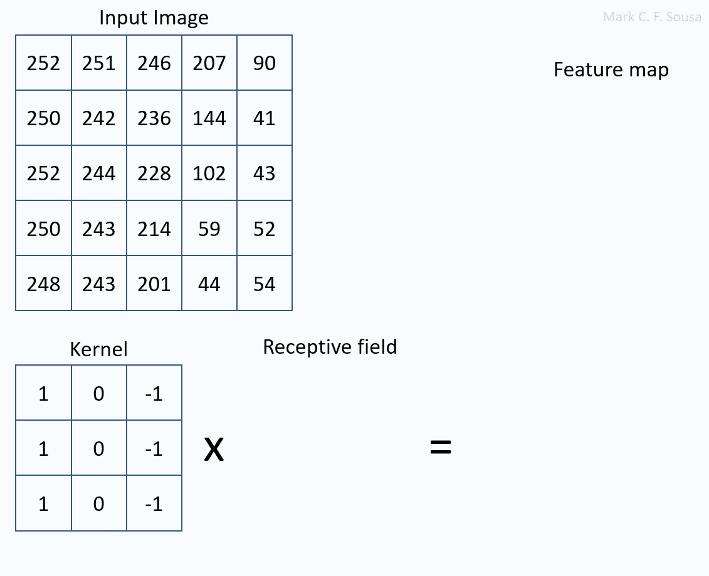

**Figure 2** — Step-by-step of the convolution of a 5x5 image with a 3x3 kernel.

动画中使用的实际图像可以在下面的图 3 中看到。内核和特征图中的值被重新缩放以适合 0 到 255 之间的区间，从而被表示为灰度像素。图像中较亮的像素代表卷积的较高值，而较暗的像素代表较低值。

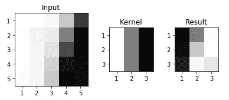

**Figure 3** — Convolution of a 5x5 input with a 3x3 kernel.

上面的卷积使用核 3x3，因此，在输入中有九个可能的感受野，每个大小为 3x3。注意，主要由白色像素组成的感受野或主要由暗像素组成的感受野在卷积后会产生非常暗的像素。另一方面，由左边的三个亮像素、中间的中间像素和右边的暗像素组成的感受域在卷积后产生最亮的像素。这是因为这种类型的内核有助于突出显示边缘，特别是从左侧亮区域过渡到右侧暗区域的边缘。

现在，看看当我们将相同的内核应用到一个也包含相反过渡的图像时会发生什么，从左边的暗区域到右边的亮区域。在图 4 中，感受野呈现从暗到亮的过渡，导致最暗的像素。请注意，之前的过渡(从亮到暗)仍然会产生更亮的像素。这意味着该内核不仅检测从亮到暗转变的边缘，还检测相反的从暗到亮的边缘。一种类型的边产生最大的正值，而另一种类型的边产生最大的负值。

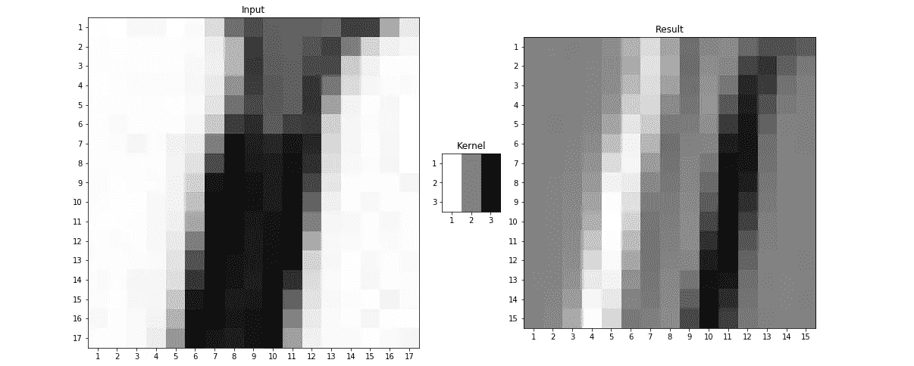

**Figure 4** — Convolution of an image 17x17 with an edge detector kernel 3x3.

RGB 图像的卷积与灰度图像非常相似。等式 4 可以适用于 RGB 图像，增加另一个循环来迭代 RGB 通道，如下所示:

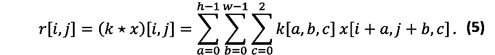

可变𝑐上的附加循环允许在信道 RBG 上迭代。结果，求和是在三维数据上完成的，而不是在二维数据上，并且仍然产生每个三维感受野和核的单个值。

# 特征抽出

让我们从一个实际的例子开始这个话题。请看图 5 中下面三个卷积的结果。为了说明卷积的结果，以下示例中的三个核中的每一个都由从图像中提取的小块组成。

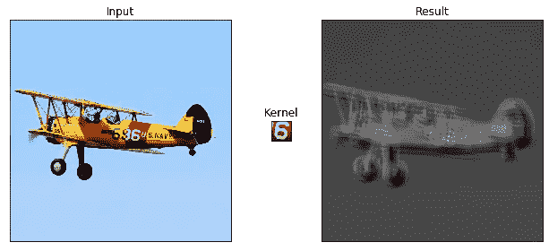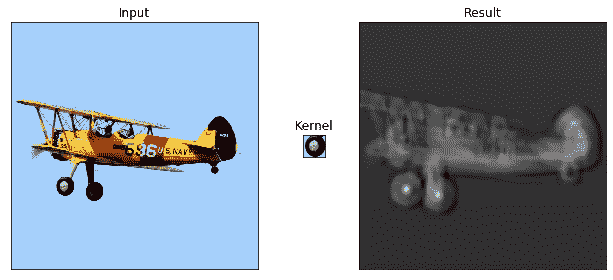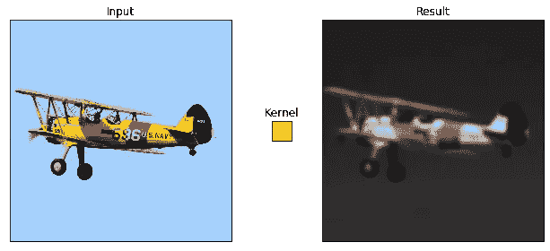

**Figure 5 —** Examples of convolutions.

在第一个例子中，组成内核的面片包括带有白色数字 6 的平面区域。右边的灰度图像本质上是内核和图像之间卷积的结果。最暗的像素代表感受野和内核之间操作的最小结果，另一方面，最亮的像素代表感受野和内核之间操作的最高值。

在第二个例子中，内核由形成飞机轮子的像素片组成。在第三个例子中，内核由从飞机尾部复制的一片黄色像素组成。

请注意，每个结果图像中最亮的像素对应于产生每个内核的位置。在第一个示例中，它对应于数字 6 的位置。在第二个例子中，它对应于轮子的位置。尽管内核是其中一个轮子的副本，另一个轮子非常相似，也产生了明亮的像素。在第三个例子中，最亮的像素对应于平面的所有黄色区域。

## 进展

步幅是每个感受野之间的距离。到目前为止，我们展示的所有例子都使用了一个步长。采用如此小的步幅导致感受野之间的大重叠。结果，许多信息在相邻的感受野重复出现，如图 6 所示。

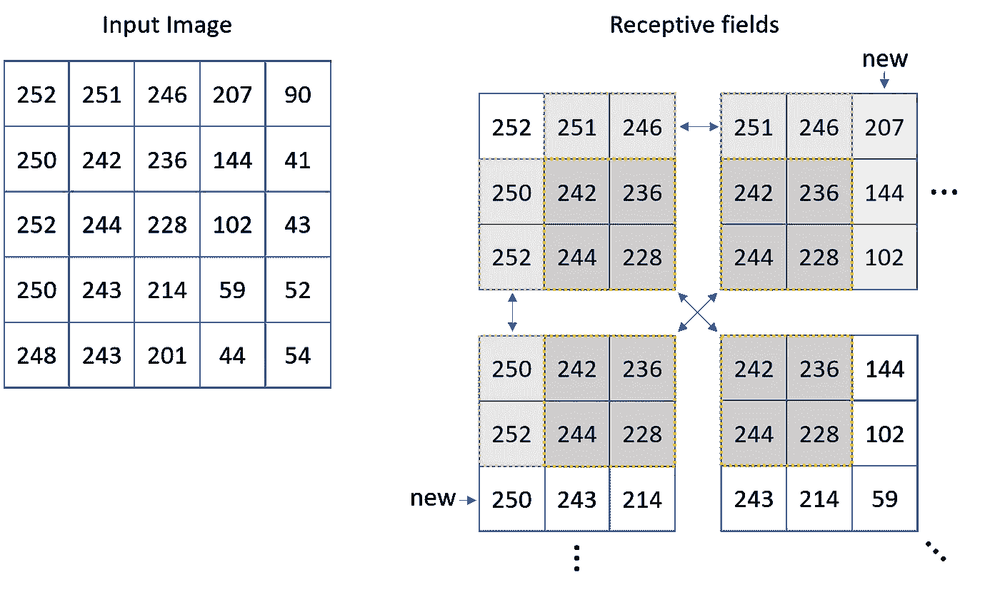

**Figure 6** –Receptive fields with stride 1.

在 3×3 大小的核的情况下，步长为 2 的采用导致一列或一行与相邻感受野重叠。这种重叠是为了保证步幅不会跳过重要信息。

增加步距将减少卷积的计算成本。如果我们将步距从 1 改为 2，计算成本的减少大约是 4。这是因为步幅影响了二维感受野之间的距离。类似地，如果我们将步幅增加三倍，我们可以预期计算成本降低大约九倍。计算成本降低，因为步幅的增加减少了从输入中提取的感受野的数量，因此，输出的维度也减少了。

图 7 显示了步长为 2、4、8 和 16 的四种卷积结果。卷积中使用的内核大小是 70x70。请注意，将步幅增加两倍，执行时间会减少近四倍。

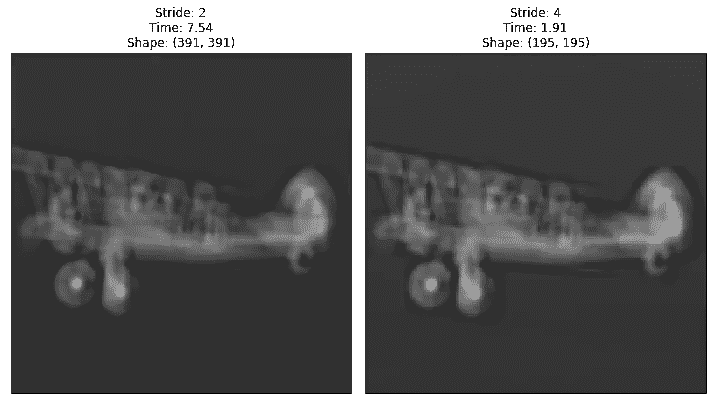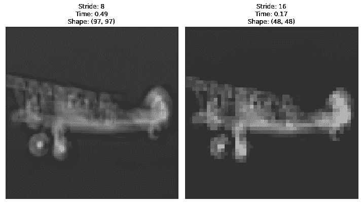

**Figure 7** — Examples of stride 2, 4, 8, and 16\. The receptive field dimension is 70x70.

在图 7 中，步长为 16 的卷积结果比步长为 8 的卷积结果少 4 倍的像素。注意，采用 16 的步幅导致 54 行或列的重叠，因为感受野大小是 70×70。步长为 16 时，仍有可能通过平面轮中最亮的像素来识别卷积的最高值。

# 正向传播

在本节中，我们将研究前向传播在卷积层中的工作原理。为此，我们将了解单个卷积层是如何工作的，然后了解多个卷积层是如何协同工作的。在这项研究中，我们将学习两个新概念:非线性激活和池操作。

## 在卷积层中

图 8 显示了典型卷积层中的前向传播，它包括三个阶段:卷积、非线性激活和池化。卷积运算已经在第一节中讨论过了。现在，我们将看到其他两个操作。

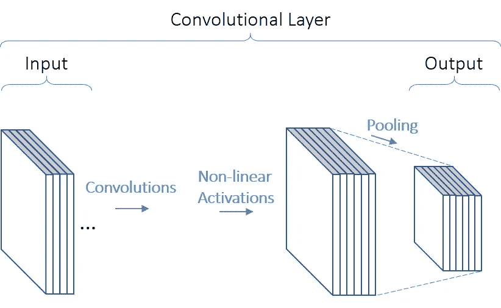

**Figure 8** — The three stages of a convolutional layer.

非线性激活也被称为检测器阶段。在这个阶段，卷积和偏差的结果被提交给非线性激活，例如 ReLU 函数。非线性激活不会改变特征图的尺寸，它只会调整其中的值。

## 非线性激活

一、什么是线性激活？线性激活是遵循规则 f(x)=ax 的函数，其中 a 是常数，x 是变量。它的图形是一条穿过原点(0，0)的直线。意味着形状 f(x)=ax + b 中的函数，其中 a 和 b 是常数，[不是线性的](https://mathinsight.org/linear_function_one_variable)。两者都是仿射函数，但只有一个常数乘以变量的函数是线性函数。

对于一个线性函数，当我们把输入乘以一个常数𝛼时，我们也应该看到输出乘以同一个常数𝛼.这意味着:

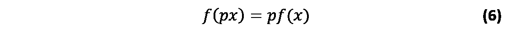

另一个要求是，当我们在线性函数中应用两个输入的和时，我们应该得到分别应用于该函数的两个变量的和的输出当量:

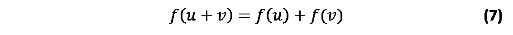

那么，我们为什么要使用非线性激活呢？因为当我们在线性函数中应用线性组合(加法或乘法)时，结果也是线性的。尽管许多模型可以用线性模型粗略地近似，但在人工神经网络中使用非线性使得它能够表示线性和非线性模型。换句话说，非线性使人工神经网络成为更强大的函数逼近器。

深度学习中最常用的非线性激活之一是 ReLU 函数，它代表整流线性单元。该函数由下式给出:

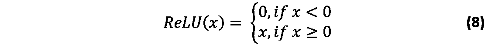

该函数在有偏置的情况下，会产生如图 9 所示的图形。

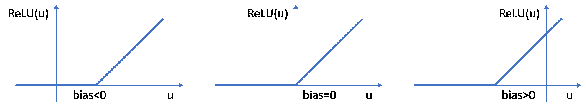

Figure 9 — The graph of ReLU function.

图 10 显示了 ReLU 如何调制卷积的结果。这里，来自图 2 的相同结果被用于应用 ReLU 函数。

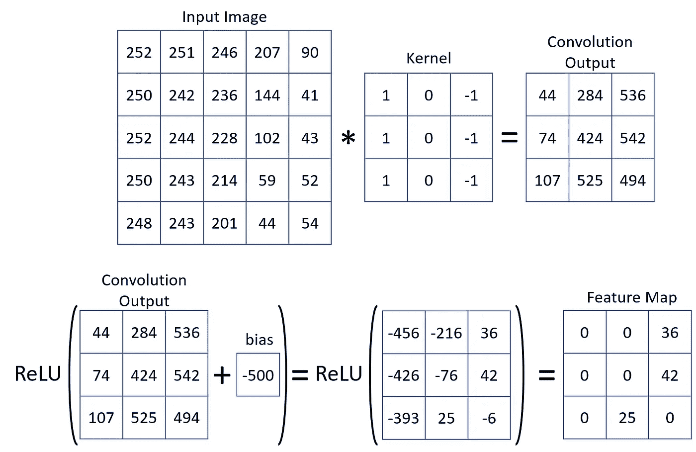

**Figure 10** — ReLU function applied after the convolution.

上例中使用的 ReLU 函数的等效图像如图 11 所示。请注意，一些中间值被涂黑，突出显示了最亮的三个像素。

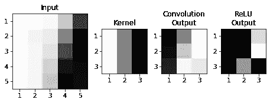

**Figure 11** — Visual representation of the ReLU function applied after the convolution.

接下来，在图 12 中，您可以看到 ReLU 函数中的一些偏置选项。该函数将平面与包含车轮的图像面片的卷积结果作为输入。请注意，偏差就像一个阈值，决定显示什么和不显示什么。

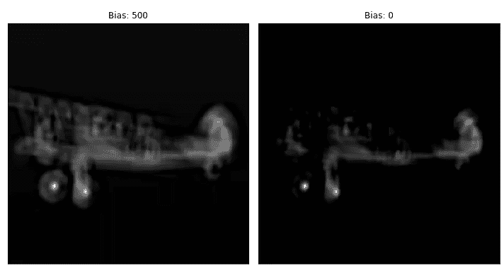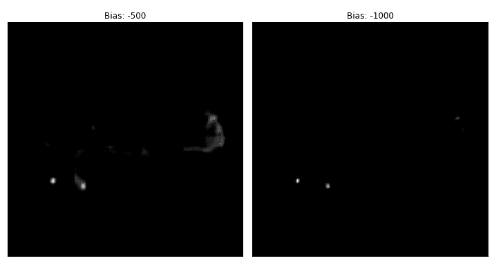

**Figure 12** — Different values of bias applied to the same result of the convolution between the plane and a patch of the image containing the wheel.

图 12 中描绘的阈值行为类似于生物神经元，当它接收到低于某个阈值的刺激时[不会触发。如果刺激超过阈值，神经元就开始放电，并且随着刺激的增加，放电频率也会增加。在图 12 中，当偏差为 500 时，它有助于人工神经元的活动。然而，如果我们将偏差定义为-1000，人工神经元只会在最强的刺激下激发。](https://www.britannica.com/science/nervous-system/The-neuronal-membrane)

总之，ReLU 功能就像一个人工神经元。这就是为什么这个阶段被称为检测阶段。ReLU 函数负责检测由内核提取的特征的存在。因此，每个内核都有一个偏差，因为每个特性需要不同的阈值。

## 联营

最后，但不是最不重要的，池操作。它是对每个特征地图执行的缩减采样操作。它从特征图中提取感受野并用单个值替换它。这个单一值可以通过不同的聚集标准获得，例如根据距感受野中心的距离的最大值、平均值或加权平均值。

除了聚集标准之外，在汇集操作中还有另外两个超参数，感受野的大小和步幅。

与 stride 类似，池化操作导致卷积处理的数据更少。一个区别是，汇集操作不是跳过数据，而是试图将感受域总结成一个值。另一个不同之处在于，跨距是在卷积之前应用的，而池是在卷积的结果上应用的，从而减少了下一层的数据量。此外，汇集操作的感受域是二维的，因为它被单独应用于每个特征图，而卷积的感受域是三维的，包括一层中所有特征图的一部分。

汇集操作的一个期望的副作用是[增加了网络对输入的平移](https://www.di.ens.fr/willow/pdfs/icml2010b.pdf)的不变性。随着更多卷积层之后是汇集层，这种效应被放大。

图 13 显示了值通过两个池层的传播，池大小为 3x3，跨距为 2。在输入要素地图的蓝色区域中的任何激活都会影响池 1 结果中的蓝色区域。类似地，在汇集 1 的结果中被蓝色覆盖的区域中的激活影响在汇集 2 的结果中被蓝色覆盖的区域。绿色区域之间的关系也是如此。

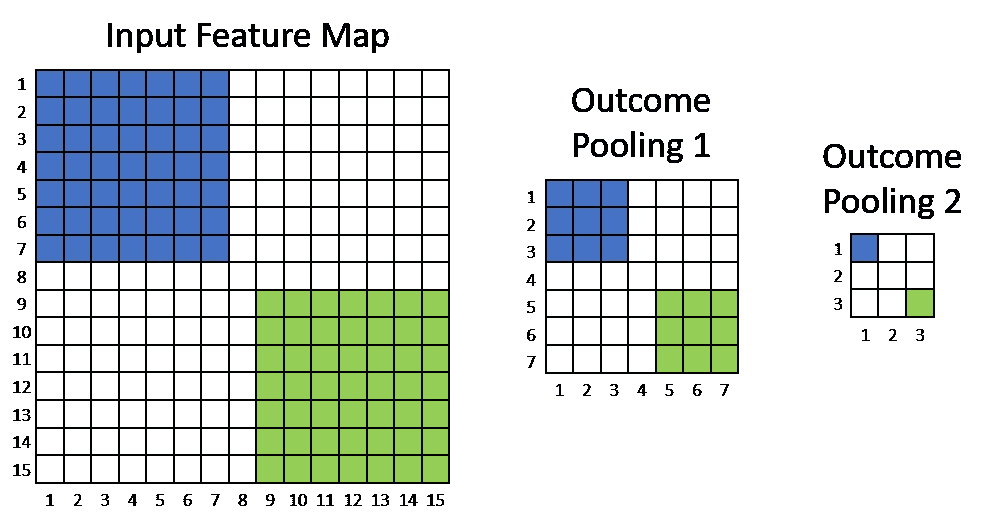

**Figure 13**–Propagation of values through pooling layers with pooling size 3x3 and stride of 2\. In this example, the convolutional layers were omitted for clarity.

考虑到图 13 中的池是最大池，最高值出现在输入特征图中蓝色区域的哪个位置并不重要，因为它将以同样的方式传播到结果池 2 中的蓝色激活。这就是合并图层增强平移不变性的原因，输入中的小平移不会改变输出中的值。

图 14 显示了卷积步长、ReLU 函数偏差、合并大小和合并步长的不同组合的效果。在左边，有三个步幅的例子:2、9 和 16。对于步幅的每个选项，有三个偏差示例:500、-250 和-1000。对于每种偏差，有三个汇集大小和步幅的示例:汇集大小为 3×3，步幅为 2，汇集大小为 5×5，步幅为 3，汇集大小为 7×7，步幅为 4×4。

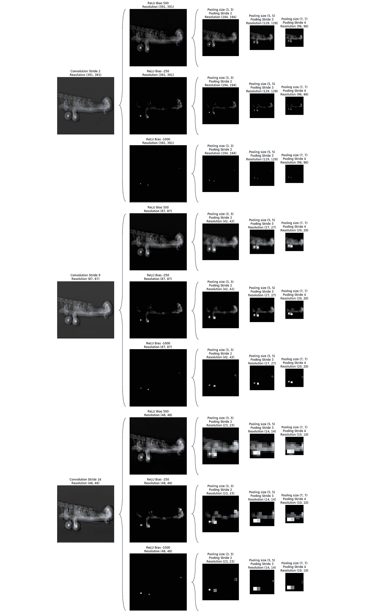

**Figure 14**–Effects of different hyperparameters in convolution, ReLU and max pooling.

卷积中的步幅和最大池中的步幅的效果是累积的。当我们在卷积和最大池中使用步长 2 时，最终结果是特征图的宽度和高度大约减少了四倍。

卷积中的步幅值为 16，最大池中的步幅值为 4，这是不常见的。它们被故意夸大以说明它们对卷积层最终结果的影响。生成的特征图只有 100 个元素(10 x 10)，比具有 37636 个元素的特征图(194 x 194)小得多。

# 将碎片拼在一起

我们将回到 AlexNet，第一个著名的 CNN 架构。这是一个很好的实际例子，可以理解 CNN 的组件是如何一起工作的。AlexNet 的构建模块如图 14 所示。虚线金字塔表示使用来自输入的感受野或来自前一层的特征图执行卷积。大方框代表特征图，特征图内的小方框是感受野。这个 CNN 可以将物体分为 1000 种不同的类别。

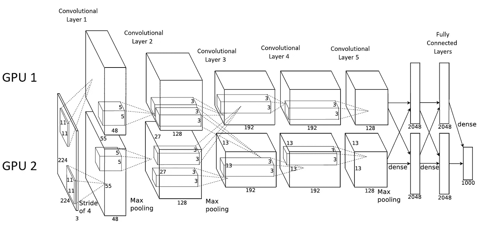

**Figure 15** — Architecture of AlexNet CNN.

这种架构的一个特点是它使用两个 GPU 进行训练。图 15 顶部的元素分配在一个 GPU 中，而底部的元素分配在另一个 GPU 中。

你可以在一些框架中得到 CNN 的训练，比如 PyTorch。比较好用。您还可以使用迁移学习将此架构应用于其他影像数据集。这需要一些数据处理来标准化和重新缩放图像，以符合 AlexNet 的要求，但值得一试。大概是这样的:

```
from torchvision import transformspre_transforms = transforms.Compose([
transforms.RandomResizedCrop(224),
transforms.ToTensor(),
transforms.Normalize([0.485, 0.456, 0.406], [0.229, 0.224, 0.225])
])
```

您可以在 PyTorch 中导入模型，如下所示:

```
from torchvision import modelsmodel = models.alexnet(pretrained=True)
```

您可以禁用卷积层的训练，并创建自己的分类器来覆盖原始的 AlexNet 全连接层:

```
from torch import nnfor param in model.parameters():
    param.requires_grad = False # disable trainingfcLayersDict = OrderedDict([('fc1', nn.Linear(9216, 1024)),
                   ('relu1', nn.ReLU()),
                   ('fc2', nn.Linear(1024, 102)),
                   ('output', nn.LogSoftmax(dim=1))
                           ])
model.fcLayersDict = fcLayersDict
fc = nn.Sequential(fcLayersDict)
model.classifier = fc
```

除了 AlexNet，PyTorch 中还有其他模型可以用来对您自己的图像数据集进行分类，只要进行必要的定制。真的建议测试这些模型，甚至从零开始建立自己的 CNN，了解 CNN 是如何工作的。

即使您已经熟悉这里介绍的概念，我希望您至少可以从另一个角度来看它们。CNN 还有其他一些概念没有在这里讨论。如果你对 CNN 的某个方面感到好奇或不确定，请告诉我。