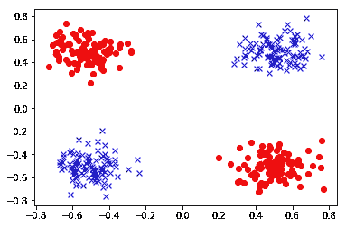
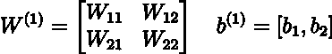
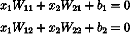
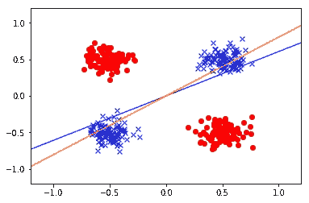
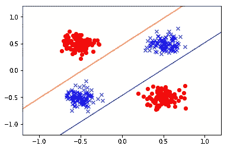
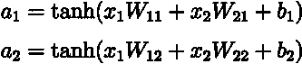
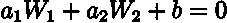
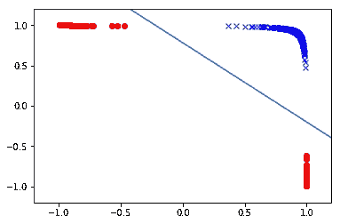

# 可视化神经网络的非线性

> 原文：<https://towardsdatascience.com/visualizing-the-non-linearity-of-neural-networks-c55b2a14ad7a?source=collection_archive---------14----------------------->

在这篇文章中，我将通过一个基本的例子来展示神经网络中非线性激活函数的能力。为此，我创建了一个人工数据集。每个数据点都有两个特征和一个类别标签 0 或 1。所以我们有一个二元分类问题。如果我们把这些特征称为 x₁和 x₂，那么这些数据在(x₂)-spacex₁)的情节如下:



这里，红点对应负类，蓝点对应正类。请注意，数据不是线性可分的，这意味着没有线来分隔蓝点和红点。因此，对于给定的特征表示，线性分类器没有用。现在，我们将训练一个具有两个单元和非线性`tanh`激活函数的一个隐藏层的神经网络，并可视化该网络学习的特征。

为了创建模型，我将使用 Tensorflow 2.0 和`tf.keras`:

```
inputs = tf.keras.Input(shape=(2,))
x = tf.keras.layers.Dense(2, activation=tf.nn.tanh)(inputs)
outputs = tf.keras.layers.Dense(1, activation=tf.nn.sigmoid)(x)
model = tf.keras.Model(inputs=inputs, outputs=outputs)model.compile(optimizer='adam',
              loss='binary_crossentropy',
              metrics=['accuracy'])
```

让我们将隐藏层的权重和偏差表示如下:



权重和偏差的初始值定义了(x₁，x₂)-space，



训练前的这些初始行以及数据如下所示:



Data and the initial lines defined by the hidden layer in (x₁,x₂)-space

请注意，这两个初始行没有很好地划分给定的两个类。现在让我们训练模型，看看这些线会发生什么。

```
model.fit(x_train, y_train, batch_size = 16, epochs=100)Epoch 100/100
400/400 [==============================] - 0s 80us/sample - loss: 0.1116 - accuracy: 1.0000
```

在 100 个时期后，我们的训练准确度是 100%,因此模型正确地分类了训练数据中的所有点。

注意，您可以通过使用`model.weights`获得 keras 模型的参数，它返回一个权重和偏差列表:

```
[<tf.Variable ‘dense/kernel:0’ shape=(2, 2) dtype=float32, numpy= array([[-3.2753847, 3.2302036], [ 3.3264563, -3.2554653]], dtype=float32)>, <tf.Variable ‘dense/bias:0’ shape=(2,) dtype=float32, numpy=array([1.5562934, 1.5492057], dtype=float32)>, <tf.Variable ‘dense_1/kernel:0’ shape=(2, 1) dtype=float32, numpy= array([[2.625529], [2.670275]], dtype=float32)>, <tf.Variable ‘dense_1/bias:0’ shape=(1,) dtype=float32, numpy=array([-2.0918093], dtype=float32)>]
```

此列表中的前两个元素是隐藏层的权重和偏差，最后两个元素是输出层的权重和偏差。所有这些元素都是张量，您可以使用 numpy()方法获得 numpy 数组形式的值。例如，下面将以 numpy 数组的形式给出隐藏层的权重，

```
model.weights[0].numpy()array([[-3.2753847,  3.2302036],        [ 3.3264563, -3.2554653]], dtype=float32)
```

第一行的系数是-3.27 和 3.32；第二行的系数是 3.23 和-3.25。你可以通过运行`model.weights[1].numpy()`看到他们的偏见

让我们想象由学习到的隐藏层的权重和偏差定义的线，



The data and the lines defined by the hidden layer after training in (x₁,x₂)-space

正如您现在所看到的，这些线以一种将类包含在独立区域中的方式划分了空间。这些线的系数告诉我们每条线的正面。对于蓝线，正方向是上侧，对于橙线，正方向是下侧。所以蓝点在两条线的正侧，红点在一条线的负侧，另一条线的正侧。

现在让我们应用非线性激活函数`tanh`并在新的特征空间(a₂).a₁)中可视化数据隐藏层的激活计算如下，



对于每个数据点，`tanh`的参数由该数据点相对于上述线的位置决定。我们可以认为 a₁和 a₂是新的特征，a₁,a₂)-space 是新的特征空间。输出层的权重和偏差在这个新的特征空间中定义了一条线，由以下等式给出



这条线和这个新特征空间中的数据一起绘制如下，



The features learned by the model in (a₁, a₂)-space and the line defined by the output layer.

请注意，在这个新的特征空间中，我们的数据变得可线性分离，由输出图层定义的线将两个类分开。蓝点的 a₁和 a₂坐标都是正的，因为(x₁，x₂)空间中的这些点位于由隐藏层参数定义的两条线的正侧，并且在应用`tanh`后，两个坐标都是正的。对于红点，a₁和 a₂中的一个是正的，因为在 x₂)-space 的 x₁中，红点仅在由隐藏层参数定义的一条线的正侧，并且根据这条线，它们在新特征空间中只有一个坐标是正的，而另一个是负的。这解释了上图(a₁,a₂)-space)中的数据图。

**结论:**神经网络学习数据的新表示，这使得相对于该新表示进行分类变得容易。

这里有一个[链接](https://gist.github.com/CihanSoylu/6967249574192728a9fba367065e8949)指向我在这篇文章中使用的 google colab 笔记本。

感谢阅读。