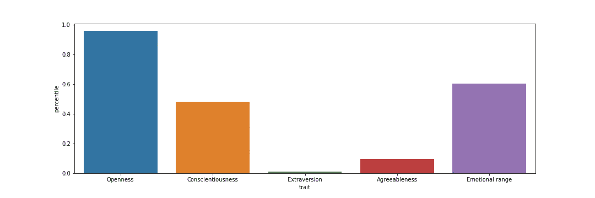
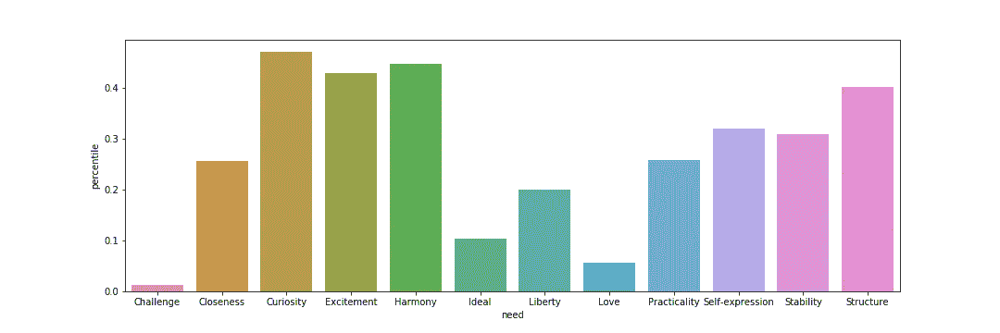
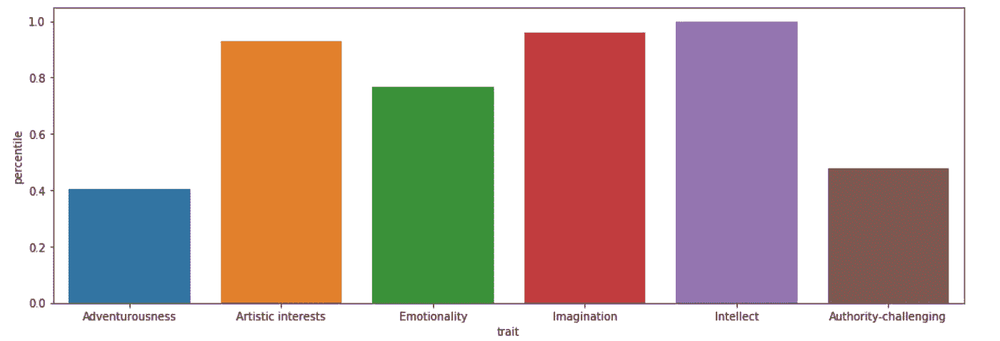
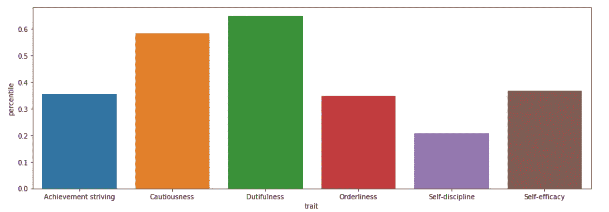
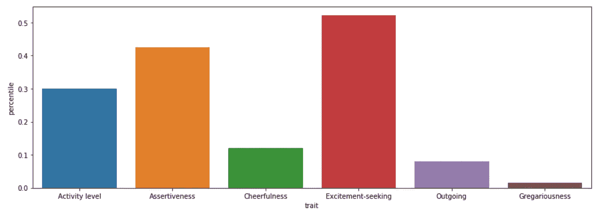
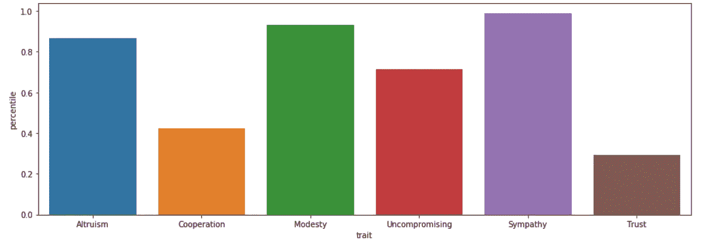
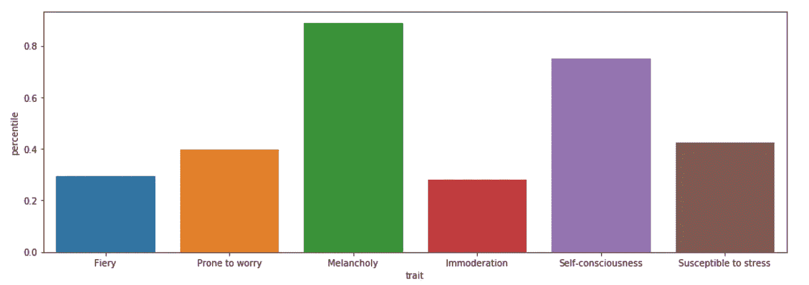
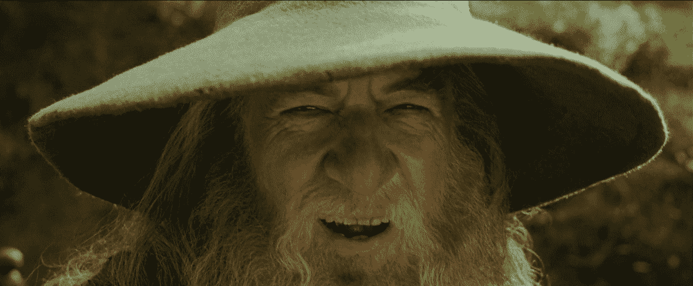

# 使用 Python 和 IBM Watson 可视化任何电影角色的个性特征

> 原文：<https://towardsdatascience.com/visualizing-the-personality-profile-of-any-film-character-using-python-and-ibm-watson-78ad2fcee065?source=collection_archive---------24----------------------->

## 一个简单的数据收集指南，光预处理和任何电影角色的五大性格特征的可视化

Photo by [Marko Blažević](https://unsplash.com/@kerber?utm_source=unsplash&utm_medium=referral&utm_content=creditCopyText) on [Unsplash](https://unsplash.com/search/photos/fantasy?utm_source=unsplash&utm_medium=referral&utm_content=creditCopyText)

伟大的社会心理学家詹姆斯·彭尼贝克曾经说过:“通过更仔细地观察人们用语言表达思想的方式，我们可以开始了解他们的个性、情感以及与他人的联系。”他和许多其他心理学家、语言学家和自然语言处理(NLP)从业者一起，利用双向 LSTMs 和 [NLU](https://en.wikipedia.org/wiki/Natural-language_understanding) (自然语言理解)等先进技术，在从书面文本中推断详细(和惊人准确)的个性信息方面取得了巨大进步。

最近，IBM Watson 背后的先锋团队开发了一个名为 Personality Insights 的产品，旨在为业务用例分类个性。在产品主页上有这样一句标语:“通过文字预测个性特征、需求和价值观。从个人层面和整体层面了解客户的习惯和偏好。“虽然商业含义很明显，但我认为利用虚拟人物塑造平台，通过电影主角的口语对话对他们的性格特征进行分类，这将是一件有趣的事情。

# 数据

为了这个项目，我利用了来自加州大学圣克鲁斯分校的[大型电影语料库](https://nlds.soe.ucsc.edu/fc2)。语料库按类型细分，包含 960 个电影剧本，其中电影中的对话与场景描述分离。

为了让数据为分析做好准备，需要进行大量的清理和预处理。此外，数据中存在一些结构性挑战。也就是说，需要将每个引用/行与相应的字符进行分解和关联。

出于本文的目的，我不会深入到整个预处理代码中(对于那些感兴趣的人，完整的笔记本可以在[这里](https://github.com/nicholassherwin/Natural-Language-Processing/blob/master/Project%204%20Final%20Notebook.ipynb)找到)。然而，我将举例说明我们如何将人物/说话者从他们的对话中分离出来，然后将它们压缩成一个数据帧。

接下来，我们需要将所有与每个角色相关的口语对话组合成一个列表。以下代码的输出将为我们提供由逗号分隔的每个角色的完整对话:

# IBM 沃森

Photo by [Vasundhara Srinivas](https://unsplash.com/@vasundhara?utm_source=unsplash&utm_medium=referral&utm_content=creditCopyText) on [Unsplash](https://unsplash.com/search/photos/brain-color?utm_source=unsplash&utm_medium=referral&utm_content=creditCopyText)

从这里开始，我们的对话就可以输入到我们的 IBM Watson 笔记本中了。请注意，在 IBM Cloud 上注册需要很多步骤。你需要开一个账户，生成一个 API 密匙，还要下载 [python SDK](https://github.com/watson-developer-cloud/python-sdk) 。虽然这些步骤非常简单，但我将为以后的文章保存设置(或者， [IBM 网站](https://cloud.ibm.com/docs/cli?topic=cloud-cli-getting-started)上的文档相对容易理解)。

一旦我们有了凭证，为列表中的每个字符获取可视化效果的过程就非常简单了。我们是这样设置的:

上面代码的输出将会显示出我们想要分类的角色的非常详细的个性特征。我们将看到输入文本中的字数，五大特征中每一个的百分位数，需求，以及五个主要特征中每一个的详细子特征(称为孩子)。

然而，作为数据科学家，我们不想呈现一个枯燥的读数。相反，我们希望通过一些有吸引力的条形图来形象化这些特征。我将列出这样做的代码，然后输出现代最具代表性的电影角色之一的结果:灰袍甘道夫(和白人！).

# 想象甘道夫的人格

Photo by [Thomas Schweighofer](https://unsplash.com/@thomasschweighofer_?utm_source=unsplash&utm_medium=referral&utm_content=creditCopyText) on [Unsplash](https://unsplash.com/search/photos/gandalf?utm_source=unsplash&utm_medium=referral&utm_content=creditCopyText)

现在我们已经有了自己的功能，我们可以将甘道夫的全部对话输入到我们的 IBM 笔记本中，并看到他的人格形象。

Big Five profile of Gandalf

The needs of Gandalf

有意思！我们可以看到甘道夫是最开放的，大约在 98%左右。另一方面，他和他们一样内向，对在黑暗的图书馆里研究符文和在莫莉亚矿井下与巴罗格战斗更感兴趣。

至于需求，并没有很大的信号。甚至他的最高需求(好奇与和谐)也没有达到 50%。我想这是有道理的。除了偶尔需要一只鹰从艾辛格塔顶救他们之外，大部分巫师都是自给自足的！(遗憾的是，在 IBMs 服务的这个迭代中没有“eagles”需求列)

除了这一大部分，我们还可以放大甘道夫性格中的儿童特征。让我们看看我们发现了什么:

Openness

Conscientiousness

Extraversion

Agreeableness

Emotional Range

更多有趣的发现！我们可以看到甘道夫在以下特质上处于第 80 到第 100 百分位之间:想象力、智力、艺术兴趣、利他主义、谦虚、同情和忧郁。类似地，我们看到合群和外向的特质的结果很低。

虽然这个程序只能考虑对话而不能考虑动作，但他们确实感觉与指环王电影中甘道夫的角色非常一致。的确，我相信甘道夫本人，如果他能够看到这些结果，会有如下反应:

giphy.com

# 结论

好了，你知道了。现在，您已经掌握了构建自己的性格分类器的知识，并可以输出一些漂亮、清晰的可视化效果，达到相当高的准确度。

非常令人兴奋的是，我们能够根据个人的书面文本提取出如此详细的信息，虽然这个项目比任何事情都有趣，但这样一个平台的实际应用既重要又多样。例如，我们可以输入一个人的 Twitter 账号，然后输出一个类似的详细而准确的个人资料。虽然这确实令人兴奋，但这也引发了一些关于隐私和我们如何使用这些数据的道德问题。营销人员可以(并且已经)开始从我们的个人资料中提取详细的个性信息，并利用这些信息向我们投放高度个性化的广告和“新闻”文章。

然而，我看到了这种技术更令人兴奋的应用。作为一名体验设计师，我认为未来我们可以使用这种个性分类器来制作定制的交互式叙事内容，并让个人接触到与他们的个性相当独特的特征，以拓宽他们自己的观点。

这是我将在下一个项目中探索的，所以请继续关注。此外，如果你有兴趣深入了解这个项目的步骤和代码，可以看看我的 Github repo。最后，在不久的将来，我将发布一个分步指南，介绍如何使用 python 和 IBM Watson，以及如何使用 NLP 和 LDA、NMF 等降维技术，按类型将相同的电影剧本语料提取为简单的主题。

# 附录

[Github](https://github.com/nicholassherwin) 、 [LinkedIn](https://www.linkedin.com/in/nicksherwinjr/) 、[投资组合](https://www.nicholassherwin.com/)