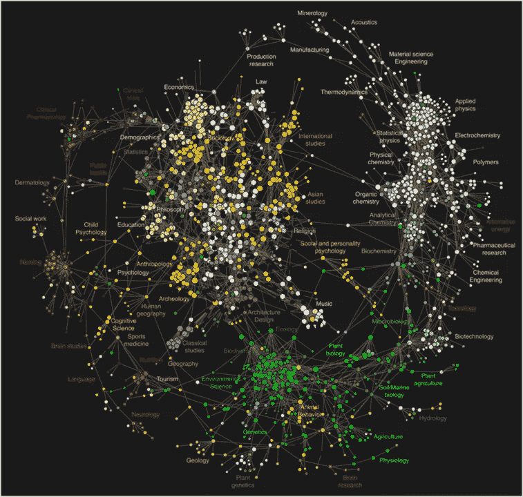
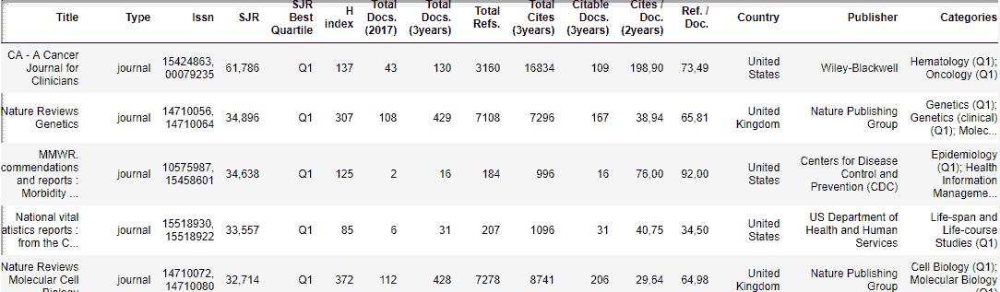
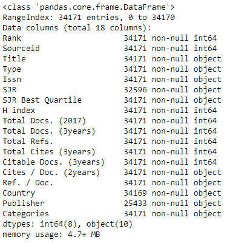
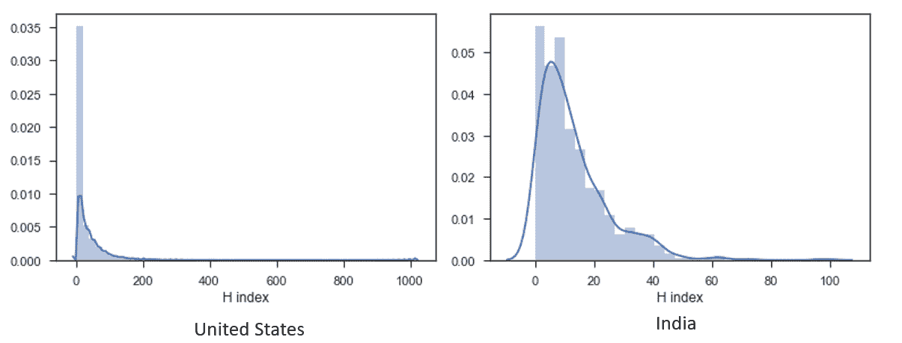
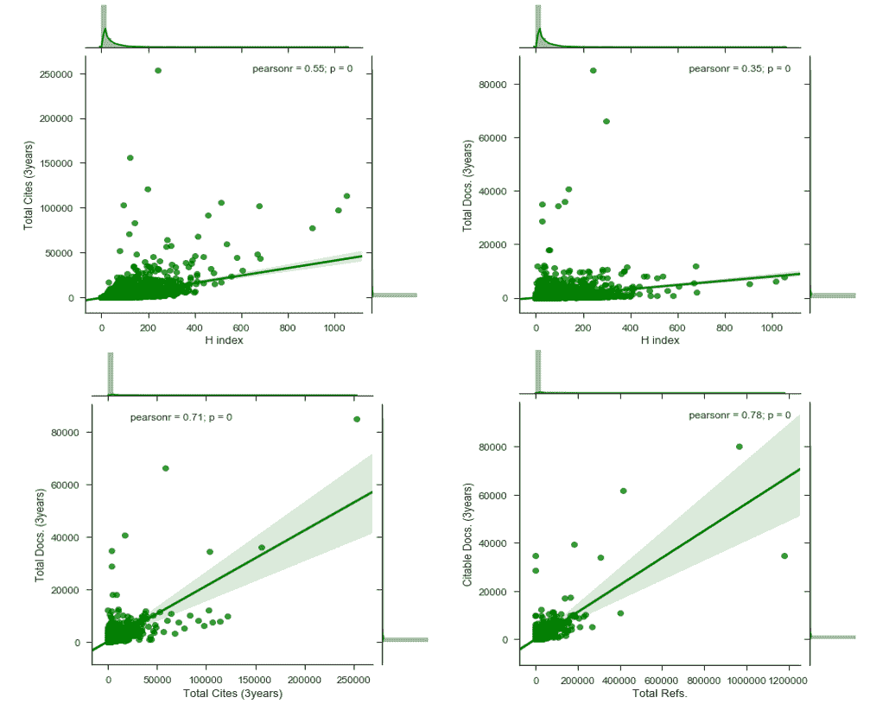
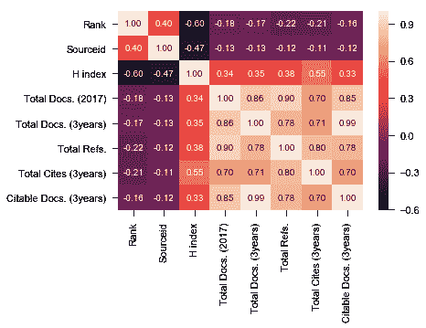
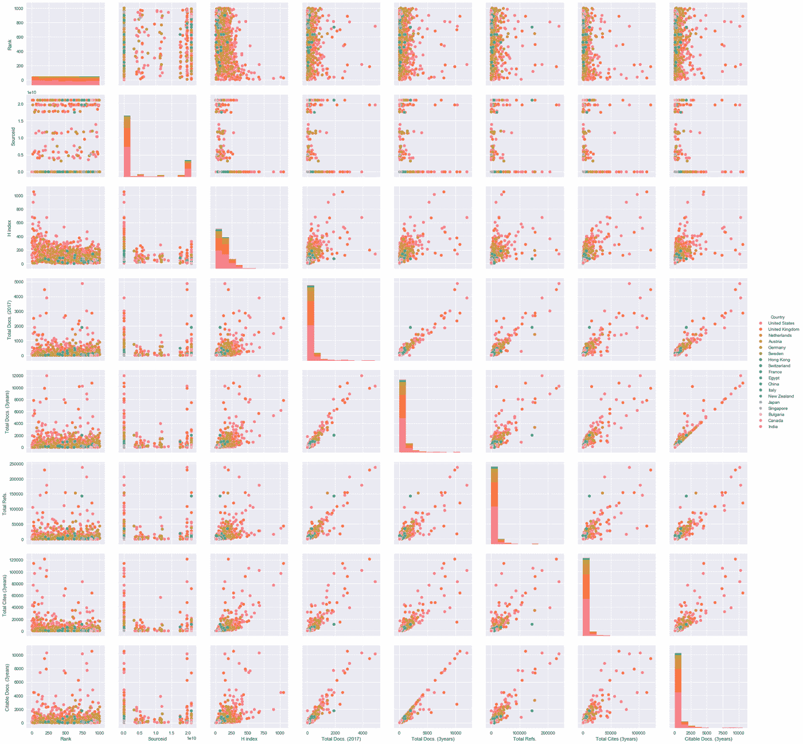
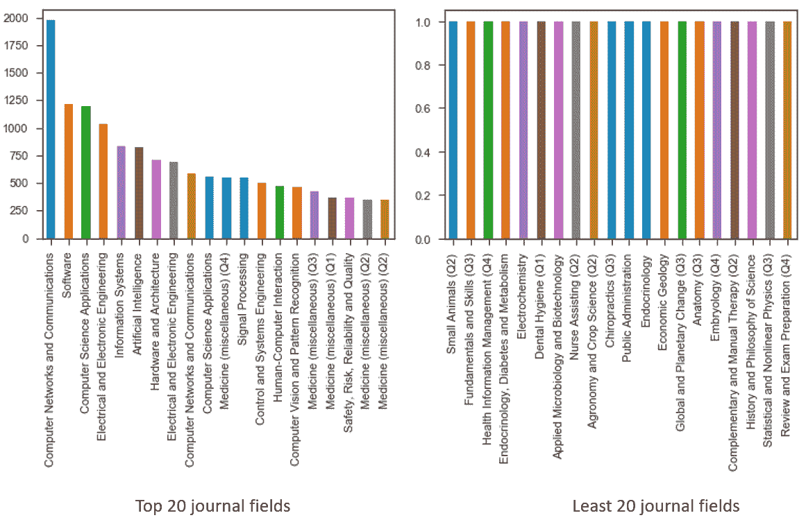

# 用熊猫可视化 Scimago 期刊排名数据库

> 原文：<https://towardsdatascience.com/visualizing-the-scimago-journal-ranking-database-with-pandas-7e7aaad54904?source=collection_archive---------12----------------------->



> SCImago 期刊排名(SJR 指标)是对学术期刊的科学影响力的一种衡量，既考虑了期刊被引用的次数，也考虑了引用来源期刊的重要性或声望。

scimago journal 的[网站](https://www.scimagojr.com/)维护着期刊和国家排名的完整信息。与其他类似网站不同，它还提供了一些独特的可视化工具，提供各种科学结构的信息可视化图表，实时和气泡图地图，这些地图基于一系列指标，如 H 指数、总文献数、引用文献数、引文数、自引数、每篇文献的引文数和国家。

**在这篇博文中，我将使用 Scimago 的数据库来创建类似的可视化效果，同时分析这些可视化效果将展现的奇怪趋势。**CSV 数据文件可在下载[。使用的库是 pandas、seaborn、matplotlib 和 plotly。对于不耐烦的灵魂，代码和输出可以在](https://www.scimagojr.com/journalrank.php)[这个](https://github.com/Saurav0074/Just-a-Peek/blob/master/main.ipynb) jupyter 笔记本中找到。

# 正在加载数据库

我用熊猫来加载 csv 文件。下图显示了数据库的各个字段:



在上图中，“标题”是指出版单位的名称。这些类型可以是*期刊、行业期刊、丛书*或*会议和会议记录*。此外，还列出了*SCImago Journal Ranks(SJR)*、*主办这些活动的国家名称*、发行商*组织、它们所属的*类别*以及其他指标。*



左图显示了在数据框上调用 info()方法得到的字段的列数和数据类型。我们可以观察到数据库非常干净，只有几列(SJR、国家、出版商)包含缺失值。

# 可视化 H 指数

H-index 指的是该期刊被引用至少 h 次的文章数量( *h* )。H-index 因其简单而优雅，可以被认为是当今[出版业绩最重要的衡量标准](https://www.researchgate.net/post/Is_H-index_the_most_important_metric_of_publication_performance)。

让我们从可视化 H 指数值的分布开始，以便推断所有可能出现的值以及它们各自的频率。为此，我们可以使用 Seaborn 的 [distplot](http://seaborn.pydata.org/generated/seaborn.distplot.html#seaborn.distplot) 。

```
sns.distplot(df.loc[df['Country'] == 'United States']['H index'].dropna(), kde=True)
print(df.loc[df['Country'] == 'United States']['H index'].dropna())
```

下图显示了美国和印度的分布情况。图上的蓝色曲线表示高斯核密度估计值。我们可以很容易地推断出两者之间的一些明显差异。例如，大多数印度期刊的 H 指数在 0-20 之间，而美国期刊的 H 指数在 0-100 之间。此外，没有一家印度期刊的 H 指数超过 200。



进一步，我尝试用气泡图将每个国家的总引用次数(过去 3 年)与它们的总 H 指数进行比较。为此，我们需要根据这些国家在过去三年中发布的文档总数来确定气泡的大小:

```
plt.figure(figsize=(10,8))
sns.set_context("notebook", font_scale=1.1)
sns.set_style("ticks")sizes = [10, 60, 90, 130, 200] 
marker_size = pd.cut(df['Total Docs. (3years)']/10, [0, 40, 80, 120, 160, 200], labels=sizes)
sns.lmplot('H index', 'Total Cites (3years)', data ​=df, hue='Country', fit_reg=False, scatter_kws={'s':marker_size})
plt.title('H index vs Total Cites (3 years)')
plt.xlabel('H index')
plt.ylabel('Total Cites')
plt.ylim((0, 50000))
plt.xlim((0, 600))
plt.savefig('sns.png')
```

由于 LinkedIn 的图片大小限制，我无法附上整张图片，而是提供了 google drive 链接。从图表中，我们可以很容易地分辨出哪些国家产生的文献最多，哪些最少被引用。不出所料，*美国*位居榜首，其次是*英国、荷兰、澳洲、*和*德国*，而排在最后的是:*津巴布韦、梵蒂冈城、斐济*和*列支敦士登*。我还使用 plotly 获得了一个类似但更具交互性的图表。然而，它太重了，不能附在这里，因为我在交互图中导航时多次经历了 plotly 的页面崩溃。(欢迎任何关于替代方案的建议。)

[](https://drive.google.com/file/d/1ZnqdeWCC6WVmKAHF8u7bABd7MlvS2CEf/view?usp=drive_open&usp=embed_facebook) [## hindex_vs_totalCites.png

### 编辑描述

drive.google.com](https://drive.google.com/file/d/1ZnqdeWCC6WVmKAHF8u7bABd7MlvS2CEf/view?usp=drive_open&usp=embed_facebook) 

# 可视化各种指标之间的相关性

接下来，我们想了解各种指标之间的关联模式。这就是 Seaborn 的[联合计划](http://seaborn.pydata.org/generated/seaborn.jointplot.html#seaborn.jointplot)来拯救的地方。使用 jointplot，我们可以根据两个变量显示数据点，包括它们的分布、核密度估计值和拟合数据的可选回归线:



该图(最后一个子图)显示了引用文献的数量与参考文献的总数高度相关，皮尔逊相关系数(pearsonr)为 0.78。此外，他们图表的回归线显示了一种强烈的上升趋势，这解释了随着参考文献总数的增加，引用文献的数量也在增加。这两个观察结果在评估关于总文档的 H 指数时给出了更差的结果，即 pearsonr = 0.35，并且回归线具有非常小的上升趋势。

关于相关性，我们可以使用 Seaborn 的[热图](http://seaborn.pydata.org/generated/seaborn.heatmap.html#seaborn.heatmap)一次可视化数据帧的多个指标之间的相关性。这可以使用对 pandas dataframe 调用的 [corr()](https://pandas.pydata.org/pandas-docs/stable/generated/pandas.DataFrame.corr.html) 方法来实现，该方法使用一种指定的方法(默认为 Pearson)来计算 dataframe 的所有数字列对之间的相关系数。



值得注意的一个特殊趋势是，引用文献的数量与发表文献的总数几乎完全相关。然而，这两个指标对 H 指数都没有很大的影响。因此，影响期刊 H 指数的最佳可能指标可以被认为是该期刊获得的引用总数**。**

如 [*Ramana 等人所述，上述热图中的趋势在联合图观察的支持下，可能表明 H 指数计算中的固有缺陷。艾尔。(2013)*](http://pubs.sciepub.com/bb/1/2/2/index.html) *:*

> *尽管你的大量论文被大量引用(在我们的例子中是总引用数)，它只考虑那些被引用次数最少的论文作为你的 h 指数，为了提高你的 h 指数，你的其他论文的引用也应该增加。*

# 可视化国家

到目前为止，我们一直在研究各种数值度量对之间的关系。到目前为止，一切都很好。但是，如果我们想知道单个国家的这些指标的趋势(或者第三个特征)，该怎么办呢？

对此的一个解决方案是使用[对绘图](https://seaborn.pydata.org/generated/seaborn.pairplot.html)。在探索多维数据之间的相关性时，Pairplots 非常重要，因为我们可能要绘制所有相互对应的值对。出于我的目的，我选择了 CSV 文件的前 1000 个实例，同时指定了字段“Country”的值，以便将绘图特征映射到不同的颜色:

```
sns.pairplot(df[:1000], hue='Country', size=2.5)
```



我们现在可以研究单个国家的表现。以下是一些快速推断:

*   粉红色光谱中的国家(保加利亚、加拿大和印度)可以看到具有较低的 H 指数和可引用文件，蓝绿色光谱中的国家具有中等水平，而橙红色光谱表示表现最好的国家。
*   可以看到沿对角线的图形由柱状图组成，以显示该列中各个变量的数据的单变量分布。
*   我们观察到的可引用文献数量和已发表文献总数之间的完美相关性在这里也成立，因为我们可以看到大多数数据点(即国家)都集中在上图的对角线上(第五行，最后一列)。这意味着我们可以沿着对角线拟合一条平滑的回归线，以覆盖大多数数据点。

# 可视化类别

我们可能还想知道更多关于数据库中提到的不同科学类别的信息。但是，类别单元格包含多个分号分隔的字段。因此，我首先基于不同的“；”复制行类别中的分隔值。

```
new_df = pd.DataFrame(df.Categories.str.split(';').tolist(), index=df.Country).stack()
new_df = new_df.reset_index()[[0, 'Country']] *# categories variable is currently labeled 0*
new_df.columns = ['Categories', 'Country'] *# renaming categories*
new_df = new_df.dropna()
new_df.info()
new_df.head()
```

现在，让我们观察发布实体数量最多和最少的类别。为此，我们需要将类别的字符串值转换成数字。Pandas 为此提供了一个内置方法:value_counts()返回 pandas 系列中唯一值的计数。

```
fig, ax = plt.subplots()
new_df['Categories'].value_counts()[:20].plot(ax=ax, kind='bar')
```



> 不出所料，计算机科学独占鳌头！

此外，上述可视化也可以用这个新的数据框来实现。