# 可视化世界各国领导人在联合国大会上的演讲

> 原文：<https://towardsdatascience.com/visualizing-the-speeches-of-world-leaders-at-unga-d7319e00e180?source=collection_archive---------14----------------------->

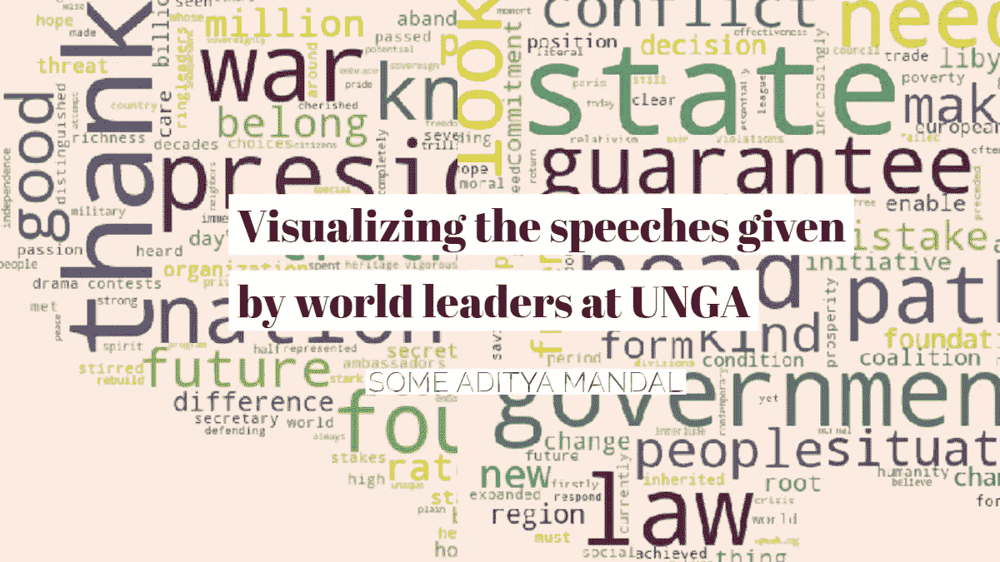

第 74 届联合国一般性辩论于 9 月 24 日星期二上午 9 时(纽约时间)开幕。今年的主题是“激励多边努力，促进消除贫困、优质教育、气候行动和包容”。

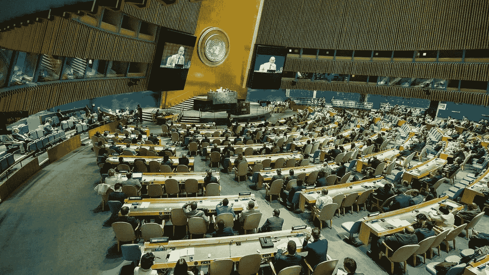

自 1947 年以来，联合国会员国的代表每年都聚集在联合国大会的年会上。每次会议的中心是一般性辩论。在这个论坛上，各国领导人和其他高级官员发表声明，阐述他们的政府对世界政治重大问题的看法。

这份领导人名单是根据他们的 GDP 规模、应对气候变化的行动以及他们对地区发展的影响等因素编制的。

*   **纳伦德拉·莫迪**，*印度总理*
*   **唐纳德·川普**，*美利坚合众国总统*
*   **唐纳德·图斯克**，*欧洲理事会主席，欧盟*
*   **埃马纽埃尔·马克龙**，*法兰西共和国总统*
*   **鲍里斯约翰逊**，*英国首相*
*   **朱塞佩·孔戴**，*意大利总理*
*   **安倍晋三**、*日本首相*
*   **雅伊尔·博索纳罗**，*巴西总统*
*   **杰辛达·阿德恩**，*纽西兰总理*
*   **伊姆兰·汗**，*巴基斯坦总理*

德国、中国和俄罗斯没有由其国家元首代表，而是由大多数高级官员代表，因此他们没有被纳入分析。

**分析参数:**

*   **词语云** —世界云会将领导讲话中使用频率最高的词语可视化。NLTK 世界云库用于生成定制的可视化。
*   **主题建模** —主题建模将通过进行 NLTK 分析来可视化演讲的前 10 个主题。Gensim 主题建模用于此。
*   **极性(模式分析器)——**使用模式分析器计算语音的极性，并在-1.0 到+1.0 的范围内显示，其中-0.1 为最大负值，0 为中性值，+1.0 为正值。使用的技术是基于 python 的文本处理库 TextBlob。
*   **主观性(模式分析器)——**使用模式分析器计算语音的主观性，并在 0.0 到+1.0 的范围内显示，0.0 表示客观，+1.0 表示主观。使用的技术是基于 python 的文本处理库 TextBlob。

**印度总理纳伦德拉·莫迪**

莫迪是世界上最大的民主国家、第五大经济体和 13 亿人口的总理。印度也是第三大二氧化碳排放国，因此印度采取的每一个行动都关系到每一个全球公民。他演讲的主要亮点是印度不断推动消除贫困、采用可再生能源、应对气候变化和根除恐怖主义。

全文[此处](https://www.narendramodi.in/prime-minister-s-address-to-the-unga-546657)。

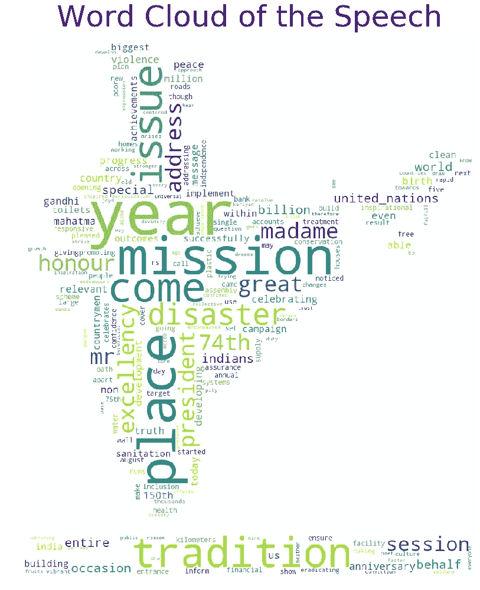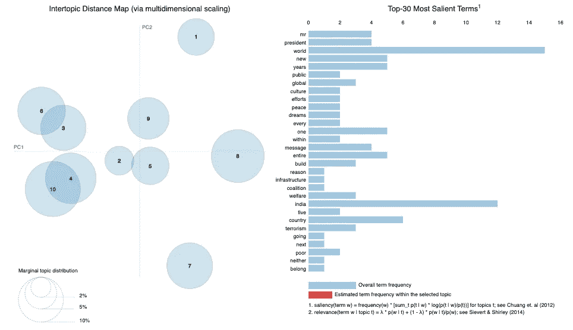

可视化显示，演讲主要集中在印度的发展和世界上的其他社会经济问题上。

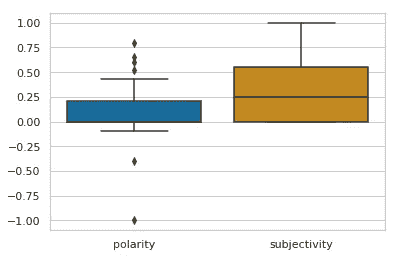

总理的讲话极性为 0.089，这表明它是中性的——积极的，主观性为 0.31，这表明它不太主观。

**美国总统唐纳德·川普**

特朗普是世界上最古老的民主国家的总统，是世界上最大的军事强国，也是仅次于中国的第二大二氧化碳排放国。特朗普总统在演讲中没有对气候变化做出任何强有力的承诺。此外，他传达了一个明确的信息，支持民族主义和国家主权，反对全球主义。这次演讲是在对他的正式弹劾调查开始后发表的。

全文[此处](https://www.whitehouse.gov/briefings-statements/remarks-president-trump-74th-session-united-nations-general-assembly/)。

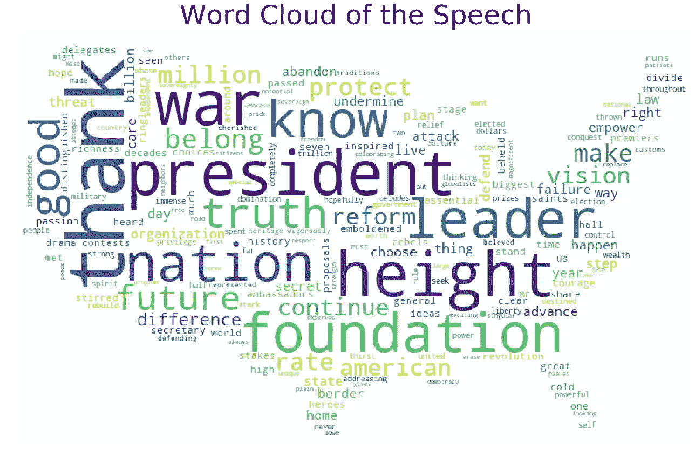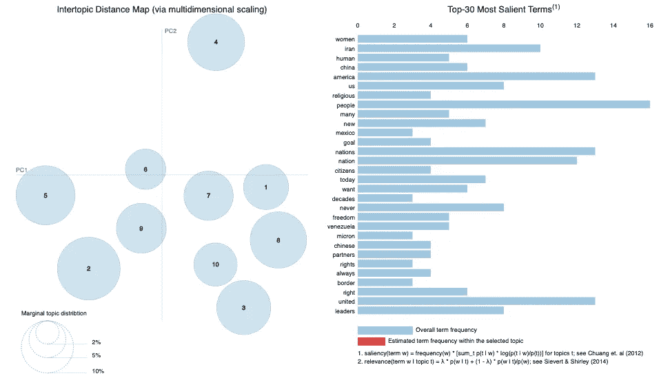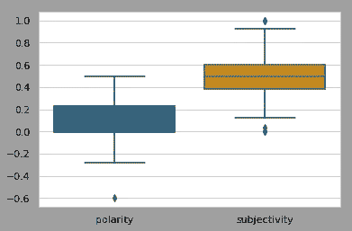

总统演讲的极性为 0.10，这表明它是积极的，主观性为 0.49，这表明它是主观的。

**欧盟欧洲理事会主席唐纳德·图斯克**

唐纳德·图斯克先生是欧盟的政治首脑，欧盟拥有 5 亿人口和 18 万亿美元的国内生产总值。图斯克强调，如果不准备在全球范围内建立规则，并在以后始终遵守这些规则，当地社区、民族和国家，甚至各大洲，在这些威胁面前都将束手无策。

全文[此处](https://www.consilium.europa.eu/en/press/press-releases/2019/09/26/address-by-president-donald-tusk-to-the-74th-united-nations-general-assembly/)。

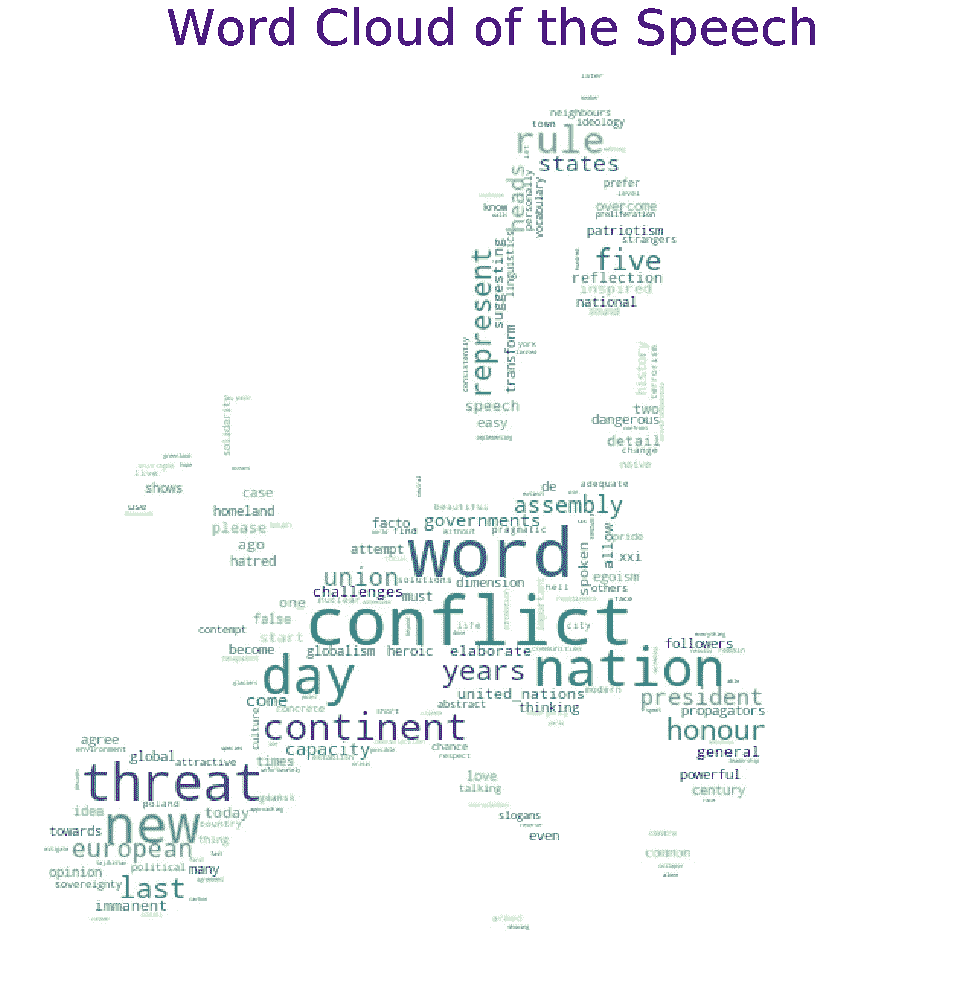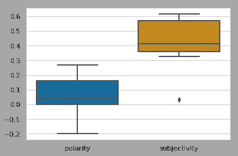

总统演讲的极性为 0.07，这表明它是积极的，主观性为 0.43，这表明它更加主观。

**法国总统埃马纽埃尔·马克龙**

周二，法国总统埃马纽埃尔·马克龙在联合国大会年度高级别辩论上向世界领导人发表讲话，呼吁拿出勇气，呼吁政治家们承担必要的风险，以找到应对当代挑战的真正解决方案。

全文[此处](https://www.diplomatie.gouv.fr/en/french-foreign-policy/united-nations/events/united-nations-general-assembly-sessions/unga-s-73rd-session/article/united-nations-general-assembly-speech-by-president-emmanuel-macron-25-09-18)。

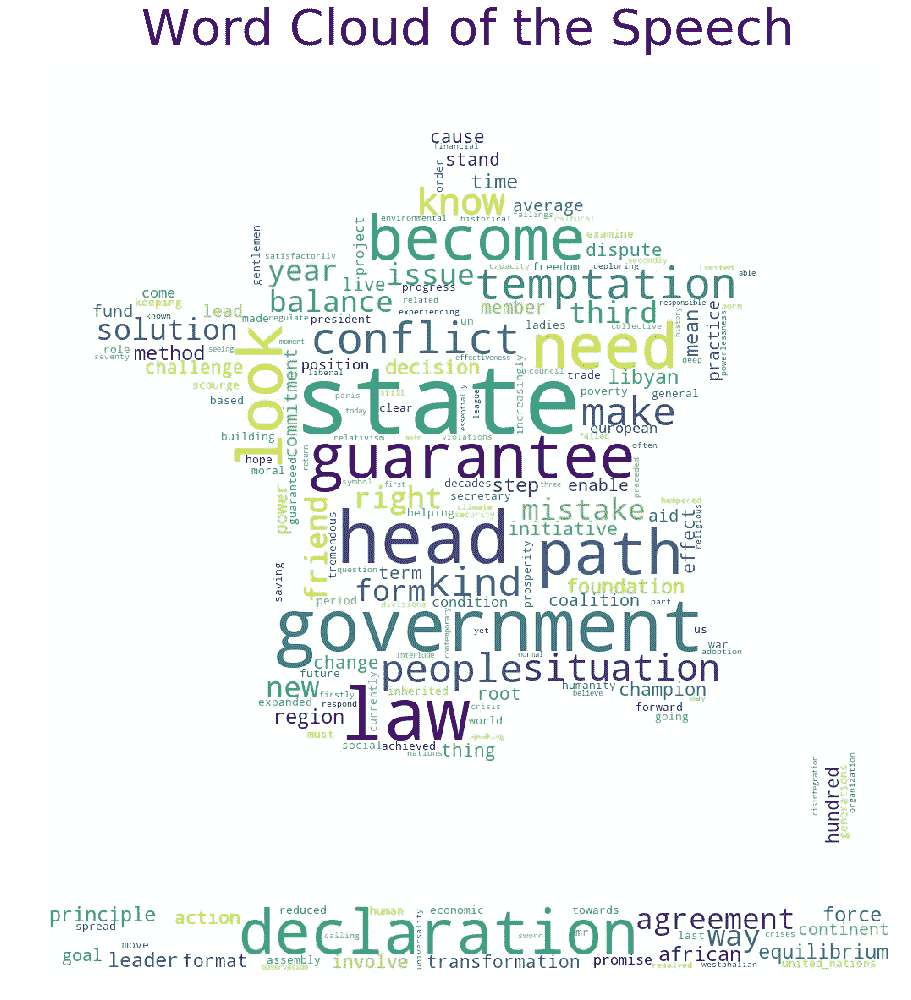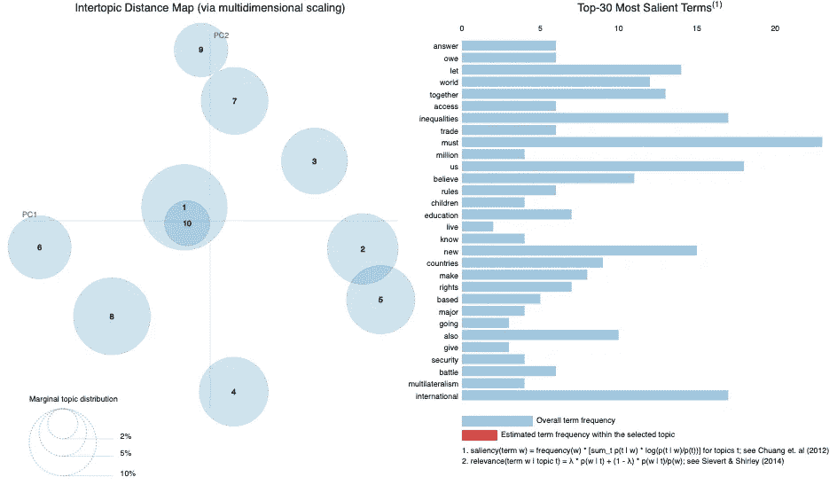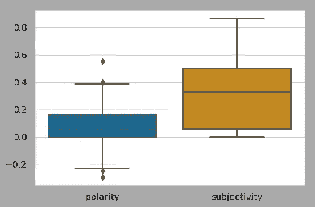

总统演讲的极性为 0.08，这表明它是中性的——积极的，主观性为 0.31，这表明它更加客观。

**英国首相鲍里斯·约翰逊**

英国首相鲍里斯·约翰逊(Boris Johnson)在联合国大会(UN General Assembly)上发表了关于技术的首次演讲，其中引用了许多离奇的引文，涉及科幻小说、电影，甚至小众的英国喜剧节目。演讲在一大堆可识别的反乌托邦比喻之间跳跃，比如“终结者”系列和关于物联网的阴谋论。这次演讲是在他在英国遭遇巨大失败后发表的，最高法院裁定他暂停议会是非法的。

全文[此处](https://www.gov.uk/government/speeches/pm-speech-to-the-un-general-assembly-24-september-2019)。

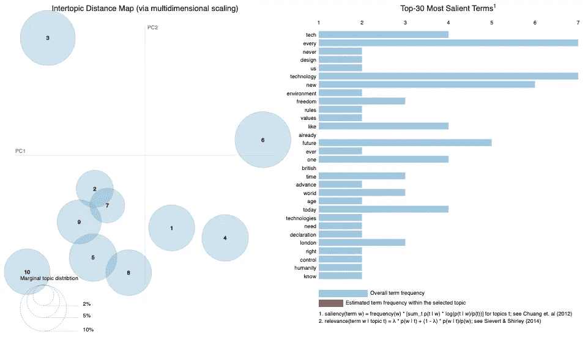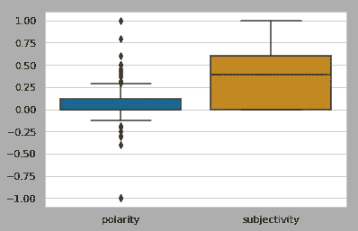

总理的讲话极性为 0.05，这表明它是中性的——积极的，主观性为 0.35，这表明它更加客观。

**意大利总理朱塞佩·孔戴**

意大利是世界第八大经济体，也是二氧化碳的主要排放国。孔戴先生强调，国际社会需要更有效的多边主义，需要一个作为基于和平、正义和公平的国际体系支柱的作用得到加强的联合国。

全文[此处](https://www.voltairenet.org/article203153.html)。

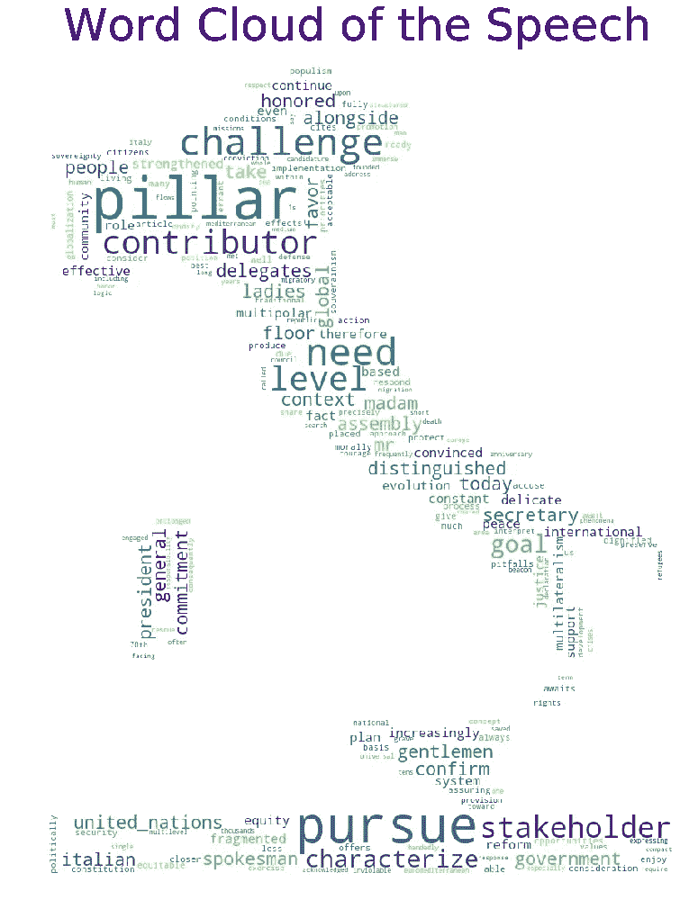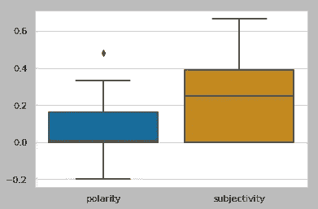

总理的讲话极性为 0.07，这表明它是中性的——积极的，主观性为 0.22，这表明它非常客观。

**日本首相安倍晋三**

日本是世界第三大经济体和第五大二氧化碳排放国。日本誓言支持全球推动为所有女孩和妇女提供包容性优质教育。安倍还表示，他打算利用多边框架和全球主义来缩小差距。

全文[此处](https://www.mofa.go.jp/fp/unp_a/page3e_001107.html)。

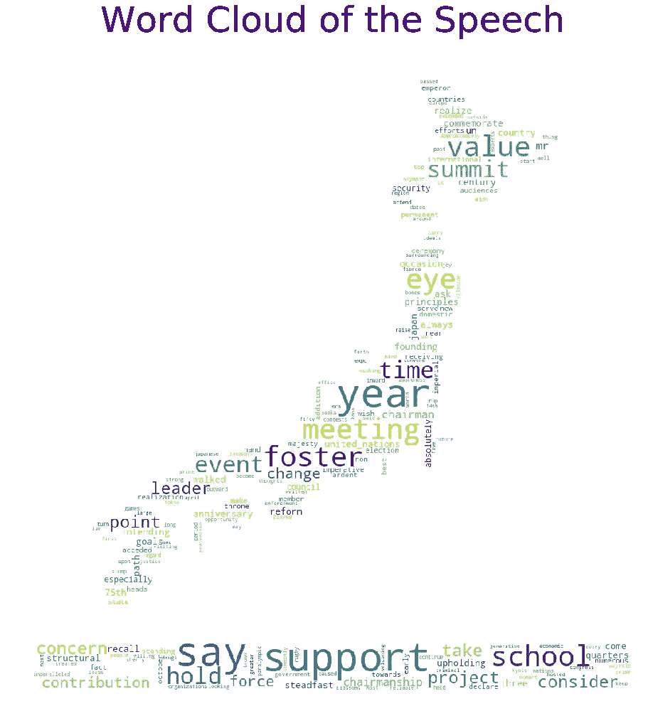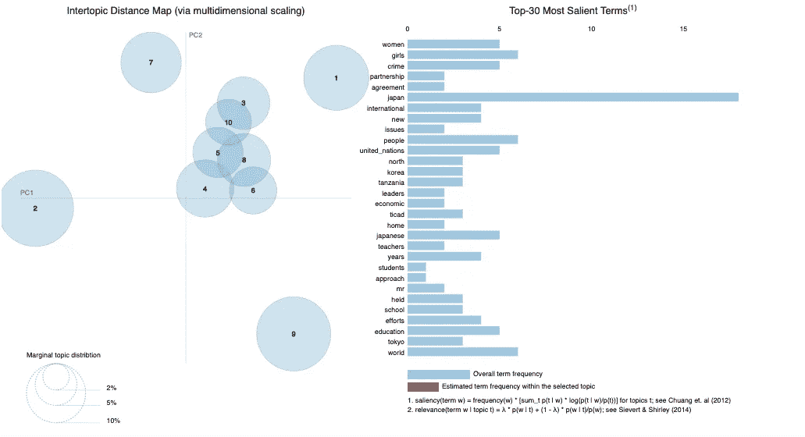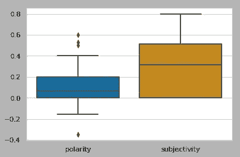

总理的讲话极性为 0.10，这表明它是积极的，主观性为 0.31，这表明它更客观。

巴西总统雅伊尔·博索纳罗

极右翼的巴西总统雅伊尔·博索纳罗公开反对他所谓的关于亚马逊的“媒体谎言”以及所谓的对居住在那里的土著居民的操纵。巴西是南美洲最大的国家，亚马逊地区比西欧还大。在他挑衅性的演讲中，他还继续攻击社会主义在拉丁美洲的遗产。在对法国和德国的尖锐反驳中——两国都公开关注森林砍伐的增加——bolso naro 利用他的演讲指出，这两个欧洲国家将超过 50%的土地用于农业，而巴西仅使用 8%。

全文[此处](https://www.c-span.org/video/?463700-2/brazilian-president-bolsonaro-united-nations-general-assembly-address&start=1603)。

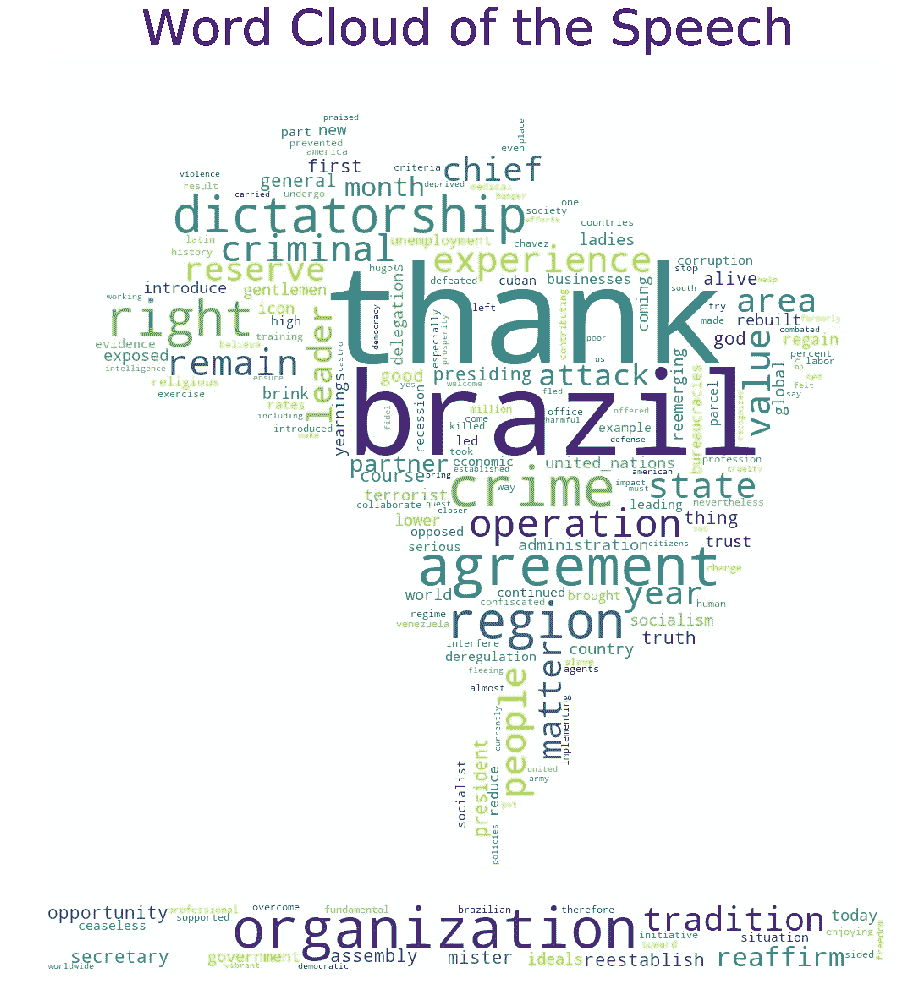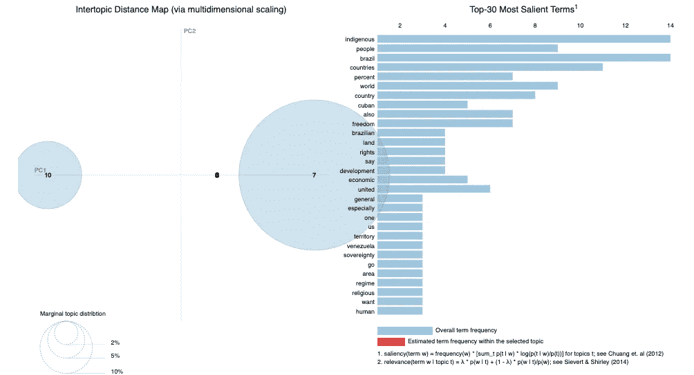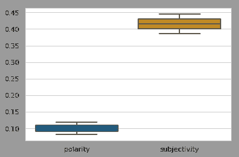

总统演讲的极性为 0.09，这表明它是中性-积极的，主观性为 0.41，这表明它是中性-客观的。

**纽西兰总理杰辛达·阿德恩**

杰辛达·阿德恩总理对民族主义的呼吁进行了指责，并恳求世界领导人共同努力，这一讲话与美国总统唐纳德·特朗普早些时候发表的讲话截然不同。阿尔登还指出，克赖斯特彻奇呼吁是各国和科技公司合作努力消除网上暴力极端主义和恐怖主义内容的一个例子。

全文[此处](https://www.stuff.co.nz/national/politics/107445802/prime-minister-jacinda-arderns-statement-to-the-united-nations-general-assembly)。

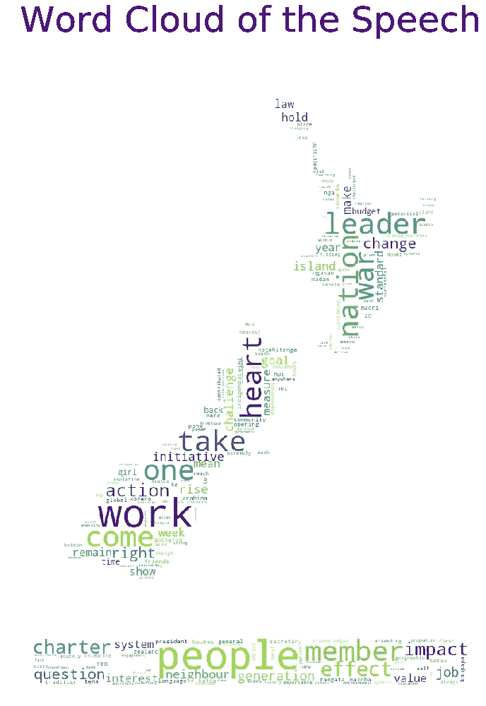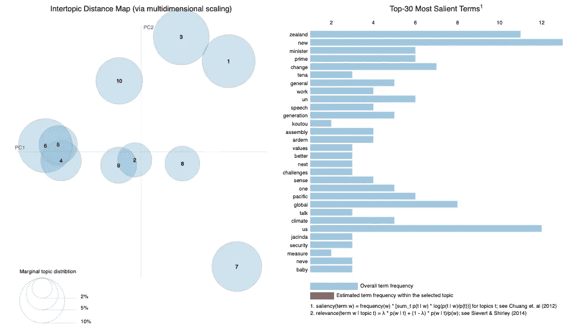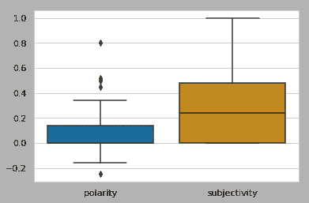

总理的讲话的极性为 0.07，这表明它是中性-积极的，主观性为 0.28，这表明它非常客观。

**巴基斯坦总理伊姆兰·汗**

这是汗先生成为巴基斯坦总理后在联合国大会上的首次发言，巴基斯坦是东南亚维护和平与稳定的一个非常重要的角色。作为 130 个联合国认定的恐怖分子，超过 25 个联合国认定的恐怖实体的家园——崩溃的国内生产总值和高耸的经济债务，世界非常有兴趣知道汗先生如何计划使巴基斯坦成为一个更好的地方。相反，他把自己的全部 59 分钟都献给了印度——一种针对印度的虚构言论，对印度领导层吐毒液，为伊斯兰激进主义和核圣战辩护。

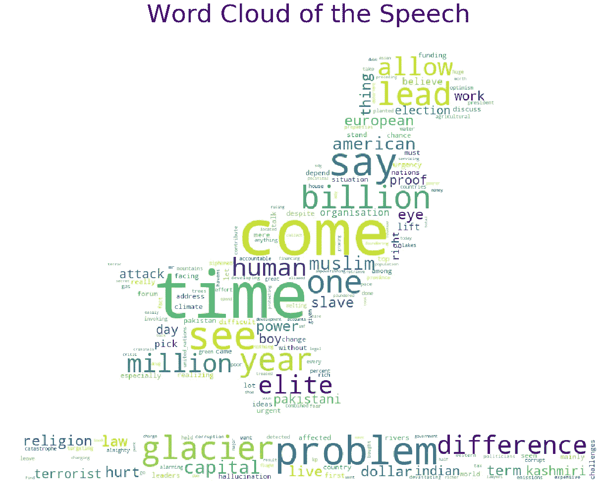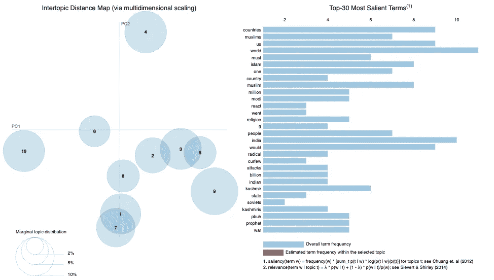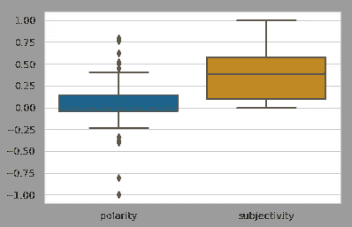

总理讲话的极性为 0.04，这表明它是中性的，具有显著的负带宽，主观性为 0.38，这表明它更加客观。

**技术背后的分析**

*   使用 python 中的正则表达式、 **NLTK** 库进行文本处理。
*   使用定制的**NLTK**word cloud 来可视化演讲。
*   使用 **Gensim** 话题建模 **LDA 分析器**获得演讲的更详细话题。
*   使用 **Textblob** ，计算极性和主观性。

链接到[***Google Collab***](https://colab.research.google.com/drive/1Iv62I_iy_gq8ilyf4WFNtLl4bxWZomnG)***。***

链接 [***Kaggle 笔记本分析联合国辩论会上的印度(1970–2016)***](https://www.kaggle.com/someadityamandal/analysis-of-india-at-un-debates)***。探究印度在谈论哪些问题？印度有多少次提到巴基斯坦或其他国家，反之亦然？***

**注:**

*这是一项完全独立的数据分析，既不赞助也不支持，也不与任何组织、公司或个人相关。*

从我的角度来说，我尽量保持它的公正性，把它表达为一种纯数据分析的形式，而不做太多的政治评论。读者可以自由使用上述数据或图像，并从中做出任何推断。