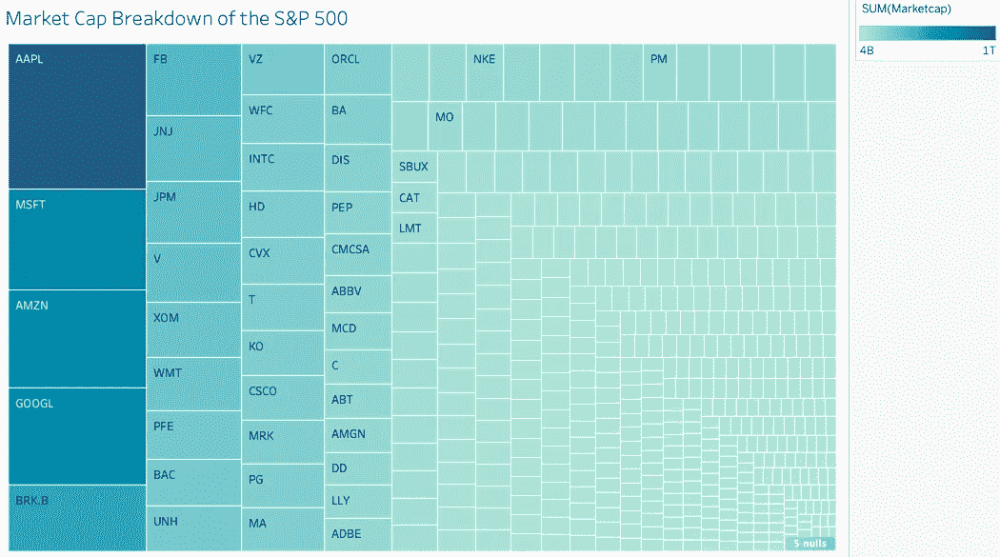
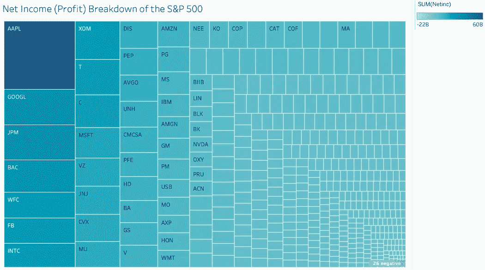
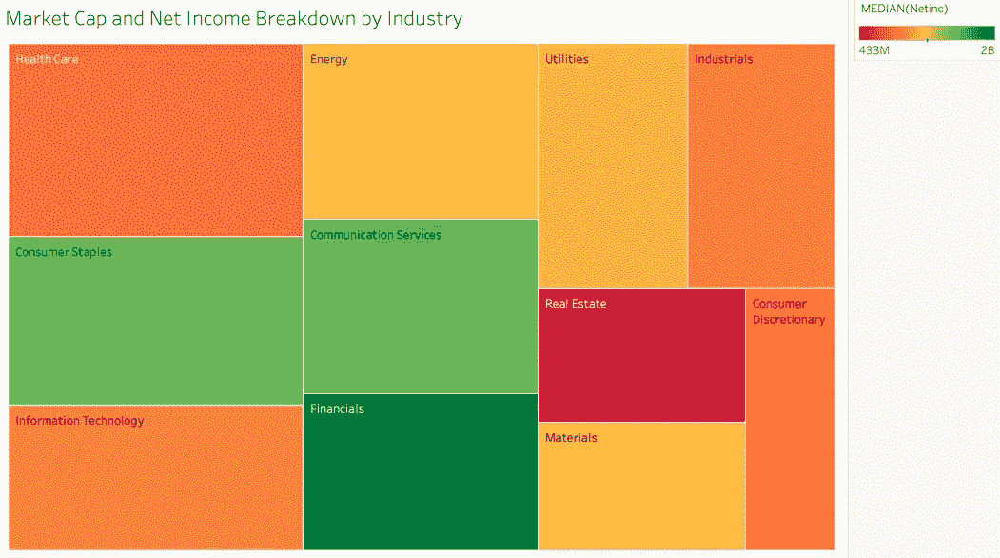

# 用 Tableau 可视化股票市场

> 原文：<https://towardsdatascience.com/visualizing-the-stock-market-with-tableau-c0a7288e7b4d?source=collection_archive---------12----------------------->


Photo by [AbsolutVision](https://unsplash.com/@freegraphictoday?utm_source=unsplash&utm_medium=referral&utm_content=creditCopyText) on [Unsplash](https://unsplash.com/search/photos/stock-market?utm_source=unsplash&utm_medium=referral&utm_content=creditCopyText)

## 我们使用 Tableau 数据可视化来寻找包含潜在廉价股票的行业

Tableau 是一个重要的数据可视化工具，属于每个数据分析师和数据科学家的工具包。今天，我们摆弄股票市场数据，以探索 Tableau 如何帮助我们剖析和更好地理解我们的数据。

# 首先，我们获取数据

我们可以从 [Quandl](https://www.quandl.com/) 抓取股市数据。我们将重点关注标准普尔 500 指数，这是一个大型美国股票(基本上是最大的美国公司)的市值加权指数。

下面是获取数据的 Python 代码(注意，您需要自己的 Quandl API 密匙，Sharadar 数据需要付费订阅)。我还在下面的代码中添加了注释，但是下面的代码片段使用 Quandl 的 API 来获取 Sharadar 数据库中所有上市公司的财务数据(财务数据包括收入、净收入、债务、投资资本回报率等等)。这个财务数据存储在数据帧 *stock_df* 中。

```
import quandl
quandl.ApiConfig.api_key = 'your_qandl_api_key'
import numpy as np
import pandas as pd# Download financial data from Quandl/Sharadar
table = quandl.get_table('SHARADAR/SF1', paginate=True)# Grab the most recent annual data ('MRY' denotes annual data)
stock_df = table[(table['calendardate'] == '2018-12-31 00:00:00') & (table['dimension']=='MRY')]
```

然而，我们不需要每家公司的数据，我们只需要标准普尔 500。为了得到标准普尔 500 的报价，我们求助于网络搜集和维基百科。下面几行代码抓取了一个维基百科表格，列出了目前在标准普尔 500 的每家公司的股票代码和行业，并将其存储在名为 *page_content* 的变量中。

```
# Scrape S&P 500 tickers from Wikipedia
from bs4 import BeautifulSoup
import requests
import repage_link = '[https://en.wikipedia.org/wiki/List_of_S%26P_500_companies'](https://en.wikipedia.org/wiki/List_of_S%26P_500_companies')
page_response = requests.get(page_link, timeout=1000)
page_content = BeautifulSoup(page_response.content, 'lxml')
```

接下来，我们使用一些解析代码从 *page_content* 中获取 ticker 和 industry，这是一个漂亮的组数据结构。代码可以总结为执行以下操作:

*   遍历 *page_content* 中所有“tr”(我相信它表示 HTML 中的一个表格行)标记的项目。
*   将跑马灯作为一个字符串来抓取(T10)。text 将项目转换为字符串格式)并将其存储在列表*ticker*中。
*   将行业作为字符串抓取并存储在列表*行业*中。

```
# From web scraped Wikipedia content on the S&P 500, grab the ticker and industry for each firm
tickers = []
industries = []
for i, val in enumerate(page_content.find_all('tr')):
    if i > 0:
        try:
            # Here is where I grab the ticker
            tickers.append(val.find_all('a')[0].text)
            # Here is where I grab the industry
            industries.append(val.find_all('td')[3].text.replace('\n', ''))
        except:
            pass
```

最后，我们需要做一些数据操作，将我们的股票和行业数据(来自维基百科)与我们的财务数据(来自 Quandl)结合起来。前两个代码块(在注释中有详细描述)将我们想要的 tickers 存储到一个名为 *sp_df* 的数据帧中。

最后一段代码使用 [Pandas 合并方法](https://pandas.pydata.org/pandas-docs/stable/reference/api/pandas.DataFrame.merge.html)将包含我们股票和行业数据的 *sp_df* 与包含我们财务数据的 *stock_df* 连接起来。我们将得到的数据帧 *merged_df* 存储在一个. csv 文件中，我们现在可以将它加载到 Tableau 中(我使用的是 [Tableau Public，它是免费的](https://public.tableau.com/en-us/s/))。万岁！

```
# After ticker ZTS, the rest of the table entries are for acquisitions/mergers
last_pos = tickers.index('ZTS') + 1
sp_tickers = tickers[:last_pos]
sp_industries = industries[:last_pos]# Create a new dataframe for S&P 500 and merge in Quandl data
sp_df = pd.DataFrame()
sp_df['tickers'] = sp_tickers
sp_df['industries'] = sp_industriesmerged_df = sp_df.merge(stock_df, left_on='tickers', right_on='ticker', how='left')
merged_df.to_csv('sp500.csv', index=False)
```

# 差不多是时候想象了

数据可视化听起来有趣又简单，但事实并非如此。我们看到的所有这些很酷的仪表盘和交互式图表都经过了大量的思考。虽然我不是专家，但在我开始把数字贴到图表上之前，我首先尝试回答以下问题:

1.  我们试图通过视觉化来揭示什么样的洞察力？漂亮的图表固然很好，但如果没有从中汲取的洞察力，它们只不过是空洞的形状和颜色。
2.  **这个视频是探索性的还是回答一个特定的问题？**这两个目标看似相似，但事实并非如此。探索性的可视化可以更一般化，包含大量信息——因为目标是引发思考和讨论。这意味着要盯着看，逐渐消化，不同的人在研究一个问题时会得出不同的结论。另一方面，旨在回答特定问题的可视化需要做到这一点——它们旨在明确支持你试图提出的任何观点。

现在让我们试着回答这些问题:

1.  我们希望**利用我们的股票数据寻找有吸引力的行业或可能值得投资的单个公司。**
2.  在本帖中，我们将关注探索性的视觉效果。挑选股票是一项复杂而主观的工作。我们的目的不是告诉人们买什么股票；相反，我们希望我们的可视化可以帮助他们识别和深入更具体的兴趣领域。

# 用 Tableau 可视化股市(终于！)

让我们先来看看 S & P 500 的树形图[。标准普尔 500 指数是一个上限加权指数——这意味着每家公司在该指数中的代表与其市值成比例(市值是该公司所有股票的总价值，换句话说，就是收购整个公司的成本)。在下面的树形图中，**每个矩形的大小和颜色对应于该公司在标准普尔 500 指数中的表现。**](https://en.wikipedia.org/wiki/Treemapping)



Larger Area and Deeper Colors Means Higher Market Capitalization

顶端有一些熟悉的面孔——苹果、微软、亚马逊、谷歌、伯克希尔·哈撒韦组成了前五名。有趣的是，**这 5 大公司占标准普尔 500 指数市值的 17%,前 15 大公司占总市值的 30%。**注意，仅仅是市值不足以解释是什么驱动了标准普尔 500 指数的价格变化——公司股价的波动也很重要。例如，尽管脸书(FB)的市值低于微软(MSFT)，但脸书的股价在过去 12 个月中波动更大，因为它试图避开一系列丑闻。因此，在过去的一年里，脸书的股票很可能比微软的股票更能推动标准普尔 500 指数的上涨。

# 可视化公司利润

拥有一家公司的股份相当于拥有同一家公司的一部分(无论多小)。例如，如果我们非常富有，购买了相当于公司 1%的股份，那么作为少数股东，我们有权获得 1%的利润。当然，作为小股东，我们也被迫将这些利润的管理和投资委托给谷歌的上层管理人员和董事会(这也是为什么我们即使拥有股份，也不会每季度从谷歌那里拿到利润分成支票)。

因此，如果一家公司的利润(又称净收入)是我们购买其股票时最终希望获得的，那么我们或许应该重新绘制利润的树形图。在下面的树形图中，**每个矩形的大小和颜色对应着该公司利润的大小(又称净收入)。**



Larger Area and Deeper Colors Means Higher Profits

虽然苹果和谷歌仍在前五名，但我们现在有了一些新面孔——摩根大通(JPM)、美洲银行(BAC)和富国银行(WFC)。尽管有关于技术如何颠覆传统行业的大肆宣传，银行业(作为一个传统行业)继续赚取巨额利润。被遗忘的科技巨头英特尔(INTC)、石油巨头埃克森美孚(XOM)和电信巨头美国电话电报公司(T)尽管在当今痴迷于创新的市场中有些被遗忘，但仍能赚得盆满钵满。

# 按 S&P 部门(按行业)可视化

我个人认为最好的长期投资策略是“低买高卖”(说起来容易做起来难)。但是我们怎么做呢？在最基本的层面上，对于我们支付的每一美元，我们应该试图购买尽可能多的利润。**之前的想象向我们展示了不受欢迎的行业有时可能隐藏着不被重视的利润来源。让我们转而关注行业而不是公司，看看我们是否能找到一些好的利润来源。**

下面的树形图根据市值中位数(每个矩形的面积)和利润中位数(每个矩形的颜色)对每个行业进行了细分。我们使用中位数是因为我们想知道，如果我从一个特定的行业中随机挑选一家公司，它的成本可能是多少(市值)，利润可能是多少(净收入)。



Larger Rectangles Means More Expensive, Greener Color Means More Profitable — Remember These are Medians!

在我们讨论结果之前，我们应该首先理解思考这个树形图的正确方式。我们用它来观察中值市值(我们支付的价格)和中值净收入(我们获得的利润)之间的关系。**如果一个行业的价格与其中公司的利润完全相关，那么我们会认为最大的矩形是最绿的，并且随着矩形尺寸的减小，颜色会转变为红色。**我们显然没有看到这一点，所以看起来有潜在的机会。

树形图突出了金融机构(银行、保险公司等。)和通信服务(谷歌、脸书、美国电话电报公司、迪士尼等。)作为寻找廉价股票的潜在有吸引力的行业——**因为它们在矩形规模(市值中值)方面处于中游，但非常环保(利润中值高)。**

与此同时，深红色的房地产似乎绝对不行。医疗保健似乎也是一个应该避开的行业，因为它拥有最高的中值市值和接近“垫底”的中值利润(这对我们来说是一个坏消息)。

当然，这些只是识别潜在投资的快速经验法则——在实际投资之前，应该进行更多的尽职调查。

# 什么是信息技术？

令人惊讶的是，在我们之前的分析中，包含苹果和微软等重量级公司的信息技术行业看起来并不出色——就价格而言，它很昂贵，但就中间利润而言，它却是“垫底”的。怎么回事？

有两个因素在起作用:

1.  2018 年末，谷歌和脸书从信息技术转向通信服务。这是两家利润丰厚的公司，人们将它们与科技紧密联系在一起。如果他们仍然在信息技术领域，那么它的市值和利润都会高得多。
2.  利润水平并不是投资者唯一关心的事情。这些利润是如何获得的也非常重要——像利润率(最终转化为利润的销售比例)和投资回报(为了产生一定水平的利润，我们需要向企业投入多少资金)也非常重要。

让我们用一个 Tableau 散点图来检验市盈率和 ROIC 之间的关系:

*   市盈率是衡量一家公司股票有多贵的常用指标。简单来说就是公司的市值除以其净收入——换句话说，我们购买特定公司 1 美元的收益需要多少钱。在其他条件相同的情况下，市盈率越高，股票被认为越贵。
*   **ROIC 代表资本投资回报率，代表我们对企业投资 1 美元所能产生的利润。**投入资本是对经营某项业务所需资本量的衡量。例如，资本密集型企业就像丰田一样，需要大规模的工厂来生产汽车。另一方面，软件是一个轻资本的行业——一旦开发出来，就固定成本或基础设施(相对于产生的利润)而言，维护和部署像微软 Office (Word、Excel、PowerPoint、Outlook)这样的东西的成本非常低。


Median ROIC vs. Median P/E Ratio Scatter Plot

看看我们左边的散点图。它表明一只股票的市盈率(它有多贵)和它的 ROIC 之间是正相关的。这是有道理的——**投资者喜欢高 ROIC 的公司，因为它们通常只需要很少的前期投资就能产生可观的利润**(需要大量前期投资的公司被认为是有风险的，因为我们可能永远得不到回报)。

到目前为止，信息技术行业的 ROIC 中值最高。这也是有道理的，因为这个领域充满了软件公司，正如我们之前观察到的，资本非常少。**因此，吸引投资者投资信息技术(并推动其高市盈率和市值)的不是当前的高利润，而是该业务的轻资本性质，以及今天相对较小的投资将在明天产生高增长和高利润的希望(每个人都喜欢易于扩展且成本低廉的业务模式)。**

那会发生吗？我不知道，但市场目前正在下大赌注——所以如果你正在寻找好的机会，你可能会想看看其他地方。

最后，请注意金融板块的 ROIC 最低。这再加上银行的感知风险(2008 年有人吗？)大概推动了他们的低估值。但是银行使用资本的方式不同——银行不是借钱建工厂，而是向你我这样的人借钱，然后以更高的利率借出去。

通常，高投入资本意味着运营企业需要高固定前期成本。银行的情况并非如此——尽管拥有极高水平的投资资本(由于高负债)，银行的固定成本却很少。这种高负债确实让它们的风险更高，或许应该得到市盈率折扣，但我们不应该仅仅因为银行的低 roic 就把它们排除在投资之外——相反，我们应该寻求理解是什么驱动了这些低 roic，以及这是否是一个真正的问题。

# 结论

很好，我们坚持到了最后！老实说，我们还有很多可以探索的。股票市场和公司战略是两个极其深刻和丰富的主题；“买什么股票”是一个非常棘手的问题。在这篇文章中，我们只是开始触及皮毛。

然而，我希望我已经展示了可视化如何帮助我们消化复杂的数据集，并开始解决具有挑战性的问题。

干杯！

***更由我论金融与投资:***

[*做空波动的危害*](/the-xiv-meltdown-1b0608110b9f)

[*我做的一个关于投资 Lending Club 贷款的数据科学项目*](/turning-lending-clubs-worst-loans-into-investment-gold-475ec97f58ee)

[*股市低迷*](/the-anatomy-of-a-stock-market-downturn-6527e31406f0)

***更多由我上数据科学:***

[*随机森林分类器*](/understanding-random-forest-58381e0602d2)

[*神经网络如何工作*](/understanding-neural-networks-19020b758230)

[*主成分分析*](/understanding-pca-fae3e243731d)