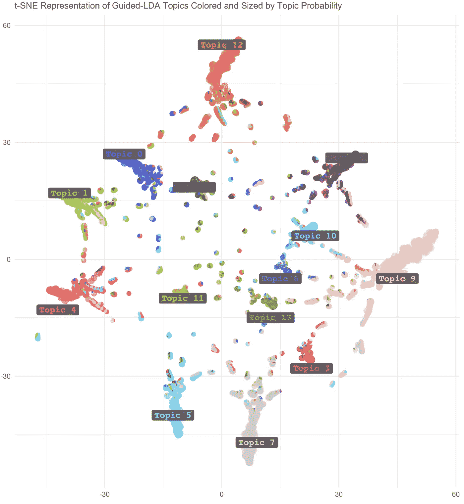
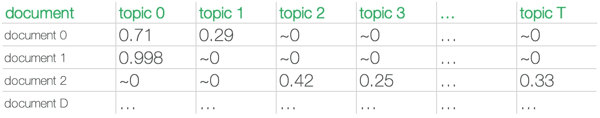
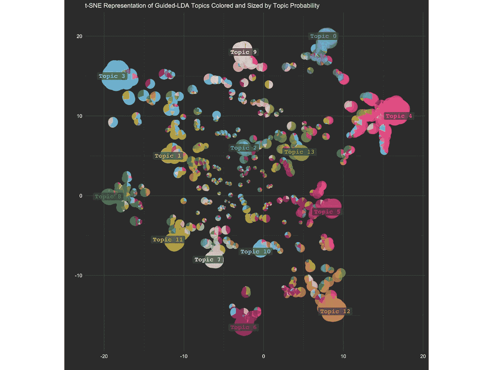
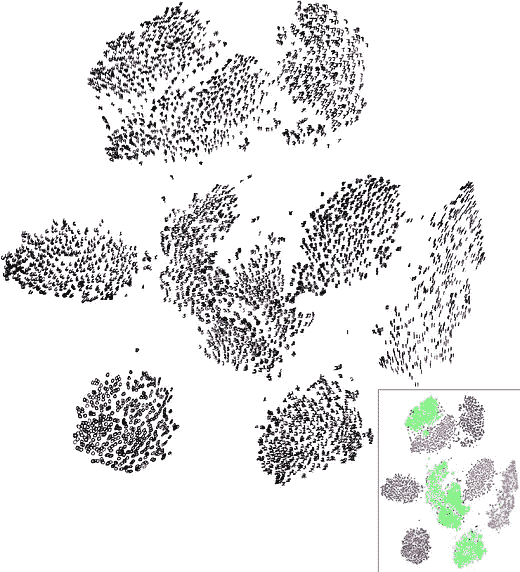
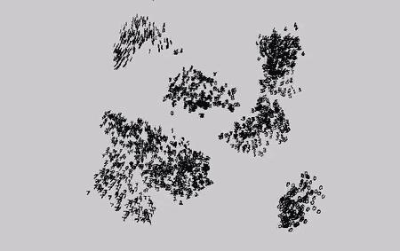
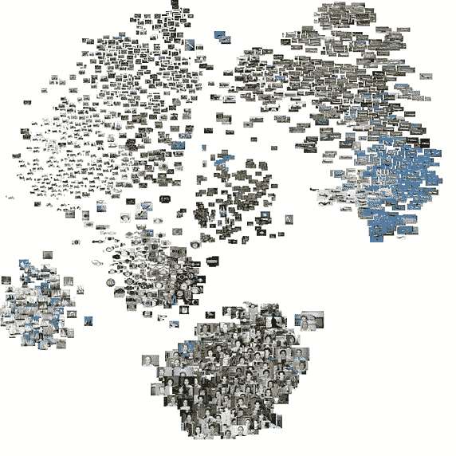

# 用散点图和 t-SNE 可视化主题模型

> 原文：<https://towardsdatascience.com/visualizing-topic-models-with-scatterpies-and-t-sne-f21f228f7b02?source=collection_archive---------12----------------------->



不管是好是坏，我们的语言还没有进化成乔治·奥威尔 1984 年的新话版本，有人知道吗？).但是如果英语类似于新话，我们的计算机理解大量文本数据会容易得多。当今自然语言处理(NLP)的挑战来自于这样一个事实，即自然语言天生是模糊的，不幸的是不精确的。

文本数据与图像和视频等格式一起属于非结构化数据。根据 [Dama](https://books.google.com/books?id=0-9lDwAAQBAJ&pg=PA241&lpg=PA241&dq=dama+international+unstructured+data+Any+document,+file,+graphic,+image,+text,+report,+form,+video,+or+sound+recording+that+has+not+been+tagged+or+otherwise+structured+into+rows+and+columns+or+records&source=bl&ots=tjVlGGZcl0&sig=ACfU3U1lQ4_8ZX6lLzG_YkHhI2KkIkI3vw&hl=en&sa=X&ved=2ahUKEwiSraarm_zkAhVQqZ4KHfP1CHYQ6AEwAHoECAkQAQ#v=onepage&q=dama%20international%20unstructured%20data%20Any%20document%2C%20file%2C%20graphic%2C%20image%2C%20text%2C%20report%2C%20form%2C%20video%2C%20or%20sound%20recording%20that%20has%20not%20been%20tagged%20or%20otherwise%20structured%20into%20rows%20and%20columns%20or%20records&f=false) 的说法，“非结构化数据在技术上是指任何没有被标记或以其他方式组织成行、列或记录的文档、文件、图形、图像、文本、报告、表格、视频或录音。”“非结构化”这个标签有点不公平，因为通常还是有一些结构的。图像分解成用 RGB 或黑/白数值表示的像素行。文本在文档中分解成句子、段落和/或章节，文档的集合形成语料库。

对于理解书面自然语言的计算机来说，它需要理解文本背后的符号结构。使用下面的一些自然语言处理技术可以让计算机对文本进行分类，并回答诸如主题是什么之类的问题。语气积极吗？主观？[读起来有多容易？](https://twitter.com/SienaDuplan/status/717420808759476224)

下面是一些我发现对揭示语料库背后的符号结构有用的自然语言处理技术:

*   主题建模(主题、聚类)
*   单词/短语频率(和“关键字搜索”)
*   文本可视化([单词树](https://www.jasondavies.com/wordtree/)，[单词云](https://www.jasondavies.com/wordcloud/)均由@Jason Davies 提供)
*   嵌入(例如 Word2Vec)
*   情感分析(正面/负面、主观/客观、情感标签)
*   文本相似性(例如“余弦相似性”)
*   TF-IDF(术语频率/逆文档频率)
*   词性标注

在这篇文章中，我将重点关注我用来理解文本的主要技术:主题建模，特别是使用[guide LDA](https://github.com/vi3k6i5/GuidedLDA)(一种增强的 LDA 模型，使用采样类似于半监督方法，而不是无监督方法)。**我在训练一个主题模型后遇到的一个困难是显示它的结果。**主题模型的输出是一个文档主题矩阵，形状为 *D x T* — *D* 行表示 *D* 文档，而 *T* 列表示 *T* 主题。单元格包含介于 0 和 1 之间的概率值，该值为每个文档分配属于每个主题的可能性。文档-主题矩阵中各行的总和应该总是等于 1。在最佳情况下，文档将很有可能被分类到单个主题中。对于更模糊的数据——每个文档可能谈论许多主题——模型应该在其讨论的主题中更均匀地分布概率。以下是 GuidedLDA 模型输出的文档主题矩阵的前几行示例:



Document 0 belongs to topic 0 with 71% probability and topic 1 with 29% probability. Document 1 belongs to topic 0 with almost 100% probability. And so on.

像上面这样的文档主题矩阵很容易变得非常庞大。除非结果被用来链接回单个文档，否则从整体上分析文档-主题-分布可能会变得混乱，尤其是当一个文档可能属于几个主题时。这就是我想用散点图和饼图的组合来可视化矩阵本身的地方:请看散点图！



Each bubble is a document. Bubbles are colored by topic probability and sized by #1 topic probability (argmax of each row/document in the document-topic matrix). Where there is a pie chart, the document belongs to multiple topics with varying probabilities. The scatterpie chart shows which topics tend to co-occur and how topics overlap with each other. Individual bubbles (documents) are pulled in the direction of the “center of mass” of another topic they may also belong to. Note: to simplify the chart, you may need to filter out documents with #1 topic probability less than some threshold. In this example, I removed documents with #1 topic probability < 0.3 to clean up the visualization.

但是不要这么快——你可能首先想知道我们是如何将主题简化成一个易于可视化的二维空间的。为此，我使用了 t-分布式随机邻居嵌入(或 t-SNE)。从 GuidedLDA 获取文档-主题矩阵输出，用 Python 运行:

```
from sklearn.manifold import TSNEtsne_model = TSNE(n_components=2, verbose=1, random_state=7, angle=.99, init=’pca’)# 13-D -> 2-D
tsne_lda = tsne_model.fit_transform(doc_topic) # doc_topic is document-topic matrix from LDA or GuidedLDA 
```

在将 t-SNE 数据的两个数组(使用`tsne_lda[:,0]`和`tsne_lda[:,1]`)连接到原始的文档-主题矩阵之后，我在矩阵中有两列可以用作散点图中的 X，Y 坐标。

对于情节本身，我切换到 R 和 ggplot2 包。下面代码片段中的 dataframe *data* 特定于我的示例，但是列名应该或多或少是不言自明的。 *x_tsne* 和 *y_tsne* 是 t-SNE 结果的前两个维度。 *row_id* 是每个文档的惟一值(就像整个文档主题表的主键)。 *x_1_topic_probability* 是文档-主题矩阵每一行中的#1 最大概率(即文档最有可能代表的主题)。 *topic_names_list* 是每个主题带有 *T* 标签的字符串列表。

```
library(ggplot2)
library(scatterpie)# high resolution tiff image
tiff(“scatterpie.png”, units=”in”, width=12, height=9, res=500)# plot
p <- ggplot() + 
 geom_scatterpie(aes(x=x_tsne, y=y_tsne, group=row_id, r=x_1_topic_probability), data=data, cols=topic_names_list, color=NA, alpha=0.7) + 
 coord_equal() + 
 geom_label(...) + 
 ggtitle(“Scatterpie Chart”) + 
 xlab(“”) + ylab(“”) + labs(subtitle=”t-SNE Representation of Guided-LDA Topics Colored and Sized by Topic Probability”) +
 scale_fill_manual(values=colors) + 
 theme_minimal() + 
 theme(text = element_text(color=”white”),
 legend.position = “none”,
 panel.background = element_rect(fill = “gray17”, colour = “gray17”), 
 plot.background = element_rect(fill = “gray17”),
 panel.grid.major = element_line(colour = “gray25”),
 panel.grid.minor = element_line(colour = “gray25”),
 axis.text = element_text(color=”white”)) # shut down graphics device
dev.off()
```

瞧，您已经有了构建主题模型输出的散点图表示的基本要素。将来，我想通过一个交互式的图(looking you， [d3.js](https://d3js.org/) )来进一步发展，在这个图中，将鼠标悬停在一个气泡上可以显示该文档的文本以及关于其分类的更多信息。

如果你对更酷的 t-SNE 例子感兴趣，我推荐你去看看劳伦斯·范·德·马腾的页面。



Left & middle: 2D & 3D t-SNE visualization of 6,000 digits from the [MNIST](https://en.wikipedia.org/wiki/MNIST_database) dataset. Right: t-SNE visualization of image data. [Source](https://lvdmaaten.github.io/tsne/)