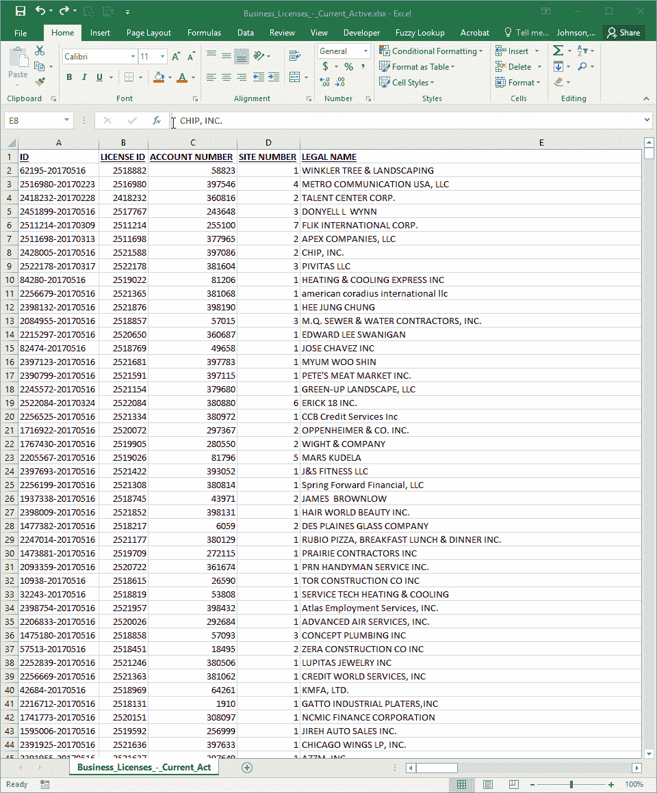
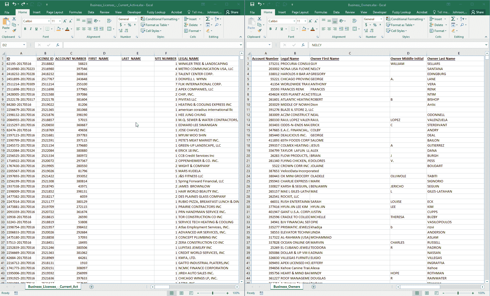
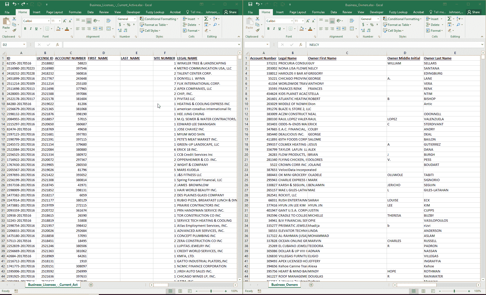
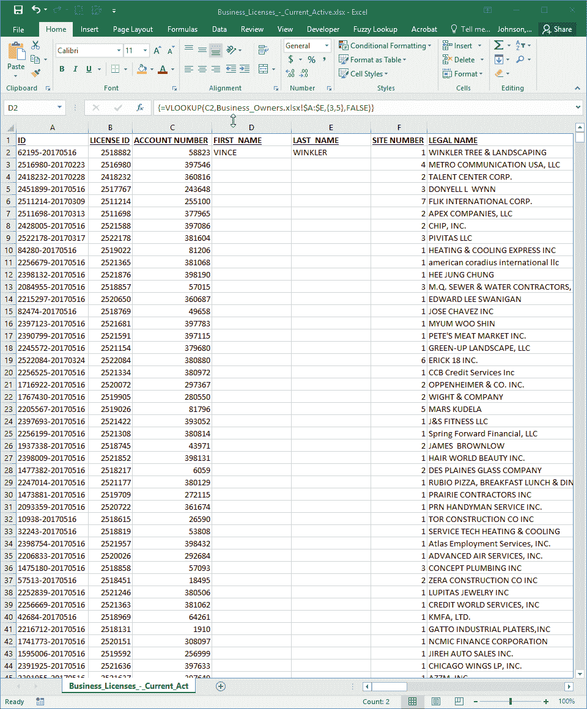

# VLOOKUP 和数组公式正在改变游戏规则

> 原文：<https://towardsdatascience.com/vlookup-and-array-formulas-are-changing-the-game-789e1b233c0d?source=collection_archive---------9----------------------->

Microsoft Excel 是现代工作场所中使用最广泛的工具之一，但也是使用最少的工具之一。我认为这应该改变，我认为应该从 VLOOKUP 开始。这就是为什么，我想花一点时间来谈谈使用 VLOOKUP 作为一个**数组公式**。

# 什么是数组公式？

数组公式是 Excel 的一项功能，允许您对多个值执行公式运算。这到底是什么意思？

好吧，假设我有两个数据集，我想连接在一起

*   [芝加哥市的所有营业执照](https://data.cityofchicago.org/Community-Economic-Development/Business-Licenses-Current-Active/uupf-x98q)
*   [芝加哥市的所有企业主](https://data.cityofchicago.org/Community-Economic-Development/Business-Owners/ezma-pppn/data)

**营业执照**文件有我需要的关于执照本身的所有数据，但是个人所有者的名字位于**企业所有者**文件中。我不想一页一页地翻来翻去看业主的名字，所以我想把业主的名字和姓氏拉到**营业执照**数据集中。为此，我将使用一个 VLOOKUP 数组公式来获取两个值，而不是一个值。

# 使用 VLOOKUP

为了将两个文件连接在一起，我需要在两个文件之间找到一个公共元素。幸运的是，我们可以在许可证和所有者文件中看到，我们有一个可以使用的帐号。

The account number is a common field between both files

# 设置

在许可证文件中，我将在**帐号**字段的右边创建两个新列。这些新列将保存我的名字和姓氏字段。

在 Excel 文件中，您可以通过右键单击并选择 insert 来创建一个新列，或者只需按 ALT+I，C

# 连接数据

现在我已经设置好了工作表，我将使用 VLOOKUP 作为数组公式从所有者文件中提取名字和姓氏数据。为了便于参考，我将两个文件并排打开。

首先，我在许可文件中选择单元格 D2 和 E2，作为我的第一行数据将要存放的位置。

Select the cells that you will be populating

接下来，我将开始输入我的 VLOOKUP 公式。

> *VLOOKUP 接受几个输入值*
> 
> 1.查找值
> 
> 2.表格数组
> 
> 3.列索引号
> 
> 4.范围查找

在这种情况下，我的查找值将是许可证文件中的账号或 C2。我的表数组将是所有者文件中的数据，从帐号列开始，一直到所有者姓氏列。我的列索引号将是名字和姓氏，或者是第 3 列和第 5 列。VLOOKUP 通常只接受一个值，但是因为我们使用的是数组公式，所以我们可以给它多个值，把它们放在括号中— {3，5}。只要我们有两个字段用于填充数据(D2 和 E2)，公式就会正确返回值。在这种情况下，它会将名字返回给 D2，将姓氏返回给 E2。

因为这是一个数组公式，所以我需要按 CTRL+SHIFT+enter，而不是在公式末尾按 ENTER。这将把我的整个公式用括号括起来，让 Excel 知道这是一个数组公式。

# 收尾工作

这样做之后，我可以将公式应用到电子表格的其余部分。最后，我复制所有内容并作为值粘贴，以便将数据完全复制到许可证文件中。

# 结论

Microsoft Excel 是一个多功能工具，当您不太需要完整的关系数据库设置时，它可以帮助您进行快速数据操作。

你在用 Excel 解决什么问题？Excel 的不足在哪里？我很乐意继续这个话题。如有任何反馈，请通过[推特](https://twitter.com/onlymattjohnson)联系我！