# 使用 GANs 进行语音翻译和音频风格转换

> 原文：<https://towardsdatascience.com/voice-translation-and-audio-style-transfer-with-gans-b63d58f61854?source=collection_archive---------3----------------------->

## 如何使用 Spectrograms 和 GANs 将爵士乐转换为古典音乐

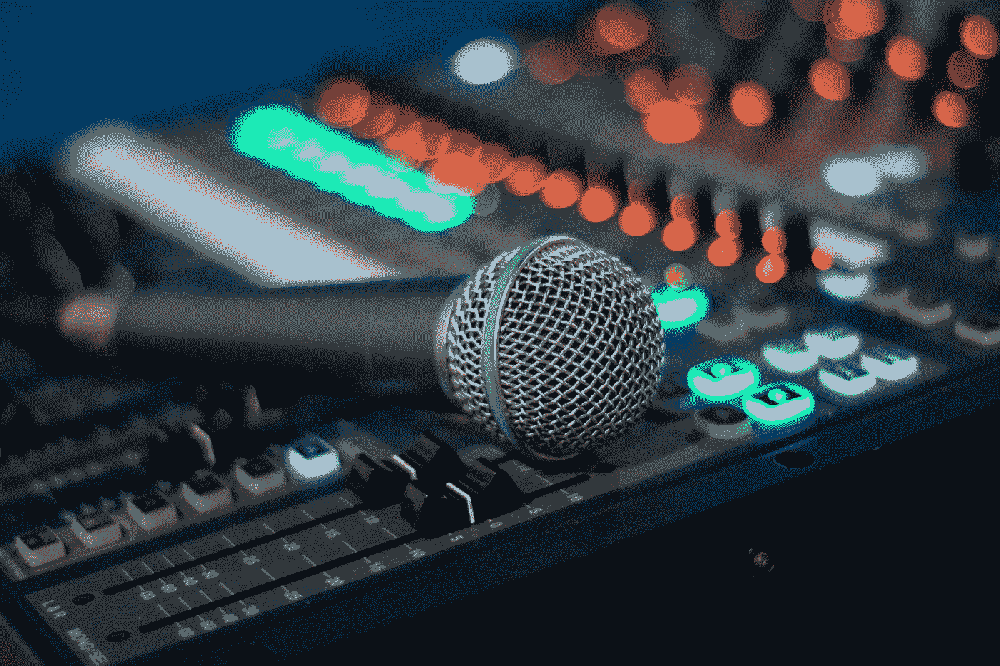

Photo by [Michael Maasen](https://unsplash.com/@mgmaasen?utm_source=medium&utm_medium=referral) on [Unsplash](https://unsplash.com?utm_source=medium&utm_medium=referral)

# 介绍

我们都听说过图像风格转移:从一幅名画中提取风格并将其应用到另一幅图像中，这是一项已经通过多种不同方法实现的任务。**生成对抗网络**(简称 GANs)也被用于图像生成、图像到图像的翻译等等。

Examples of image style transfer

但是声音呢？从表面上看，你可能会认为**音频与图像**完全不同，所有为图像相关任务探索的不同技术都不能应用于声音。但是，如果我们能找到一种方法将音频信号转换成类似图像的二维表示会怎么样呢？

事实上，是的，我们可以！这种声音表示就是我们所说的“**声谱图**”，它是允许我们利用专门设计的算法来处理音频相关任务的关键。

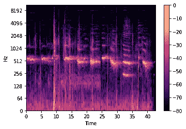

Spectrogram ([source](/getting-to-know-the-mel-spectrogram-31bca3e2d9d0))

# 光谱图

如果你是音频处理领域的新手，你可能不熟悉声谱图到底是什么。给定一个时域信号(一维)，我们希望获得一个**时频二维表示**。为了实现这一点，我们对音频信号应用具有特定长度窗口的短时**傅立叶变换** (STFT)，仅考虑结果的平方幅度。

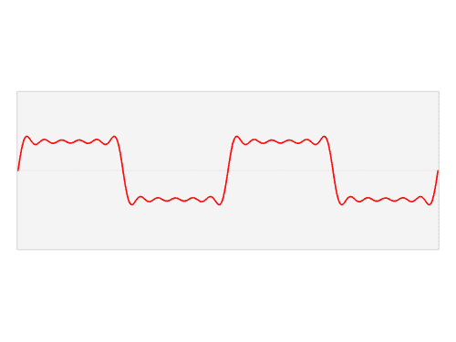

Incredible illustration of how Time and Frequency correlate from the [MelNet paper page](https://sjvasquez.github.io/blog/melnet/)

更简单地说，我们将原始**波形**信号分成相互重叠的块，提取块中**频率**的幅度(通过傅立叶变换)，每个结果向量将代表我们最终频谱图的一列。谱图的 x 轴代表**时间**，y 轴代表**频率**。

为了让这些频谱图对我们的任务更有用，我们将每个“像素”(或量值)转换成分贝标度**，取每个值的对数。最后，我们应用 mel 滤波器组，将光谱图转换为 **mel 标度**，得到所谓的 **mel 光谱图**。**

**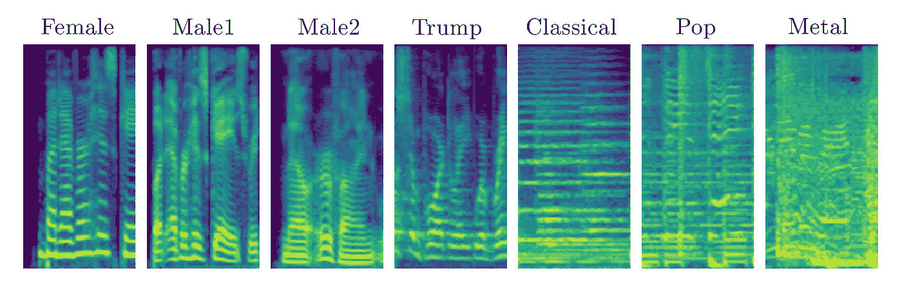**

**Examples of mel-spectrograms with log-amplitude**

**这让我们能够让声谱图表现方式**对我们人类对声音的理解**更加敏感，突出我们人类更容易听到的振幅和频率。**

**同样非常重要的是要注意，频谱图可以被**转换回**成“可听见的”**波形**数据:这不会是一个**完美的重建**(相位信息在我们的幅度频谱图中丢失了)，但是由于一种叫做 **Griffin-Lim** 的算法，我们能够近似相位并且**重现**真实的声音音频。**

# **我们的任务**

**现在我们知道了如何用图像来表示声音，让我们来玩一玩。**

**在这篇文章中，我将解释如何构建和训练一个能够执行**语音转换**和任何其他类型的**音频风格转换**(例如将一种音乐风格转换为另一种)的系统。该方法在很大程度上受到最近使用生成式对抗网络进行图像到图像翻译的研究的启发，主要区别在于将所有这些技术应用于音频数据。作为一个额外的功能，我们将能够翻译任意长度的样本，这在 GAN 系统中并不常见。**

**为了让你对将要学习的内容有一点兴奋，这里有一个**演示视频**，展示了我们用这种方法可以达到的效果。**

**在演示视频中，你可以听不同的**语音翻译**示例以及一些**音乐流派转换**，特别是从爵士乐到古典音乐的转换。听起来很不错，不是吗？**

# **选择架构**

**计算机视觉领域有许多不同的架构用于图像到图像的翻译，这是我们希望通过音频(比如说语音)的**频谱图表示**来实现的任务。**

**图像到图像的转换在于**将图像**从域 A(例如猫的图片)转换到不同的域 B(狗的图片)，同时**保持来自原始图片(猫的表情和姿势)的内容信息**。我们的任务实际上是**相同的**:我们希望从说话者 A 翻译到说话者 B，同时保持来自说话者 A 的相同的**语言信息**(生成的语音应该包含与来自说话者 A 的原始语音相同的**单词**)。**

**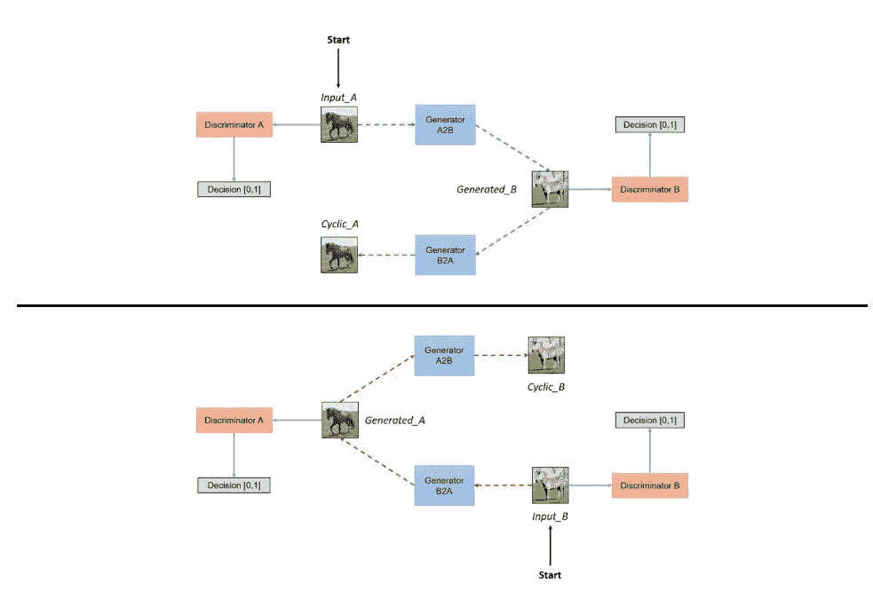**

**CycleGAN architecture**

**为这个目标打造的**最著名的** GAN 架构可能是 **CycleGAN** ，于 2017 年推出，此后被广泛使用。虽然 CycleGAN 在**相似领域**(相似的形状和背景)之间的翻译非常成功，比如从马到斑马，或者从苹果到橙子，但当涉及非常不同的领域时，比如从鱼到鸟，或者从苹果到胡萝卜，它就显得力不从心了。**

**这个**缺点**的原因是 CycleGAN 严重依赖于**像素损失**的事实，或者换句话说，它的损失倾向于最小化真实和生成图像的像素值的差异:直觉上，当将一个对象(例如苹果)的图像转换到一个实质上不同的域(胡萝卜)时，我们需要改变原始对象的**主要形状**，在这种情况下 **CycleGAN 不能帮助我们**。**

**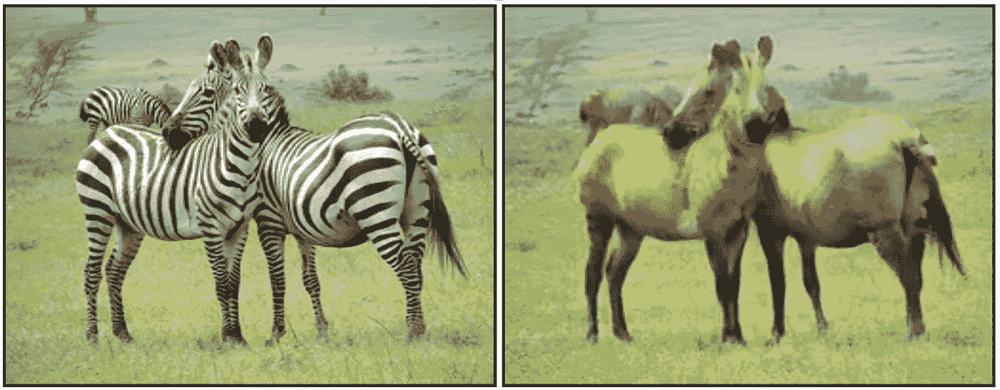**

**CycleGAN translation example. (Zebra to Horse)**

**不同人的演讲的频谱图(或不同流派的音乐作品的频谱图)在视觉上可能彼此非常不同:因此我们需要找到一种更通用的方法来解决这个问题，一种不涉及被视觉上相似的领域之间的翻译所约束的方法。**

****

**Spectrograms of different speakers or different music genres can be very visually different**

# **TraVeLGAN:我们的解决方案**

**最初在这里介绍的 **TraVeLGAN** (变换向量学习 GAN)旨在解决我们的问题。**

**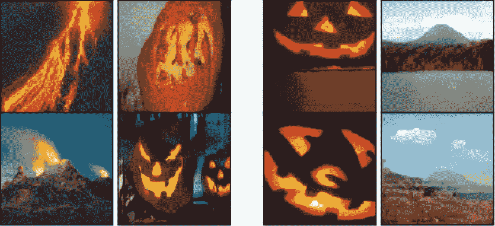**

**Examples of TraVeLGAN image-to-image translations with very different domains**

**除了生成器和鉴别器(或评论家)，TraVeLGAN 还引入了一个**暹罗网络**(一个将图像编码为潜在向量的网络)以允许在**实质上不同的域**之间进行翻译，从而保持原始样本和转换样本之间的内容关系。**

**让我们了解一下 TraVeLGAN 到底是如何工作的。**

****

**TraVeLGAN architecture**

**我们的目标是找到一种方法来保持原始样本和生成样本之间的关系，而不依赖于像素损失(如 CycleGAN 中的循环一致性约束)，这将限制视觉上相似的域之间的转换。因此，如果我们**将**图像(或光谱图)编码成**向量**，这些向量在**组织的潜在空间**中捕获它们的内容信息，我们就能够保持这些向量之间的关系，而不是整个图像。**

**这正是一个**暹罗**网络让我们实现的目标。最初用于人脸识别的任务，暹罗网络将一幅**图像作为输入**，而**输出一个长度为 *vec_len 的单一向量***。使用损失函数指定矢量空间中哪些图像**编码应该靠近**(例如同一张脸的图像)以及哪些应该远离**(不同脸的图像)我们能够**组织潜在空间**并使其对我们的目标有用。****

****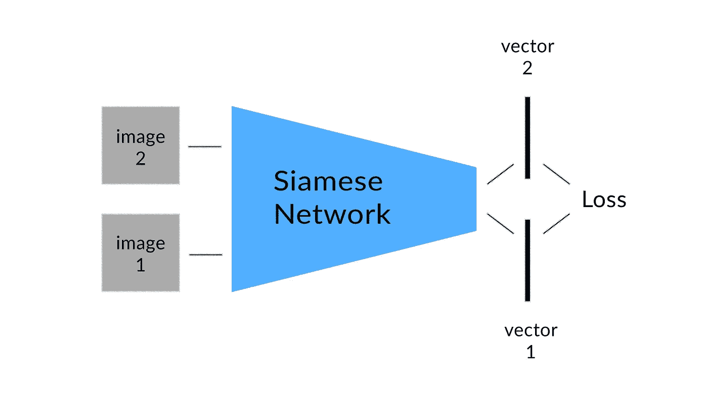****

****The Siamese network encodes images into vectors****

****更具体地说，我们的目标是保持编码对之间的**变换向量** **相等:这似乎是一个非常难以理解的概念，但实际上是非常容易理解的**。********

****以 *G(X)* 为平移图像 *X* (生成器的输出) *S(X)* 为矢量编码的 *X* 和 *A1、A2* 两幅图像来自源域 *A* ，网络必须对矢量进行编码，如:****

*******(S(A1)-S(A2))=*(*S(G(A1)-S(G(A2)))*******

****这样，连接一对源图像编码的变换向量**必须等于**由生成器转换的同一对之间的变换向量。****

****这允许**在翻译中保留语义信息**(不同于使用其循环一致性约束保留更多几何内容信息的 CycleGAN)，允许约束不同域的图像之间的**更多“抽象”关系**。****

****形式上，为了在翻译中保留内容信息，我们将**最小化两个变换向量之间的欧几里德距离和余弦相似度**，以便向量的**角度**和**幅度**都得到保留。****

****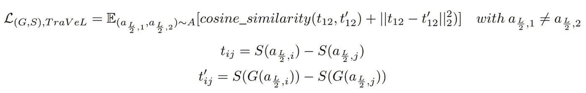****

****Formal TraVeL loss****

****此外，重要的是澄清**发电机**和**连体**网络**必须配合**来实现这一目标。更具体地说，行程损耗的梯度从到**反向传播到两个网络**，并且它们的权重相应地更新。因此，当鉴别者和发生者有一个**对立的目标**(他们互相挑战以达到他们的目标)时，暹罗人和发生者**互相帮助**，在相同的规则下合作。****

****除了这种“内容”损失之外，由于传统的**对抗性损失**(在我的实验中，我使用了铰链损失)，生成器将学习如何生成逼真的样本。****

****如果你是 GANs 及其工作方式的新手，或者如果你想**更深入一点**如何用潜在空间保存内容信息，我推荐你**查看** [**我的文章**这里](/a-new-way-to-look-at-gans-7c6b6e6e9737)讲述如何在一个简单的图像到图像的翻译任务中应用相同的技术。****

# ****翻译任意长度的音频信号****

****既然我们已经探索了一种允许我们在翻译中保留内容信息的方法，我们需要理解如何让生成器转换任意长的样本，而不增加额外的计算和训练时间。****

****假设我们有一个音频信号:“提取”该信号的 mel 谱图，我们获得一个具有单通道的**图像(不同于传统的 3 通道 RGB 图像)，该图像具有**确定的高度***(这取决于用于 STFT 的跳数大小)和**宽度***×25**取决于音频样本的原始长度**。********

***然而，众所周知，处理具有**可变尺寸**的图像是一项具有**挑战性的**任务，尤其是如果我们事先没有决定这些尺寸的话。这就是为什么我们将**分割**所有光谱图(形状 *XxH* 与 *X* 不同)成**块**与**确定宽度**，让我们说 *L* 。完美！我们的数据集现在由具有**已知尺寸** ( *LxH* )的源和目标光谱图组成，我们已经准备好进行下一步。***

******

***Each spectrogram in the dataset has a fixed height H and width L***

***在创建我们的生成器 *G* 之前，我们需要指定其输入的**尺寸，在我们的例子中是 *(L/2)xH* 。换句话说，G 将接受我们数据集中宽度为一半的光谱图。为什么？因为这样我们就能让 G 翻译我们之前拆分的**整个** *XxH* **光谱图**。让我们来看看是如何做到的。*****

***我们的**培训管道**将包括以下行动:***

1.  *****将**源 *LxH* 谱图**分成两半**，得到 *(L/2)xH* 谱图***
2.  *****将两半对**送入发电机，并将**平移的两对**作为输出***
3.  *****将平移的两半**连接回它们的**原始形状** ( *LxH* )***
4.  *****将**经**翻译的**和**目标**和 *LxH* 光谱图送入鉴别器，使**区分**和**对抗训练**。***

***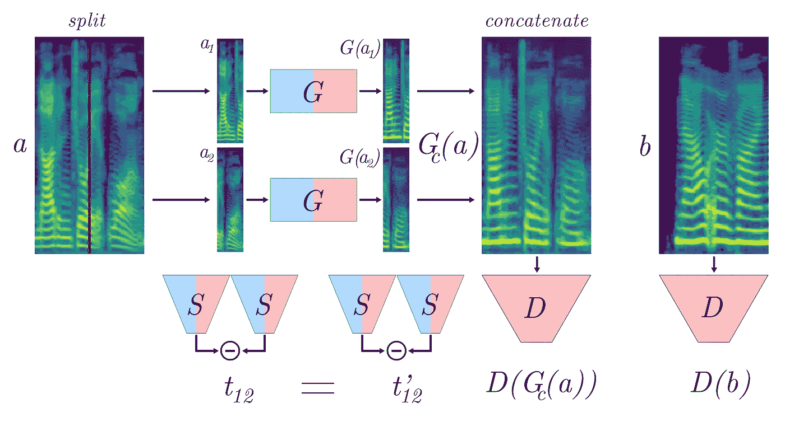***

***Illustration of the training pipeline: splitting, converting and concatenating.***

***使鉴别器检查**连接的“假”光谱图**和**，将**与**“真实”**目标光谱图进行比较，迫使发生器生成样本，当**连接在一起时，产生**真实**光谱图。*****

***换句话说，转换后的 *(L/2)xH* 样本不得在边缘上出现任何**不连续**，这将使它们**在鉴别器看来不真实**。因此，发生器上这个重要的**约束**允许我们将任意长度的音频信号从一个域转换到另一个域。***

***训练后，当想要**翻译**一个任意形状的声谱图 *XxH* 其中 *X* **变化**并由原始音频信号的长度给出时，这是我们需要做的:***

1.  *****将 *XxH* 谱图分割成 *(L/2)xH* 块，如果 *X* 不能被 *L/2* 整除，则使用填充*****
2.  *****将**每个 *(L/2)xH* 样本送入发生器进行翻译***
3.  *****连接**转换后的样本为原始 *XxH* 形状，如果使用了填充，则剪切掉多余的部分。***

***在用 Griffin-Lim 算法将其变回**波形**之后，最终翻译的样本不应**呈现** **不连续**，而应呈现**与目标域(特定的语音或音乐流派)相同的风格**。很简单，不是吗？***

***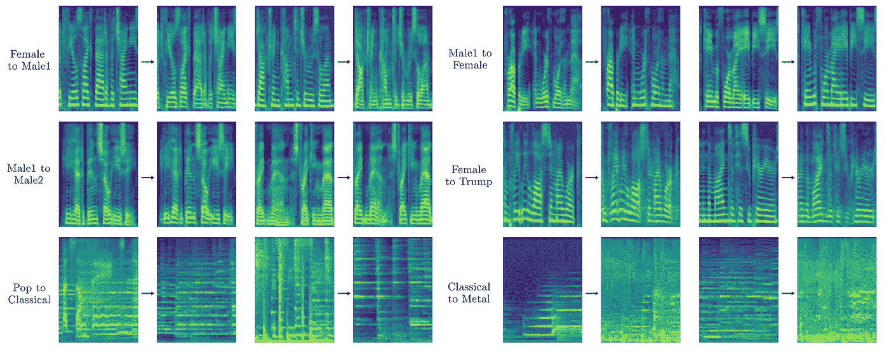***

***Examples of source and converted spectrograms: the concatenated samples do not present discontinuities***

# ***把所有东西放在一起***

***我们之前已经学习了如何**保存来自源音频样本的内容**(在语音的情况下，它将是一些**言语信息**，在音乐的情况下，它将是一首歌曲的特定**旋律**，而没有在**视觉上相似的域**之间进行转换的约束(不同声音或音乐流派的频谱图在视觉上可能极其**不同**)以及允许我们转换任意长度的样本的简单而有效的技术***

*****现在终于是时候把所有的事情整合在一起了。*****

*****这是我论文中的一段**摘录**，介绍了这项技术:*****

**********

*****Putting everything together: the siamese network helps preserve content keeping vector arithmetic between source and converted samples*****

> *****梅尔根-VC 训练程序。我们分离频谱样本，将它们馈送到发生器 G，将它们连接在一起，并将结果样本馈送到鉴别器 D，以允许无差异地翻译任意长度的样本。我们在传统的生成器-鉴别器 GAN 架构中添加了一个连体网络 S，以在潜在空间中保留矢量算法，从而在翻译中对低级内容进行约束。在还需要保存高级信息(在语音翻译的情况下是语言信息)的任务中添加了可选的身份映射约束。*****

*****此外，我们必须为暹罗网络增加一个**边际损失**，以避免它从**退化为学习一个**平凡函数**来满足它的目标。边际损失使得 S 产生的所有向量彼此远离，因此网络不能将相同的精确向量与每个输入相关联，并且必须**学习有意义的关系**创建有用的潜在空间。*******

***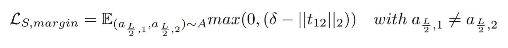***

***where delta is a fixed value and t is the transformation vector***

***最后，下面是用于训练三个网络的**形式损失**:***

***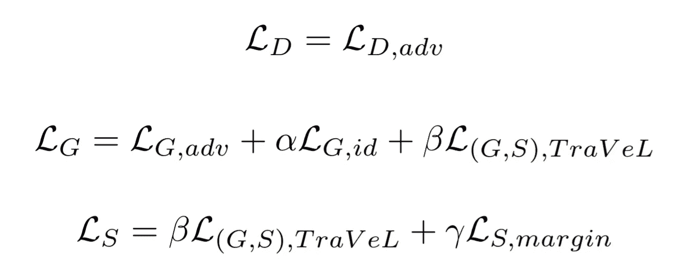***

***Final losses for generator G, discriminator D, siamese network S***

***值得注意的是，添加的**身份约束**(来自目标域的样本和由生成器翻译的那些相同样本之间的均方误差)仅在**语音翻译**的情况下有用，其中语言信息必须被保留，并且其中我们的**内容丢失**(基于暹罗网络的向量输出)**努力**捕获那些**高级别**信息。***

***如果你在寻找关于这种特殊技术的更多信息，或者如果你更喜欢一个更**正式和系统的解释，我推荐并邀请你阅读我的全文。*****

# ***结论***

***今天，我们已经学习了如何使用深度卷积神经网络架构和一些**技巧和技术**来执行**语音翻译**和**音频风格转换**(如音乐流派转换)，以实现对任意长度音频样本的**逼真的**翻译。***

***我们现在知道，我们能够**利用**大部分**最近关于深度学习的研究**用于**计算机视觉**应用，也解决与**音频信号**相关的任务，这要归功于图像等效频谱图表示。***

***最后，我想以承认这样一个事实来结束我的发言，即**可能会为了**恶意目的**而误用**这种和其他技术，尤其是在**语音翻译**的情况下。随着强大的机器学习方法**的兴起**来创建**真实的虚假数据**我们在探索和使用这种算法时都应该非常**警觉和谨慎**:虽然**研究不会停止也不应该停止**，我们也应该分配资源并研究如何**检测我们帮助创建的虚假数据**。***

***非常感谢**您宝贵的关注**，玩得开心！***

***另外，如果您对 GAN 和 GAN 相关的**现成想法**和应用感兴趣，您也应该**查看**:***

***[***一年来我训练甘斯的 10 个教训***](/10-lessons-i-learned-training-generative-adversarial-networks-gans-for-a-year-c9071159628)**(如果你对帮助你完成超级挑战任务的技巧和窍门感兴趣，那就是训练甘斯)*****

****[***在高清图像上使用 GANs 进行风格转换***](/style-transfer-with-gans-on-hd-images-88e8efcf3716)**(我使用了类似的技术，允许使用很少的计算资源进行大图像的风格转换)******

****[***以新的方式看待甘斯***](/a-new-way-to-look-at-gans-7c6b6e6e9737)**(我在这里详细探讨了潜在空间是如何工作的，以及它如何被用于图像到图像的翻译任务)******

****[***用生成式对抗网络合成音频***](/synthesizing-audio-with-generative-adversarial-networks-8e0308184edd)**(在这里我研究了一篇论文，该论文提出使用卷积 gan 来使用原始波形数据和一维卷积生成音频)******