# Voronoi 方法:分区学校系统提案

> 原文：<https://towardsdatascience.com/voronoi-method-zoning-school-system-proposal-8ea333e9ece1?source=collection_archive---------36----------------------->

source : [unplash.com](https://unsplash.com/photos/J17gyn1adEM)

也许现在讨论这件事有点太晚了。因为分区学校系统现在不是一件事，但在 2019 年 5 月和 6 月左右，它在印度尼西亚是一件大事。

印度尼西亚有一个新的规则(紧接着是另一个规则)来创建类似“分区系统”的东西，未来的学生不能选择他们区域之外的下一级学校。然而，老实说，我真的不太明白这个规则。所以，这里有一篇巴哈萨语的文章，是关于这条规则以及政府颁布这条规则的原因。

 [## 2019 年 PPDB 赛区系统。身份证明

### tirto.id -巴鲁(PPDB) 2019 年奥运会将于 2019 年举行。

tirto.id](https://tirto.id/memahami-sistem-zonasi-sekolah-di-ppdb-2019-ecEz)  [## 9 点，2019 年 PPDB 地区系统会议召开

### kompas . com ----教育和科学部(Mendikbud)的多名官员有效地提出了几项建议……

edukasi.kompas.com](https://edukasi.kompas.com/read/2019/06/20/11111981/9-poin-buka-bukaan-mendikbud-soal-sistem-zonasi-dan-ppdb-2019?page=all) 

那里的所有规则都产生了许多来自公众的病毒式负面反馈，如下所示:

1.  一些学生不能上学，因为他们只能选择一所已经满员的学校(半径规则)。
2.  有些学校招不到足够的学生，因为他们所在的地区不够密集。
3.  区域间质量不平衡。

[点击这里](https://www.kompasiana.com/muhamad27970/5d0257d43ba7f74e4e772572/dilema-zona-2-ppdb-online-sistem-yang-kurang-berkeadilan?page=all)了解问题的细节。

我不会谈论这些规则，以及这些规则如何对印度尼西亚未来的学生产生重大影响。此外，我不会责怪规则本身，因为我不知道印度尼西亚政府是如何制定这条规则的。然而，在这篇博客中，我想提出某种方法来解决这个“分区问题”，这种方法*可能*可以将负面影响降至最低。我将展示我是如何做分析的，并以方法结束。

# 定义问题

每一个分析都必须从问题定义开始，以北极星作为真正的目标。在这个博客中，我的目标是做一个分区学校系统，将上述第一个负面影响降到最低。我将问题限制在最小化第一个问题，因为我只有有限的数据可以处理。第二个问题也许可以用密度人口数据解决，同时，第三个问题应该用所有学校的标准化质量。

因此，基于我的目标，我的问题陈述是

*“如何创建分区学校系统，让未来的学生至少有 3 所学校可以选择？”*

# 数据收集

有了问题陈述之后，接下来要做的就是获取适合问题的数据。我需要印度尼西亚所有学校的经度和纬度位置，这样我就可以定义这个区域。我从这个[来源](http://dapo.dikdasmen.kemdikbud.go.id/sp)获得数据，我认为这个来源对任何人都是开放的(至少在印度尼西亚)。所以，我抓取了所有列出的可能的学校及其信息。

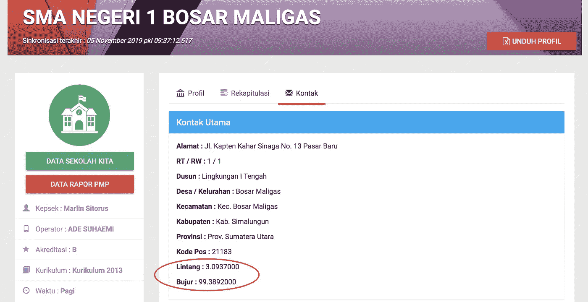

Get the Longitude and Latitude

我花了大约两天的时间获得正确的数据，我得到了大约 200，000 所各级学校的数据:小学(SD)，初中(SMP)和高中(SMA/SMK)。我不确定数据的质量，但当我试图从网站上绘制所有的经度和纬度时，结果如下。

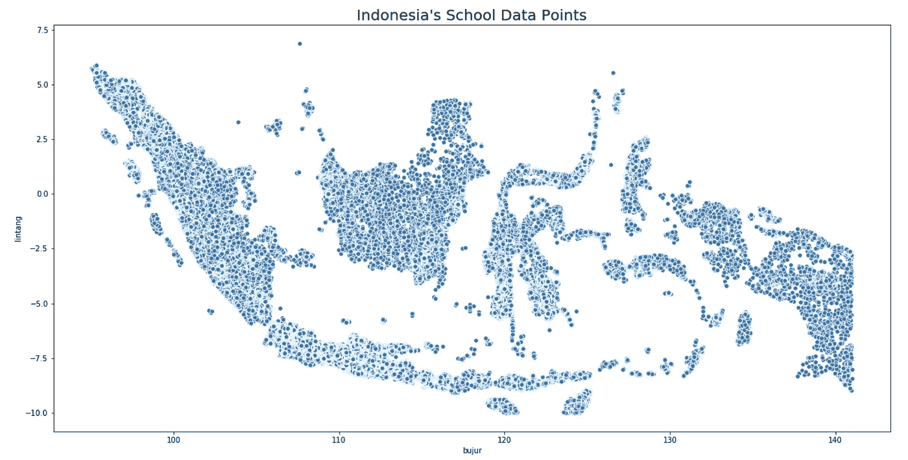

Probably All School Location in Indonesia

它显示了印度尼西亚的地图，因此该图可以确认数据的质量足够好。为了与真实地图进行对比，我用 python 从这个[源](https://gadm.org/download_country_v3.html)中读取了印尼城市层面地图的 shapefile。

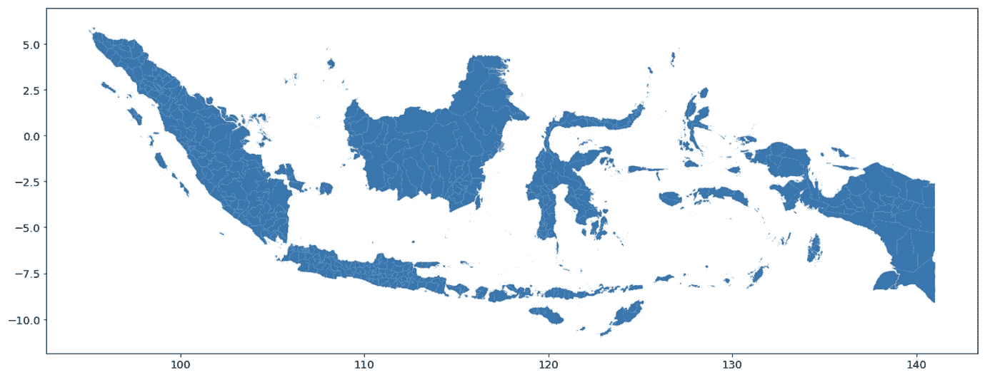

Indonesia’s Map

即使有几乎相同的形状，在检查数据后，几乎有 2%的点不完全在城市多边形内。面外的点将从方法分析中移除。这是一个来自“泗水”的例子，它有多边形外的点(红点)。

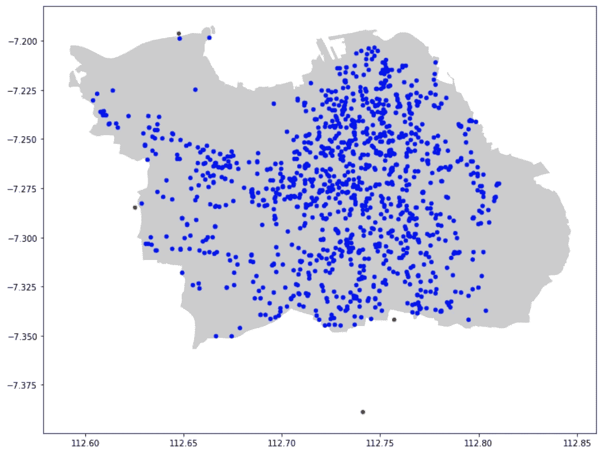

Surabaya All School Location’s

为了进行简单的探索，这是印度尼西亚每个城市在网站上正式注册的学校总数的热图。红色区域是一个缺失值，因为 shapefile 和报废数据的命名约定不同。地图显示爪哇岛(南面黄色的大岛)比其他岛屿发展了更多的学校。此外，除了爪哇岛， ***学校的数量在空间上不相关*** 。例如苏门答腊岛(西边的大岛)，它有一个被绿色区域包围的黄色区域。

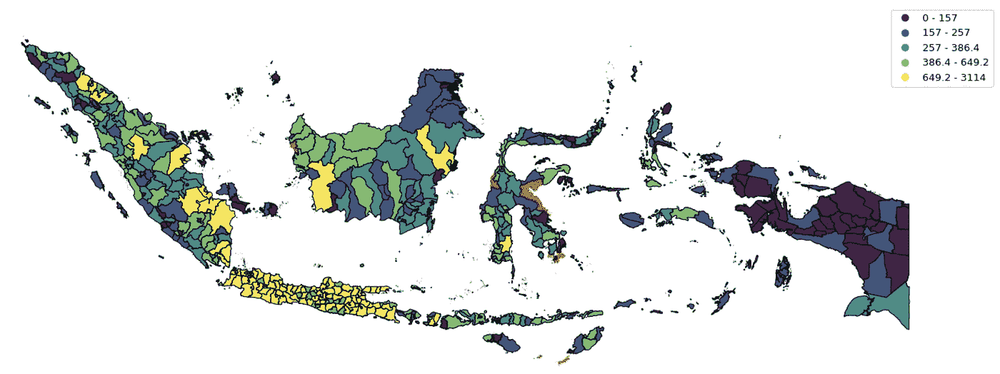

Total School in Every City of Indonesia

# Radius 主体概述

在提出这种方法之前，让我们看一下使用半径原则的分区系统。方法并不复杂，*未来学生学校区*就在离家 *X* 公里的半径范围内。

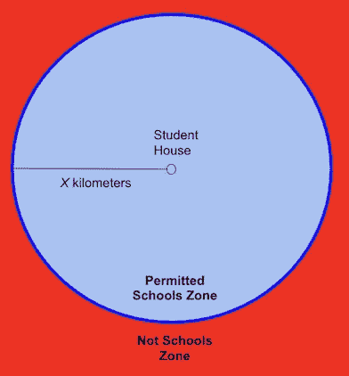

Radius Principal

所以，学生不能选择离他们家很远的学校(红色区域)。如果保证在这个区域内有学校，这个校长可能会工作。让我们使用印度尼西亚学校位置数据来模拟这种方法。

模拟很容易，只需在一个特定城市的多边形上选取许多随机点，并对学校的不同半径进行迭代(从学校点改变半径比随机点更容易，结果是一样的)。随机点被假设为学生住宅，如果城市足够密集，这个假设可以实现。因为我们不希望随机点最终出现在森林中间或废弃的湖中。因此，基于某些参考资料，模拟在 *DKI 雅加达、哥打泗水、哥打棉兰、哥打万隆、哥打望加锡和哥打巨港*进行。需要注意的是，**的模拟只使用**位置的高中(SMA)数据。

这是*泗水*上的模拟例子，颜色显示了特定半径内每个随机点将获得的学校选择数量。红点是泗水的 SMA 位置。

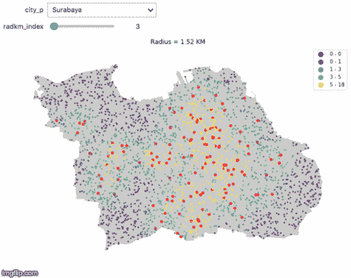

对总体密集城市的模拟表明，对于不同的地区，所有学生获得最少 3 所学校选择的概率是不同的。下图显示了在许多不同的城市(用颜色区分)中，学生从他们家(x 轴)的一定半径范围内获得至少 3 个学校选项(y 轴)的概率(百分比)。因此，预计 x 轴越高，直线越接近 100。

该图描述了即使半径为 *X=* 4 公里，仍有某个区域像*巨港*一样，其概率低于 80%。就算是一个叫*万隆巴拉特*的城市，半径 *X* =5 公里也达不到 60%。

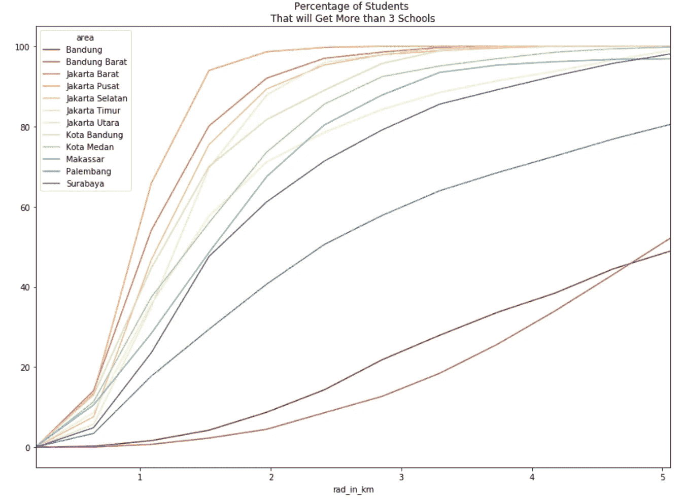

这意味着学生需要至少行驶 5 公里才能获得至少 3 个学校选择的概率为 60%,以获得*万隆巴拉特的所有学校。*而且，这里的半径采用欧几里德距离，所以现实生活中的真实距离可能比 5 公里更远。

总之，半径原则更适合用于人口密度高的城市。但是，如果必须对不同密度的所有城市实施这些方法，那么 ***半径距离应该对不同的区域有所不同*** 取决于人口密度。甚至可以将城市划分成某些更小的区域，并对这些区域采用不同的半径。不仅如此，发展新学校对于那些学校数量很少的地区也是必要的。因此，学生将有不同的学校选择，他们不应该把时间花在路上。

# 提议的方法

分区系统真的很有挑战性，尤其是像印度尼西亚这样全是小岛的地区。上述半径原则缺乏多样性，需要更多的探索来确定正确城市的正确半径。如果学生来自不同的岛屿，比如望加锡，这也是一个不利因素。如果到最近学校的岛距大于半径，那么那个岛上所有学生到校的可能性几乎为零。

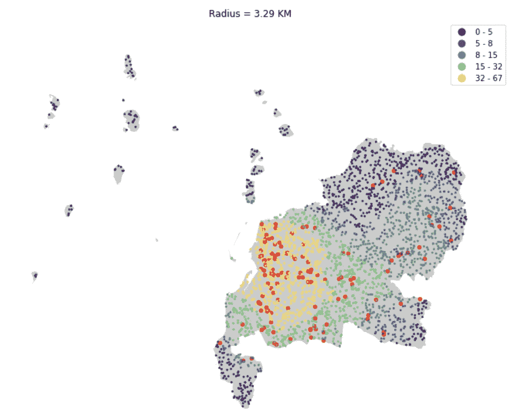

Makassar has many smalls island

因此，提出了一种称为 Voronoi 的新方法来最小化确定半径的耗时探索。Voronoi 是一种将平面分割成靠近给定对象集合中每个对象的区域的方法。假设我们有一个平面，平面上有一些点，Voronoi 的目标是创建每个区域都比其他点更靠近某个特定点的区域。

Voronoi diagram example ([source](https://thatsmaths.com/2017/02/02/voronoi-diagrams-simple-but-powerful/))

假设我们有一张地图和所有学校的位置，Voronoi 将自动为每所学校创建区域，这样该区域中的每个学生都比其他学校更靠近该学校。然而，这意味着如果他们必须进入最近的学校，每个学生只有**一个学校选项**可以选择。因此，学校集群被提议创建一个更大的区域，在那里学生可以有 3 个学校的最低选择。现在，我提出了 [KMeans](/understanding-k-means-clustering-in-machine-learning-6a6e67336aa1) 来对每个城市的学校进行聚类(最好使用 HDBSCAN 作为将来的参考)，这导致了另一个选择聚类数的问题。在这种情况下，可以使用[轮廓分数](https://medium.com/@jyotiyadav99111/selecting-optimal-number-of-clusters-in-kmeans-algorithm-silhouette-score-c0d9ebb11308)来评估集群编号，其中我们将选择具有最高分数的集群编号。必须记住的是 ***这里所有的学校都被假定为具有相同的质量*** 以防止来自所有不良学校的群集。

总之，这是所提出方法的算法

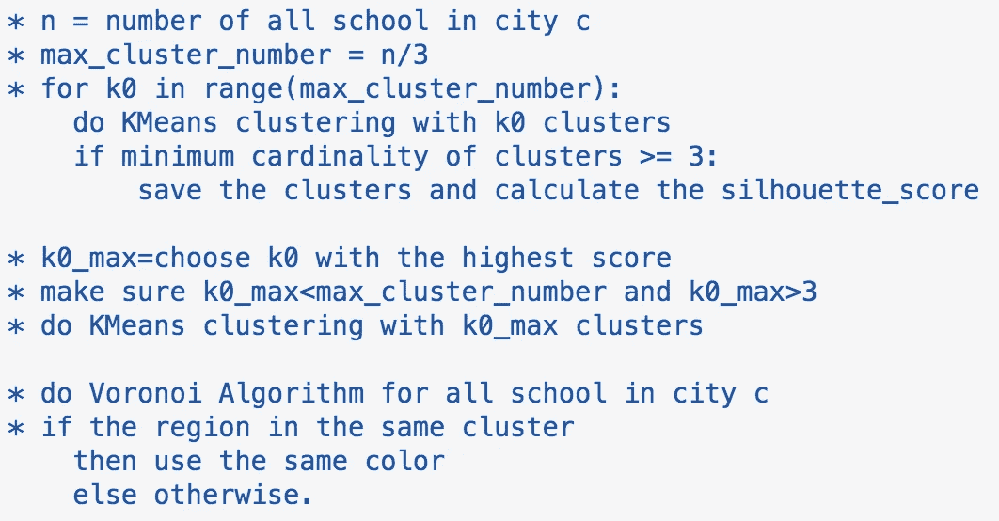

Pseudocode of the Algorithm

这是*望加锡*和*万隆巴拉特的算法结果。*

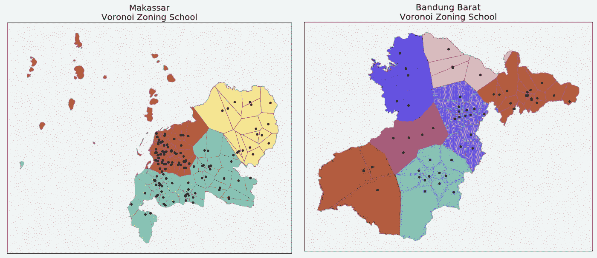

Senior High School (SMA) Proposed Zoning System

Voronoi 方法将确保城市中的每个学生至少有 3 个选择学校，它解决了以前万隆巴拉特的“60%问题”。Voronoi 也帮助远岛上的学生有机会上学。

然而，对于一些区域，如万隆巴拉特的棕色区域(左下方)，平均而言， ***学生必须旅行相当长的时间，*** 因为该区域相当大，只有 3 所学校可供选择。这可能表明 Voronoi 方法将不会解决“该区域中所有学校已经满员”的问题。这个问题也出现在绿色区域的*巨港*和紫色区域的*泗水*(左上)。

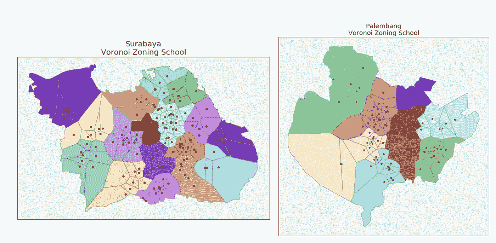

Surabaya and Palembang Proposed Zoning School for SMA

# 结论和建议

分区制度的建立是为了实现教育质量的平等，这样就不会有高等或低等的教育区域。即使有良好的意图，糟糕的分区系统和不规范的学校质量将使教育系统看起来很糟糕，并减少许多学生进入学校的权利。

**如模拟所示，对于印度尼西亚，在相同的半径下，学生获得至少 3 所学校选项的概率是不同的。在雅加达*和巨港*两公里半径范围内，这种可能性几乎达到 100%,但在同样的半径范围内，这种可能性在巨港*大约为 50%。*由此可见，半径距离对于不同的区域应该是不同的。**

***带 KMeans 聚类的 Voronoi 图*** 是另一种比半径原理更好的方法，可以覆盖半径问题。Voronoi 图可以为每个学校创建一个最佳区域，这样就不会有学校选项超过 3 个的区域。然而，如果一所学校覆盖了一个很大的区域，就会出现问题，因为附近的学校数量很少。

因此，要想取得更优的解决方案，这里可以做一些动作

1.  在沃罗诺伊地区的学校周围建造更多的学校。或者扩展具有大 Voronoi 区域的学校。
2.  对学校质量多做分析，给印尼所有城市做一个标准质量。这里在设施、教师数量和班级方面的质量。因此，我们可以使用群集进行分区，其中群集间的总体质量是相同的。
3.  此外，对于短期解决方案，增加学生的公共交通，使他们能够到达遥远的学校，而不是通过半径原则限制他们的选择。

# **参考**

 [## alam hanz/教育区

### 它始于印度尼西亚政府的新 Zonasi 规则，这似乎对某些人不公平(基于病毒式新闻)。这个…

github.com](https://github.com/alamhanz/education_zone/tree/master)  [## Voronoi 图实验室

### 除了直接读入 CSV 文件。Pandas 内置了一个读取 JSON 文件的函数。本节…

comet.lehman.cuny.edu](http://comet.lehman.cuny.edu/owen/teaching/datasci/voronoiLab.html)