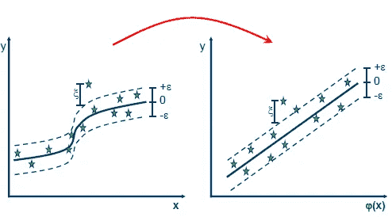

# 通过支持向量回归和 LSTMs 进行股票价格预测

> 原文：<https://towardsdatascience.com/walking-through-support-vector-regression-and-lstms-with-stock-price-prediction-45e11b620650?source=collection_archive---------2----------------------->

## 使用 python、scikit-learn 和 Keras 了解 LSTMs 和支持向量回归

Image *via* Pixabay
Free for commercial use *under* Pixabay License
[source](https://pixabay.com/illustrations/charts-trend-world-graphs-increase-5669430/)

人工智能(AI)无处不在。机器学习和人工智能正在彻底改变现代问题的解决方式。应用机器学习的一个很酷的方法是使用金融数据。金融数据是机器学习的游乐场。

在这个项目中，我使用支持向量回归和 sci-kit-learn 分析了特斯拉的收盘价，并使用 Keras 分析了 LSTM。这是我的第二个机器学习项目，我一直在学习大量关于机器学习和数据科学的信息。如果你喜欢这个，看看我的另一个[项目](/my-first-contribution-to-data-science-a-convolutional-neural-network-that-recognizes-images-of-fdf9b01c6925)，在那里我创建了一个卷积神经网络来识别尼古拉斯·凯奇的图像。

当使用像 LSTM 算法和其他算法这样的技术分析金融数据时，重要的是要记住这些并不能保证结果。股票市场难以预测，瞬息万变。这只是一个有趣的项目，学习使用神经网络进行股票分析的一些基本技术。这不是一篇声称这项技术会让你成为百万富翁的文章，因为它绝对不会。

## 目录:

1.  获取我们的数据:

*   进口
*   获取股票数据
*   修复我们的数据

2.可视化我们的数据:

*   绘制我们的数据
*   滚动平均值

3.支持向量回归:

*   转换日期
*   线性回归
*   支持向量机
*   支持向量回归演练
*   使用 sklearn 和可视化内核的 SVR 代码

4.深度学习:

*   为神经网络标准化和准备我们的数据
*   递归神经网络
*   LSTM 漫游
*   拒绝传统社会的人
*   我们模型的代码

5.结果是:

*   绘制模型损耗
*   做出预测
*   结论
*   资源

# 进口:

这里我们导入:

*   来创造我们的神经网络
*   熊猫和熊猫 _ 数据阅读器获取和分析我们的股票数据
*   datetime 来确定我们的股票日期，以便进行数据分析
*   重塑我们的数据，输入我们的神经网络
*   matplotlib 来绘制和可视化我们的数据
*   警告忽略弹出的任何不想要的警告

# 获取我们的股票数据:

*   这段代码将我们的绘图样式更改为 ggplot。我把样式改成了 ggplot，因为我更喜欢它的样子。在这里阅读更多关于 ggplot [的内容](https://matplotlib.org/3.1.1/gallery/style_sheets/ggplot.html)。
*   然后，我们使用 pandas_datareader 作为“web ”,使用 datareader 函数获取我们的股票价格数据，该函数获取财务数据并将其存储在 pandas 数据帧中。
*   我们获得了 2014 年至 2018 年的特斯拉股票数据来训练我们的模型。
*   我们获得从 2019 年到今天的特斯拉股票数据，让我们的模型进行预测。
*   “TSLA”是特斯拉的股票代码，我们指定“雅虎”来使用雅虎金融 API 获取数据。

# 修复我们的数据:

*   因为我们在做时间序列预测，所以我们希望我们的数据是连续的。我们按日期对训练和测试数据进行分类。
*   然后，我们重置指数并设置数据框架的指数，以确保我们的股票价格日期在数据框架中是一列。

# 绘制我们的数据和滚动平均值:

2014–2018 Tesla closing stock prices

Rolling mean plotted on our data

*   我们从数据框架中获得调整后的收盘价，并在数据上绘制滚动平均值。
*   滚动平均也称为移动平均。移动平均线帮助我们消除有大量波动的数据，并帮助我们更好地看到数据的长期趋势。
*   使用移动平均线，您可以定义一段时间，您想要取其平均值，这就是我们的窗口。我们将移动平均窗口定义为 100。我们定义 100 是因为我们希望在数据中看到长期的移动平均值。

## 数学:

*   移动平均线的工作方式是将连续 100 天的价格相加，然后除以 100 得到平均值。然后我们将窗口向右移动一位。所以我们去掉第一个价格，在最后加上一个新的价格。
*   另一种理解滚动平均值的方法是将它看作一个由 100 个价格组成的数组。我们将所有元素相加，然后除以 100，得到我们的平均值。然后我们移除位于`a[0]`的元素，在数组的末尾追加另一个价格。然后，我们再次对所有元素求和，然后除以 100，得到我们的下一个平均点。

# 转换日期:

*   在这里，我们创建了 dataframe 的副本，并将其命名为 dates_df。我们将原始日期存储在 org_dates 中。稍后我们将使用 org_dates 来绘制我们的预测和日期。
*   然后，我们使用 mdates.date2num 将我们的 dates_df 日期转换为整数。我们需要整数形式的日期，因为您无法将日期输入支持向量机和神经网络。

# 线性回归

*   线性回归是一种寻找两个变量之间最佳线性关系或最佳拟合线的方法。
*   有了给定因变量(x)的最佳拟合线，我们可以预测我们的自变量(y)。
*   线性回归的目标是找到最适合我们数据的直线，使预测的 y 值尽可能接近我们给定的已知 y 值
*   线性回归的等式为 Y = A + B * X，其中 X 是预测值，Y 是根据 A、B 和 X 计算的预测值，B 是系数，A 是截距，它们都是回归的估计值
*   这也是一个有用的线性回归图像:

Image *via* Wikipedia
Free for commercial use *under* Wikipedia commons license
[source](https://en.wikipedia.org/wiki/File:Linear_regression.svg)

*   因此回归试图通过最小化成本函数来学习我们数据的最佳 A 和 B 值。通常用于线性回归的成本函数是均方误差(MSE)。下面是 MSE 的等式:

Image via Wikipedia free for commercial use under the Creative Commons Attribution-ShareAlike License [Source](https://study.com/academy/lesson/estimation-of-r-squared-variance-of-epsilon-definition-examples.html)

*   因此，在我们的例子中，我们将试图在日期和股票价格之间找到一条最佳匹配线。由于我们的数据有如此多的波动，因此没有最佳拟合线可以用于线性回归，从而为我们提供良好的股票预测准确性。因此，在我们的情况下，仅使用线性回归是不准确的。具有线性关系的数据，如根据房子的大小预测房价，就是线性数据的一个例子。

# 支持向量机:

*   支持向量机用于分类。SVM 的目标是在图上定义两个类之间的边界线。我们可以认为这是以最好的方式“拆分”数据。这条边界线叫做超平面。
*   SVM 中的超平面在两个类之间有一个“余量”或距离。构成空白的这两条线是从超平面到每个类中最近的数据示例的距离。这些线被称为边界线。
*   分割过程完成后，SVM 可以根据单个数据点在图表中的位置来预测其应属于哪个类。下面是一个有助于形象化的图表:

Image via Wikipedia free for commercial use under the Creative Commons Attribution-ShareAlike License [Source](https://en.wikipedia.org/wiki/Support-vector_machine#/media/File:SVM_margin.png)

*   如您所见，我们在中间有一个最佳超平面，然后有两条虚线作为边界线，它们穿过每个类中最近的数据点。
*   使用 SVM 确定边界线时，我们希望这两个类之间的距离尽可能宽。这将有助于 SVM 在看到需要分类的新数据时进行归纳。

# 支持向量回归演练:

*   既然我们对线性回归和支持向量机有了基本的了解，支持向量回归就是支持向量机和回归的结合。
*   线性回归对我们的数据不起作用，因为我们的数据有许多波动，最佳拟合的线性线对股票数据的预测很差。SVM 不会对我们的数据起作用，因为我们没有在两个不同的类之间进行分类。
*   对于股票数据，我们不是预测一个类，而是预测一系列中的下一个值。
*   使用回归，我们尝试使用类似梯度下降的东西来最小化成本函数。使用支持向量机，我们试图在两个不同的类之间画一个超平面。所以 SVR 是 2 的组合，我们试图在一定的阈值内最小化误差。下面是 SVR 上一篇有帮助的[文章](https://medium.com/coinmonks/support-vector-regression-or-svr-8eb3acf6d0ff)中的一张惊人图片，有助于可视化 SVR:

*   蓝线是我们的超平面，红线是我们的边界线。我希望你能开始看到我们是如何结合支持向量机和回归的思想。我们试图在某个阈值内准确预测值。
*   所以我们把我们的边界线定义为+eplison 和-eplison 来构成我们的边距。Eplison 是从我们的超平面到每条边界线的距离。
*   然后我们可以定义我们的回归线为 y=wx+b
*   我们的目标是最小化误差和最大化边缘距离。
*   SVR 最酷的地方在于它可以用来预测非线性阈值范围内的值。下图有助于形象化 SVR 的外观:

# 使用 sklearn 和可视化内核的 SVR 代码:

SVR fitting our data

*   在这段代码中，我们使用 Sklearn 和支持向量回归(SVR)来预测数据的价格。
*   如您所见，非常符合数据，但很可能过度拟合。这个模型很难概括一年来看不见的特斯拉股票数据。这就是我们的 LSTM 神经网络派上用场的地方。
*   我们从数据中获得调整后的收盘价和日期，作为整数。我们将数据整形为 1D 向量，因为我们需要将数据输入 SVR。
*   核是将低维数据映射到高维数据的函数。我们定义我们的核为 RBF。RBF 代表径向基函数。RBF 的等式如下:

*   这是 RBF 的核函数方程。RBF 将我们的 2D 空间转换到一个更高的维度，以帮助更好地适应我们的数据。该函数取两个样本之间的平方欧几里德距离，并除以某个σ值。sigma 的值决定了我们的曲线拟合或数据有多“紧密”。
*   为了帮助更好地理解 RBF 如何将我们的数据转移到更高维度的空间，我根据 Brandon Rohrer 的这个[视频](https://www.youtube.com/watch?v=-Z4aojJ-pdg)制作了一个 gif。这显示了线性超平面如何不能分离 4 组数据点。因此，我们使用一个核函数将我们的数据转换到一个更高的维度，并“拉伸”我们的数据空间，以将我们的数据点归入不同的类别:

Gif of kernel functions *via* Brandon Rohrer *under license* Creative Commons Attribution license (reuse allowed) [source](https://www.youtube.com/watch?v=-Z4aojJ-pdg)

*   c 是正则化参数。这是您希望避免对每个培训示例进行错误分类的程度。
*   对于较大的 C 值，该算法将选择一个较小边界的超平面。
*   对于小的 C 值，该算法将寻找分隔超平面的大的余量，即使这意味着错误分类一些点。下面是一个有用的形象化的 C 值大小之间的差异。

[Source](https://stackoverflow.com/questions/4629505/svm-hard-or-soft-margins)

*   在我们的例子中，我们选择我们的 C 值为 1e3，这是一个很大的 C 值，这意味着我们的算法将选择一个较小的边界超平面。
*   根据 sklearn [文档](https://scikit-learn.org/stable/auto_examples/svm/plot_rbf_parameters.html)，“伽马参数定义了单个训练样本的影响达到多远，低值意味着‘远’，高值意味着‘近’。”
*   换句话说，当决定超平面的位置时，只考虑边界线附近的高伽马点。并且当决定超平面的位置时，考虑靠近和远离边界线的低伽马点。下面是另一张有助于形象化的图片:

# 标准化我们的数据:

*   在这里，我们创建我们的训练数据，并将其标准化。我们使用 sklearn 创建一个 MinMaxScaler()对象。
*   MinMaxScaler 的工作原理是将我们的值的范围缩小到 0 或 1
*   下面是最小-最大缩放器的公式:

*   这是 sklearn 在后台做的方程，把我们的数据转换成我们想要的范围。

# 为神经网络准备数据:

*   这里我们创建了“create_dataset”函数。该函数从(0 到数据集长度，即时间步长数)开始循环。
*   因此，X_train 数组中的每个指数都包含一个 36 天收盘价的数组，y_train 数组包含我们的时间步长后一天的收盘价。
*   因此，换句话说，我们将前 36 天的股票收盘价数据输入神经网络，然后让它预测第二天的收盘价。
*   这可以通过打印输出来可视化:

# 递归神经网络；

*   LSTM 代表长期短期记忆。LSTMs 是递归神经网络的高级版本。递归神经网络(RNN)是一种特殊类型的神经网络。rnn 将以前的输出作为输入。在 RNNs 中，前一个输出影响下一个输出。下面是克里斯托弗·奥拉写的这篇令人惊叹的[文章](https://colah.github.io/posts/2015-08-Understanding-LSTMs/)中一个 RNN 的形象:

*   “递归神经网络可以被认为是同一网络的多个副本，每个副本都向后继者传递信息。”克里斯·奥拉
*   递归神经网络受到消失梯度问题的困扰。在反向传播(在神经网络中更新权重的递归过程)期间，每层的权重被更新。然而，使用 RNNs 和消失梯度，梯度变得如此之小，因为它继续更新每一层。当反向传播通过各层传播时，当它到达第一层时，梯度值是如此小的值，以至于它对权重的改变几乎是不明显的。由于只做了很小的改变，这些初始层不会学习或改变。
*   因此，换句话说，对于较长的数据序列，rnn 会忘记它们在早期层中看到的内容，并且由于消失梯度问题而无法正确学习。例如，如果您有多个文本段落，并且您正在尝试预测句子中的下一个单词，RNNs 将不会记住模型已经看到的前面段落中的单词。这就是 LSTMs 有用的地方。

# LSTM 漫游:

LSTM 是一种 RNN，每个 LSTM 单元内部都有门。我喜欢把 LSTM 细胞想象成一个细胞，每个细胞内部都有自己微小的神经网络。LSTM 细胞中的这些门帮助 LSTM 决定哪些数据是重要的，哪些数据可以被记住，即使是在一长串数据中。门的类型有遗忘门、输入门和输出门。下面是这个[视频](https://www.youtube.com/watch?v=8HyCNIVRbSU)中这些 LSTM 细胞的惊人可视化效果。这个部分受到这个视频和这篇[文章](https://colah.github.io/posts/2015-08-Understanding-LSTMs/)的很大影响，因为它们的解释非常棒:

所以 LSTMs 和 rnn 一样是连续的。前一个单元的输出作为输入向前传递到下一个单元。让我们来分析一下 LSTM 细胞内部的每个门在做什么:

门包含 s 形激活功能。乙状结肠激活函数可以被认为是“挤压”函数。它接受数字输入，并将数字压缩到 0 到 1 的范围内。这很重要，因为它可以让我们避免网络中的数字变得庞大，从而导致学习错误。

## 忘记入口:

遗忘门从先前的 LSTM 单元和当前输入中获取先前的隐藏状态，并将它们相乘。更接近 0 的值意味着忘记数据，更接近 1 的值意味着保留这些数据。

*   **数学:**

*   遗忘门是遗忘门权重矩阵乘以先前的隐藏状态，然后输入状态+一些偏置，全部传递到 sigmoid 激活函数中。在计算之后，它被传递到单元状态。

## 输入门:

这个门用我们想要存储在单元状态中的新数据来更新单元状态。输入门将先前的隐藏状态乘以输入，并将其通过一个 sigmoid。接近 0 的值不重要，接近 1 的值很重要。然后，先前的隐藏状态乘以输入，并传递到 tan 激活函数，该函数将值压缩到-1 到 1 的范围内。然后，sigmoid 输出乘以 tan 输出。sigmoid 输出决定哪些信息对 tan 输出很重要。

*   **数学:**

## 单元格状态:

网络的记忆。这可以被认为是一条“信息高速公路”,将记忆从以前的细胞传送到未来的细胞。这些门对单元状态进行改变，然后将该信息传递给下一个单元。一旦计算出遗忘门和输入门，我们就可以计算单元状态的值。

*   **数学:**

*   单元状态是遗忘门输出*前一单元状态+输入门输出*从前一单元传递的单元状态值。这是为了去掉我们想要忘记的更接近于零的某些值。然后，我们将来自输入门的值添加到我们想要传递给下一个单元的单元状态值中。

## 输出门:

输出门决定下一个隐藏状态应该是什么。我们将之前的隐藏状态乘以输入，然后传递给一个 sigmoid 激活函数。然后，我们将单元状态值传递给 tan 激活函数。然后，我们将 tan 输出乘以 sigmoid 输出，以决定隐藏状态应该将哪些数据传送到下一个 LSTM 单元。

*   **数学:**

# 辍学:

*   Dropout 是深度学习和神经网络中使用的一种正则化技术。正则化是一种技术，用于帮助网络不过度适应我们的数据
*   过度拟合是指我们的神经网络在训练数据上表现良好，但在测试数据上表现很差。这意味着网络没有很好地概括，这意味着它对以前没有见过的新图像的分类不正确/很差
*   在官方的[论文](http://jmlr.org/papers/v15/srivastava14a.html)中解释说，“在一个神经网络中，每个参数接收到的导数告诉它应该如何改变，从而减少最终的损失函数，给定所有其他单元正在做的事情。因此，单位可能会以某种方式改变，以修正其他单位的错误。这可能导致复杂的共同适应。这反过来会导致过度拟合，因为这些共同适应不会推广到看不见的数据。”
*   因此，我们本质上关闭了一层中的一些神经元，以便它们在网络权重的更新(反向传播)期间不学习任何信息。这使得其他活跃的神经元可以更好地学习并减少错误。

# 我们模型的代码:

*   顺序——在这里我们建立我们的神经网络。我们按顺序创建模型。顺序意味着您可以一层一层地创建模型。顺序意味着只有一个输入和一个输出，就像流水线一样。
*   LSTM 层-然后我们创建两个 LSTM 层，每层后有 20%的下降。
*   第一层我们有 return_sequences = true。我们这样做是因为我们有堆叠的 LSTM 层，我们希望第二个 LSTM 层有一个三维序列输入。
*   我们还将 input_shape 设置为 x.shape，以确保它接受数据的相同 3D 形状。
*   输出层——然后创建我们的输出层，它只是一个单一的节点，输出一个 0 到 1 之间的数字。
*   编译——然后我们编译模型。我们使用 Adam 优化器，它是一种梯度下降优化算法，我们将损失函数定义为均方误差。我们使用 Adam 来最小化我们的均方误差成本函数。
*   拟合模型—最后，我们使用反向传播和 Adam 优化器来拟合模型。我们将纪元定义为 20，批量大小为 10。我们还使用内置的 Keras split 函数将我们的数据分成 70%的训练数据和 30%的测试数据。

# 绘制模型损耗:

*   这里我们使用来自 [keras api](https://keras.io/visualization/) 的代码来绘制模型损失。当我们到达第 20 个纪元时，测试损失和训练损失非常接近，并且它们被最小化。

# 做出预测:

LSTM prediction results

*   在这里，我们让我们的神经网络对未知的 2019 年特斯拉股票数据进行预测。
*   我们首先从测试数据框架中获取 2019 年的收盘价数据，并将其转换为 0 到 1 之间的值。
*   我们再次使用 create_dataset 函数将数据转换成 36 个股票价格的批次。因此，我们给神经网络一个 X_test 数组，其中每个指数包含 36 天的收盘价。y_test 是应该给 36 天价格的值。
*   然后，我们将原始的 y 值存储在 org_y 变量中。我们将绘制该图，并将该值与我们的模型预测的价格值进行比较。
*   最后，我们重塑它，让网络进行价格预测。
*   正如你在上面的预测图中所看到的，我们的模型表现得相当好，并且跟踪了一整年的未知数据的行为。

# 结论:

*   LSTMs 非常迷人，有很多有用的应用。它们允许对长系列的连续数据进行精确预测。我希望你喜欢这篇文章，我希望你学到了一些东西。如果您有任何问题、顾虑或建设性的批评，请在 [linkedin](https://www.linkedin.com/in/drew-scatterday-415146147/) 上联系我，并在 [github](https://github.com/DrewScatterday) 上查看该项目的代码。

# 资源:

*   [https://python programming . net/getting-stock-prices-python-programming-for-finance/](https://pythonprogramming.net/getting-stock-prices-python-programming-for-finance/)
*   [https://towards data science . com/in-12-minutes-stocks-analysis-with-pandas-and-scikit-learn-a8d 8 a 7b 50 ee 7](/in-12-minutes-stocks-analysis-with-pandas-and-scikit-learn-a8d8a7b50ee7)
*   [https://www.youtube.com/watch?v=4R2CDbw4g88](https://www.youtube.com/watch?v=4R2CDbw4g88)
*   [https://medium . com/coin monks/support-vector-regression-or-SVR-8e B3 ACF 6d 0 ff](https://medium.com/coinmonks/support-vector-regression-or-svr-8eb3acf6d0ff)
*   [http://www.saedsayad.com/support_vector_machine_reg.htm?source = post _ page-8e B3 ACF 6d 0 ff-](http://www.saedsayad.com/support_vector_machine_reg.htm?source=post_page-----8eb3acf6d0ff----------------------)
*   [https://medium . com/machine-learning-101/chapter-2-SVM-support-vector-machine-theory-f 0812 effc 72](https://medium.com/machine-learning-101/chapter-2-svm-support-vector-machine-theory-f0812effc72)
*   【https://www.youtube.com/watch?v=SSu00IRRraY 
*   [http://benalexkeen.com/feature-scaling-with-scikit-learn/](http://benalexkeen.com/feature-scaling-with-scikit-learn/)
*   [https://colah.github.io/posts/2015-08-Understanding-LSTMs/](https://colah.github.io/posts/2015-08-Understanding-LSTMs/)
*   [https://www.youtube.com/watch?v=8HyCNIVRbSU](https://www.youtube.com/watch?v=8HyCNIVRbSU)
*   [https://towards data science . com/playing-with-time-series-data-in-python-959 e 2485 BF F8](/playing-with-time-series-data-in-python-959e2485bff8)
*   [https://github . com/krishnaik 06/Stock-Price-Prediction-using-Keras-and-Recurrent-Neural-networking/blob/master/rnn . py](https://github.com/krishnaik06/Stock-Price-Prediction-using-Keras-and-Recurrent-Neural-Networ/blob/master/rnn.py)