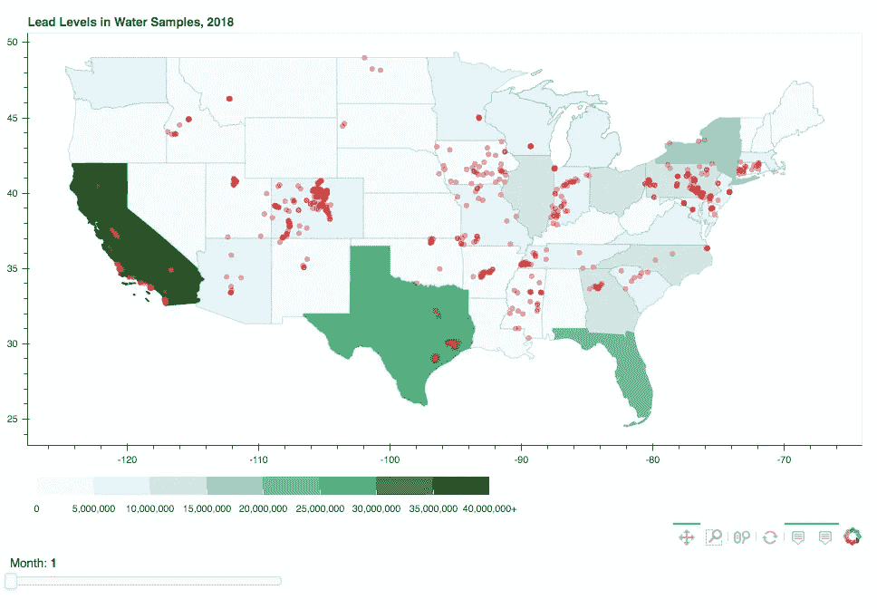
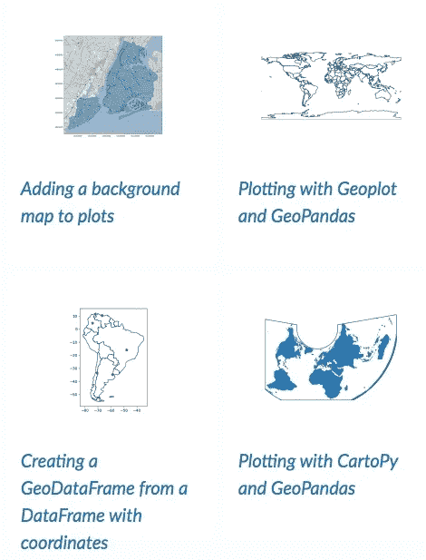
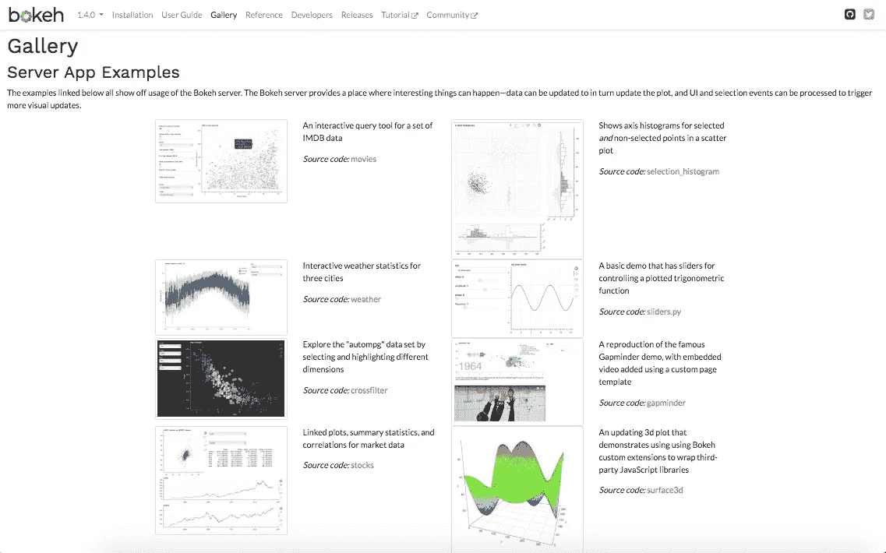
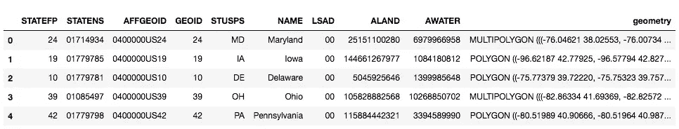
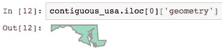
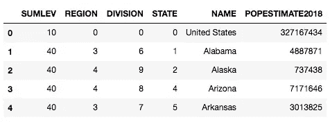
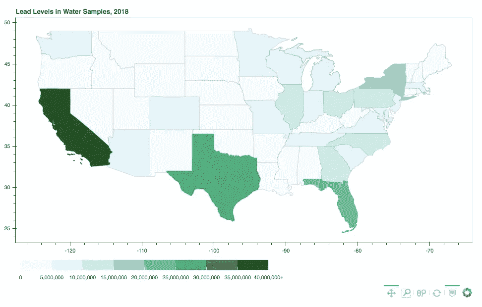

# 演练:使用 Python 中的 bokeh 和 GeoPandas 进行基本映射

> 原文：<https://towardsdatascience.com/walkthrough-mapping-basics-with-bokeh-and-geopandas-in-python-43f40aa5b7e9?source=collection_archive---------3----------------------->

## 从数据和文件到静态地图再到交互式地图



Final static plot. Keep reading for the interactivity!

我本周的目标是学习如何制作一个交互式地图，然后创建一个关于如何制作该地图的教程。地图在可视化地理数据和随时间变化方面非常有用。它们可以提供一种很好的方式来缩小视图，查看宏观层面的变化。首先，我将概述所使用的两个主要包:GeoPandas 和 bokeh。然后，我将介绍如何从一个特定的数据集到一个特定的交互式地图。创建的地图决不是完整或完美的。总之，我将回顾一些潜在的改进，并提供一个我在哪里找到我的信息的资源列表和一些起点，如果你对散景、GeoPandas 或交互式制图感兴趣的话。

# 目标

*   了解如何使用散景和 GeoPandas 创建交互式地图的基础知识
*   了解软件包的应用，以便绘制 2018 年在整个美国邻近地区采集的水样中的铅含量
*   如果你有关于散景和地质公园的问题，知道去哪里

这篇博文的灵感来自于各种关于制图和可视化的帖子。所有的灵感来源和其他有用的链接都发布在下面的参考资料部分。

**代码可以在** [**我的 GitHub 回购**](https://github.com/rweng18/bokeh_map) **上找到。**

# 包 1: GeoPandas



Examples from GeoPandas Gallery

GeoPandas 是一个帮助用户处理地理空间数据的开源包。GeoPandas 有许多依赖项。我们将关注的是包 shapely，GeoPandas 依赖它来执行几何运算。在我们的例子中，美国各州的形状将通过 shapely 包编码为多边形或多多边形。然后通过 GeoPandas 来理解地理空间数据。

**安装**

为了让 GeoPandas 运行，需要安装一些软件包。很难确保这一点。但是如果你确定的话，可以用 pip 安装。否则，使用 Anaconda 安装 GeoPandas 将会为您处理依赖关系。

```
conda install geopandas
```

你可以在这里阅读更多关于安装 GeoPandas [的信息。](http://geopandas.org/install.html)

# 包装 2:散景



Gallery of plots you can make in Bokeh

虽然 GeoPandas 允许绘图，但散景允许我们创建更复杂的绘图。bokeh 是一个多功能的开源软件包，旨在帮助用户创建漂亮的交互式可视化效果。2013 年 4 月首次发布 Bokeh，最近一次发布是在 2019 年 10 月。在此最新版本之后，将不再支持 Python 2.7、Python 3.5 或更早版本。你可以在这里找到你可以在散景中制作的完整图库。

**安装**

散景依赖于几个软件包。您仍然可以使用 pip 来安装 Bokeh，但是您可能会遇到依赖性方面的问题。在我的例子中，我使用 Anaconda 来安装 bokeh，因为它负责确保依赖关系是有序的。

```
conda install bokeh
```

安装的更多细节可以在[这里](https://docs.bokeh.org/en/latest/docs/user_guide/quickstart.html#userguide-quickstart)和[这里](https://docs.bokeh.org/en/latest/docs/installation.html)找到。

# 例如:观察水中的铅含量

## 目标

创建一个显示美国各州人口的地图。在每个州内，显示 2018 年在哪里发现了铅。

## 创造连续的美国

为了创建一个地图，你需要一个形状文件。shp)。在这种情况下，我从美国人口普查局[这里](https://www.census.gov/geographies/mapping-files/time-series/geo/carto-boundary-file.html)下载了一个 shapefile。该文件告诉 Geopandas 我们正在绘制什么形状。在我们的例子中，我们需要一个文件来概述美国相邻的每个州。我们使用一个 geometry 列，以便 Geopandas 包知道在哪里寻找每个州的形状信息。在这种情况下，形状是形状良好的多边形对象。

```
# Import geopandas package
import geopandas as gpd# Read in shapefile and examine data
contiguous_usa = gpd.read_file('data/cb_2018_us_state_20m.shp')
contiguous_usa.head()
```



First 5 rows of contiguous USA shapefile

在 Jupyter 笔记本中运行以下代码行将返回马里兰州的图像。



Running just the first entry in the geometry column, which represents the shapely geometry needed to create an image of Maryland

但是我们可以将 geometry 元素转换为字符串，以查看 shapely geometry 对象是如何表示的:

```
str(contiguous_usa.iloc[0]['geometry'])
```

返回一个长字符串，该字符串代表构成马里兰州的许多多边形:

```
'MULTIPOLYGON (((-76.04621299999999 38.025533, -76.00733699999999 38.036706, -75.98008899999999 38.004891, -75.98464799999999 37.938121, -76.04652999999999 37.953586, -76.04621299999999 38.025533))...
```

## 数据:国家人口

现在我们已经有了如何绘制美国地图的想法，我们需要将每个州的几何图形与我们想要绘制的数据结合起来。在这种情况下，我们需要将每个州与其 2018 年的人口联系起来。你可以通过美国人口普查局在这里找到美国各州和年份的人口估计。

```
import pandas as pd# Read in state population data and examine
state_pop = pd.read_csv('data/state_pop_2018.csv')
state_pop.head()
```



First 5 rows of state_pop dataframe

现在我们知道 shapefile 和 state population csv 都有一个名为“NAME”的列，我们可以将它们匹配在一起。所以现在我们可以使用 pandas 合并文件。

```
# Merge shapefile with population data
pop_states = contiguous_usa.merge(state_pop, left_on = ‘NAME’, right_on = ‘NAME’)# Drop Alaska and Hawaii
pop_states = pop_states.loc[~pop_states['NAME'].isin(['Alaska', 'Hawaii'])]
```

现在，我们已经合并了数据并将其限制在相邻的美国，我们可以将数据转换为有利于制图的格式:

```
import json
from bokeh.io import show
from bokeh.models import (CDSView, ColorBar, ColumnDataSource,
                          CustomJS, CustomJSFilter, 
                          GeoJSONDataSource, HoverTool,
                          LinearColorMapper, Slider)
from bokeh.layouts import column, row, widgetbox
from bokeh.palettes import brewer
from bokeh.plotting import figure# Input GeoJSON source that contains features for plotting
geosource = GeoJSONDataSource(geojson = pop_states.to_json())
```

现在，数据已经转换为适当的格式，我们可以使用以下步骤绘制州人口地图:

1.  创建图形对象
2.  将面片渲染器添加到图形中
3.  创建悬停工具
4.  展示图

```
# Create figure object.
p = figure(title = 'Lead Levels in Water Samples, 2018', 
           plot_height = 600 ,
           plot_width = 950, 
           toolbar_location = 'below',
           tools = “pan, wheel_zoom, box_zoom, reset”)
p.xgrid.grid_line_color = None
p.ygrid.grid_line_color = None# Add patch renderer to figure.
states = p.patches('xs','ys', source = geosource,
                   fill_color = None,
                   line_color = ‘gray’, 
                   line_width = 0.25, 
                   fill_alpha = 1)# Create hover tool
p.add_tools(HoverTool(renderers = [states],
                      tooltips = [('State','@NAME'),
                                ('Population','@POPESTIMATE2018')]))show(p)
```

Basic map showing some tools available in bokeh package

现在我们已经创建了地图，我们可以添加一个颜色条来指示州人口。

```
# Define color palettes
palette = brewer['BuGn'][8]
palette = palette[::-1] # reverse order of colors so higher values have darker colors# Instantiate LinearColorMapper that linearly maps numbers in a range, into a sequence of colors.
color_mapper = LinearColorMapper(palette = palette, low = 0, high = 40000000)# Define custom tick labels for color bar.
tick_labels = {‘0’: ‘0’, ‘5000000’: ‘5,000,000’,
 ‘10000000’:’10,000,000', ‘15000000’:’15,000,000',
 ‘20000000’:’20,000,000', ‘25000000’:’25,000,000',
 ‘30000000’:’30,000,000', ‘35000000’:’35,000,000',
 ‘40000000’:’40,000,000+’}# Create color bar.
color_bar = ColorBar(color_mapper = color_mapper, 
                     label_standoff = 8,
                     width = 500, height = 20,
                     border_line_color = None,
                     location = (0,0), 
                     orientation = ‘horizontal’,
                     major_label_overrides = tick_labels)# Create figure object.
p = figure(title = ‘Lead Levels in Water Samples, 2018’, 
           plot_height = 600, plot_width = 950, 
           toolbar_location = ‘below’,
           tools = “pan, wheel_zoom, box_zoom, reset”)
p.xgrid.grid_line_color = None
p.ygrid.grid_line_color = None# Add patch renderer to figure.
states = p.patches(‘xs’,’ys’, source = geosource,
                   fill_color = {‘field’ :'POPESTIMATE2018',
                                 ‘transform’ : color_mapper},
                   line_color = ‘gray’, 
                   line_width = 0.25, 
                   fill_alpha = 1)# Create hover tool
p.add_tools(HoverTool(renderers = [states],
                      tooltips = [(‘State’,’@NAME’),
                               (‘Population’, ‘@POPESTIMATE2018’)]))# Specify layout
# p.add_layout(color_bar, ‘below’)show(p)
```



Map with coloring based on state population

## 数据:销售线索级别

现在我们已经有了基本的地图，我们可以添加关于发现铅的水域的信息。我用的数据来自[水质数据](https://www.waterqualitydata.us/)。根据现有的数据，我下载了两个数据集:

1.  2018 年美国所有的水站点
2.  2018 年美国每一份检测铅含量的水样的结果

```
sites_df = pd.read_csv('data/sites_2018.csv')
lead_samples = pd.read_csv('data/lead_samples_2018.csv')
```

在我们加载数据之后，我们需要检查和清理数据。在这种情况下，去除没有铅结果或 0 微克/升铅的点。在这种情况下，我们只想绘制以微克/升或毫克/升为单位进行测试的位置。我们将毫克/升转换为微克/升，以获得一致的单位。

清理完数据后，我们可以将水源与铅样本合并。然后，我们对网站进行排序，删除任何重复的网站，在网站和日期上进行匹配。然后，我们可以根据纬度和经度对美国境内的水源进行分类。然后我们创建一个月列用于绘图目的。最后，我们通过创建有形状的几何点对象来创建一个几何行

```
lead_sites = lead_per_l.merge(sites_no_dup,
                          left_on = ‘MonitoringLocationIdentifier’,
                          right_on = ‘MonitoringLocationIdentifier’)lead_sites_sorted = lead_sites.sort_values(by = ‘ActivityStartDate’)# After dropping duplicates by date, 12,249 data points
lead_sites_dropdup = lead_sites_sorted.drop_duplicates(subset = [‘MonitoringLocationIdentifier’, ‘ActivityStartDate’], keep = ‘last’).reset_index(drop = True)# Drop data points not in the contiguous USA, 10,341 data points
lead_sites_dropdup = lead_sites_dropdup[(lead_sites_dropdup[‘LongitudeMeasure’] <= -60) 
                 & (lead_sites_dropdup[‘LongitudeMeasure’] >= -130)
                 & (lead_sites_dropdup[‘LatitudeMeasure’] <= 50) 
                 & (lead_sites_dropdup[‘LatitudeMeasure’] >= 20)]# Create Month column for plotting Slider
lead_sites_dropdup[‘Month’] = [int(x.split(‘-’)[1]) for x in lead_sites_dropdup[‘ActivityStartDate’]]# Create shapely.Point objects based on longitude and latitude
geometry = []for index, row in lead_sites_dropdup.iterrows():
    geometry.append(Point(row[‘LongitudeMeasure’], 
                          row[‘LatitudeMeasure’]))lead_sites_contig = lead_sites_dropdup.copy()
lead_sites_contig[‘geometry’] = geometry
```

既然我们已经创建了合适的几何列，我们可以指定坐标参考系统(crs)并将数据转换为地理数据框架。然后我们提取 x 和 y 坐标用于绘图，并转换为 columndatasource。更多关于散景数据源的信息可以在[这里](https://docs.bokeh.org/en/latest/docs/reference/models/sources.html)找到。

```
# Read dataframe to geodataframe
lead_sites_crs = {‘init’: ‘epsg:4326’}
lead_sites_geo = gpd.GeoDataFrame(lead_sites_contig,
                                  crs = lead_sites_crs,
                             geometry = lead_sites_contig.geometry)# Get x and y coordinates
lead_sites_geo[‘x’] = [geometry.x for geometry in lead_sites_geo[‘geometry’]]
lead_sites_geo[‘y’] = [geometry.y for geometry in lead_sites_geo[‘geometry’]]
p_df = lead_sites_geo.drop(‘geometry’, axis = 1).copy()sitesource = ColumnDataSource(p_df)
```

## 滑块工具

有许多数据点(10，000 多个)，按时间段查看数据可能更有意义。因此，对于这个例子，我按月划分数据，并创建了一个滑块工具，以便您可以查看 2018 年任何月份的每个水站点。

```
# Make a slider object to toggle the month shown
slider = Slider(title = ‘Month’, 
                start = 1, end = 12, 
                step = 1, value = 1)
```

现在我们已经创建了 slider 对象，我们需要根据用户输入更新它。我们通过编写一个回调函数和一个 CustomJSFilter 来实现这一点。

```
# This callback triggers the filter when the slider changes
callback = CustomJS(args = dict(source=sitesource), 
                    code = """source.change.emit();""")
slider.js_on_change('value', callback)# Creates custom filter that selects the rows of the month based on the value in the slider
custom_filter = CustomJSFilter(args = dict(slider = slider, 
                                           source = sitesource), 
                               code = """
var indices = [];
// iterate through rows of data source and see if each satisfies some constraint
for (var i = 0; i < source.get_length(); i++){
 if (source.data[‘Month’][i] == slider.value){
 indices.push(true);
 } else {
 indices.push(false);
 }
}
return indices;
""")# Uses custom_filter to determine which set of sites are visible
view = CDSView(source = sitesource, filters = [custom_filter])
```

现在我们已经写好了函数，我们可以绘制水样采集站点，站点的悬停工具，以及滑块。

```
# Plots the water sampling sites based on month in slider
sites = p.circle('x', 'y', source = sitesource, color = 'red', 
                 size = 5, alpha = 0.3, view = view)# Add hover tool
p.add_tools(HoverTool(renderers = [sites],
                      tooltips = [('Organization', '@OrganizationFormalName'),
                                  ('Location Type', '@MonitoringLocationTypeName'),
                                  ('Date', '@ActivityStartDate'),
                                  ('Lead (ug/l)', '@LeadValue_ug_l')]))# Make a column layout of widgetbox(slider) and plot, and add it to the current document
layout = column(p, widgetbox(slider))show(layout)
```

Finished bokeh plot!

## 改善可视化的方法

1.  目前，该地图仅显示了州一级的人口，但由于水样/站点可能无法覆盖整个州，因此更详细的人口细分(例如按县)可能会提供更多信息。
2.  为了与 1 保持一致，显示哪个区域从这些水源获得水可能是有趣的。
3.  目前，该地图没有提供关于铅含量的统计数据的快速概览(例如:检测到的最少/最多铅、方差、多次记录的地点变化等。)
4.  从视觉上来看，可以在标记或改变悬停工具的样式方面进行改进。

# 资源

*   使用 Python 制作交互式地理地图的完整指南*走向数据科学* (Shivangi Patel，2019 年 2 月 5 日)
*   [“添加小部件”*散景文档。*](https://docs.bokeh.org/en/latest/docs/user_guide/interaction/widgets.html)
*   [“散景.模型.滤镜”*散景文档。*](https://docs.bokeh.org/en/latest/docs/reference/models/filters.html#bokeh.models.filters.CustomJSFilter)
*   [“散景.模型.来源”。*散景文档。*](https://docs.bokeh.org/en/latest/docs/reference/models/sources.html)
*   [GeoPandas 文档](http://geopandas.org/index.html)
*   GeoPandas 101:在地图上绘制任何带有经度和纬度的数据。(瑞安·斯图尔特，2018 年 10 月 31 日)
*   [如何使用 Python 3 在 Bokeh 中使用 slider 回调过滤 ColumnDataSource？*栈溢出。*](https://stackoverflow.com/questions/46420266/how-to-use-a-slider-callback-to-filter-a-columndatasource-in-bokeh-using-python)
*   [“带散景的交互式地图”赫尔辛基大学。](https://automating-gis-processes.github.io/2016/Lesson5-interactive-map-bokeh.html)
*   “Javascript 回调”*散景文档*
*   [风韵犹存的用户手册](https://shapely.readthedocs.io/en/stable/manual.html#)