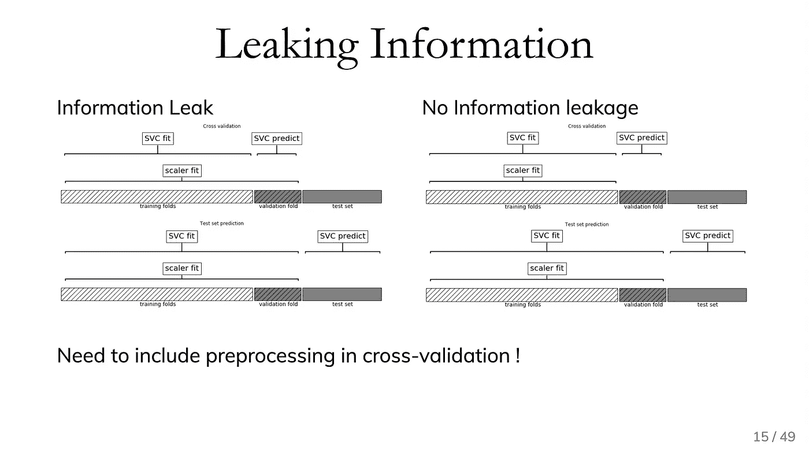
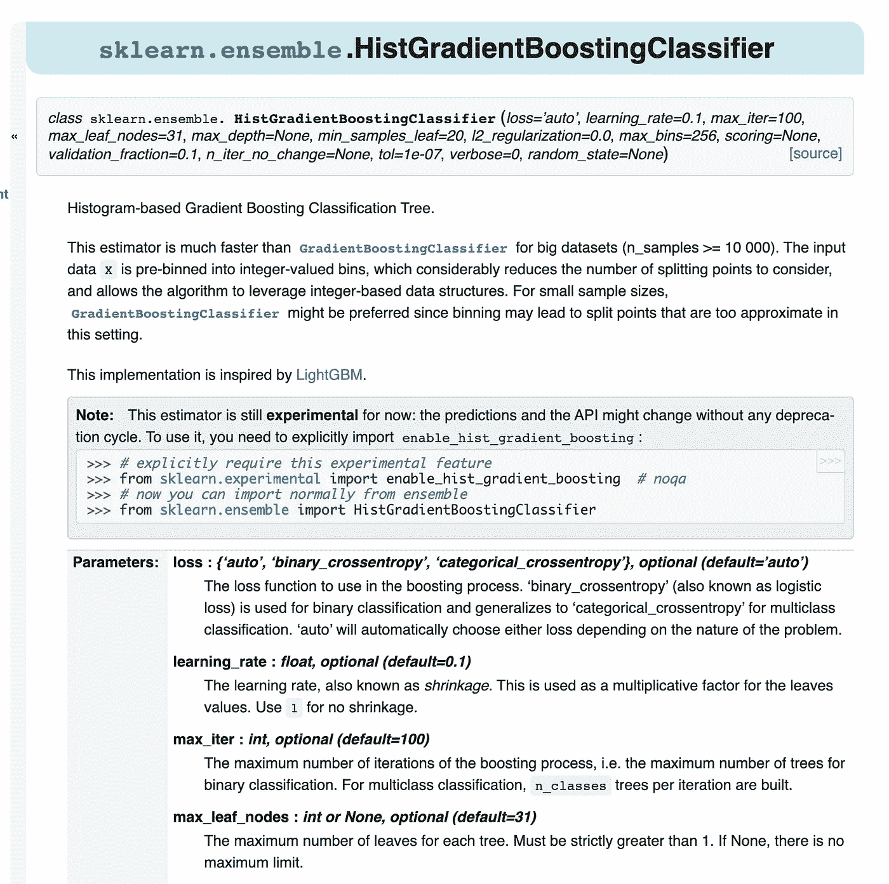
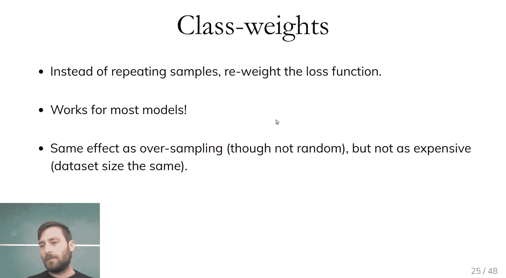
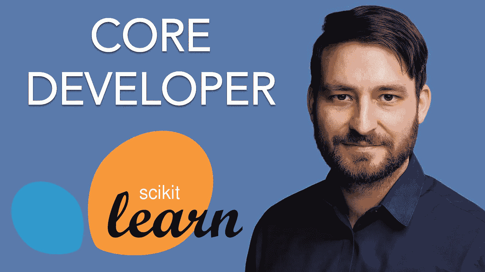

# 想要真正掌握 Scikit-Learn？来自核心开发人员自己的 2 个重要提示

> 原文：<https://towardsdatascience.com/want-to-truly-master-scikit-learn-2-essential-tips-from-the-official-developer-himself-dada6ff56b99?source=collection_archive---------10----------------------->

## [独家 TDS 采访](https://towardsdatascience.com/tagged/tds-interview)

## Scikit-learn 的核心开发人员之一分享了每个数据科学家都需要知道的 3 种实用 ML 技术。

Please subscribe to our [youtube channel](https://www.youtube.com/channel/UCuHZ1UYfHRqk3-5N5oc97Kw/featured?disable_polymer=1)!

**面试官:**[TowardsDataScience.com 项目负责人 Haebichan Jung](https://medium.com/@haebichan) 。旧金山 Recurly 的数据科学家。

**受访者:**[sci kit-learn 的核心开发者 Andreas Muller](https://datascience.columbia.edu/andreas-mueller) 。O'Reilly 书籍*的作者，介绍使用 Python 进行机器学习*。哥伦比亚大学数据科学研究所的研究科学家和讲师。

**开源社区如何为 Scikit-learn 服务？图书馆的工作流程和所有权是如何构建的？**

首先是用户。对于 Scikit-learn 的大多数贡献者来说，他们是从用户开始的。如果你不使用这个包，你就没有动力了。第二，大多数伟大的贡献都是由人们的用例激发的。我为 Scikit-learn 制作了一些版本，因为我想使用它们。这些通常是最好的版本。你不想迎合软件过于具体的用例。你不想在特性上做标记，因为你可以。

第三，对于像 Scikit-learn 这样复杂的东西，您不希望从添加一些大的新功能开始。许多人都有他们最喜欢的模型，他们希望通过将它添加到 Scikit-learn 来开始他们的贡献。但是现在向 Scikit-learn 添加一个模型需要大约一年的时间。所以我真的建议从小事做起。我自己开始修复文档中的错别字。改进文档总是受欢迎的。问题跟踪器上也有很多东西。

**在机器学习工作流程中实施 Scikit-learn 的人员中，您看到了哪些常见的错误或低效之处？**

有几个与 Scikit-learn 和机器学习相关的常见错误。

1.  对于 Scikit-learn，每个人都应该使用管道。如果你不使用管道，你可能做错了。两年前，我们引入了列转换器，它允许您更好地处理具有连续和分类变量的数据，或者其他类型的混合数据。我们还改变了一键编码器的一些东西。现在，当一起使用管道、列转换器和一键编码器时，一切都很好。
2.  我在机器学习上看到的一个常见错误是没有足够重视指标。sci kit-learn for better or bad 使用准确性作为默认指标。但是一旦你有一个不平衡的数据，准确性是一个可怕的指标。你真的应该考虑使用其他指标。我们不打算改变默认的度量标准，因为准确性被如此广泛地使用，并且有如此明显的解释。但是查看其他指标并为您的用例考虑它们是机器学习中最常见的问题。

**什么是管道？如果不是准确性，还有什么其他指标更适合机器学习？**

在 Scikit-learn 中，每个 ML 模型都封装在一个简单的 python 类中，称为“estimators”。在你的机器学习过程中，经常会有一个包含一系列预处理步骤的分类器。管道允许您封装所有预处理步骤、特征选择、缩放、变量编码等等，以及您通常在单个估计器中拥有的最终监督模型。

所以你有一个物体来完成你所有的工作。这 A)非常方便，B)使编写错误代码变得更加困难，因为它确保您为您的训练和测试集做完全相同的事情。最后，你应该使用交叉验证或网格搜索简历。在这种情况下，重要的是所有的预处理都发生在交叉验证循环中。如果在交叉验证循环之外选择特性，可能会发生非常糟糕的事情。但是在您的管道中，您知道一切都在交叉验证循环中。

From Andreas Muller Columbia Lecture [Series](https://www.cs.columbia.edu/~amueller/comsw4995s19/schedule/)

对于度量标准，它们通常在二进制分类中被忽略。在二元分类中，要看你的目标是什么。我喜欢看 ROC 曲线下的面积和平均精度。这些是细粒度的度量标准。我也喜欢看精确召回曲线(AUPRC)。关于这些指标的事情是，它们不依赖于您应用的决策阈值，因为它们是排名指标。所以你需要决定在哪里设置阈值来说“我说它是 1 类还是 0 类的概率是多少？”

您可以研究的其他指标是 F1 指标或微平均召回率/精确度。这些也很有意思。

**在 Scikit-learn 软件包中，您认为还有其他工具或功能没有被充分利用或低估吗？**

有一个未被充分利用，因为它还很新。这叫做 Hist 梯度推进。这是 LightGBM 的根实现，因此它比以前的梯度增强实现快得多。比 XGBoost 略快，比 LightGBM 略慢。现在它还不支持缺失值，但在大约 2 周后的下一个版本中将会支持。它也不支持分类变量，这将发生在明年春天。

你提到 LightGBM 很有意思，因为越来越多基于 python 的 ML 库正在发布，如 Catboost，以及深度学习框架，如 PyTorch。你对 ML 领域的这些成长中的玩家有什么感觉？是竞争的反应？

我认为多数情况下多元化是好的，因为大多数都提供了类似于 Scikit-learn 的接口，因此与我们的包兼容。因为 Scikit-learn 应用如此广泛，所以它的开发速度很慢。我们看到 XGBoost 和 LightGBM 对人们来说非常有价值。因此，我们希望确保每个人都知道这一点，我们在 Scikit-learn 中包含了这一点，希望所有软件包都能获得更广泛的受众。

就深度学习库而言，部分原因是它们可以移动得更快，因为我们移动得太慢了。还有两件事。

1.  与谷歌或脸书相比，我们的资源真的很少。所以和那些公司的工程师竞争毫无意义。我认为 Keras 真的很酷，我没有理由在 Scikit-learn 中重新实现这样的东西。
2.  技术原因。现在，仍然很难跨不同平台无缝地支持 GPU。你可以在张量流中看到。Tensorflow 上有针对不同架构编译的不同版本，你得自己编译等等。我们在 Scikit-learn 中不会遇到这种麻烦。

**你在哥伦比亚大学关于不平衡数据的演讲中说，这个问题有两个主要的解决方案:1)在改变数据(欠采样/过采样)后建立模型，2)改变模型(训练过程本身)。每种策略的优点和缺点是什么，特别是关于 Scikit-learn？**

我想从你的问题后退一步，再次提到最重要的事情是指标，以及你如何评估它。你的目标是什么？你的目标永远不是准确，也永远不是 ROC-AUC。这不是你申请的内容。你应该考虑在你的应用环境中取得一个特定的结果意味着什么。

一旦你有了这个目标，你就可以定义指标，并尝试不同的方法来最大化这些指标。重采样非常吸引人的一点是，您通常可以丢弃大量数据，而不会真正影响结果。如果你有 1:1，000+的比率，你不想欠采样到 1:1。但是你可以去 1:100 或者 1:10，你可以得到完全一样的结果。现在你已经将数据集缩小了 100 倍。

> “你的目标从来都不是准确性，也不是 ROC-AUC。这不是你申请的内容。你应该想一想，在你的应用环境中，取得一个特定的结果意味着什么。”

因此，至少如果你有很多数据，计算不是问题，欠采样是更有效地获得类似结果的方法。反过来说，我还没有真正见过有人在实践中使用 SMOTE，也就是合成数据生成。这是人们经常谈论的话题，但我对此有点怀疑。

就改变模型而言，Scikit 中的一个有用的东西是类权重。类权重实际上会改变损失函数，就好像对少数类进行过采样一样。所以你使用了所有的样本，但是给了少数类更多的权重。这是人们发现有用的东西。但是，这更像是尝试不同的东西，并且您有正确的指标来评估哪个解决方案最适合您的问题。

From Andreas Muller Columbia Lecture [Series](https://www.cs.columbia.edu/~amueller/comsw4995s19/schedule/)

有趣的是，你以那种方式提到了 SMOTE。在我的公司，我们一直在试验 SMOTE。但就实际结果而言，无论是 AUC 还是其他方面，都没有太大的好处。此外，它大大降低了我的流水线速度，因为我正在创建所有这些合成数据。所以想问问大家自己的疑惑从何而来。

因为我交谈过的每个人都说了你刚才说的话。

**你认为这是为什么呢？**

对我来说，机器学习中的很多东西都是非常经验性的。如果你在许多数据集上尝试，但没有帮助，那么它就没有帮助你。很难说为什么梯度增强效果很好。我想大多数人都相信渐变效果很好。但是我不认为任何人可以提出适当的理由来解释为什么梯度提升比支持向量机更有效。我认为没有人能以简洁或有意义的方式解释这一点。

就 SMOTE 而言，我认为有两件事正在发生:

1.  我认为 SMOTE 对数据的分布做了假设。所以 A)要么关于相邻样本之间的线的假设是错误的。B)如果样本离得太远，中间还有其他类的样本，那么这种情况可能会破坏东西。
2.  可能添加这些合成样本实际上对你感兴趣的模型类别没有帮助。

实际上，我和一个合作者有一个计划，要写一篇关于广泛基准的论文。这是因为，正如你所说的，你尝试使用 SMOTE 是有原因的，因为它是经过验证的文献中提出的方法，但在实践中，人们发现它对他们没有多大作用。

关于完整的采访，请观看 YouTube 视频的其余部分，其中 Andreas 对 Scikit-learn 包进行了更深入的研究。如果您喜欢这篇文章，请查看我们之前对哥伦比亚大学数据研究所所长 Jeannette Wing 博士的采访！(这是安德烈亚斯目前工作的地方)另外，请订阅我们的 YouTube 频道！

 [## 我们没有谈到的最危险的数据科学问题

### 这位来自微软研究院的(前)副总裁计划如何通过管理一个庞大的数据机构来改变这种情况。

towardsdatascience.com](/the-most-dangerous-data-science-problem-that-we-arent-talking-about-9ba56ebbe498) 