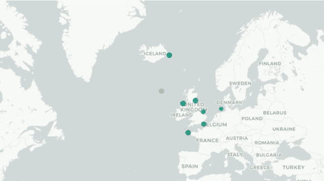
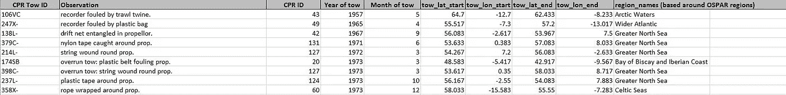
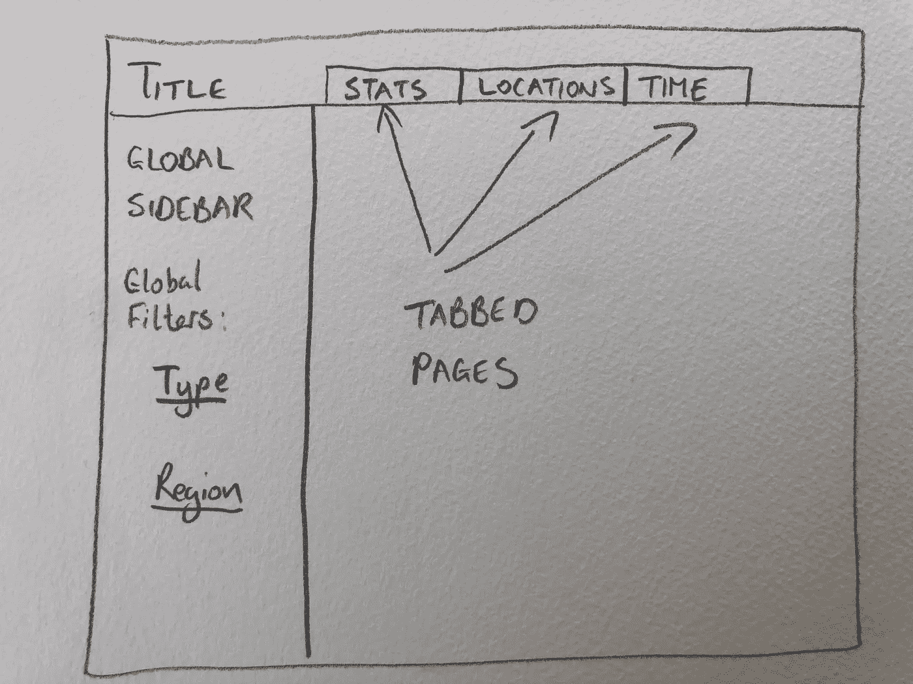

# 通过研究海洋塑料的兴起了解 R Shiny 第一部分

> 原文：<https://towardsdatascience.com/watch-the-rise-of-plastics-in-our-oceans-part-one-61ccd16cfa04?source=collection_archive---------25----------------------->

## 在本系列文章中，学习如何使用刚刚发布的海洋塑料数据在 R Shiny 中构建一个 web 应用程序

在《自然》杂志最近的一篇文章中，一组海洋科学家分析了自 20 世纪 30 年代以来被称为连续浮游生物记录器(CPR)的设备收集的数据。CPR 在日常航行中由船只牵引，用于捕获浮游生物进行研究。

但从 1957 年开始，CPRs 开始意外地捕捉到另一条数据——我们直到最近才知道它会有用——因为在那一年，CPR 首次被发现受到人造塑料物体的污染。

在他们的期刊文章中，科学家团队煞费苦心地收集了一个数据集，其中包括从 1957 年第一次记录事件到 2016 年在北大西洋、北极和北欧海洋的 CPR 中发现的所有此类人造塑料事件。他们还向公众开放了该数据集——共有 208 起各类塑料事故，从渔网到塑料袋。

当我在这里查看数据集[时，我意识到这是一个很好的数据集，可以帮助教某人如何使用 R Shiny 创建数据探索应用程序，这也是我将在这一系列文章中做的事情。数据集的大小有限，因此很容易处理，但包含了广泛的信息，包括日期、文本和地理坐标数据。](https://www.dassh.ac.uk/downloads/Supplementary_Data_2.xlsx)

要阅读本系列，您需要一些在 R 中操作数据的基本经验，包括使用 RStudio 作为编码环境。以前在`ggplot2`中使用 RMarkdown、Shiny 和简单绘图的一些经验是有帮助的，但不是必需的。您需要在启动前安装以下软件包:`shiny`、`RMarkdown`、`ggplot2`、`tidyverse`和`leaflet`。

在本系列中，您将学习如何:

*   在 R Markdown 中设计一个简单的 web dashboard 格式，并准备您的数据在这个 dashboard 中使用。
*   理解闪亮应用的反应，以及输入和输出是如何相互作用的
*   创建根据用户输入而变化的简单图表
*   在地图上可视化坐标数据
*   (*高级):*创建动画时间序列图形
*   发布您的应用程序，以便其他人可以使用它

要查看将成为本系列最终产品的应用程序，您可以访问这里的[和 Github 上的全套代码](https://keith-mcnulty.shinyapps.io/cpr_explorer/)[这里的](https://github.com/keithmcnulty/cpr_data)。这是一个更酷的输出——一个动画时间线剪辑，展示了自 1957 年以来在 CPRs 中发现的所有人造塑料实例。



## 什么是闪亮的？

`shiny`是一个开源的 R 包，它为使用 R 构建 web 应用程序提供了一个优雅而强大的 web 框架。

描述`shiny`的价值的一种方式如下:假设你是一家公司的分析师，你可以访问一组机密数据，许多人想要这些数据的统计数据。您每天至少会收到六个请求，要求获得可预测的统计数据，如基于指定过滤器的分组平均值。处理这种情况的一种方法是每次自己手动进行这些分析，并将结果发送给请求者。

另一种方法是构建一个简单的自助式应用程序，请求者可以随时访问，选择他们的过滤器和其他输入，并立即看到结果。`shiny`允许通过网络探索数据集，开发者可以决定可以看到什么以及如何看到。使用`shiny`，R 程序员可以节省大量的手工劳动，代价只是一点额外的编码。(事实上，在每一个版本中，Shiny 可以做的远不止这些，但现在让我们坚持这样做)。

为了使用`shiny`，R 程序员需要稍微钻研一下反应性的世界。他们需要了解输入如何反馈到 R 中的反应性变量，以及如何控制反应性，以便显示他们想要的输出。如果你没有时间学习和掌握 Javascript，`shiny`是一个很好的选择，可以实现通过 web 发布反应分析的目标。

## 设计您的仪表板

你如何设计你的仪表板很大程度上取决于它将如何被使用。如果它是一个被很多人用来满足特定需求的产品，建议遵循良好 UX 设计的原则，在进行模型和技术开发之前，进行用户访谈，以准确了解用户的需求。

在这种情况下，由于这是一个有趣的项目，而不是一个庞大的用户群，我们可以决定自己的设计。我们需要做的第一件事是查看数据并问:我们认为人们会有兴趣看到什么？以下是我们正在处理的 CPR 数据的快照:



我们可以看到一些有趣的东西。首先,“观察”栏帮助我们确定发现了什么类型的塑料，允许我们向数据集添加“类型”(类似于科学家在 *Nature* 文章中进行的分析),这可能有助于过滤。还有一个“拖一年”的专栏，帮助我们理解时间线。拖曳的起点和终点都有坐标，帮助我们直观地看到塑料是在哪里发现的，最后还有不同海域的名称，这可能也有助于过滤。

因此，在我们的应用中包含以下内容可能会有所帮助:

1.  能够根据塑料类型和海洋区域过滤所有分析
2.  能够按年份过滤某些分析
3.  能够看到 CPR 中塑料发生率的一些基本统计数据(可能受 *Nature* 文章中所做分析的指导)。
4.  能够在地图上显示这些事件发生的时间和地点。

因此，我们将如下设计我们的仪表板:



*全局工具条*将一直可见。它将给出一些一般的使用指南和背景，它将允许按塑料类型和海洋区域过滤，以便在应用程序中显示的任何结果都将反映这些过滤器。然后将有三个独立的页面，每个页面关注数据的不同方面:

*   STATS 将提供一些关于事件的描述性统计信息，以及一些进一步的过滤选项
*   位置将在某种形式的地图上呈现事件的位置
*   时间将以某种形式显示事件是如何随着时间的推移而发生的

## 准备在应用程序中使用的数据

考虑到我们的设计，我们现在需要获取研究人员给我们的数据集，并将其用于我们的应用程序。这有两个步骤。

首先，我们需要添加我们在设计中考虑的特定分析所需的任何新列。正如我上面提到的，这个数据集已经处于良好的状态，但是我们确实需要解析观察列来确定每个事件的“类型”，我们可以清理列名以使它们更容易使用，因为当它们直接加载到 r 中时会看起来非常混乱。所以让我们在 RStudio 中启动一个项目，并将其命名为`cpr_data`，让我们在该项目中创建一个名为`data`的子文件夹，在其中我们可以放置研究人员提供给我们的原始`xlsx`文件。我们可以编写一个简单的 R 脚本来添加新的“type”列并整理列名——我们称之为`prep_data.R`。我们可以通过在 Excel 中打开数据集，删除第一行，重新保存为 CSV 文件并使用`read.csv`来加载数据集。或者像我下面做的那样，直接用`openxlsx`包读入 R。

```
# prep data for use in CPR app# load librarieslibrary(dplyr)
library(openxlsx)# prep data for use in CPR app# load librarieslibrary(dplyr)
library(openxlsx)# load original data file and make colnames easier to code withdata <- openxlsx::read.xlsx("data/Supplementary_Data_1.xlsx", sheet = 1, startRow = 2)colnames(data) <- gsub("[.]", "", colnames(data)) %>% 
  tolower()colnames(data)[grepl("region", colnames(data))] <- "region"# create columns to classify by key termdata <- data %>% 
  dplyr::mutate(
    type = dplyr::case_when(
      grepl("net", observation, ignore.case = TRUE) ~ "Netting",
      grepl("line|twine|fishing", observation, ignore.case = TRUE) ~ "Line",
      grepl("rope", observation, ignore.case = TRUE) ~ "Rope",
      grepl("bag|plastic", observation, ignore.case = TRUE) ~ "Bag",
      grepl("monofilament", observation, ignore.case = TRUE) ~ "Monofilament",
      grepl("string|cord|tape|binding|fibre", observation, ignore.case = TRUE) ~ "String",
      1L == 1L ~ "Unclassified"
  )
)# save as an RDS filesaveRDS(data, "data/data.RDS")
```

在这个脚本中，我们使用`grepl()`来标识 Observation 列中文本字符串中的术语，然后使用`dplyr::case_when()`将这些术语分配给一个`type`。如果没有匹配的术语，我们定义一个`type ~ "Unclassified"`。我们还将列名改为易于编码的简单小写字符串。

其次，我们需要重新保存转换后的数据。稍后，当我们编写了应用程序并部署它以便其他人可以访问它时，这个数据文件将与它捆绑在一起，应用程序将把它读入它的环境。如果这个数据集非常大，我们需要考虑 R 可以读取的最快的文件格式。但是在这种情况下，数据集很小，所以我们可以选择任何文件格式来保存它。在这种情况下，我们将保持简单，将数据集作为 R 对象保存到一个`RDS`文件中。

## 下次…

因此，我们已经计划好了基本设计，并以正确的方式设置了数据。在本系列的下一部分中，我将介绍如何启动和运行仪表板的简单轮廓。我还将讨论如何处理输入和反应变量，以及如何在`ggplot2`中构建一些基本的描述图来响应用户输入。

## 练习

以下是一些后续练习，你可以用它们来测试你对本文内容的理解程度:

1.  什么是 R Shiny？为什么它对这个数据集有用？
2.  如果用户群很大而且多样化，你会如何着手设计这个仪表板？
3.  R Shiny 应用程序如何使用本地数据集？当你创建一个要在 R Shiny 应用中使用的数据集时，你要考虑的关键问题是什么？
4.  阅读产生这个数据集的 [*《自然》*文章](https://www.nature.com/articles/s41467-019-09506-1)。读过这篇文章后，你还可以用什么方法来设计这个仪表板？

*最初我是一名纯粹的数学家，后来我成为了一名心理计量学家和数据科学家。我热衷于将所有这些学科的严谨性应用到复杂的人的问题上。我也是一个编码极客和日本 RPG 的超级粉丝。在*[*LinkedIn*](https://www.linkedin.com/in/keith-mcnulty/)*或*[*Twitter*](https://twitter.com/dr_keithmcnulty)*上找我。*