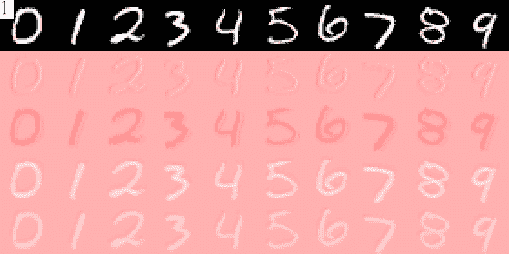

# 看这个神经网络学会看

> 原文：<https://towardsdatascience.com/watch-this-neural-network-learn-to-see-545492272440?source=collection_archive---------11----------------------->

## 在整个模型训练中可视化卷积层激活

Image by [Sian Molloy](http://sianmolloy.com/)

> 给手机用户的一个警告:这篇文章中有一些厚的 gif 图片。

# 动机

深度学习相对于其他机器学习技术的主要优势是它能够自动学习输入数据的抽象表示。然而，事实并非总是如此。早在 1969 年，Minsky 和 Papert 出版了一本书,证明了单层感知器(人工神经网络的祖先)无法解决 XOR 问题。对于我们这些没有计算机科学背景或没有其他生活经历的人来说，异或问题就是接受两个二进制输入， *A* 和 *B* ，当且仅当 *A* 或 *B* 中的一个为真时，返回*真*，因此得名“异或”，或 XOR。单层感知器无法解决这个问题的原因是它们只能解析线性可分的类。如果您要画出 XOR 问题的可能输入及其输出，空间看起来会像这样:

The world’s worst game of tic-tac-toe (source: wikimedia commons)

现在，你能在这张图片上画一条直线，把圆圈和十字分开吗？剧透:不能，感知器也不能。幸运的是，勇敢的先驱们拥有将两个感知机粘在一起的洞察力，深度学习领域由此诞生(或多或少)。这样做的原因是，神经网络的每一层都可以被视为前一层的嵌入；虽然上图中的圆圈和十字在它们的原始形式下可能不是线性可分的，但是通过简单的编码它们是线性可分的。抓住图像的左上角和右下角，并在脑海中保持不动。然后，借助你的想象力，通过第三维度将图像对折*，将右上角拖出屏幕，然后向下按回到左下角。如果你做对了，它应该是这样的:*

If you look closely, you may notice I’m not an artist

现在，你能画一条穿过*这张*图片的直线，并把圆圈和十字分开吗？我真诚地希望如此。这种获取信息并将其编码为其他更有用的形式的行为，是神经网络擅长的主要任务。事实上，训练神经网络不是为了它们的预测能力，而是为了它们发现的学习表示，这一直是深度学习研究的支柱。

# 学习观察

卷积神经网络(CNN)是将深度学习应用于图像数据的最流行的架构。简而言之，CNN 学习许多过滤器，它们应用于图像的每个像素及其层。通过将这些过滤器应用于图像，以及重复下采样，神经网络学习识别其第一层中的简单、低级特征以及其最后一层中的复杂、高级特征。或者至少，这是他们通常的解释。

Image Source: Convolutional Deep Belief Networks for Scalable Unsupervised Learning of Hierarchical Representations, by Lee *et al.*

正如你所看到的，该模型学习识别各种边缘，然后面部特征，然后整个脸(许多中间层被删除)。如果你在谷歌上搜索“卷积神经网络层可视化”，你会发现大量的上述图片。然而，我从来没有在训练过程中见过 CNN 层的可视化*，所以我想我应该看看它们是什么样子的。在这次探索中，我使用了常见的 [MNIST 数据集](https://en.wikipedia.org/wiki/MNIST_database)，这是一组 60 000 个黑白手绘数字，每个数字的高度和宽度都是 28 像素。我使用了一个简单的卷积模型，如下所示:*

The network architecture, including 6 convolutional layers and 3 dense layers

## 形象化

神经网络被训练五个时期，具有 1024 个图像的小批量大小，总共 290 个训练步骤。在每一步之后，预先选择的一组十个样本图像(每个数字一个)被输入到模型中，并且保存每个卷积层的激活。尽管近年来它已经不再流行，取而代之的是更容易训练的 [ReLU](https://en.wikipedia.org/wiki/Rectifier_(neural_networks)) 函数，我还是决定使用 [tanh](https://en.wikipedia.org/wiki/Hyperbolic_function#Tanh) 作为卷积层的激活函数。这是因为 tanh 介于-1 和 1 之间，这使得可视化变得简单。当第一层的激活被应用到红蓝颜色图时，结果如下:

Conv1: The input images (top row) and the activations of the four channels in convolutional layer 1\. Activations range from +1 (blue) to 0 (white) to -1 (red). Frame (top left) is the number of training steps applied.

Conv1 似乎已经学会识别第一和第二通道中的笔画宽度，因为每个数字的内部是暗红色，而外部是浅红色。在第三和第四个通道中，它似乎已经学会了边缘的概念，数字是蓝色的，背景是粉红色的，数字边缘是白色的。然而，这些激活从深度学习佳能所建议的来说是一个长镜头，即每个通道将学习一个清晰和独特的特征，例如垂直和水平边缘；Conv1 在很大程度上再现了原始输入，并稍加注释。

Conv2: The same setup as Conv1.

与 Conv1 类似，Conv2 似乎也在再现原始输入。通道 1、通道 2 和通道 4 彼此几乎相同，并且与 Conv1 中的边缘突出显示行为几乎相同，通道 3 只是输入的模糊再现。

Conv3: The same setup as Conv1, except with eight channels instead of four. This layer has half the resolution as the original image, so activations were upscaled without interpolation for visualization.

在 Conv3 中，我们看到了可能是第一个真正习得的特性。在第六个通道中，接近训练结束时，我们看到手指是蓝色的，大部分背景是粉红色的，手指每个部分正下方的背景是红色的。这表明这个通道已经学会识别水平边缘的底部。类似地，第七个通道有红色数字，粉色背景，每个数字上方有白色水平边缘*。然而，其他通道似乎是原始图像的简单复制。*

Conv4: The same setup as Conv3.

在 Conv4 中，我们可以看到更清晰的特性。特别是，我们看到不同角度的边缘。第一、第二和第六通道标识水平边缘的顶部。第三、第七和第八通道标识对角边缘。其他两个通道是原始通道的粗略再现。

Conv5: The same setup as Conv1, except with sixteen channels instead of four. This layer has one-quarter the resolution of the original image, so activations were upscaled without interpolation for visualization.

Conv5 进行了大量的下采样，分辨率仅为 7x7 像素，但似乎具有有意义的特征提取。在训练的最初阶段，每个频道都是粉红色的，基本上没有信息。到步骤 70，该层已经学会产生模糊地类似于输入的斑点。然而，在训练结束时，这些通道已经明显地彼此区分开来，并显示出激活的急剧变化。由于低分辨率和我们所谓的独立功能的纠缠，我们不清楚这里学到了什么功能，但很明显，这里的每个通道都有一些有用的东西。

Conv6: The [gif](https://github.com/ConorLazarou/medium/blob/master/visualizing_mnist_12019_12/tanh/visualizations/conv6.gif) was too large for Medium, so these are the activations after training has completed.

不幸的是，Conv6 刚好超过 Medium 的文件大小限制，你必须[点击这个链接](https://github.com/ConorLazarou/medium/blob/master/visualizing_mnist_12019_12/tanh/visualizations/conv6.gif)才能观看它学习。与 Conv5 类似，学习到的功能清晰可见，但几乎不可能说出它们实际对应的是什么。

Accuracy and loss (categorical_crossentropy) during training

# 经验教训

那么这个故事的寓意是什么呢？我建议有三个。首先，深度学习的结果很少像佳能所说的那样清晰。很多教材，包括*深度学习* (Goodfellow *等*。)，把低级卷积层比作 [Gabor 滤波器](https://en.wikipedia.org/wiki/Gabor_filter#)和其他手工制作的计算机视觉滤波器。尽管该模型在测试数据上达到了 95%以上的准确率，但前四个卷积层在特征提取方面做得很少。诚然，对于一个非常简单的任务来说，这是一个非常简单的模型，而且很可能一个为更困难的任务训练的更复杂的模型至少会学习一些有用的低级特征，但深度学习通常被教授的方式(以我的经验来看)表明，特征提炼和提取是不可避免的，即使对于简单的任务来说也是如此；事实显然并非如此。

第二个教训是，习得的特征不太可能是人类可能选择的直观、独立的品质。Conv5 和 Conv6 显然已经学会了*一些东西*，原始图像已经以这样一种方式进行编码，即网络的密集层可以根据数字类型对它们进行分类，但还不清楚它们学会了检测什么。这是深度学习中的一个常见问题，尤其是在生成模型中，模型可能会学习将两个或更多看似不相关的品质[嵌入为单个特征](https://openreview.net/references/pdf?id=Sy2fzU9gl)。

第三个教训是我在作为数据科学家的工作中每天都会想起的，那就是可视化一切是值得的。我进入这个项目，期望写一篇非常不同的文章。我很兴奋地展示了网络学习和提炼功能，从低级的边缘检测到高级的循环和旋转。相反，我发现了一个懒惰的懒汉，直到最后一刻才改进功能。最值得注意的是，我惊讶地发现，一旦这些层学会了输入的一些表示，它们在训练过程中几乎没有改变。将这一点可视化增强了我对卷积神经网络训练的理解。我希望你在这里也学到了一些东西。

对于那些好奇的人来说，用来训练这个网络并产生这些可视化效果的代码可以在这个 Github repo 中找到:

 [## ConorLazarou/培养基

### 卷积神经网络学习识别手写数字时的可视化

github.com](https://github.com/ConorLazarou/medium/tree/master/12019/visualizing_mnist)