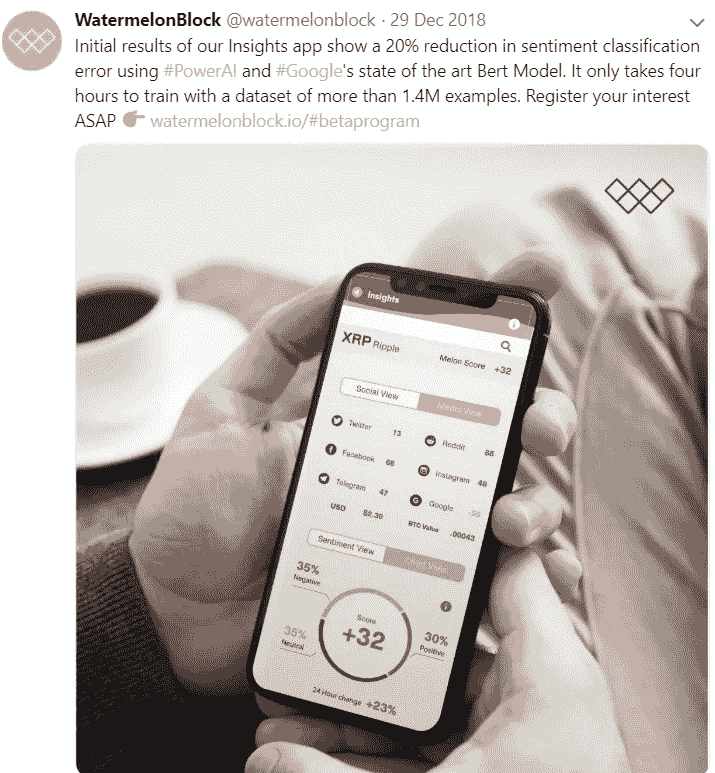
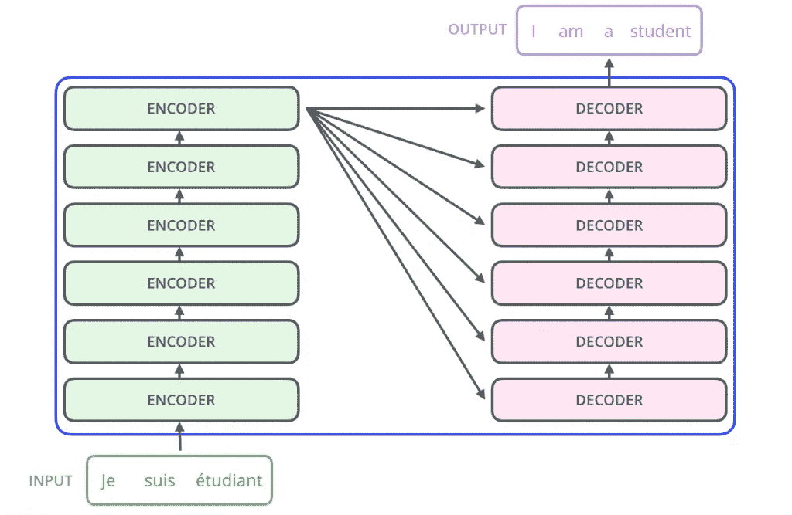
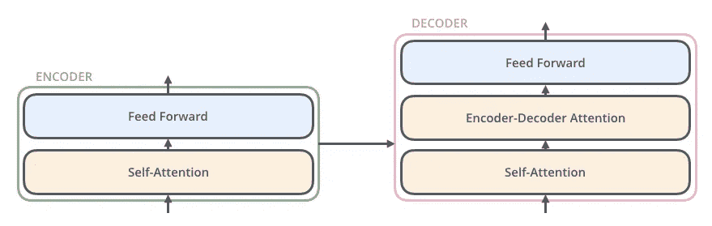
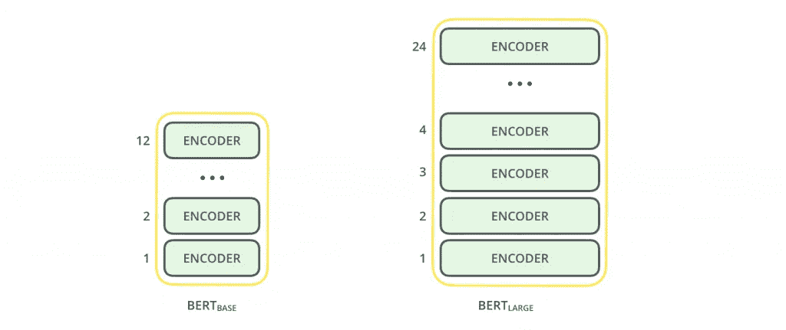
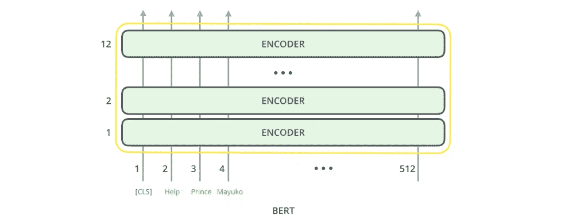
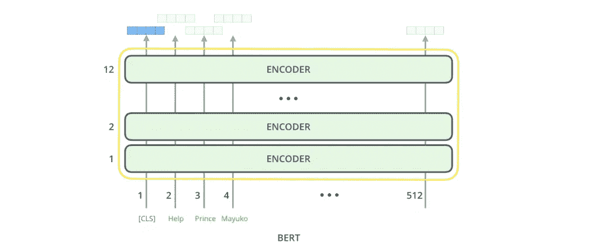
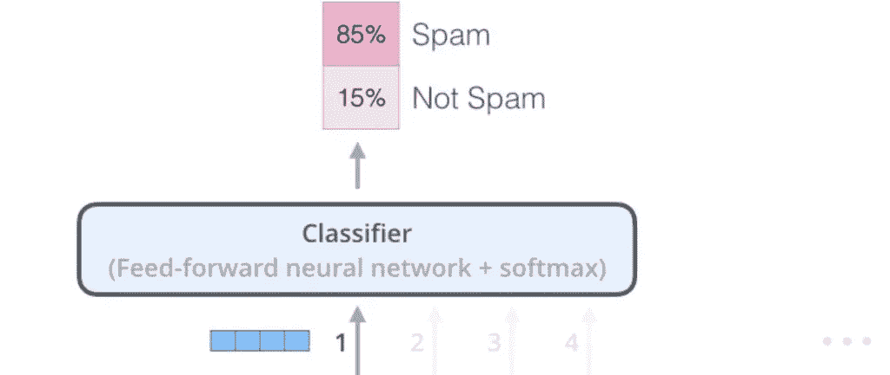

# WatermelonBlock 和 Google BERT |直到更好的 NLP 模型将我们分开

> 原文：<https://towardsdatascience.com/watermelonblock-and-bert-till-better-nlp-models-do-us-part-555ad7839a7c?source=collection_archive---------26----------------------->

## BERT——任何 NLP 工程师都渴望得到的完美新年礼物。

[WatermelonBlock](https://www.watermelonblock.io/) 的数据科学团队已经接受了实验，我们已经开始实施深度文本挖掘算法，以便不时提高准确率，从而产生高效的数据管道。这种管道可以处理我们从网络上获得的大量自然语言语料库，并轻松实现偏差-方差权衡。

**Source:** WatermelonBlock

[我们在 IBM](https://finance.yahoo.com/news/watermelonblock-partners-ibm-watson-using-123000544.html) 的合作伙伴在[与我们合作，利用 IBM PowerAI 服务器](https://developer.ibm.com/linuxonpower/deep-learning-powerai/)进行这些实验，并获得预期的结果。该团队一直在开发一些令人难以置信的自然语言处理模型，以便为我们的客户提供智能但通用的实时洞察应用程序。一个这样的模型是趋势开源 NLP 模型——最近由 Google 开发的*【BERT】*。我们在为我们的应用测试 BERT 框架时获得的初步结果表明，分类错误减少了 20%,并且仅用了 4 个小时来训练包含超过 140 万个示例的非结构化数据集的集成模型。

[https://Twitter . com/watermelon block/status/1078929013094010885](https://twitter.com/watermelonblock/status/1078929013094010885)

这好得令人难以置信，但的确，这是我们迄今为止最好的成绩之一。任何数据科学团队都渴望得到的完美新年礼物。事实上，我们已经爱上了这个框架，迫不及待地将它部署到生产中。

那么什么是 BERT，它是如何工作的？

来自 Transformer 的 BERT a.k.a *双向编码器表示法是一种预训练语言表示法的新方法，它在各种自然语言处理任务(如语际机器翻译和事实核查)上提供了最先进的结果。让我们从模型基础背后的概念开始。*

## **伯特的内脏(来源:插图伯特|杰伊·阿拉玛)**

BERT 基本上是一个带有关注机制的变压器编码器堆栈。

如果你不知道什么是注意力机制，[这篇由 WildML](http://www.wildml.com/2016/01/attention-and-memory-in-deep-learning-and-nlp/) 撰写的精彩文章将让你快速了解！另一方面，转换器是一种深度学习模型，它通过将输入数据表示为合适的形式来加速整个堆栈的训练过程。虽然转换器由两个重要的组件组成，即相互连接的*编码组件*和*解码组件*，但是 BERT 只使用编码组件进行操作。

下图是一个使用转换系统将法语句子翻译成英语的简单黑盒案例。

**A transformer stack | Source:** *The Illustrated BERT, Jay Alammar*

编码组件是一个编码器堆栈(为了给出一个例子，我们将 6 个编码器堆叠在一起，但是也可以尝试其他的排列)。每个编码器都有一个*前馈网络*层和一个*自关注机制*层，而每个解码器都有一个相同的附加层— *编码器-解码器关注。*

**Encoder & Decoder Components | Source:** The Illustrated BERT, Jay Alammar

编码器的输入最初流经*自我关注层*，这是一个神经层，帮助编码器在编码特定单词时查看输入句子中的其他单词。

自关注层的输出然后被馈送到*前馈层*——该层分配权重并将编码的单词向量向前传播到下一个编码组件。

解码器有这两层，但在它们之间有一个*编码器-解码器* *注意层*，这是一种安全措施，有助于解码器关注给定输入句子的相关部分。

## 伯特的建筑(来源:插图伯特|杰伊·阿拉玛)

已经开发了两种类型的 BERT 模型:

1. ***BERT Base:*** 体积较小，计算负担得起，不适用于复杂的文本挖掘操作。

2. ***BERT Large:*** 体积较大，计算开销大，处理文本数据只是为了提供最佳结果。

**BERT Variants | Source:** The Illustrated BERT, Jay Alammar

两种 BERT 模型都有*‘N’*编码器层(也称为变压器模块)，形成了一个大规模的数据编码堆栈。通常基础版 *N = 12* ，大版 *N = 24* 。他们有更大的前馈层(分别为 768 和 1024 个隐藏单元)，以及自我关注层(分别为 12 和 16)。

出于解释的目的，让我们使用具有 6 个编码器层、512 个前馈层和 8 个自我关注层的迷你版 BERT 来对垃圾文本或真实文本进行分类。

**Encoder Block | Source:** The Illustrated BERT, Jay Alammar

就像变压器中的典型编码器一样，BERT 接受一系列单词作为输入，这些单词在堆栈中不断向上流动。每一层应用自我关注，并通过前馈网络传递其结果，然后将其交给下一个编码器。第一个输入令牌是分类器令牌**【CLS】**，它通过前馈网络和 softmax 函数将该层中输入的编码版本传送到下一个编码器层。

就输出而言，转换器堆栈中的每个编码器位置给出一个隐藏大小为 768 的合成向量(在 BERT Base 的情况下)

**Encoded Output Flow | Source:** The Illustrated BERT

对于垃圾邮件分类的任务，仅仅单个编码器位置就足够了。生成的向量然后被发送到我们选择的分类器，它通常是一个单层神经网络，具有分配最终权重的前馈网络和用于非线性的 [softmax 函数](https://en.wikipedia.org/wiki/Softmax_function)。softmax 是一个很棒的激活函数，它将数值上不正确的逻辑转换成一个平衡的概率分布，所有的概率总和为一。

**Probabilistic Classification | Source:** The Illustrated BERT, Jay Alammar

如果有更多的目标标签可以自动将电子邮件分类为“社交帖子”或“推广电子邮件”，那么调整分类器网络以具有更多最终通过 softmax 函数的输出神经元(在本例中为 4 个输出神经元)就足够了。

从分类器获得的概率值给出了电子邮件是垃圾邮件或其他邮件的可能性。虽然垃圾邮件分类只是 BERT 如何轻松做到更好的要点，但假新闻检测、社会情绪分类、令牌审查监控等复杂任务都有发挥的空间。

就我们在 WatermelonBlock 的实验而言，BERT 是 ELMo、ULMFiT 等众多模型中的一个，我们努力通过快速集思广益会议为我们的客户创建最佳洞察应用程序。

如果您喜欢这个技术博客，并想了解更多关于 WatermelonBlock 的[工程师和数据科学家如何构建下一代产品的信息，请热烈鼓掌欢迎这篇文章，并关注我们的中型博客频道，网址为](https://www.watermelonblock.io/#team) [WatermelonBlock](https://medium.com/u/2e4ae63ee111?source=post_page-----555ad7839a7c--------------------------------) ，也可以访问我们网站上的[公告页面，了解即将发布的新闻！](https://www.watermelonblock.io/blog/)

## 参考资料:

1.*《图解变形金刚》，杰·阿拉玛，2018，*【https://jalammar.github.io/illustrated-transformer/ 

2.*“自然语言处理中的自我注意机制”*，[https://dzone . com/articles/Self-Attention-Mechanisms-in-Natural-Language-proc](https://dzone.com/articles/self-attention-mechanisms-in-natural-language-proc)

3.*《开源 BERT:自然语言处理最先进的预训练》，* *Google AI，2018*