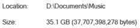
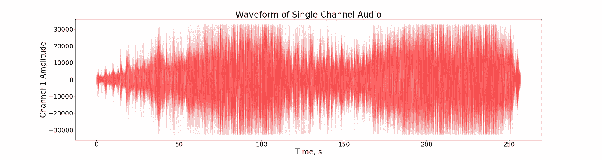
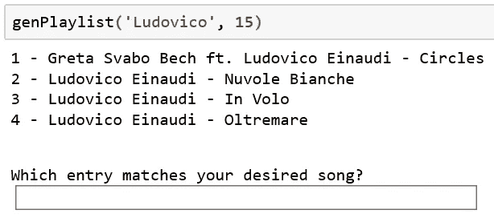

# 波形分析解锁音乐中的数据

> 原文：<https://towardsdatascience.com/waveform-analysis-unlocks-the-data-in-music-c47e773f1fa8?source=collection_archive---------16----------------------->

一个[波形](https://en.wikipedia.org/wiki/Waveform)就是一首歌的指纹。正是这种波形，或声波的卷积，包含了一首歌的所有内容。从中可以发现大量的特征。这些功能能够增强推荐算法，远远超过仅使用歌曲的标题、艺术家和流派所能达到的效果。无论是作为纯粹基于内容的方法的一部分还是作为解决[【冷启动】问题的重要第一步](https://en.wikipedia.org/wiki/Cold_start_(computing))，理解媒体内容与理解它是如何被消费的同等重要。


[Pixabay](https://pixabay.com/photos/headphones-smartphone-technology-791078/)

# 我与音乐的关系

音乐对我来说极其重要。这是我生命中不变的一部分，它见证了我走过的各行各业，无论是好的还是坏的。因为我花了很多时间在音乐上，所以寻找新的音乐一直是我的激情所在。虽然我不知道这些年来我花了多少时间听音乐，但我知道仅在过去的八年里，我已经积累了超过 6000 首个人精选的歌曲。



The size of my music library.

由于我的整个音乐收藏都是离线存储的，我无法参与协同过滤算法，就像音乐流媒体平台用来推荐新歌的那些算法一样。具体来说，如果用户 *X* 听了很多和我一样的音乐，音乐流媒体平台就知道我可能也喜欢用户 *X* 听的其他歌曲。因此，如果我想创建主题播放列表，我只能对手头的音乐进行基于内容的过滤。

然而，从这么大的一个集合中手工选择一组有凝聚力的歌曲是很费时间的，即使我能完美地回忆起每首歌的标题、艺术家及其识别特征(例如，古典、钢琴或“chill”)。事实上，我只能回忆起这些歌曲中的一小部分，并且经常忘记艺术家的姓(我知道他们的名字是约翰… *什么的*)，所以以这种方式制作播放列表是一项艰巨的任务，我通常会避免。相反，我通常通过启用随机播放和按播放来简化这个过程。

然而，去年我意识到，我可以利用歌曲的波形数据来解决创建播放列表这一日益严重的问题。我以前处理过来自光源的数据，因为光和声音都是以波的形式传播的，所以我相信我能够利用我的技能来解决这个问题。



Example single channel audio waveform.

# 特征提取和选择

在兴奋和西雅图咖啡的刺激下，我头脑风暴了一下我的方法:从这些波形中可以提取什么特征？哪些功能对我想要的最有用？应该如何为播放列表选择歌曲？

我想开始，并且知道一旦我掌握了一些特性，我就能够回答后面的问题，所以这就是我开始的地方。在重构了当时已经过时的 [pyAudioAnalysis](https://github.com/tyiannak/pyAudioAnalysis) 包并管理了包的依赖关系之后，我为每首歌提取了特征。我知道如果我只提取歌曲的一部分的特征，提取的特征可能不能准确地反映歌曲的整体。为了解决这个问题，在移动窗口中提取特征并进行平均。通过这样做，可以计算每个特征的方差，并将其用作附加特征。这相当于每首歌曲的 33 个主要特征，每个特征都有一个相关的标准偏差:

1.  **过零率** : *符号变化率(音频波形是相对的，以零为中心)。对打击乐声音进行分类的一个关键特征。*
2.  **能量:** *信号值的平方和，用窗口长度归一化。标识歌曲的音量。*
3.  **能量熵:** *子帧归一化能量的熵。用来衡量突然的变化。*
4.  **光谱质心:** *光谱的重心。与声音的“亮度”相关。*
5.  **频谱扩展:** *频谱的第二中心矩。测量频谱的带宽。*
6.  **光谱熵:** *归一化光谱能量的熵。测量光谱随时间的变化。*
7.  **频谱通量:** *两个连续帧的频谱的归一化幅度的平方差。测量光谱的稳定性/一致性。*
8.  **频谱滚降:** *频谱 90%的量级分布集中在此频率以下。*
9.  **Mel-频率倒谱系数(13 个特征):** *线性倒谱的变化(音高的非线性标度)。通常用于语音识别。*
10.  **键(12 个特性；g、C、D 等。):** *每个半音中的频谱能量。*

**由此，我基于以下考虑选择了一系列有用的特性:**

1.  由于特征是在歌曲的长度上计算的，所以成分变化很大的歌曲或与多首歌曲混合的歌曲将具有不能完美反映歌曲的特征。
2.  歌曲的基调用作歌曲选择的特征并不理想。我不想要一个怪异小调的歌曲播放列表(见[阿黛尔的 A 小调《像你一样的人》](https://www.youtube.com/watch?v=q0-ftKdfAJE))，所以我去掉了涉及歌曲基调的特征。
3.  梅尔频率倒谱系数比选择发音相似的歌曲更适合语音识别，所以这些也被删除了。

最终，这 33 个特征被浓缩成 8 个有用的特征以及它们的标准偏差，然后被标准化。因此，有了一套强大的功能来封装我的整个音乐库，终于到了制作播放列表的时候了！

我的图书馆，没有方便的流派标签，如另类，流行，摇滚等。不允许传统意义上的流派特定播放列表。这困扰着我，直到我意识到流派的界限没有很好地定义，这将对我如何生成播放列表产生不必要的偏见。

很明显，使用类似于[k-最近邻(k-NN)算法](https://en.wikipedia.org/wiki/K-nearest_neighbors_algorithm)的东西将是创建播放列表最合适的方式，尽管我不需要创建一个分类系统；一旦指定了一首歌，我会通过用 scikit-learn 计算每隔一点成对的[欧几里德距离](https://en.wikipedia.org/wiki/Euclidean_distance)来找到这首歌在 16 维空间中的最近邻居。我还希望我的框架足够健壮，不需要梳理成千上万的文件，也不需要记住确切的歌曲或艺术家姓名来找到播放列表所基于的歌曲。为此，我创建了一个简单的管道来创建每个播放列表。

# 创建播放列表！

首先，我输入部分歌曲或艺术家的名字和播放列表的长度。例如，如果我想要一个基于鲁多维科·艾奥迪的一首古典钢琴曲的 15 首歌曲的播放列表，但是我想不起歌名和他的姓，那么输入应该是:

```
genPlaylist(‘Ludovico’, 15)
```

这将显示所有匹配松散 SQL 查询的歌曲:

```
SELECT name WHERE name LIKE ‘%ludovico%’
```

给出以下输出:



在看到名字并意识到我想要鲁多维科·艾奥迪的歌曲 *Nuvole Bianche* 后，我可以选择歌曲 2。下面的代码将确定从 *Nuvole Bianche* 到每首其他歌曲的欧几里德距离，对它们进行排序，然后返回最近的邻居，以便在播放列表中使用。

```
min_dists = pairwise_distances(features_df.loc[songID]\
.values.reshape(1,-1), features_df.values)neighbor_indices = min_dists.argsort()[0][:num_songs]id_list = [] 

for neighbors in neighbor_indices:
    id_list += [features_df.iloc[neighbors].name]

new_playlist = song_df[song_df.index.isin(id_list)]
new_playlist_entries = new_playlist['title']
```

识别出歌曲后，会创建一个名为“鲁多维科·艾奥迪-努沃尔·比安奇”的文件夹，并将歌曲移动到该文件夹中。

最后，我可以随时收听我新创建的播放列表，或者我可以继续创建更多的播放列表！如果您感兴趣，可以在这里找到这个精确查询形成的播放列表(再次限于我的音乐库内的那些歌曲)。你也可以在这里查看源代码。

# 结论和潜在应用

虽然这个框架目前仅限于我的个人音乐库，因此无法为我找到新的音乐，但它非常适合在瞬间创建与特定歌曲主题相匹配的播放列表。然而，有了更广泛的库，如 Spotify、iTunes 或 YouTube，它的用途可以扩展到促进音乐发现和新用户的“冷启动”问题。

在 16 维特征空间中，用户可能对他们通常会听的内容有明确的界限。如果用户然后决定他们想要将他们的音乐库扩展到位于他们当前特征空间边界之外的歌曲，则包括刚好超出该边界的歌曲的播放列表将是实现这一点的有效方式。对于新用户，该方法可以用来快速定义他们的特征空间边界，此时也可以使用协同过滤。

虽然我只是在音乐的背景下讨论了这个问题，但是它的应用远远超出了播放列表的生成。底层方法可以(并且可能已经)适用于在视频流平台、半定向广告和其他平台上查找新节目，尽管它需要丰富的特征空间。这可以通过原始数据的工程特征来实现，揭示丰富的信息，并且不限于波形分析。所以我鼓励你更深入地审视你所拥有的数据，因为就像冰山一样，容易看到的可能只是开始。