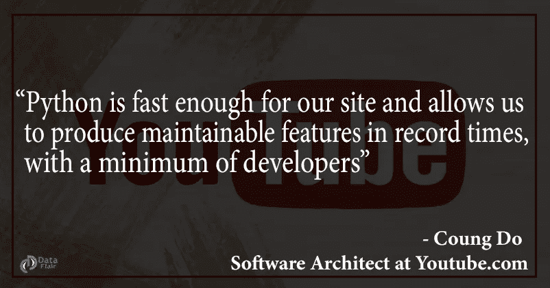
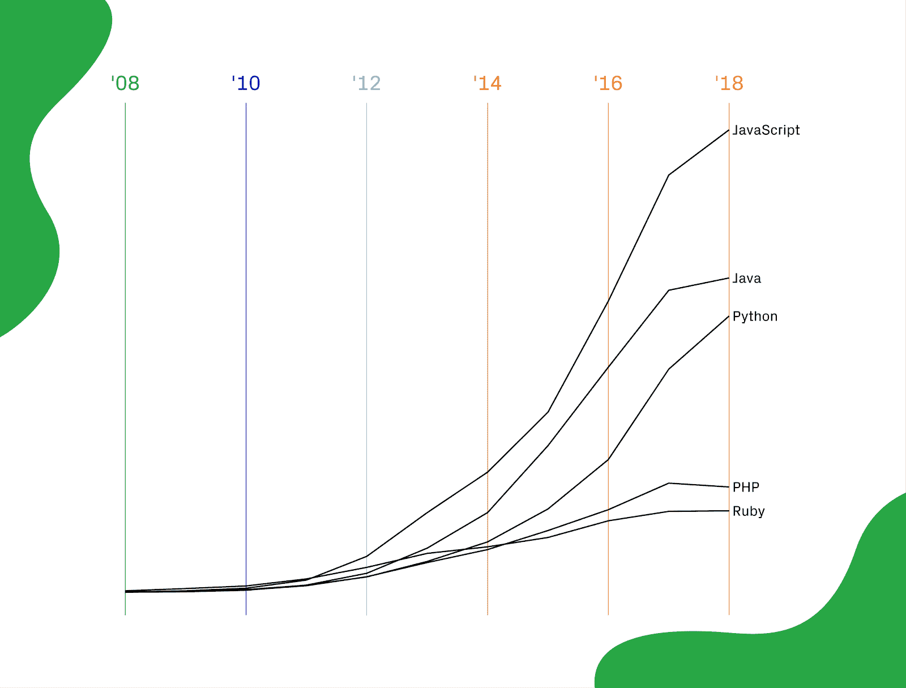

# 我们生活在“Python 时代”

> 原文：<https://towardsdatascience.com/we-are-living-in-the-era-of-python-bc032d595f6a?source=collection_archive---------4----------------------->

## Python 如此受欢迎的原因

# 你知道吗？

Python 编程语言一点都不年轻了。它于 1991 年由荷兰程序员**吉多·范·罗苏姆**首次发布。

python 最有趣的一点是，它实际上是一个人的作品。大多数其他流行的编程语言都是由雇佣大量专业人员的大公司开发和发布的。 **Python 是个例外！**

当然，他并没有独自开发和进化 python 的所有组件。这是一个开源项目，成千上万的人为 Python 的开发做出了贡献。尽管 python 在过去的几年里有了很大的发展，但它仍然被广泛地用于与当时相同的目的。

从[***完美的 Python 指南***](https://data-flair.training/blogs/learn-python-notes/) 开始您的旅程

# Python 的诞生

开发 python 的主要目的是帮助程序员为小型和大型项目编写清晰的逻辑代码。这就是它在开发者中如此受欢迎的原因。Python 是如此多功能，它被用于 Web 开发、游戏、构建桌面应用程序的脚本和 GUI、配置服务器、执行科学计算和数据分析。
**Python** 简直什么都能用！

在所有主要的编程语言中，Python 在过去的几年中发展迅速。关于编程语言增长的栈溢出调查显示了 python 的增长是如何在它的竞争对手中攀升到顶端的。

**你知道吗？** [***蟒与网飞***](https://data-flair.training/blogs/python-at-netflix/) 令人不寒而栗

那么，这些年到底发生了什么？python 怎么成长这么快？

让我告诉你一些推动 python 语言使用的技术。

# **Python——人工智能的最佳选择**

人工智能(AI)和机器学习(ML)技术的进步已经超越了科幻小说。正如克里斯·达菲在他的书《超人的创新》中所说，

人工智能的唯一限制是人类的想象力

如今，随着数据量和密度的膨胀，人工智能和机器学习正在帮助处理过去似乎不可能完成的任务。所有的科技巨头(脸书、微软、谷歌、亚马逊)都在广泛工作，并为促进这些领域做出贡献。

根据研究，AI 和 ML 从业者更喜欢使用 python，因为 python 提供了易于编码和可读性，这样我们就不会陷入语言的构造中。

**用这些** [***的顶级 Python 项目***](https://sites.google.com/view/learn-python-data-science/home) 在 Python 中大显身手

# Python 是数据科学的支柱

这个世界充斥着大量的数据。全球范围内出现了虚拟的数据海啸，而且每天都在变得越来越大。我们所做的一切现在都被生成为数据。从拍照到在社交媒体上发表评论，从在网上搜索东西到网上购物，从股市价格到天气预报，一切都在被记录。

到 2020 年，预计每天将产生 44zb 的数据。这个数字意味着可观测宇宙中的恒星数量增加了 40 倍。但是，如果我们不能收集、整理、分析和应用数据来造福社会，那么数据就毫无用处。这就是数据科学的用途。

ython 在数据科学生命周期中被大量使用。python 社区开发了优秀的库，如 Numpy、Pandas、sci-kit-learn 等，用于处理数据。收集数据、清理数据集、提取重要特征、构建机器学习模型和用 graph 可视化结果，python 提供了一组丰富的功能来执行所有这些任务。

Indeed 的经济学家、《Indeed 报告》的作者安德鲁·弗劳尔斯(Andrew Flowers)说:“数据科学家的工作变得越来越性感。”。“越来越多的雇主希望雇佣数据科学家。”

Github 每年都会进行年度调查，Octoverse 2018 报告的状态向我们展示了近年来 python 的使用是如何增加的。

像 Spotify、网飞、Quora、脸书和谷歌这样的 ig 公司已经深入开发了 Python。Google 从一开始就支持 Python。它现在是谷歌官方的服务器端语言。他们将许多用 Bash 或 Perl 编写的脚本重新编码成 Python。

谷歌的研究主管彼得·诺维格说

**“Python 从一开始就是 Google 的重要组成部分，随着系统的成长和发展，它将一直保持下去。如今，数十名谷歌工程师使用 Python，我们正在寻找更多掌握这种语言的人。”**

Spotify 和网飞非常依赖 python 来分析他们在服务器端拥有的大量数据。分析来自数百万用户的信息使他们能够向每个用户提出更好的建议，这就是他们如何赚取数十亿美元的原因。

# 尾注

ython 并不是一门年轻的语言，它已经发展了很多年，并将在未来几年保持其趋势地位。这是 Python 的世界，IT 行业就生活在其中。
花时间学习 Python 编程语言是你能做的最好的投资。

**那么，你还在等什么？**

[***花了一些时间与 Python***](https://data-flair.training/blogs/python-tutorials-home/)