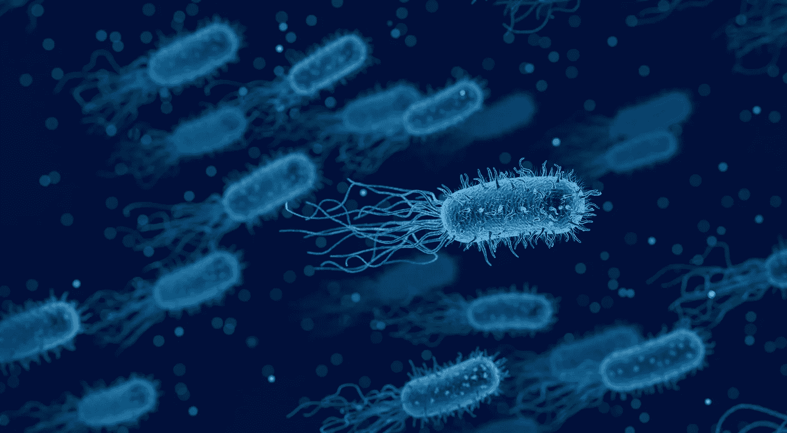
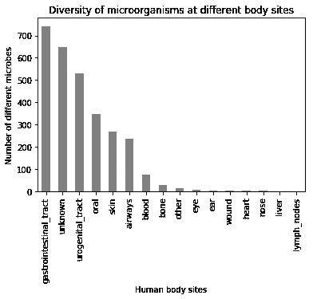
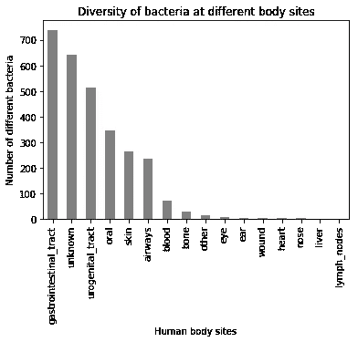
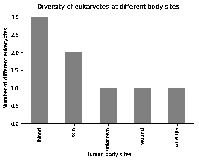
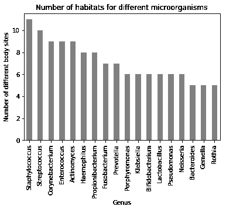
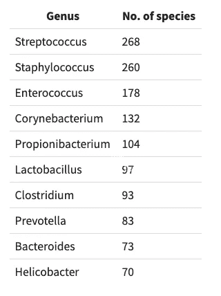

# 在我们的身体里，我们并不孤独:这是数万亿微小的朋友和敌人的家

> 原文：<https://towardsdatascience.com/we-are-not-alone-in-our-body-a-home-to-trillions-of-tiny-friends-and-foes-f5561aa04724?source=collection_archive---------36----------------------->

Image by [Arek Socha](https://pixabay.com/users/qimono-1962238/?utm_source=link-attribution&utm_medium=referral&utm_campaign=image&utm_content=3662695) from [Pixabay](https://pixabay.com/?utm_source=link-attribution&utm_medium=referral&utm_campaign=image&utm_content=3662695)

我们每个人体内的微生物细胞比人类细胞多十倍。这些共生体(与你生活在一起的有机体)控制着健康、疾病和我们行为的一系列功能。它们参与的一些功能是食物消化、药物代谢、调节代谢率、免疫、记忆、行为和肥胖。人类微生物群是由我们体内所有这些微生物群落的基因组成的。这片微生物海洋包括细菌、真菌、病毒、古生菌和原生生物。我们两个人之间的基因差异是微小的，但是我们的微生物菌落所带来的差异却是巨大的。由于其对人类健康和生存的巨大影响，美国国立卫生研究院(NIH)于 2008 年启动了人类微生物组项目(HMP ),以描述人类微生物组的特征并阐明其在健康和疾病中的作用。这个项目涉及来自 80 多个组织的 300 名科学家。他们分析的样本来自健康和患病的个体，数据被公开([链接](https://www.hmpdacc.org/hmp/catalog/grid.php?dataset=genomic))。

所以，我的分析从这里开始:

在数据中发现了 2906 种不同的微生物，包括 2873 种细菌，但只有少数非细菌微生物，包括 8 种真核生物(这里仅列出真菌)、6 种病毒和 2 种古菌。

这些登记在册的 2906 种微生物明显存在于 16 个不同的人体部位，每一种在我们体内或体外都有自己特定的家。每个含有微生物的器官/身体部位就像一个独立的生态系统，微生物的多样性互不相同。正如所料，我们的肠道是各种微生物的家园，在那里可以找到 742 种不同的微生物物种(在人类微生物组项目中列出的物种中)。超过 25 英尺长，我们的肠道拥有大约 100 万亿个细菌细胞。它被认为是地球上生态最丰富多样的栖息地之一。我们所知的人类微生物群的几乎所有健康益处都来自于居住在我们肠道中的这个群体，因此越来越多的研究针对肠道微生物群。与肠道不同，肝脏和淋巴结显示出较少的多样性和密度。仅病原体，*坏死梭杆菌亚种。据报道，胃底肠球菌*和*粪肠球菌 TX4248* 分别存在于肝脏和淋巴结中。

现在让我们考虑不同领域在人体中的位置——细菌、古细菌、真核生物。如上所述，细菌存在于所有 16 个被研究的人体部位中，大多数存在于肠道中，而真核生物存在于血液、皮肤、未知部位、伤口和气道中，古菌存在于肠道中，病毒的位置主要在未知部位(除了这些词已经暗示的以外，我找不到对“未知部位”的任何解释)。

所有的生物都是根据二项式命名法命名的，包括两个部分。第一个是生物所属属的名称。在分类学中，属是一小组密切相关的生物。第二个是特定名称，即该属内的生物物种，这将该物种与属于该属的其他生物区分开来。例如，人类的学名是*智人*，其中*智人*是人类所属的属，*智人*是指这个属中的人类物种。

根据可用的 HMP 数据，*葡萄球菌*是最普遍的属，在 11 个研究身体部位存在，其次是*链球菌*，在 10 个部位存在。大多数*葡萄球菌*是无害的，但有些像*金黄色葡萄球菌*一样，存在于人体皮肤上，是条件致病菌(即当我们的身体抵抗力较低时会伤害我们)，会导致皮肤感染、呼吸道感染和食物中毒。

该数据列出了 242 种存在于人体内或人体上的不同种类。其中，*链球菌*是最常见的菌属，有 268 种，其次是*葡萄球菌*有 260 种。*链球菌*包括病原和共生(与我们有长期共生关系)物种。他们负责的一些常见疾病包括咽炎、脑膜炎、红眼病、细菌性肺炎。

人类有 20500 个基因，根据这一数据，人类拥有 4286967 个额外的微生物基因，比我们的基因数多 209 倍。链霉菌属。HGB0020 有 8490 个基因，是所有微生物菌落中基因数最多的。

我们身体中的微生物质量大约相当于我们大脑的质量。就像任何器官一样，它也具有重要的功能，因此根据许多研究人员的说法，称它为附加器官并没有错。此外，我们有责任通过避免服用广谱抗生素和健康饮食来保护这一特殊器官。

数据和分析可以在我的 [github 资源库](https://github.com/bbhatt001/The-Human-Microbiome-Project)中找到。