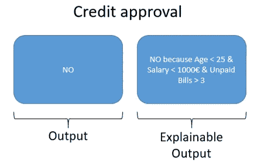
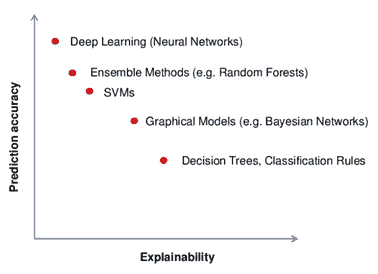
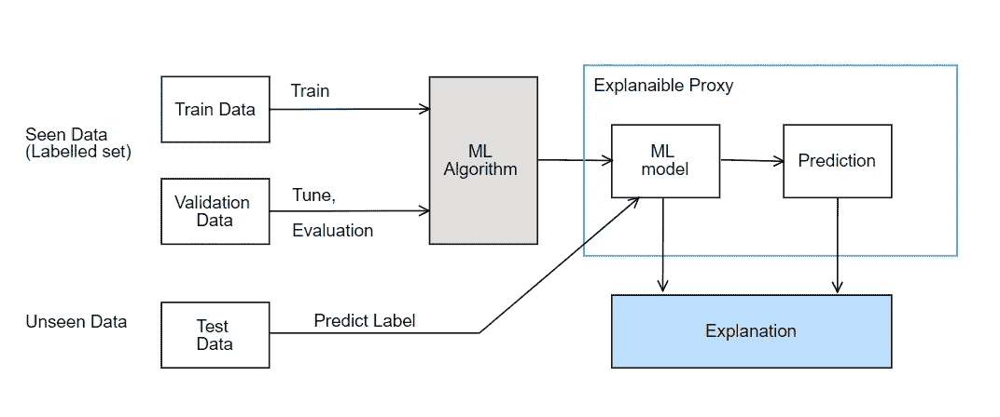

# 我们准备好机器学习了吗？

> 原文：<https://towardsdatascience.com/we-are-ready-to-ml-explainability-2e7960cb950d?source=collection_archive---------20----------------------->

新的欧盟通用数据保护条例( [GPDR](https://eugdpr.org/) ，通用数据保护条例)包括如何使用机器学习的规定。这些规定旨在将个人数据的控制权交给用户，并引入解释权。

European Union HQ

***解释权*** 是欧盟为了让人工智能更加透明和道德而提出的要求。这一规定促进了算法的建立，以确保对每一个机器学习决策的解释。

可解释性对于一个解释应该是什么样子仍然没有共识。例如，传统的 ML 模型，在大多数情况下，仅限于产生二进制输出或评分输出(准确性，F1-评分…)给定一个 ML 模型来授予信用，其二进制输出为是:批准信用/否:拒绝信用。另一方面，一个更容易解释的输出将告诉我们为什么信贷被批准或拒绝(图 1)

Figure 1: Example of an explainable output

使用决策树或分类规则可以很容易地生成前面的输出。但是很难从像神经网络或梯度提升分类器(这些算法也被称为黑盒算法)这样的高精度 ML 算法中生成/提取这种解释。

如果我们限制 ML 模型的可解释性，例如决策树或分类规则；欧洲会输掉[人工智能竞赛](https://www.euronews.com/2019/02/05/the-eu-s-softball-approach-to-artificial-intelligence-will-lose-to-china-s-hardball-view)。这种可解释系统的缺乏转化为欧盟对研究可解释系统的迫切需求:在不牺牲可解释性的情况下获得高预测精度。

­

Figure 2 : Prediction accuracy versus Explainability

可解释的机器学习是一个非常广泛的话题，还没有正式的定义。快速浏览一下谷歌学术就足以看出可解释性的不同定义。

**定义 1** ，理解模型做了什么或可能做了什么的科学【Leilani H. et altrum 2019】

**定义 2，**向人类解释或呈现可理解术语的能力【压轴多希-维勒兹和贝内金 2017】

**定义 3** ，使用机器学习模型提取数据中包含的领域关系相关知识【W. James Murdoch et altrum 2019】

Figure 3: Explainability Machine Learning as a Post Hoc Analysis

即使是定义的细微差别也很容易理解什么是可解释的机器学习(至少从理论的角度来看)。近年来出现了像[莱姆](https://github.com/marcotcr/lime)和 [SHAP](https://github.com/slundberg/shap) 这样的算法，试图提供事后分析的解释(图 3)。

这两个工具是开始研究可解释性的一个很好的起点，但不足以完成 GPDR 框架。此外，它不存在解释的正式输出。没有一个比较解释的标准可以肯定解释 A 比解释 b 更好。

直到一个可解释性的一般框架仍然是一条漫长的道路。可解释性框架需要完成的一些洞见如下【压轴多希-维勒兹和 Been Kim 2017】:

- **公平**:受保护的群体不会受到某种形式的歧视(明示或暗示)。

- **隐私**:该方法保护敏感信息，每个预测都独立于其他观察

- **可靠性和稳健性**:解释必须根据输入变化而发展。

- **因果关系**:暗示由于扰动导致的预测输出变化将发生在真实系统中。

- **可用和可信**:框架协助用户完成任务。在其他任务中，可信指的是拥有用户的信任。

# 参考

走向可解释机器学习的严格科学(终曲多希-维勒兹和贝金，2017 年)

可解释的机器学习:定义、方法和应用(W. James Murdoch et altrum，2019)

解释解释:机器学习的可解释性概述(Leilani H. Gilpin et altrum，2019)

解释模型预测的统一方法(Scott M. Lundberg 和 Su-In Lee，2017 年)