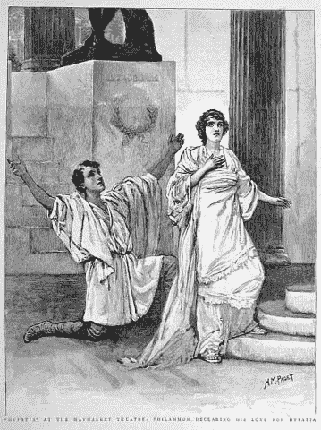

# 我们必须在为时已晚之前防止数据伪科学

> 原文：<https://towardsdatascience.com/we-must-prevent-data-pseudoscience-before-its-too-late-86b1fc50c970?source=collection_archive---------16----------------------->

**Iceberg, right ahead!** [Image by [j.davis](https://www.flickr.com/photos/97786474@N00/) via Flickr]

直到最近，人们还可以选择生活在“五大”科技公司的势力范围和影响力之外。你可以使用旧翻盖手机与朋友和家人通话，在当地拥有的夫妻店用现金支付，用纸和笔阅读和写作，使用巨型地图导航(然后在试图重新折叠时失去理智)，并使用美国邮政与朋友和家人通信。

但是，随着越来越多的科技博客作者[发现](https://motherboard.vice.com/en_us/article/ev3qw7/how-to-quit-apple-microsoft-google-facebook-amazon)，那些日子很快就要结束。零售商正在远离现金——商业的命脉。不仅 95%的招聘人员使用 LinkedIn 寻找候选人，而且截至 2019 年 1 月，拥有 LinkedIn 档案的美国工人比活跃在平民劳动力中的美国工人多近 2700 万。甚至数字工具的创造者自己也在努力寻找一种方法来拔掉 T21 的电源。

虽然上面的例子是头条新闻，但隐藏在表面之下的是更大的风险:看不见的和[通常不可知的算法](https://www.technologyreview.com/s/608011/secret-algorithms-threaten-the-rule-of-law/)，这些算法利用从面向消费者的工具和服务中生成的数据和元数据来做出对人类日常生活产生重大影响的决策(健康、金融、新闻、社交反馈等)。

这些趋势引出了三个非常重要的问题:

1.  我们如何确保[历史上的不公平](https://www.wired.com/story/ideas-joi-ito-insurance-algorithms/)和认知偏见不会“融入”这些算法，不管[是有意还是无意](https://www.jstor.org/stable/10.5325/jinfopoli.8.2018.0078#metadata_info_tab_contents)，以某种方式[造成物质伤害](https://www.nytimes.com/2015/07/10/upshot/when-algorithms-discriminate.html)？
2.  我们如何确保[垃圾科学](https://fivethirtyeight.com/features/statisticians-found-one-thing-they-can-agree-on-its-time-to-stop-misusing-p-values/)、[不可重复的研究](https://www.npr.org/sections/health-shots/2018/08/27/642218377/in-psychology-and-other-social-sciences-many-studies-fail-the-reproducibility-te)和[无统计学意义的民意调查](https://www.acsh.org/news/2016/10/19/polls-are-not-rigged-they-also-arent-scientific-10329)不被别有用心的人武器化？
3.  我们如何确保美国或任何国家在数字经济中保持竞争力和创新力，同时保护和尊重隐私？

# 最起码可行的前进道路

Image by [Simon](https://pixabay.com/users/Simon-3/) via Pixabay

这不是我们第一次发现自己处于道德、技术和商业的交汇点。当这种冲突发生时，两种类型的解决方案被用来创建透明的、基于信任的市场:自上而下的监管和自下而上的运动。

一个成功的自上而下方法的好例子是[汽车](https://www.nytimes.com/2011/12/11/magazine/stop-sign.html)。随着新技术变得足够先进，以至于不负责任地使用时会致命，我们集体决定([不顾行业](http://articles.latimes.com/1985-02-19/news/mn-546_1_seat-belts)的反对)定义道路规则:我们设定速度限制，定义标准标志，建立许可要求，并要求某些安全功能，如安全带和安全气囊。随着新的消费者安全技术，如[备用摄像头](https://www.usatoday.com/story/money/cars/2018/05/02/backup-cameras/572079002/)，被证明更加有效，这一过程仍在不断发展。

然而，自顶向下的路线只有在满足三个条件时才有意义:

1.  这种需要对每个人来说都是显而易见的。
2.  该解决方案很容易被非专家沟通和理解。
3.  变化的速度很慢，足以让立法者在制定规则之前获得技术本身的工作知识。

当这些条件没有得到满足时，专家和从业者自己必须走到一起*相互公开*就如何定义“**最低可行伦理**”达成一致，这是平衡消费者的安全与企业的利润动机和企业家的创造力所必需的。

自古以来就认识到需要形成自下而上解决方案。医生有[希波克拉底誓言](https://www.nlm.nih.gov/hmd/greek/greek_oath.html)。工程师有阿基米德誓言。是时候让数据科学家们立下自己的誓言了。

如果做得好，誓言将增加对机构、技术和算法的信任，消除采纳和使用数字生态系统的摩擦，让所有人都能从数字革命中受益。

> 说到数字技术，信任是新的货币。
> 
> —塞特亚·纳德拉，微软 via [SmartCompany](https://www.smartcompany.com.au/startupsmart/advice/startupsmart-growth/startupsmart-innovation/microsoft-ceo-satya-nadella-on-our-worlds-future-trust-is-the-new-currency/) 首席执行官

毕竟，如果我们看不到香肠是如何制作的，即使是我们中最勤奋的人也可能成为操纵和 T2 误传的受害者。

# 希望的灯塔:夸张的誓言

Hypatia at the Haymarket Theatre, H. M. Paget via Wikimedia Commons

T4:伊帕蒂亚是一位哲学家、数学家和天文学家，生活在公元前 400 年左右的埃及亚历山大。虽然她的大部分传说很可能是杜撰的，但人们相信希帕提娅的死导致了亚历山大图书馆的焚毁和古典时代的终结。

除了对数学和科学的贡献，希帕提娅还宣扬了两个关键原则，这两个原则使她有资格承担数据科学誓言的衣钵:

1.  那些有权力和知识的人有责任以高道德标准领导，并为他们的人类同胞的利益而行动。
2.  所有的“恶”的根源是没有光。

为了启动这场自下而上的运动，有一份关于数据科学对 Change.org 的夸张宣誓的初稿。

> 通过签署这份契约，我在此承诺维护希帕提娅、哥白尼、艾萨克·牛顿爵士、艾米莉·杜·夏特莱、乔纳斯·索尔克、居里夫人、弗朗西斯·培根爵士、玛丽·萨默维尔、多萝西·霍奇金、内特·西尔弗以及无数其他已知和未知的科学家和数学家的悠久传统，他们拒绝让强者操纵和剥削弱者。
> 
> 我，心智健全，相信科学、真理和正义的原则，在此发誓只使用我的能力来造福人类，不伤害数据。我将坚决反对利用我的数学和技术能力或其成果来任意和故意地:
> 
> 1.通过参与创建、分析或传播不可复制且无统计学意义的研究和调查，歪曲或帮助歪曲“真相”。
> 
> 2.通过将预定义的数据类型或数据源与其他数据类型或数据源区别对待，实现对受保护组的区分或造成不同的影响。
> 
> 3.通过使用、出售或存储通过不道德或非法手段获取的数据或元数据，侵犯和/或忽视基本的隐私权。

# 一起打开灯

Image by [Skitterphoto](https://www.pexels.com/@skitterphoto) via Pexels

如果你是统计学、数学或数据科学的从业者，或者为一个在盈利或非盈利部门雇佣统计学家、数学家或数据科学家的组织工作，签署誓言并公开鼓励其他人也这样做。

虽然前面的路很长，我们要对抗的力量非常强大，但无所作为不再是一种选择。