# 用数据科学方法进行天气预报

> 原文：<https://towardsdatascience.com/weather-forecasting-with-data-science-approaches-cb8f2afd3f38?source=collection_archive---------5----------------------->

在本文中，我将展示我们如何使用数据科学算法进行天气预报，并比较一些分类和回归任务的框架。

[Central Otago District, New Zealand](https://unsplash.com/search/photos/central-otago-district%2C-new-zealand)

天气预报*是一项相当困难的任务。维基上说，“* **天气预报**是应用科学技术预测给定**位置**和**时间**的大气**状况。**天气预报**是通过收集**关于给定地点**当前大气状态**的定量数据**并利用气象学预测大气将如何变化而做出的。”**

所以总的来说，天气预报是关于大气的数据。当然，我不会模拟大气条件，但我可以使用大量的数据进行天气预报。在本文中，我将尝试预测未来 3 小时的降水量。我将尝试用两种方法来解决这个任务—作为二元分类(1-降水量，0-无降水量)和回归，其中我将尝试预测以毫米为单位的降水量。

那么，什么是沉淀呢？还是在 [Wiki](https://en.wikipedia.org/wiki/Precipitation) 里问吧。在气象学中，**降水**是大气中的水蒸气在重力作用下凝结的产物。降水的主要形式包括毛毛雨、雨、雨夹雪、雪、霰和冰雹。当大气的一部分被水蒸气饱和，水凝结并“沉淀”时，就发生了降水。让我们看一下图解，它显示了水循环和降水发生的过程。

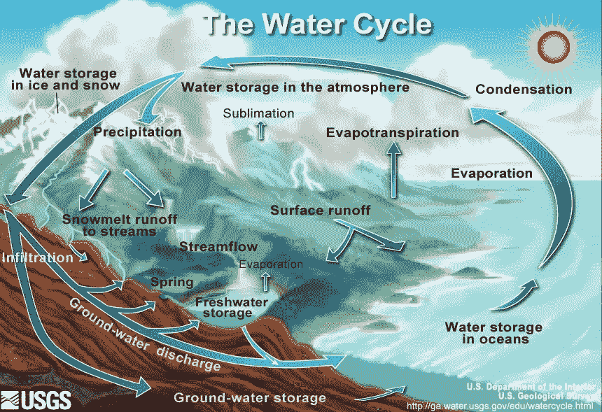

Condensation and coalescence are important parts of the water cycle.

当然，降水的发生是一个非常复杂的过程，这些图式并不能显示整个过程。维基说，“降水是水循环的主要组成部分，是地球上大部分淡水沉积的原因。产生降水的机制包括对流、层状和地形降雨。对流过程涉及强烈的垂直运动，可在一小时内导致该位置的大气翻转，并导致强降水，而层状过程涉及较弱的上升运动和较不强烈的降水。根据降水是以液态水、与地表接触时冻结的液态水还是冰的形式降落，降水可以分为三类。不同类型降水的混合物，包括不同类别的降水，可以同时降落。液态形式的降水包括雨和毛毛雨。在冰点以下的气团中接触时冻结的雨或毛毛雨被称为“冻雨”或“冻雨”。降水的冻结形式包括雪、冰针、冰粒、冰雹和霰

# 探索性数据分析

所以，让我们试着找一些数据，试着预测这种自然现象。在我的实验中，我将使用一个气象站的数据。让我们检查数据的标题。

所以，我得到了 **29 个变量**和 **22 064 个记录**。让我描述一下列名:

*   **T** —地球表面以上 2 米高度的空气温度(摄氏度)；
*   **Po** —气象站级别的大气压力(毫米汞柱)；
*   **P** —大气压力降低至平均海平面(毫米汞柱)；
*   **Pa** —压力趋势:最近三个小时的大气压力变化(毫米汞柱)；
*   **U**——地面以上 2 米高度的相对湿度(%)；
*   **DD** —在观测前 10 分钟内，地球表面以上 10-12 米高度的平均风向(罗经点);
*   **Ff**——观测前 10 分钟内地面以上 10-12 米高度的平均风速(米/秒)；
*   **ff10**——观测前 10 分钟内，地面以上 10-12 米高度的最大阵风值(米/秒)；
*   **ff3**——观测周期内，地面以上 10-12 米高度的最大阵风值(米/秒)；
*   **N** —总云量；
*   **WW** —从气象站报告的当前天气；
*   **W1** —过往天气(观测时段之间的天气)1；
*   **W2** —过往天气(观测期间的天气)2；
*   **Tn** —过去一段时间(不超过 12 小时)的最低气温(摄氏度)；
*   **Tx** —过去一段时间(不超过 12 小时)的最高气温(摄氏度)；
*   **Cl** —层积云、层云、积云和积雨云属的云；
*   **Nh** —存在的所有 CL 云的量，或者，如果不存在 CL 云，存在的所有 CM 云的量；
*   **H**——最低云层底部的高度(米)；
*   **Cm**——高积云、高层云和雨层云属的云；
*   卷云、卷积云和卷层云属的云；
*   **VV** —水平能见度(公里)；
*   **Td** —地球表面以上 2 米高度的露点温度(摄氏度)；
*   **RRR**——降水量(毫米)；
*   **tR**——累计规定量降水的时段；
*   **E**——地面无积雪或可测冰盖的状态；
*   **Tg**——夜间土壤表面最低温度。(摄氏度)；
*   **E**——地面有雪或可测冰覆盖的状态；
*   **sss** —积雪深度(厘米)。

首先，我想知道这个数据集的摘要，然后选择一个有用的列进行进一步的分析。

我用平均值替换空数值，然后我可以可视化这个数据集。先说温度(T)。

首先，我想画出温度的时间序列。在图上，你可以看到“2012 年 2 月 1 日”到“2019 年 7 月 13 日”期间的温度变化。

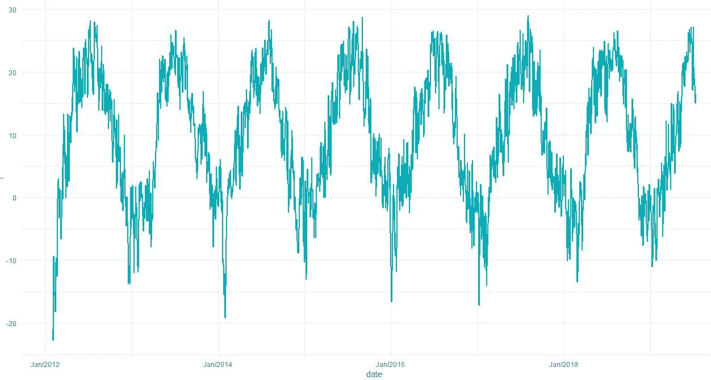

在这里，我们可以找到我们的数据季节性，但我想检查它更详细。为了检查每年的变化，我画了一个方框图。

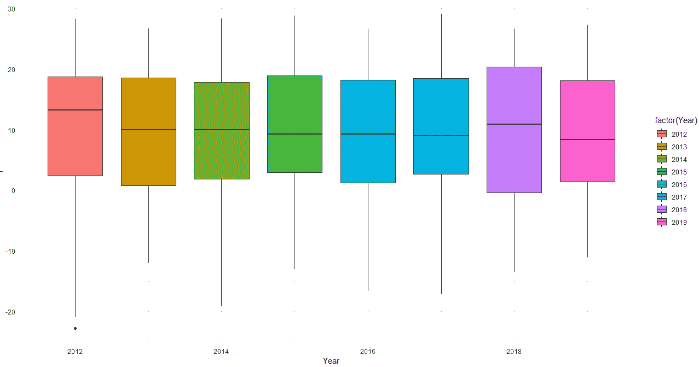

这张图表上的变化很小，所以让我们按月份和年份来检查一下。

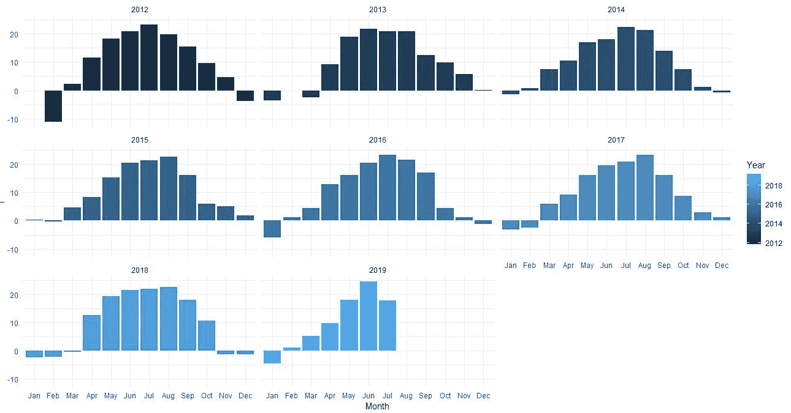

哇，有趣的是发现大多数年份的夏天都是相似的，但是秋天和春天是不同的。此外，绘制整个时期内最高、最低和中间温度的趋势图也很有意思。

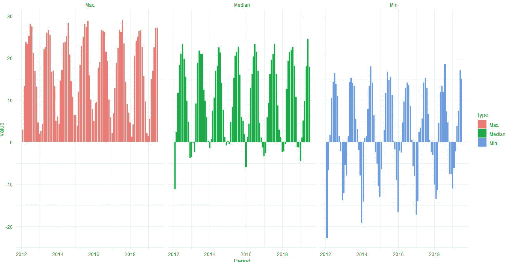

有趣的是，最近几年的最低温度变高了。有关更多细节，您可以在下一个表格中查看。

我的数据分析的下一阶段是计算所有数值之间的相关性。

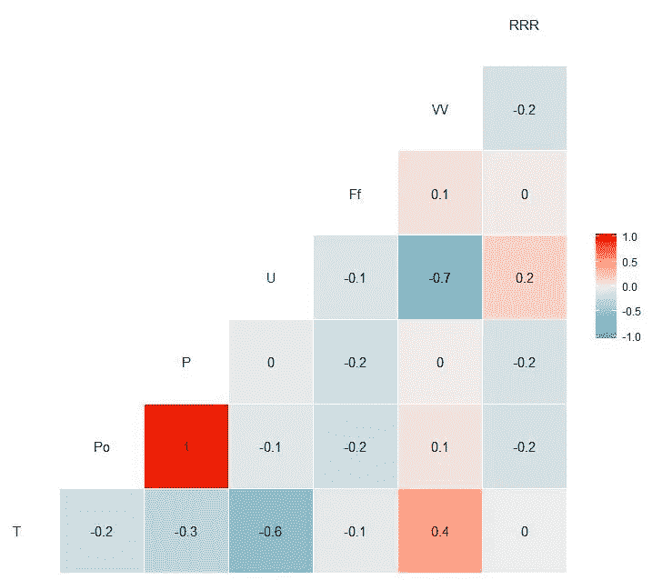

在这张图上，我们可以看到三个有趣的关联:

*   温度与水平能见度呈正相关(0.4)；
*   温度和相对湿度呈负相关(-0.6)；
*   相对湿度和水平能见度之间的负相关(-0.7)。

此外，我想分析更详细的降水量，并绘制类似于温度的图表。

让我们从时间序列图开始。

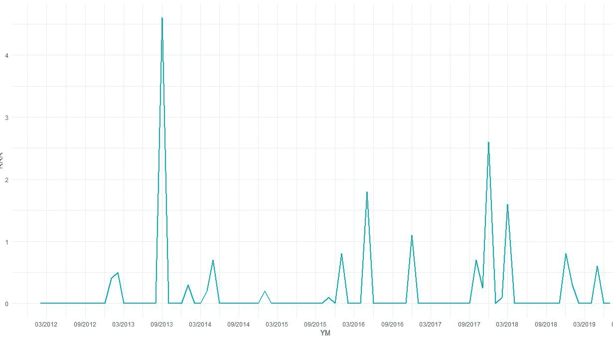

2013 年秋季的总降水量是近 5 年来最高的。让我们计算非零降水值的汇总统计数据。

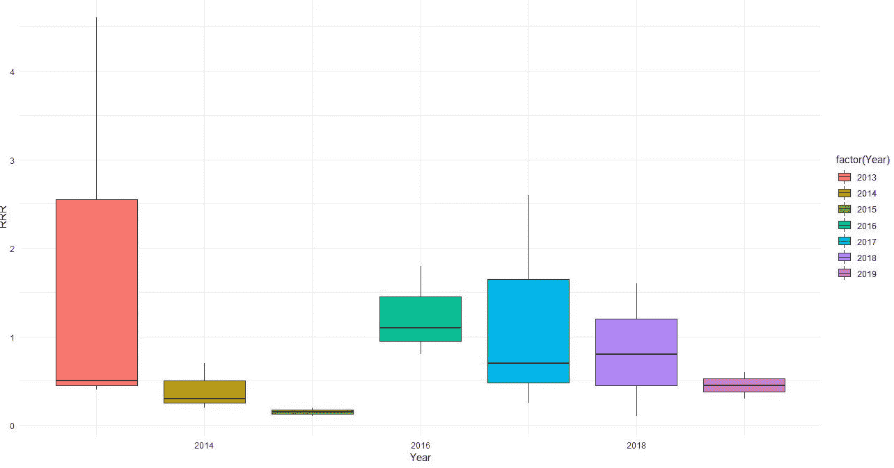

我还想知道整个时期降水量的汇总值。

这里我们可以看到，2014 年和 2015 年是这一时期降水量的最低水平。

分类数据及其对降水的影响如何？先说风向(DD)。数据集中有 16 个不同的方向和一个无风事件。

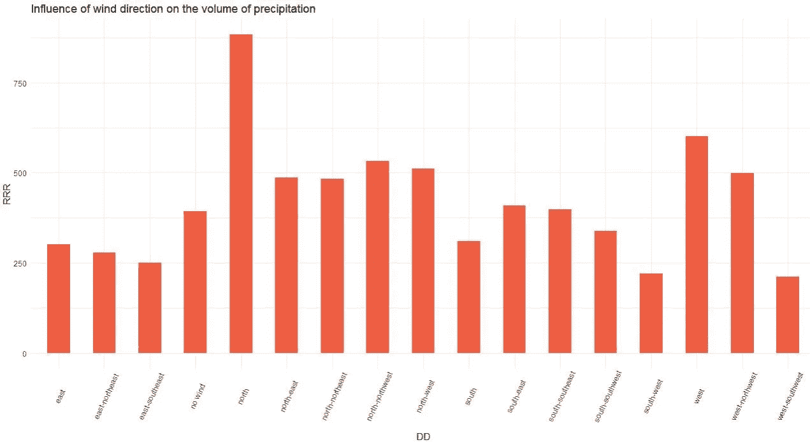

我们可以看到，大部分降水可能来自北部或西北部。

下一阶段是对云的分析。首先，我想分析有云的一天的计数和分析云的特征对降水的影响。

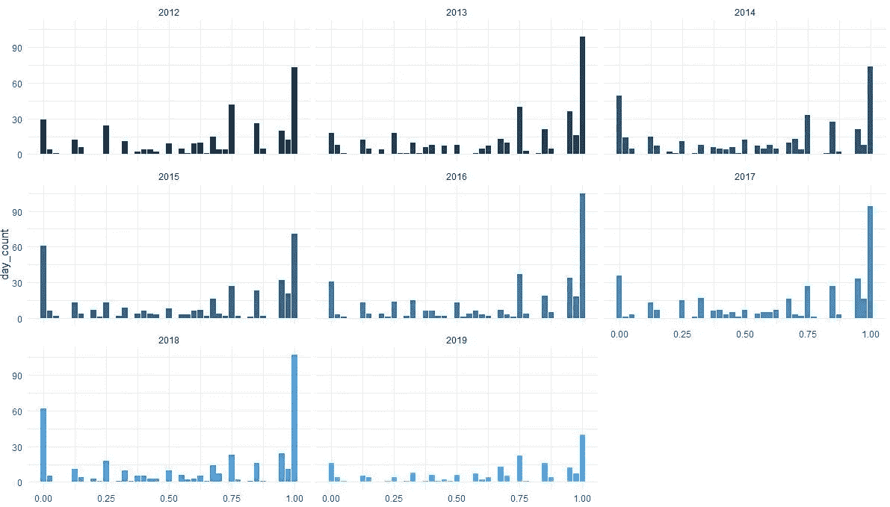

总的来说，云量是一个非常相似的时期，而且大部分时间都没有变化。我们也来分析一下云的特性。

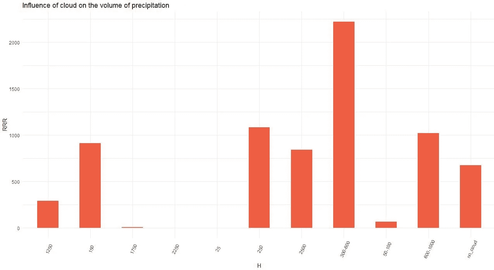

这张图表显示，大部分降水伴随着 300-600 米高的云。这就是我在探索性数据分析中想要的。

# 特征工程和目标准备

首先，我计算日期特性—季度、月、周、工作日、月日、年日、小时。所有这些特性我都可以用 [lubridate](https://lubridate.tidyverse.org/) 库来计算。

特征工程的第二阶段是计算某些数字特征的滞后值。对于我的分析，我想计算 T，Po，P，U，Ff，N，Nh，VV 和我的目标 RRR 的滞后值。某一天会有 3 个滞后，前一天会有 1 个滞后。最终数据集:

因此，是时候为训练、验证和测试子集拆分数据集了。“2012–02–02 02:00:00”-“2018–12–31 23:00:00”范围内的训练数据集，“2019–01–01 02:00:00”-“2019–03–31 21:00:00”范围内的验证数据集，以及“2019–04–01 00:00”-“2019–07–19

此外，检查子集中类的平衡和回归任务目标值的分布也很重要。

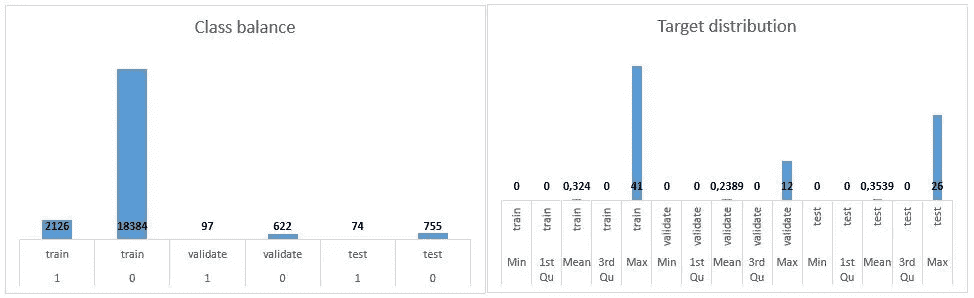

因此，结果是，我们得到了用于分类的不平衡数据集和用于回归的稍微不同的分布。

# 建模

***分类***

好了，开始建模吧。我想测试的框架是 H2O。

[H2O](http://docs.h2o.ai/h2o/latest-stable/h2o-docs/index.html) 是一个完全开源的分布式内存机器学习平台，具有线性可扩展性。H2O 支持最广泛使用的统计&机器学习算法，包括梯度增强机器、广义线性模型、深度学习等。H2O 还拥有行业领先的 AutoML 功能，可自动运行所有算法及其超参数，生成最佳模型排行榜。

在我的实验中，我想使用梯度增强机器、广义线性模型、深度学习和 AutoML。H2O 的好处之一是对因素重要性的综合分析。

我的第一个模型是——分类任务的广义线性模型。正如我们之前看到的，我们的标签是不平衡的，所以我们需要设置 *balance_classes = TRUE* 。同样为了分类，我们需要设置*family =‘二项式’*。所以，让我们构建它，看看特性的重要性。

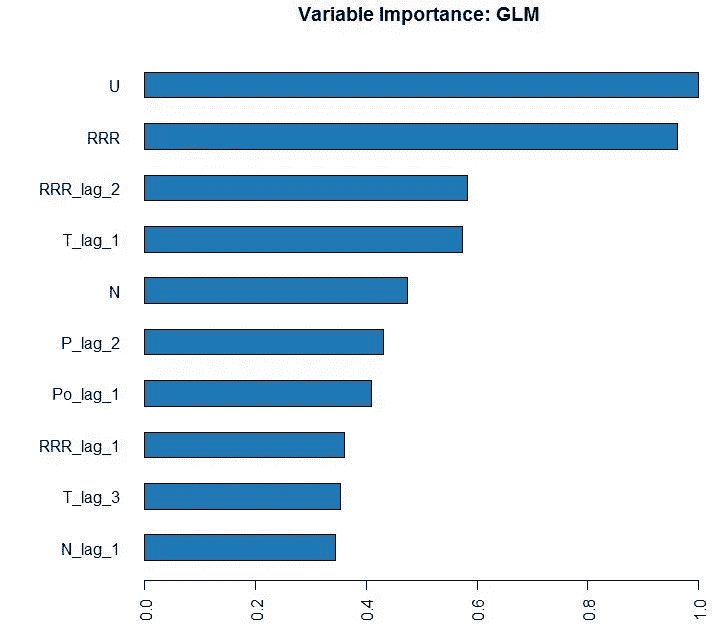

正如我们所看到的，最重要的因素是降水前一小时的湿度。准确性呢？让我们计算所有主要指标:

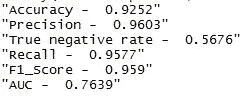

所以总的来说，我们的模型预测不错，但是我们能预测的降水量只有 56%。

让我们试试另一个模型。我的第二个模型是梯度推进机器。我还要设置 *balance_classes = TRUE* 。这些特性的重要性看起来会像:

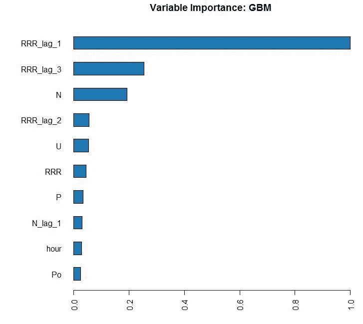

最重要的因素是降水和云量的不同滞后。这个模型的准确性如何？

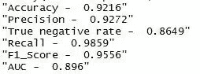

结果比较好。我们可以更准确地预测降水。我想试试更复杂的型号。这将是一种深度学习算法，H2O 也提供了这种算法。我还要设置 *balance_classes = TRUE* 。这些特性的重要性看起来会像:

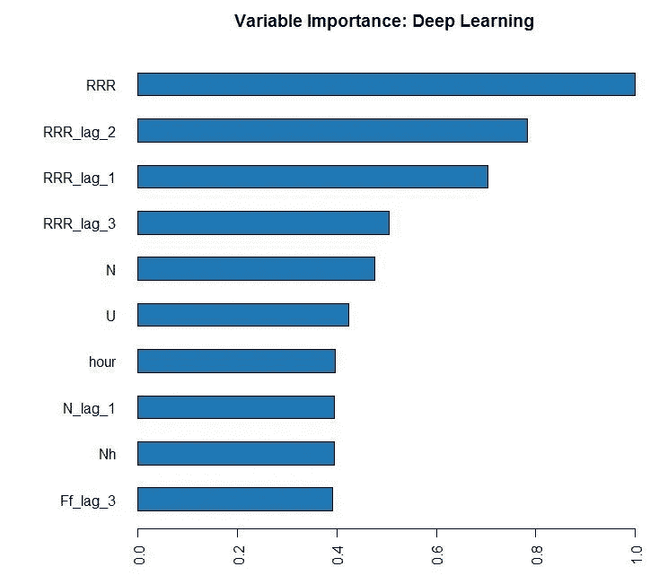

哇，这是有趣的最重要的因素，如果所有的降水滞后，然后才是湿度和云量。精确度呢:

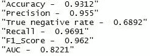

在 GBM 算法中，结果最差，这可能与我的深度学习模型过拟合有关。

H2o 也有自动机器学习。让我们建立 50 个模型，看看结果。创建的前 5 个模型—具有不同超参数的 GBM。像往常一样。让我们看看最重要的因素:

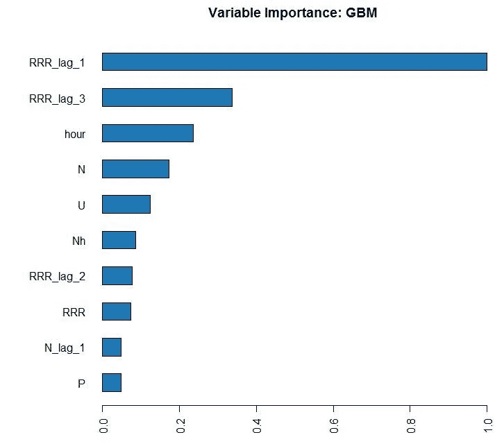

您可以看到因素重要性与我自己的 GBM 模型非常相似，那么准确性呢:

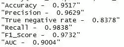

AUC 比我自己的 GBM 模型要好，但 TNR 最差。此外，它需要更多的时间进行计算。

***回归***

让我们建立回归模型，并尝试预测降水量。

我们的第一个模型是线性回归。在分类任务中，我们可以查看特性的重要性:

湿度具有最重要的值。准确性呢？在这项任务中，我想使用 3 个指标:MAPE，平均误差，均方误差。

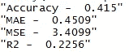

GLM 模型的结果相当糟糕。

让我们试试另一个模型——梯度推进机器。首先，我想看看这些特性的重要性:

与 GLM 模型不同，这里我们可以看到前一小时的特征**降水量最有价值。**

指标相当不错:

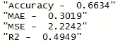

我们在分类任务中的复杂模型是深度学习。功能的重要性如下所示:

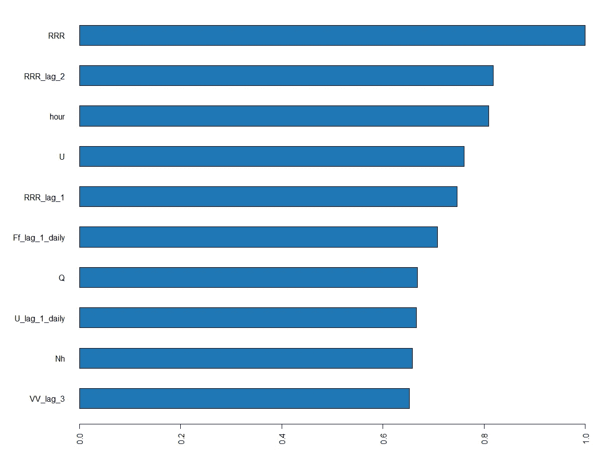

最重要的特征是前几个小时和当前几个小时的**降水量。准确性如何:**

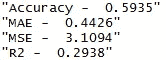

在 GBM 模型中准确性较差，我认为这是因为 DL 太复杂了。

最后一个是 AML。排名前五的车型是:

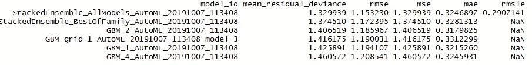

像往常一样。让我们从反洗钱角度来看 GBM 模型的最重要因素:

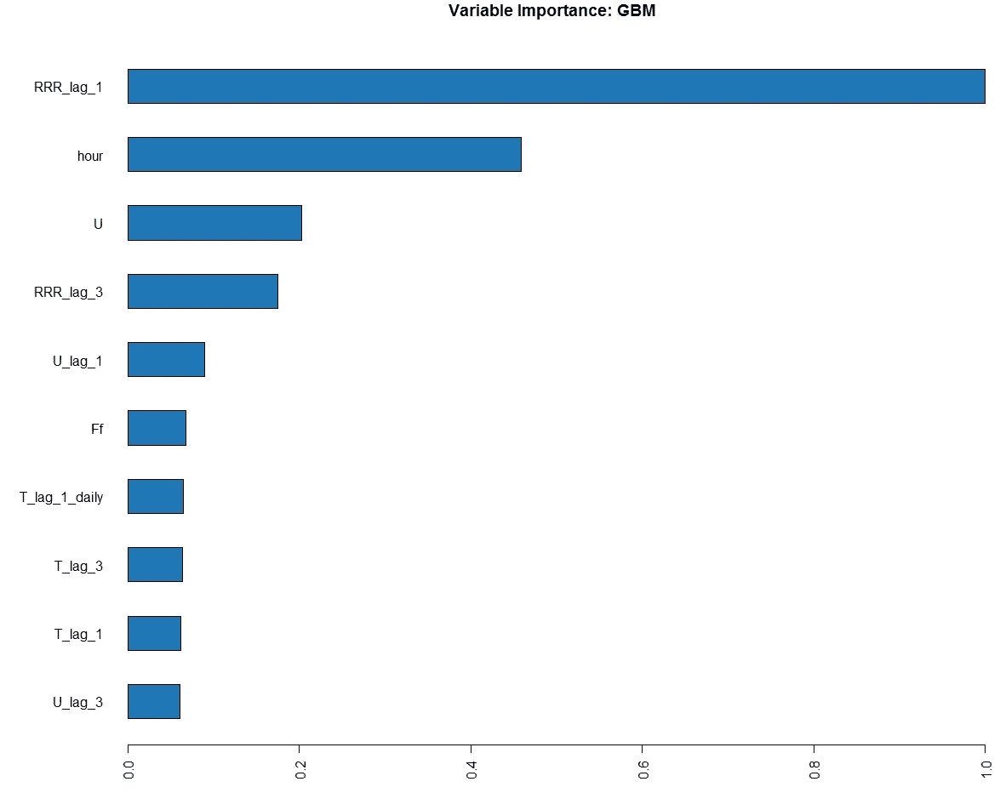

结果和我的 GBM 模型很像。

让我们看看最佳 AML 模型的结果—stacked ensemble _ all models _ AutoML:

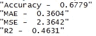

这是我创造的所有模型中最好的结果。

H2O 框架很好，也很容易使用。它可以在最短的实施时间内产生良好的效果。它还有很多超参数需要优化。

让我们试试另一个——KERAS。

[Keras](https://keras.io/) 是一个高级神经网络 API，致力于实现快速实验。能够以尽可能少的延迟从想法到结果是做好研究的关键。 Keras 具有以下主要特性:

*   允许相同的代码在 CPU 或 GPU 上无缝运行。
*   用户友好的 API，使快速原型深度学习模型变得容易。
*   内置对卷积网络(用于计算机视觉)、递归网络(用于序列处理)以及两者任意组合的支持。
*   支持任意网络架构:多输入或多输出模型、层共享、模型共享等。这意味着 Keras 适用于构建任何深度学习模型，从记忆网络到神经图灵机。
*   能够在多个后端之上运行，包括 [TensorFlow](https://github.com/tensorflow/tensorflow) 、 [CNTK](https://github.com/Microsoft/cntk) 或[theno](https://github.com/Theano/Theano)。

我想建立一个多输入多输出的神经网络。

对于输入，我想使用与 H2O 车型相同的功能。对于分类特征，我会使用实体嵌入方法。关于这种方法的更多细节，您可以在本文中阅读— [链接](https://arxiv.org/pdf/1604.06737.pdf)。

多输出帮助我同时解决 2 个任务(分类和回归)。

Keras 框架没有自己的特性重要性模块，但是你可以使用 [Lime](https://uc-r.github.io/lime) 。

让我们来看看结果:

*   分类:

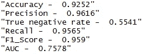

*   回归:

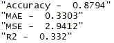

Keras 的神经网络带来了很酷的结果。这种型号比以前的型号性能好得多。

# 结论

天气预报是一项非常困难的任务。机器学习算法有助于短期预测。为了得到好的结果，我们需要在神经网络中使用滞后特征或使用 RNN 结构。

你能在 Git 仓库中找到的所有代码— [链接](https://github.com/AndriiShchur/weather-forecast.git)。