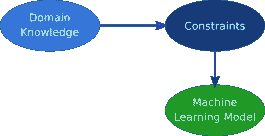
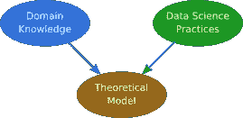
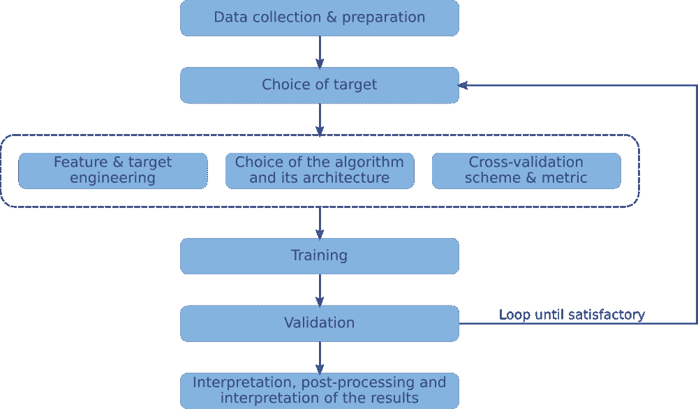
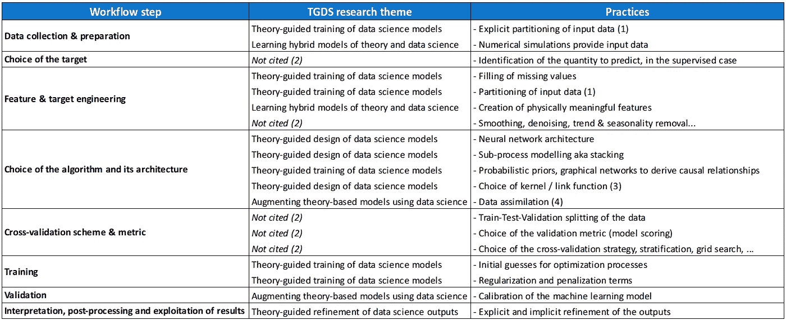

# 将机器学习融入物理学:数据科学家的观点

> 原文：<https://towardsdatascience.com/weaving-machine-learning-into-physics-a-data-scientists-point-of-view-63f60a95f5be?source=collection_archive---------23----------------------->

我是一名数据科学家，这篇文章是针对我的同行的。它主要基于 2017 年的一篇论文，名为“*理论指导的数据科学:从数据中进行科学发现的新范式*【TGDS】。[TGDS]向自然科学家展示了数据科学对他们工作的贡献。在这里，我们将讨论[TGDS]并做反向映射:我们的数据科学家的实践能在科学努力中适合哪里？我们如何向愿意将数据科学融入工作的科学家宣传自己？

数据科学现在在许多行业都很常见。数据可用性的增加，加上机器学习和一般计算的进步，是这种普遍性的主要因素。

机器学习长期以来一直被用于商业目的，由电子商务和营销等行业培育。但我们看到越来越多的应用在自然科学中，算法被用来刺激科学发现。下面是机器学习在自然科学中的一个快速、不全面的使用列表(更多细节可以在[TGDS]和[MLPHYS]中找到):

*   *粒子物理学*:探测罕见事件，其中最大的成功是发现了希格斯玻色子
*   *气候&地质*:空间&时间多尺度建模，子过程间耦合更好
*   *能源*:消耗&产量预测，产量优化
*   *流体力学*:提高数值模拟的精度，特别是在湍流等临界状态下。
*   *量子力学* : DFT 近似
*   *材料*:材料的表征(结构- >性质关联)，新化合物的发现
*   *生物学* : DNA/RNA 匹配、神经模型、基因到蛋白质表征

然而，不仅仅是把最新的机器学习算法扔进肉汤。在这里，我们处理的是物理现象，首先我们只有不完善的模型。数据科学肯定有助于改进这些数学模型。但是为了实用，我们必须确保机器学习输出在物理上是一致的。这意味着，当我们将数据和自然科学结合在一起时，必须特别小心——换句话说，将知识融入机器学习。

我们收集的文献是由来自不同领域的物理学家和工程师们制作的。一些作者已经进行了实际的实验，比较了基于物理的方法和基于数据的方法；其他人回顾了前者的结果，以便从这些不同的实验中吸取教训。根据他们的说法，当我们很好地利用数据科学时，必须遵循以下原则:

*   *效率* —当与实际数据比较时，算法必须做出好的预测(这当然不是自然科学特有的)
*   *可归纳性*——该算法肯定捕捉到了更普遍现象的“某些东西”，而不仅仅是被审查的实验
*   *可解释性*——可以从算法模型中提取“一些东西”，从而提供对物理现象的更好理解(可解释性是一个很强的假设，参见[这里的](https://blog.acolyer.org/2019/10/28/interpretable-models/)进行讨论)
*   *通用语言、工具和平台* —算法必须适合一个全球框架，允许来自多个学科的物理学家通过交换数据、实验和见解进行合作(这在多尺度设置中至关重要)。如果我们的目标是开发一种新产品，合作必须扩展到其他个人，如工程师，他们将负责工业化

换句话说，物理学家和工程师对数据科学在其专业领域的应用持批评态度。他们不反对归纳(基于物理学)和经验(基于数据)策略，但承认它们的互补性(*在本研究的狭义背景下，机器学习被定义为从测量和模拟中为大量数据创建有效替代的能力*【CLASSIF】)。

# 科学家如何使用数据:理论指导的数据科学

有许多方法可以将数据科学和物理学结合起来。理论指导的数据科学的概念产生于利用现有实践的需要；[TGDS]论文对此进行了广泛描述。我们可以把 TGDS 看作是对这两个领域之间相互认识的恳求。它既承认数据在自然科学中日益增长的重要性，也承认需要建立一个良好实践的目录，以实现本文引言中引用的利害关系:*“TGDS 的总体愿景是引入科学一致性，作为学习可概括模型的基本组成部分。”*

在[TGDS]中，机器学习模型的性能被定义为:

> 性能∝准确性+简单性+一致性

*   *准确性*是我们在进行机器学习时通常追求的——模型准确反映我们想要预测的数据分布的能力
*   *简单性*是指数据科学中经常提出的偏倚/方差权衡。“最佳”模型不是最复杂的模型，而是那些针对训练数据的可变性平衡了准确性和鲁棒性的模型
*   最后，*一致性*是嵌入 TGDS 所有力量的因素。它可以防止机器学习模型泛化能力差，因为它们没有被约束为与底层物理理论一致(注意，该论文断言一致性可以在不损害偏差的情况下减少方差；考虑到这里的概念是非正式的，应该不严格地理解这种说法)

一致性是[TGDS]中详述的各种实践背后的驱动原则。这些实践分为 5 个 TGDS 研究主题，即:

(A)理论指导下的数据科学模型设计
(B)理论指导下的数据科学模型培训
(C)理论指导下的数据科学成果提炼
(D)学习理论和数据科学的混合模型
(E)使用数据科学扩充基于理论的模型

## 数据科学模型的理论指导设计

在这个主题中，领域知识影响机器学习算法的选择、它的体系结构，以及(当适用时)输入和输出之间的链接函数。

例如，科学家可能会被引导到具有卷积层的人工神经网络，因为所研究的问题涉及空间相关性。

## 数据科学模型的理论指导培训

在这里，领域知识规定了施加在数据科学模型上的各种约束(值或梯度的界限、参数的初始值、对称性、变量之间的交互、正则化等)。实际上，这属于我们所说的“模式选择”。

例如，如果预测目标必须在已知范围内取值，那么可以相应地将惩罚项添加到机器学习模型的损失函数中。此外，如果问题在输入空间的某种变换下是不变的，则可以人工创建附加的训练样本，以迫使模型具有相同的不变性。

## 数据科学产出的理论指导提炼

根据理论考虑对机器学习模型的输出进行后处理(细化)，以便使它们更有意义或者使它们在物理上一致。

最简单的例子是简单地排除产生不一致结果的候选模型。然后可以测试另一个算法或参数集，希望它满足一致性要求。如果不一致不太严重，结果可能会被“调整”,例如用更合理的值替换异常值。

## 学习理论和数据科学的混合模型

理论和/或数值模型与机器学习模型共存。前者为后者提供输入，相反，机器学习模型的输出可以推动传统模型。所有这些模型然后形成一个复杂的图形，中间结果在它们之间流动，直到最后的输出步骤。

一个例子是代理模型的概念。代理模型处理系统的一部分缺少理论模型的情况。该模型不是从蓝色中取出方程，而是学习相关变量之间的关系，并插入到更一般的理论或数字模型中。当理论模型是可获得的，但是太昂贵而不能在每个实例上数值运行时，代理模型也是有用的。

## 使用数据科学扩充基于理论的模型

在这里，我们不一定要建立机器学习模型。相反，数据科学实践被用来帮助理论家改进他们的模型。

[TGDS]中针对该主题描述的两个用例是数据同化和参数校准。他们依靠推理和不确定性建模来最大化理论模型或其参数的可能性。

# 编织图案

作为数据科学家，我们通常不会这样计划我们的工作。我们更习惯于数据科学工作流或管道，例如下面的监督学习:

因此，让我们回顾一下 TGDS 实践，作为在我们的数据科学工作流程的特定点引入领域知识的方法。关于在这种情况下可以调动的实践知识的例子，请参考[TGDS]论文。

1.  在[TGDS]中，输入数据的划分被称为“多任务学习”。它允许每个分区使用不同的机器学习模型。我们将练习分成表格中的两行。在数据准备步骤中，划分标准直接由领域知识决定。在特征工程步骤中，通过对数据应用第一模型(显式或通过无监督聚类算法)从数据中导出标准
2.  这些实践在[TGDS]中没有被引用，但是它们确实适合这里。关于“目标的选择”和“交叉验证方案和指标”的讨论，见下一节
3.  这一项可以在[TGDS]中的“响应规范”下找到，并附有广义线性模型(GLM)的例子。然而，我们可以将这一论点扩展到先验地给出一个关系函数的算法，就像具有核的支持向量机
4.  我们将数据同化(在每次迭代中使用观测值来校正预测)映射到模型/算法步骤，因为这正是在线学习或梯度推进的情况

TGDS 的一个实践不适合我们的表格，因为它不是以数据科学为中心的。它是对数据科学成果的一种物理或数值模型的开发(在“学习理论和数据科学的混合模型”研究主题中提到)。这种混合将是数据/物理耦合方法的一个特例，是未来文章的主题。

为了使画面完整，让我们提到两个在[不变性]中详细描述的技术，灵感来自物理考虑。这些技术旨在产生比“幼稚”模型更准确、更简单(也更快)的机器学习模型。第一种技术不是在原始数据上训练机器学习模型，而是在由数学模型的不变量启发的输入特征上训练机器学习模型。第二种在图像识别应用中是众所周知的；它包括通过应用数学模型不变的变换(例如通过平移或旋转输入)来增加输入数据。

# 为什么 TGDS 是重要的，它应该在哪里更加明确

将 TGDS 实践投射到数据科学工作流中是相当容易的。这是一个很好的信号，有利于数据和自然科学家之间的合作。

我们还发现，一些实践远非天真:它们远远超出了“平凡的”数据科学任务，如功能工程和算法调整。最有启发性的项目可以说是培训阶段的“调整和处罚条款(B)”。这是一种技术，其中物理一致性被*嵌入*在机器学习模型中，而不是用于在可能的模型中进行后验区分。具体来说，它包括几个技巧:

*   为变量或它们的导数(梯度)设定上限和下限
*   使用群组套索正则化来加强已知相互作用的变量之间的相互作用(换句话说，这是在模型中注入物理因果关系的一种方式)
*   惩罚缺乏一致性的模型-例如，在模拟景观高程时，水面必须低于周围土地的水面

并非所有的训练算法或框架都允许数据科学家在损失函数上自由行动，因此这种实践也会对工作流的“算法及其架构的选择”步骤产生影响。例如，Scikit-learn Python 生态系统没有群组套索实现。另一方面，XGBoost 允许您插入自己的目标函数和度量。

不利的一面是，[TGDS]中没有提到两个重要的(监督的)机器学习任务:目标的选择，交叉验证方案和度量的选择。

人们可能认为目标的选择在给定的科学背景下是显而易见的:一个可观察的量，一个期望的结果如产量，一个离散的参数如制度……都是自然的。然而，事实证明，在一个数学模型存在的情况下，许多量是联系在一起的，其中几个是可以观察到的，我们必须选择一个。如果我们考虑到我们的数学模型是不完美的，并且观测值可能是有噪声的，并且所有候选目标可能不会表现出相同的测量不确定性或数据质量问题，那么它们就不是同等重要的。

关于交叉验证，在数据科学的背景下，我们希望明确地解决这个问题。就像上面的目标选择一样，我们可以猜测这个问题被[TGDS]的作者认为太明显了。事实上，对于具体的物理问题，RMSE(均方根误差)是迄今为止最令人满意的回归选择。对于一类分类问题，准确性感觉也一样自然。但我们必须承认，交叉验证在模型的泛化能力(以及它的一致性)中发挥了作用。更具体地说，以下是交叉验证方案和指标易于编码的知识示例:

*   现象的空间和/或时间性质(通过正确分割输入数据集来避免泄漏)
*   目标的统计分布
*   极端值的处理或“挤压”(如遇到噪音或不完整的观察)
*   不一致模型的惩罚
*   等等。

目标的定义和交叉验证这两个问题不容忽视。一起工作的数据科学家和物理学家真的需要平等地讨论它们，因为这两个概念具有物理和方法上的含义。在这里，这不仅仅是物理学家要求数据科学家实现他们的知识。

# 利用数据科学重用和共享知识

到目前为止，我们的讨论集中在将数据科学与物理学结合起来的方法上。在引言中列出的利害关系中，前三个——效率、可推广性、可解释性——真的被那些方法满足了。最后的利害关系——通用语言、工具和平台——只被认为是对跨学科合作的呼吁。现在让我们更具体一些。

如前所述，数据科学渗透到许多科学领域。它在工业中也是公认的，它在物理现象和过程之间建立了联系。换句话说，数据科学是产品整个生命周期中所有活动的理想协作工具:研究、设计、流程工程、质量控制、供应链、物流、客户服务等

回想一下前面描述的数据科学工作流，至少有 3 个步骤可以生产或消费对整个组织有价值的工件:

*   数据收集&准备:数据集、获取它们的技术、它们的结构、它们的意义、文档、清理的结果……都是可重用的信息
*   *特性&目标工程*:在我们的环境中，从现有数据中创建的新特性很可能具有物理意义，使它们对组织中的其他团队有益
*   *结果的解释、后处理和利用*:随着新数据和经过训练的模型，工作流产生重要的工件，例如解释性报告、数据可视化等。

以上在组织内部是有效的。在某种程度上，这也适用于同一行业的组织之间，只要他们愿意合作。严重依赖软件工具的数据科学被开源文化所渗透。如今，将自己的发现作为可重复使用的软件包发布是很常见的；有关材料科学的示例，请参见[PYMKS]，它提供了微结构计算、结果可视化等功能。

还有人呼吁广泛共享数据集:数据是建立更好的机器学习模型的燃料。它可以有多种形式:测量、实验、数值模拟……或者模型本身。当然，广泛的数据共享，虽然是非常可取的，但在实践中是困难的。知识产权、缺乏元数据协议都是明显的障碍。另一个是承认这样一个事实，即数据存储库应该带有计算网格、软件和元数据目录——与许多利益相关者一起构建数据平台确实是一个复杂的项目。【素材】和【PYKMS】至少在呼吁这样一个平台。

# 结论

本文试图从数据科学家的角度总结数据和自然科学之间卓有成效的合作的各种因素。正如我们已经评论过的作者所指出的，来自两个世界的组织和个人对合作有着强烈的兴趣。为了科学发现的利益，他们将建立高效且物理一致的数据科学模型，以适应更广泛的科学工作流程。引用【MLPHYS】，*“在为每个应用选择合适的 ML 方法时，平衡数据生成的计算成本、模型训练的便利性和模型评估时间仍然是一个重要的考虑因素。”*

以下参考资料更详细地涵盖了这些方面。他们还提供了大量具体的例子来理解所概述的各种方法的实用性。对于好奇的读者，[MLPHYS]还追溯了统计物理学对机器学习算法理论基础的影响——统计物理学的几个概念工具被移植到数学中，给出了新的直觉，并允许超越机器学习的纯粹经验有效性。

我们只是触及了理论和数据科学如何协同工作的表面。合作的许多方面还有待更详细的探讨。例如，我们希望建立一个系统的方法，将数据科学与数学模型(PDEs，模拟)结合起来。另一个高度感兴趣的话题是在我们回顾的文献中一种特殊的算法所起的重要作用:人工神经网络。如何在他们的设计中融入知识？

# 承认

我要感谢 Annabelle Blangero 和 Rémy Frenoy 对这篇文章的深思熟虑的评论。

# 参考

c-w . Chang 和 N. T. Dinh，“数据驱动的热流体模型的机器学习框架分类”，国际热科学杂志，第 135 卷，第 559-579 页，2019 年 1 月。

【不变性】J. Ling，R. Jones，J. Templeton，“具有不变性的系统的机器学习策略”，《计算物理学报》，第 318 卷，第 22–35 页，2016 年 8 月。

【材料】J. Hill，G. Mulholland，K. Persson，R. Seshadri，C. Wolverton，B. Meredig，“大规模数据和信息学的材料科学:开启新机遇”，MRS Bulletin，第 41 卷，第 05 期，第 399–409 页，2016 年 5 月。

【ml phys】g . Carleo*等*，*arXiv:1903.10563【astro-ph，物理学:cond-mat，物理学:hep-th，物理学:physics，物理学:quant-ph】*，2019 年 3 月。

[PYMKS] D. B. Brough、D. Wheeler 和 S. R. Kalidindi，“Python 中的材料知识系统——加速开发分级材料的数据科学框架”，《材料与制造创新集成》，第 6 卷第 1 期，第 36–53 页，2017 年 3 月。

[TGDS] A. Karpatne 等，“理论指导的数据科学:从数据中进行科学发现的新范式”，IEEE 知识与数据工程汇刊，第 29 卷，第 10 期，第 2318–2331 页，2017 年 10 月。