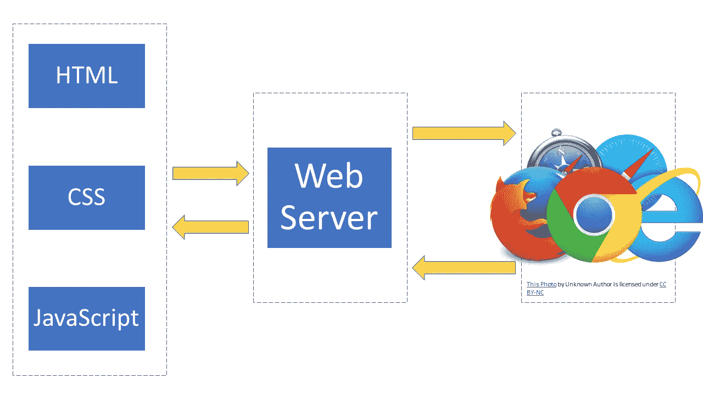
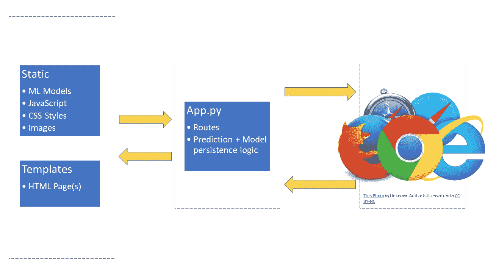
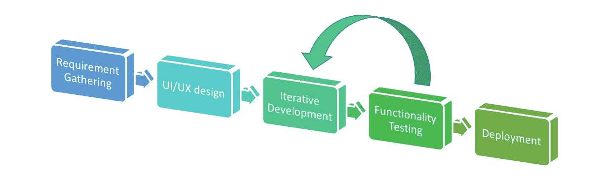
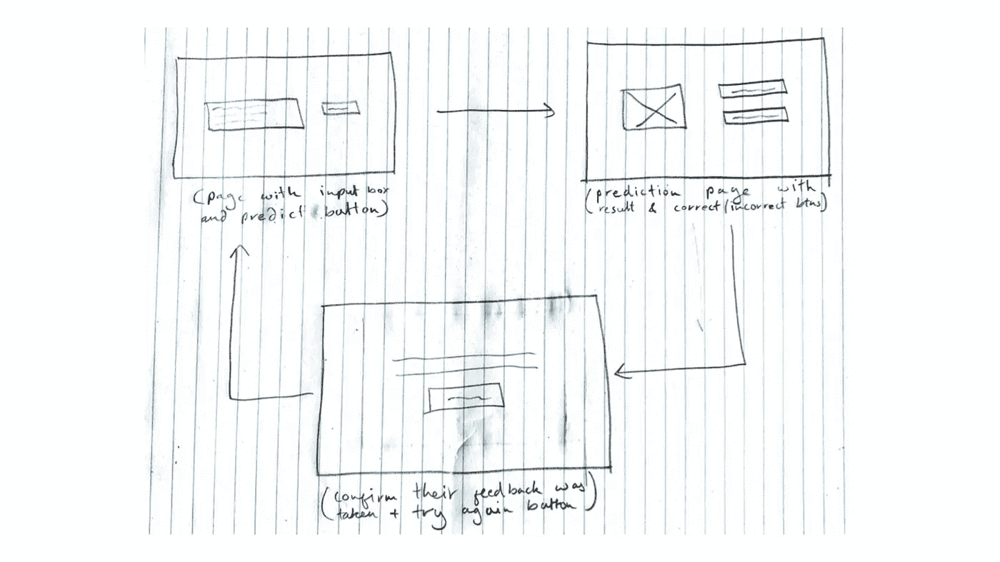
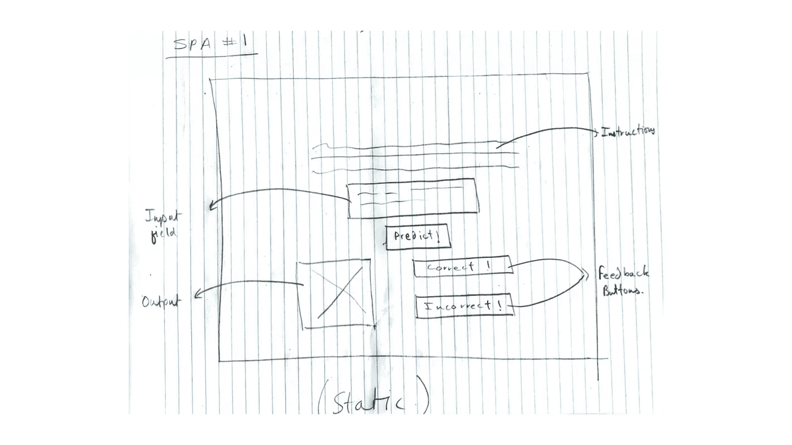
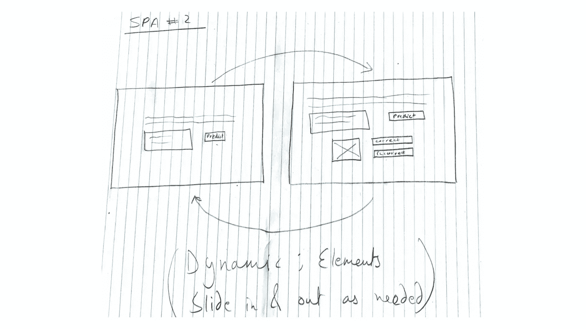
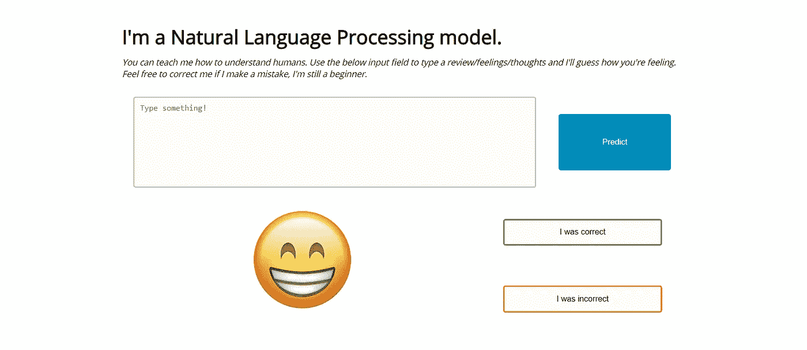

# 面向数据科学家的 Web 应用程序开发

> 原文：<https://towardsdatascience.com/web-app-development-for-data-scientists-48e445e54d7b?source=collection_archive---------15----------------------->

## [数据科学冲刺](http://towardsdatascience.com/tagged/data-science-sprints/)

## 两周搭建全栈数据科学项目学习自然语言处理，Flask 和 ML 模型部署！


The end product that we’ll be building in this article

我知道你们中的一些人可能在想:*为什么一个数据科学家应该关心构建一个 web 应用程序？*这个问题的答案非常简单:虽然分析数据集、发现模式和构建模型都是数据科学家的重要技能，但交流思想和为模型构建交互层同样重要。如果你正在考虑制造一个面向消费者的产品，或者甚至开始你自己的生意，这可能是特别重要的。

> 唯一比优秀的数据科学家更有价值的人，是同时了解工程和部署的优秀数据科学家。

我这个项目的目标是建立一个基本的情感分析机器学习模型+web 应用程序，并在两周内部署它，以学习三种新技术——自然语言处理(NLP)、flask 和增量/持续学习。在本文中，我将介绍如何构建 flask web 应用程序来帮助用户与情感分析模型进行交互。你可以使用你自己的模型，或者随意利用这个[库](https://github.com/hr23232323/nlp_medium_p1)来找一个我之前建的。**我这篇文章的所有代码都可以在我的**[**Github**](https://github.com/hr23232323/nlp_medium_p2)**上找到，所以请随意跟随**。

# 2 分钟内完成网络应用复习！

Web 应用程序可以像您希望的那样简单或复杂。尽管复杂应用程序的架构可能会让最优秀的开发人员感到困惑，但简单的 web 应用程序并不复杂。简而言之，它包括以下几个部分:



Basic Web application layout

1.  HTML 页面:这些是你的用户可以与之交互的不同网页。许多简单的应用程序利用一个单一的网页，因此命名为单页应用程序(SPA)。
2.  **层叠样式表(CSS)** : CSS 是一种样式表语言，用于改变 HTML 页面的外观。从文本颜色到背景的一切都用 CSS 描述。
3.  JavaScript:这是一种面向对象的编程语言，已经占领了 web 开发社区。Javascript 主要用于在网页上引入复杂的功能，如交互性、请求处理等。
4.  web 服务器:这是 Web 应用程序中最令人困惑的部分。web 服务器可以由硬件和/或软件组成，其工作是向用户“提供”资源。因此，当用户想要查看网页时，浏览器通过 HTTP 向 web 服务器请求资源并接收响应。对于我们的项目，我们将使用 flask 服务器进行开发。

现在你已经知道了 web 应用程序的不同部分，让我向你介绍一下 Flask，它将是我们将要使用的 web 应用程序框架。

# 假人用烧瓶

Flask 是一个轻量级的非常通用的 web 应用程序框架。它在构建时考虑了灵活性和速度，这使得它非常适合几乎没有后端需求的小型应用程序。让 Flask 成为数据科学家工具箱中特别有用的工具的是，它是用 Python 构建的；许多数据科学家对此已经驾轻就熟。那么 Flask 是做什么的？

Flask 负责 web 应用程序中涉及的大量环境和项目设置。这实质上意味着，作为开发人员，您可以专注于您的应用程序，而 Flask 则负责 HTTP、路由、资产等。我保证，随着本文的深入，所有这些都会变得更容易理解。

我们的烧瓶应用程序将由以下部分组成:



Flask app layout; notice how the components mentioned in the basic web app section fall into place here

根据上面的图表，您可以清楚地看到我们的应用程序的不同功能部分。`app.py`文件将作为主服务器逻辑，帮助服务文件和运行任何需要的 ML 逻辑。`static`文件夹将包含我们的应用程序所需的任何资产，从图像到我们挑选的模型。最后，`template`文件夹将包含我们应用程序中使用的单个 HTML 网页。

既然你已经知道了 web 应用程序的组成以及我们为什么要使用 flask，那么让我们来谈谈我们将如何实现这一切。

# 开发生命周期

在这个项目中，我试着遵循以下思维模式:

> 我想以一种快速构建/学习的模式来完成这一切，重点是功能性，而不是美观性。

鉴于此，我想分享一下我所遵循的应用程序开发生命周期。这将帮助你理解如何将功能看得比其他任何东西都重要，并快速构建原型。



Development Life Cycle used for this project

正如你所看到的，主要的功能将被反复构建。这将帮助我们在不断添加功能的同时，始终拥有一个可用的应用程序。我们将在需求收集阶段概述应用程序中所需的特性。然后，我们将为整个应用程序设计 UI/UX，以避免在开发后期担心美观问题。之后，我们将优先考虑功能，并在 24 小时内完成。最后，我将把这个应用程序部署到一个 AWS EC2 实例中，这将在另一篇文章中全面介绍。我们开始吧！

# 需求收集

我们的项目涉及用户与机器学习模型的交互，所以我们必须真正理解这些交互将如何发生。我们有一个 [NLP 分类器](https://github.com/hr23232323/nlp_medium_p1/blob/master/nlp_model.ipynb)，它可以预测用户对某个主题的感受是积极还是消极。因此，我们需要一个**输入字段，用户可以在这里输入评论/想法**和一个**输出位置，预测将在这里显示**。此外，我们还构建了一个[功能](https://github.com/hr23232323/nlp_medium_p1/blob/master/incremental_learning.ipynb)来增量训练我们的模型。所以，**我们需要为用户提供一种提供反馈的方式(正确/不正确的预测)**。这些都是我们基本应用程序中的交互。

考虑到我们的应用程序的简单性，将其构建为单页面应用程序是有意义的。因此，我们 it 的另一个要求是**输入、输出和反馈功能都需要在同一个页面**。这将有助于保持我们的项目精简和最小化，并减少开发时间。

# UI 设计

我喜欢在写任何代码之前在一张纸上画出 UI 设计，因为我们可以更快地做出改变，修补整个部分，并为快速构建提供具体的设计。此外，我还认为，在不同的屏幕上使用不同的功能，有助于将所有内容整合到一个页面应用程序(SPA)中，而不会遗漏任何部分。我的 UI/UX 设计进展可以在这里看到。



Design #1

我从三个不同的屏幕(设计#1)开始，每个屏幕都有自己的功能。第一个屏幕是用户可以输入信息并点击预测的地方。第二种情况是用户可以看到输出，并可以选择将其标记为正确或不正确的预测。最后，最后一个屏幕将是一个确认屏幕，这样用户就知道他的反馈被采纳了，并可以选择重新开始。



Design #2

这三个屏风是我的第一个水疗设计(设计#2)的模型。这是一个带有占位符的静态设计，其中各个部分(输出、反馈按钮等。)会在需要时变得活跃。我认为它是活跃的，因为没有一个元素会在任何时候隐藏；他们总是可见的。



Design #3 (Final)

我的最终设计是静态 SPA 的动态版本(设计#3)，其中输出和反馈元素最初是隐藏的(左侧屏幕)，然后在用户单击预测按钮时出现(右侧屏幕)。我对这个设计非常满意，并且很乐意在这一点上继续进行实际的开发。

# 迭代开发

在开始开发之前，我为完成这个项目所需的特性创建了一个优先级队列。它们可以在下面(按顺序)看到:

1.  为整个应用程序构建静态用户界面(普通的 HTML+CSS)
2.  捕捉用户的输入，通过我们的模型运行它，并提出一个预测，显示在前端
3.  获取用户反馈，并使用之前构建的增量学习功能适当地教授模型
4.  将 UI 从静态改为动态:在启动时隐藏不必要的元素，并在需要时显示它们

在每次迭代结束时，我将拥有一个功能有限的工作应用程序。这将有助于快速测试和调试新功能。让我来分享一下我的代码和每个特性的进展。

## 迭代 1:静态用户界面

构建一个静态用户界面相当简单。如果你以前从未为网络开发过，我强烈推荐你查看 [MDN 网络文档](https://developer.mozilla.org/en-US/)来解决你的所有问题。鉴于我们的应用程序的简单性，我们的 HTML 代码是最少的，虽然我不想浪费您的时间来深入描述这一点，但我将从高层次来介绍它。我们的 UI 被分成两个主要的`<div>`标签:一个用于包含指令、输入文本框和预测按钮的上半部分，另一个用于包含预测输出和反馈按钮的下半部分。与这个项目相关的大多数 HTML 对于以前做过 web 开发的人来说应该是有意义的，但是我想指出一个重要的 flask 特定代码:

```
<form id="input-form" class="input-form" 
   action="**{{ url_for('predict')}}**" method="post">
     ..
     ..
     ..
</form>
```

表单标签中的`{{url_for(‘predict’)}}`属性是一个指向“预测”路线的 flask 方法。这个关联帮助我们从表单中捕获用户输入，并在我们的模型可用的`app.py`文件中处理它。当我们在下一节介绍 flask 时，您将看到这一点。

最后，为了设计这个 HTML 页面，我主要使用 CSS 的 flexbox 显示模式来创建一个最小的布局。因此，尽管还没有任何按钮起作用，图像也没有改变，但我在这次迭代结束时的静态布局如下所示:



Static UI after iteration 1\. None of the buttons work yet :)

鉴于读者的兴趣，我不会在本文中涉及 CSS，但是如果你感兴趣，你可以在这里找到我所有的代码[](https://github.com/hr23232323/nlp_medium_p2)**。**

## **迭代 2:捕获输入并在前端显示预测**

**在上一节的最后，我们只有一个 HTML 和 CSS 文件。现在，我们将开始使用`app.py`文件来构建我们的应用程序的逻辑，并且从直接显示 HTML 页面转移到使用 Flask 服务器来服务它。要开始使用 Flask 服务 HTML 页面，我们只需要几行代码:**

```
from flask import Flask, render_template, requestapp = Flask(__name__, template_folder='../templates', static_folder='../static')@app.route('/')
def home():
    return render_template('index.html', image_filename="img/happy.webp", display_mode="none")@app.route('/predict', methods=['POST'])
def predict():
    return render_template('index.html', image_filename="img/happy.webp", display_mode="none")@app.route('/save_pred', methods=['POST'])
def save_pred():
    return render_template('index.html', image_filename="img/happy.webp", display_mode="none")if __name__ == "__main__":
    app.run(debug=True)
```

**注意:Flask 不要求显式地提到 template_folder 和 static_folder，但是我喜欢这样做，以防我弄乱了名称/路径。此外，此时，我们的项目文件夹结构应该如下所示:**

****

**Project folder structure**

**这样，我们所有的资产(图像、模型等。)在同一个主文件夹`static`的不同子文件夹中，我们的 HTML 页面在`templates`文件夹中，我们的`app.py`文件在`python`文件夹中。**

**此时，我们已经准备好使用 Flask 服务器运行我们的应用程序。为此:使用命令行导航到 python 文件夹，并运行命令`python app.py`。请记住，此时您应该已经使用 pip 安装了 Flask。更多关于那个[的信息在这里](https://flask.palletsprojects.com/en/1.1.x/installation/)。恭喜，您的应用程序已经启动并运行了！现在让我们添加预测逻辑。**

**注意我们是如何为`predict`和`save_pred`路线放置占位符的。这样做是为了确保 Flask 应用程序部署无误。为了让我们的 predict 函数工作，我们需要从 textbox 中捕获用户的输入，使用我们的 NLP 矢量器(`input_transformer.pkl`)将它转换成一个单词袋矢量，并通过我们的分类器(`review_sentiment.pkl`)运行它。还要注意，我将使用全局变量来存储模型输入和输出，以便在预测和增量学习函数中保持它们。此功能的代码如下所示:**

```
# module needed to load models
from sklearn.externals import joblib# load models pickeled earlier
input_transformer = joblib.load(open('../static/models/input_transformer.pkl', 'rb'))
model = joblib.load(open('../static/models/review_sentiment.pkl', 'rb'))# Global variables for persistence across methods (and requests)
model_input=""
model_output=""@app.route('/predict', methods=['POST'])
def predict(): # retrieve global variables to store input and output
    global model_input
    global model_output

    # get text from the incoming request (submitted on predict button click)
    text = request.form['input_text']

    # convert text to model input vector
    final_features = input_transformer.transform([text])

    # use classifier's predict method to get prediction
    prediction = model.predict(final_features)

    # store model input and output
    model_input = text
    model_output = prediction[0] return model_output
```

**你有它！现在，我们的应用程序可以将用户输入的文本转换成向量，可以通过我们预先训练的模型进行分类。**

## **迭代 3:增量学习**

**我们采取的步骤如下:使用全局变量对输入文本进行矢量化，获得用户点击的按钮(正确/不正确)，基于用户的按钮选择断言“正确”预测，递增地训练模型直到它重新学习，更新模型 pickle。这方面的代码如下所示:**

```
[@app](http://twitter.com/app).route('/save_pred', methods=['POST'])
def save_pred():
    # retrieve global variables
    global model_input
    global model_output # vectorize user input
    final_features = input_transformer.transform([model_input])

    # get user's button choice (correct/incorrect)
    save_type = request.form["save_type"]

    # modify global variable if user selected "incorrect"
    if(save_type == 'incorrect'):
        if(model_output == 'p'):
            model_output = 'n'
        elif(model_output == 'n'):
            model_output = 'p'
        else:
            print("Error: Model output was neither N nor P") # Strengthen weight of particular connection
    max_iter = 100
    counter = 0
    for i in range (0,max_iter):
        model.partial_fit(final_features, [model_output])
        if(model.predict(final_features) == [model_output]):
            counter = i
            break

    # Save trained model pickle
    joblib.dump(model, '../../review_sentiment.pkl')    # return placeholder (will be updated later)
    return ""
```

**虽然上面的代码实现了我们需要的所有功能，但是一旦重新训练完成，它没有向用户提供任何类型的反馈。为了解决这个问题，我们将添加一个返回文本变量来返回"*权重已更改，谢谢您的指正！*"或"*砝码被强化，谢谢你教我！*“根据情况。此外，我还认为捕获模型被重新训练的数据以防止误用该功能是非常重要的。几行代码可以帮助我们将输入、校正后的输出以及重新训练所需的周期数存储在 csv 文件中:**

```
fields = [model_input, model_output, counter]
    with open('user_teaching_data.csv', 'a') as file:
        writer = csv.writer(file)
        writer.writerow(fields)
```

****迭代 4:动态内容****

**随着我们的静态应用程序的完成，这次迭代的目的是让它变得动态和更加用户友好。你一定注意到了，所有的元素在我们的应用程序中都是可见的，而且页面每次都会重新加载。虽然这没什么大不了的，但是我们可以很容易地使用 jQuery 和 AJAX 来避免重载，并根据需要隐藏元素。这将有助于给我们的应用程序一个完美的外观，也有助于积极的用户体验。深入研究 jQuery 或 Ajax 超出了本文的范围，但是如果您感兴趣，我强烈建议您查看我的 [**代码**](https://github.com/hr23232323/nlp_medium_p2/blob/master/static/scripts/script.js) ，以及这篇关于 AJAX 的[精彩文章。](https://medium.com/free-code-camp/ajax-basics-explained-by-working-at-a-fast-food-restaurant-88d95f5fcb7a)**

**在这次迭代结束时，我们的应用程序按预期工作:它接受用户信息，显示我们的 NLP 模型的结果，允许用户重新训练我们的模型，并以最简单优雅的方式完成所有这些工作。我们的全功能 web 应用程序演示可以在下面再次看到:**

****

**Final working demo for web application**

**恭喜我们的两周挑战进行到这一步！希望到目前为止，您不仅能够构建 NLP 模型，还具备了构建 web 应用程序以使这些模型具有交互性的必要技能。**

# **包裹**

**到目前为止，我们已经完成了许多很酷的事情:我们采用了以前训练过的数据科学模型，并围绕它构建了一个功能齐全的 web 应用程序。我们花了大约六天的时间来构建我们的 web 应用程序，把重点放在功能而不是美观上。这种心态让我们能够在大约 10 天内构建我们的模型和 web 应用程序。**

**两周的时间还剩四天，**我们将解决我们最大的挑战:使用普通 EC2 实例**在 AWS 上进行建模和应用程序部署。我将写另一篇帖子来指导您完成部署过程，所以请随时关注[我的专栏《走向数据科学](https://towardsdatascience.com/tagged/data-science-sprints)》以获得发布时的通知！**

**我希望你喜欢读这篇文章，就像我喜欢把它放在一起一样。如果您有任何问题、反馈或意见，请随时通过 [LinkedIn](https://www.linkedin.com/in/harshrana1997/) 或我的[网站](http://www.harshrana.com/)与我联系。**