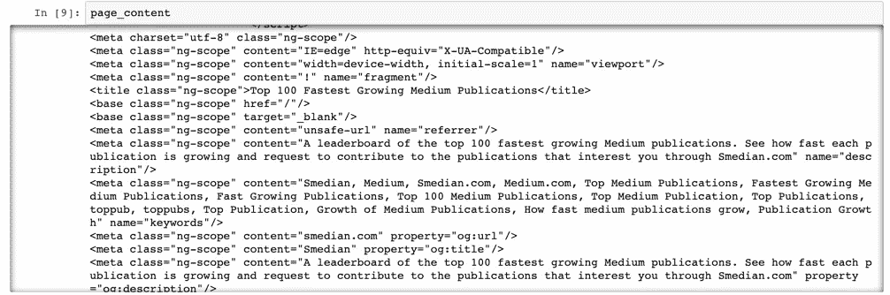
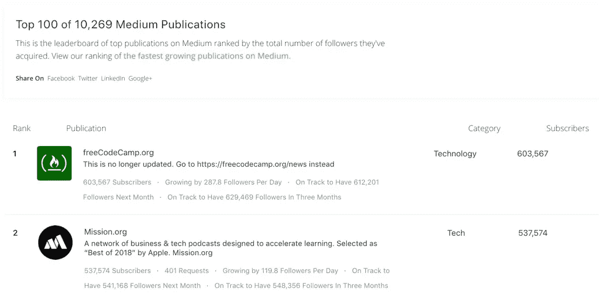
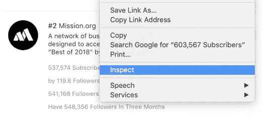
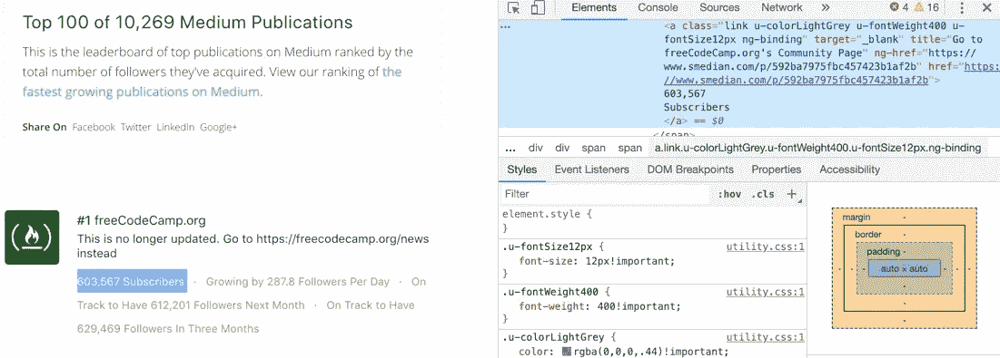
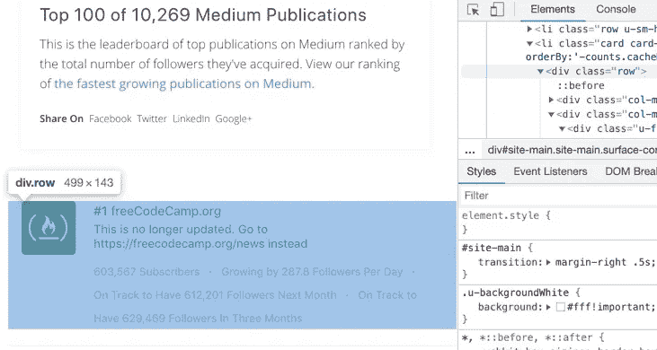
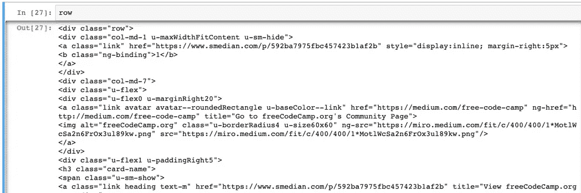
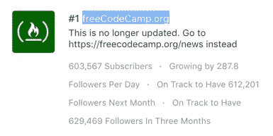
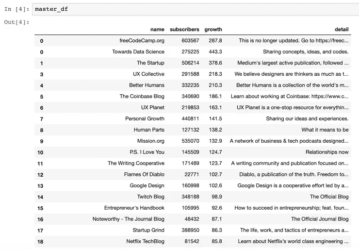

# 网页抓取 101

> 原文：<https://towardsdatascience.com/web-scraping-101-969499c2d706?source=collection_archive---------15----------------------->


Photo by [Pankaj Patel](https://unsplash.com/@pankajpatel?utm_source=medium&utm_medium=referral) on [Unsplash](https://unsplash.com?utm_source=medium&utm_medium=referral)

## 使用 Python 从您最喜欢的网站快速抓取数据

总有一些数据科学工具，我每隔几周就会使用一次——虽然不够频繁，还不足以让它们成为我的第二天性，但足够频繁，以至于当我发现自己第无数次谷歌它时，我会感到恼火。网络抓取就是一个例子，所以今天的博客对我未来的自己和对你一样重要。

网络抓取对于初露头角的数据科学家来说是一项非常有用的技能。当我们试图分析一些东西时，我们经常需要用我们在网上找到的额外数据来补充我们现有的数据。网络抓取使我们能够自动化这个数据收集过程。

在今天的帖子中，我们将使用 Python 来抓取一个网站，以便了解网页抓取的来龙去脉。

# 刮的时间到了

我们将从网站[https://toppubs.smedian.com/](https://toppubs.smedian.com/)获取排名前 100 的媒体出版物的数据。[完整的代码，你可以去我的 Github。](https://github.com/yiuhyuk/publications)

首先，我们需要导入我们将需要的包。除了通常的，我们将利用 **BeautifulSoup** 和 **requests** Python 包来帮助我们获取和解析网站的数据(我还加入了 **re** 包，以防我需要使用正则表达式)。

```
# For our general needs
import numpy as np
import pandas as pd# For getting and parsing the data from the website
from bs4 import BeautifulSoup
import requests
import re
```

*   Python 包**请求**，允许我们的程序连接到网站并提取其数据(以非常原始的格式)。
*   **BeautifulSoup** 是一个处理网页数据的重要软件包。它以一种更像列表的方式重组数据，这样我们就可以用我们的代码操纵它。

现在让我们从网站上抓取数据。我们使用来自**请求**包的 **get** 方法来 ping 网站并获取其数据。然后使用 **BeautifulSoup** 以更加用户友好的格式构建它，以便我们可以开始使用它:

```
link = '[https://toppubs.smedian.com/'](https://toppubs.smedian.com/')# Grab data from website
page_response = requests.get(link, timeout=1000)# Structure the raw data so that we can parse it
page_content = BeautifulSoup(page_response.content)
```

下面是 **page_response.content** 的前几行(很乱吧？):


The raw website data is a mess

在我们通过 **BeautifulSoup** 运行它之后，它看起来是这样的(更有条理一点):



A bit more structure thanks to BeautifulSoup

仍然有很多东西需要理解，但是现在看起来更容易解析了。现在让我们来看看实际的网站，找到我们感兴趣的刮。这是网站的快照:



The website we are scraping

前 100 家媒体出版物的表格(上图的下半部分)包含了我们感兴趣的数据。我们可以通过检查页面的源代码来找出数据所在的位置。为此，只需将鼠标悬停在您感兴趣的页面部分，右键单击，然后选择“Inspect”。



Inspecting the source code

这将打开一个侧窗格，允许您查看页面的源代码。例如，如果我们对收集订阅者的数量感兴趣，我们检查 603，567 个订阅者(在左边用蓝色突出显示)。这打开了右边的窗格，在这里我们可以看到，为了获得订阅者的数量，我们应该在我们的 **BeautifulSoup** 对象中寻找标签(这是一个 HTML 标签，我对 HTML 知之甚少，所以请原谅缺乏解释)。回想一下，我们的 **BeautifulSoup** 对象是变量 **page_content** 。



## 在表格中循环

该表中有 100 行(它毕竟列出了前 100 个出版物)。所以我们应该用一个循环来遍历它。但是我们通过什么循环呢？如果我们检查整行，我们会看到每一行都用 HTML 标签

表示。

Inspecting a row of the table that we want to scrape

所以我们的循环应该找到每个标签，然后获取内容。我们可以使用 **find_all** 方法来做到这一点——我们使用它来查找 **page_content** 中 tag = 'div '和 class = 'row '的所有元素。 **find_all** 方法返回一个我们可以遍历的列表:

```
pub_names = []
pub_subs = []# Loop through each row
for row in page_content.find_all('div', class_='row')[1:]: # Contains the name of the publication
    pub = row.find_all('a', class_='link link--primary u-  accentColor--hoverTextNormal ng-binding') # Contains number of subscribers
    detail = row.find_all('a', class_='link u-colorLightGrey u-fontWeight400 u-fontSize12px ng-binding') if pub != []:
        pub_names.append(pub[0].text.split('\n')[1])
        pub_subs.append(detail[0].text.split('\n')[1])
```

首先，让我们打开**行的**变量，看看里面有什么。挺密的。我们可能需要使用 **find_all** 方法来进一步过滤。



The row variable from our loop

## 抓取出版物的名称

在 **pub** 变量中(来自上面的 for 循环代码),我们获取了出版物的名称。我们知道数据存在于**行**变量的某个地方，但是在哪里呢？为了找到它，我们可以再次检查网页。我检查了页面上用蓝色突出显示的部分，它告诉我寻找标签‘a’和类‘link u-color light grey u-font weight 400 u-font size 12 px ng-binding’。挺拗口的！



Inspect the name of the publication

一旦我们知道要查找什么，我们就可以使用 **find_all** 方法来定位它(这是上面 for 循环中的同一行代码):

```
pub = row.find_all('a', class_='link link--primary u-  accentColor--hoverTextNormal ng-binding')
```

让我们来看看 **pub** 变量里面有什么:

```
[<a class="link link--primary u-accentColor--hoverTextNormal ng-binding" href="https://medium.com/free-code-camp" ng-href="http://medium.com/free-code-camp" style="display:inline" title="Go to freeCodeCamp.org's Community Page">
 freeCodeCamp.org
 </a>]
```

现在我们正在谈话！在 **pub** 中，我们看到“freeCodeCamp.org”，这是该出版物的名称。我们现在要做的就是解析 **pub** 并获取我们想要的东西。我们可以使用方法**文本**来实现:

```
pub[0].text
```

这会产生以下输出:

```
Out: '\nfreeCodeCamp.org\n'
```

如此接近，我们只需要去掉换行符。我们可以用**串**的方法**拆分**来做到这一点:

```
pub[0].text.split('\n')
```

换行符上的拆分产生以下输出:

```
Out: ['', 'freeCodeCamp.org', '']
```

出版物的名称是这个列表的第二个元素，所以我们抓住它，准备好了:

```
pub[0].text.split('\n')[1]
```

## 获取该出版物的订户数量

让我们快速地再看一个例子，以确保我们理解了网络抓取的来龙去脉。既然我们已经知道了出版物的名称，我们还想知道有多少读者订阅了它。前面，我们已经发现了数据在页面源代码中的位置:


Same picture as above

如果我们拿出放大镜阅读源代码，我们会看到我们正在寻找标记为“a”的元素，并且类等于“link u-colorLightGrey u-font weight 400 u-font size 12 px ng-binding”。如果我们回头参考上面的 for 循环代码，我们会发现我们使用了 **find_all** 方法来获取相关元素，并将其存储在变量 **detail** 中。

```
detail = row.find_all('a', class_='link u-colorLightGrey u-fontWeight400 u-fontSize12px ng-binding')
```

如果我们显示它，我们会看到细节**变量**是一个有 5 个元素的列表。第一个元素包含订户数量， **detail[0]** 如下所示:

```
Out: <a class="link u-colorLightGrey u-fontWeight400 u-fontSize12px ng-binding" href="https://www.smedian.com/p/592ba7975fbc457423b1af2b" ng-href="https://www.smedian.com/p/592ba7975fbc457423b1af2b" target="_blank" title="Go to freeCodeCamp.org's Community Page">
603,567
Subscribers
</a>
```

值 603，567 是我们想要的，所以让我们用下面的代码行获取它:

```
detail[0].text.split('\n')
```

它产生以下输出:

```
Out: ['', '603,567', 'Subscribers', '']
```

酷，现在我们要做的就是抓住第二个元素:

```
detail[0].text.split('\n')[1]
```

在我们对它进行任何分析之前，我们需要将其转换为整数(通过删除逗号，然后将其转换为整数):

```
int(detail[0].text.split('\n')[1].replace(',',''))
```

如果我们在我的 GitHub 中运行全部代码，它会产生以下数据帧:



The output dataframe, ready for analysis

好啊，都搞定了。希望这篇教程风格的博客是有用的。干杯！

***更多数据科学与商业相关岗位由我:***

[*了解 RNNs*](/understanding-rnns-recurrent-neural-networks-479cd0da9760)

[*数据科学家的商业战略*](/business-strategy-for-data-scientists-25e3ca0af5ee)

[*有项目还是没有项目？*](/project-or-no-project-307f6148a16d)

[*用 Python 进行业务模拟*](/business-simulations-with-python-a70d6cba92c8)

[*了解 PCA*](/understanding-pca-fae3e243731d?source=post_page---------------------------)

[*理解贝叶斯定理*](/understanding-bayes-theorem-7e31b8434d4b)