# 网络抓取:Scrapy 和 Selenium 的一个不太简要的概述，第二部分

> 原文：<https://towardsdatascience.com/web-scraping-a-less-brief-overview-of-scrapy-and-selenium-part-ii-3ad290ce7ba1?source=collection_archive---------3----------------------->

[by Tom Gowanlock](https://pixels.com/featured/colorful-background-tom-gowanlock.html)

## Scrapy + Selenium 来抓取 Airbnb(包含 Python 代码)

> “网络爬行的第一条规则是你不能损害网站。网络爬行的第二条规则是你不要伤害网站。

在我之前的博客文章中([链接此处](/web-scraping-a-simple-way-to-start-scrapy-and-selenium-part-i-10367164c6c0)，我给出了使用 Scrapy 和 Selenium 进行网页抓取的概述。我关注的是我用这些工具制作我的第一批刮刀的学习成果。我还没有在网上找到很多如何将 Scrapy 和 Selenium 结合起来的例子，所以如果你正在寻找这样的东西，请继续阅读——我试图让这篇文章尽可能具有说明性。我选择继续使用 Airbnb，这是我在《T4》第一部中提到的，这让我很惊讶，我在本博客的最后一部分中谈到了这一点。

这篇博文的内容如下:几个*免责声明*，一个第一部分的*摘要*，对 Scrapy 和 Selenium 的简要描述，一个对作为目标网站的 Airbnb 的*描述*，一个带有我这边评论的*逐步刮刀*，以及一个非常简短的*最终注释*。

我们走吧！

# 这个帖子是什么

简单说说这个帖子是什么，不是什么。

## 放弃

*免责声明#1* :我花了一段时间才发表这篇文章，因为我被其他项目缠住了。我花了几个星期的时间断断续续地研究它，并注意到 Airbnb 对它们的源代码进行了修改。因此，如果你过一段时间发现这个帖子，很可能他们那边的事情不会保持不变。出于这个原因，我附上了截图和 gif，所以即使源代码被更改，整个过程也更有意义。

*免责声明#2* : Airbnb 是一个特殊的目标，因为网站的布局可能会根据会话而改变。起初，我认为这种行为是由他们识别机器人引起的，但后来，当我作为普通用户试图从多台机器和网络访问它时，我遇到了同样的问题——布局会根据会话随机变化。在这篇文章中，我将介绍类似这样的无限卷轴布局:

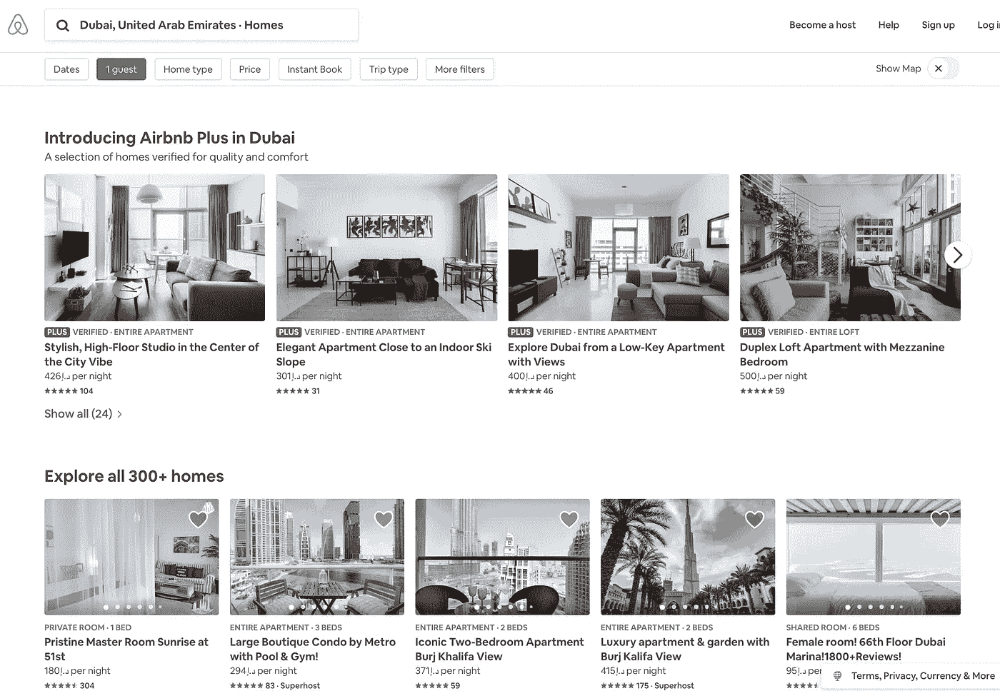

Infinite scroll layout that is in the focus of this post

要在此设置中加载新属性，您需要向下滚动到页面底部，直到加载完所有项目。反过来，每个项目都有一个*图片来源，一个简短的描述，包括物业类型，物业名称，每晚价格，评级，评论数量*，还有一些我们不能马上看到，但仍然存在的东西，就是连接目录项目及其简介的 *URL* 。

与目录相反，无论目录视图如何，房屋的配置文件似乎不会改变太多。然而，说过去几周没有任何变化是错误的。例如，现在有一个特殊的“加”房屋布局，它会出现在目录中。我将在代码中跳过这些，但是您当然也可以创建规则来处理这些配置文件。

“Plus” Homes That Are Out of This Blog Post

*免责声明#3* :这篇文章是一个概念证明，而不是防弹刮刀，请随意调整，并分享对你有用的改进。

# P **艺术一总结**

Scrapy 是一个 Python 框架，允许你抓取 HTML 页面。虽然它快速、高效且易于使用，但它不允许您抓取更多使用 React 等框架的 JavaScript 网站，或者只是识别爬虫并禁止它们的网站。

另一方面，Selenium 是一个自动化测试的工具，它不是为抓取而开发的，但是，它可能有助于抓取 Scrapy 无法做到的网站。在模拟浏览器时(Selenium 实际上是用 webdriver 打开浏览器的)，你可以编写爬虫来模拟用户的所有点击、滚动和暂停行为。除此之外，你还可以进行截图等操作。虽然很酷，但硒需要一点时间。

总而言之，Scrapy 在处理错误和异常方面更快、更健壮，Selenium 在前端模拟用户操作，这对于以抓取工具为目标或有很多反应元素的网站来说是一个巨大的优势。因此，将两者合并在一起是一个可以考虑的选择。

# Airbnb: Scrapy 和 Selenium

## **目标 Airbnb 的样子**

对于这篇文章，我选择了删除 Airbnb，因为一些论坛建议，Airbnb 需要一点努力。还有，我在*第一部分*开始写了，所以觉得坚持下去会很好。

假设我们要提取某个位置的属性的以下细节:
1。属性类型
2。物业名称
3。每晚价格
4。评级
5。链接到酒店简介
6。也许还有一些评论

您可以在这些属性的目录页面或个人资料页面中找到这些详细信息。

我更愿意做的第一件事是熟悉网站。其中一个有用的 Chrome 工具是 [*React 元素检测器*](https://chrome.google.com/webstore/detail/react-detector/jaaklebbenondhkanegppccanebkdjlh?hl=en-US) ，当页面上检测到 React 时，它会变成蓝色。

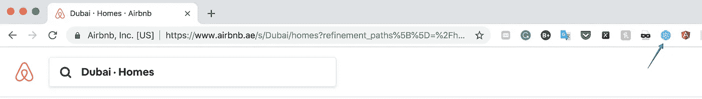

airbnb.ae — React enabled!

当你点击扩展时，你会在页面上看到大量的蓝色——所有的东西都是框架的一部分——Scrapy 不会单独处理它！你注意到的另一个需要硒或类似元素的东西是臭名昭著的无限卷轴。

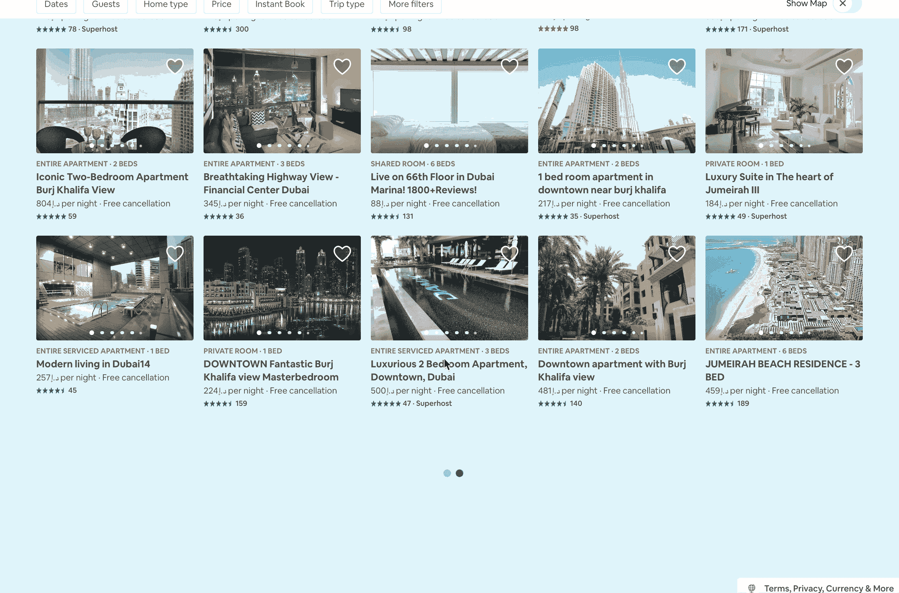

The Blue and Infinite Airbnb

## SPID er 逻辑

scraper 的逻辑模拟用户在网站上采取的行动，从主屏幕开始进行搜索(为简单起见，我们称之为*自顶向下*)，然后抓取内容(比如目录页面或属性页面)。同时，您可以选择从下到上开始构建您的爬虫，看看您是否收集了任何数据并发现了任何问题。

虽然通过开始抓取目标页面(如目录页面)来检查您是否在正确的轨道上是有用的，但一些网站，如 Airbnb，会在您的请求中寻找特定信息，如果发现可疑活动，他们会禁止您，修改他们显示的 web 元素，甚至改变页面的内容。

## T

由于 Scrapy 既好又快，我确实尝试单独使用 Scrapy，所以让我们做一个小实验:我们将尝试仅使用 Scrapy 获得一些响应。您可以使用 **pip** 安装所需的模块。安装完模块后，我们可以用`scrapy startproject projectname`启动项目，这将在您的工作目录中创建一个“projectname”文件夹。接下来，您可以通过将目录更改为您的项目文件夹`cd projectname`和`scrapy genspider nameofthespider`来在文件夹中生成默认的蜘蛛，这将在您的项目中创建一个默认的 Scrapy crawler 架构。*提示*:在命令行中调用`scrapy`会给你显示基本的 scrapy 命令，下面会用到一些，看看吧！

Install Packages

除了安装模块，我们还需要[下载 chromedriver](http://chromedriver.chromium.org/downloads) ，解压并在机器上安装谷歌 Chrome，如果还没有的话。Chromedriver 并不是你唯一可以使用的 webdriver，比如 Firefox 是相当流行的，但是在这篇文章中我将只讨论 Chrome。

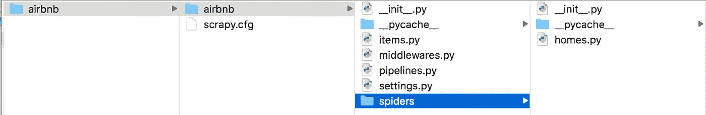

Scrapy Architecture in a File Directory

需要注意的是，在这个树中，蜘蛛“根目录”是`scrapy.cfg`所在的位置，所以每当我们想要启动爬虫时，工作目录应该是`scrapy.cfg`所在的位置。接下来，`settings.py`——蜘蛛的设置——和`homes.py`——蜘蛛的脚本——将是这篇文章的重点。

现在，我们可以看看是否可以使用 Scrapy 从目录页面获取任何信息。让我们先来看一下 *scrapy shell* ，这是 scrapy 的一个命令行。这便于*测试*碎片代码，即查看选择器是否返回任何特定的结果。`[scrapy shell 'URL'](https://docs.scrapy.org/en/latest/topics/shell.html)`就是要走的路。输出包含日志、零碎的汇总统计数据，最后是一个零碎的 shell，类似于 ipython shell。

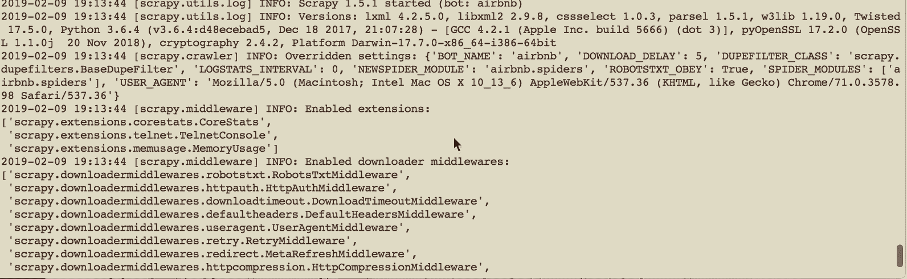

scrapy shell ‘url’

你也可以在 bash 中直接尝试`scrapy fetch "url"`。结果会更大，有一堆状态和一个 HTML 树，看起来像这样:

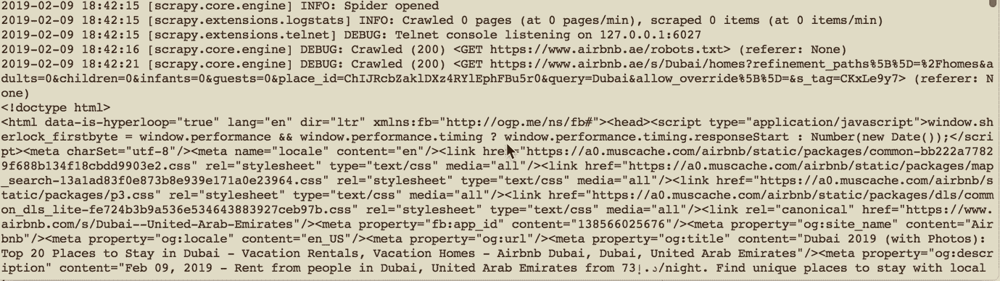

scrapy fetch

无论哪种方式，重要的是`downloader/response_status_count/200`，其中 **200** 意味着我们成功地接收到了服务器响应。500 和 400 意味着我们的请求被服务器拒绝——要么你太咄咄逼人，要么机器人已被识别和阻止。

现在，让我们把重点放在 scrapy 外壳上。让我们尝试使用不同的 xpath 获取第一个属性名，我们可以通过*指向属性名> >右键单击> >检查*来找到。有多种方法可以获得相同的元素。比如物业类型(“包间* 1 床”、“整间* 3 床”等。)可以通过使用`class="_ng4pvpo"`、`itemtype="http://schema.org/ListItem"`和`itemprop="name"`以及其他选项进行定位。

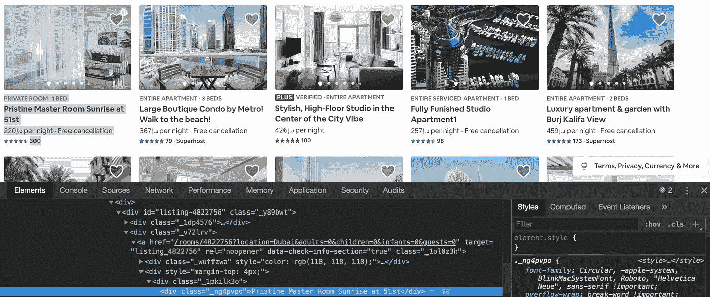

One of the xpaths to a Property Name

使用 xpath 测试 Scrapy:

Testing Scrapy’s Response

尽管`scrapy fetch`产生一个 GET 状态 200，选择器还是返回空白列表。当他们说 scrapy 不能处理 JS 过多的页面时，就是这个意思。当 xpaths 不正确时也可能是这种情况(尝试任何随机的 xpaths)，但是在编写本文时不是这种情况。请注意，这两种情况下都不会产生错误。

使用 Scrapy `Selector`和 Selenium 的`driver.page_source`获得相同的元素会返回一个选择器列表:

Chromedriver and Scrapy Selector

要点是:由于 Airbnb 依赖于 JS-heavy React 框架，Scrapy 无法获得所需的 web 元素并从中提取数据。这就是 Selenium 派上用场的地方，它虚拟地向服务器发出请求，同时发送服务器将接受的头，而不会阻塞您的 bot 或扭曲数据。也就是说，[真实浏览器标题和 Selenium 标题](http://pythonscraping.com/blog/selenium-headers)是有区别的，特别是用户代理，但是我们将在下面处理它。

## 关于建筑——一些调整

Scrapy 架构由几个部分组成，正如我之前提到的，我将重点关注其中的两个部分。

**spider.py**

在您调用`scrapy genspider nameofthespider`之后，该文件的实际名称将是 nameofthespider.py。该文件将包含爬虫要遵循的脚本。

**settings.py**

Settings.py 是蜘蛛的设置。文档[非常全面](https://doc.scrapy.org/en/0.16/topics/settings.html)，如果你有时间的话可以读一读。设置允许你在必要的时候修改爬虫的行为，避免被阻止，更重要的是，不要让网站的服务器超负荷运行，否则会损害它的性能。一般来说，至少调整以下设置是个好主意:1) DEFAULT_REQUEST_HEADERS，它是浏览器发送给 web 服务器的任何请求的一部分(查看 [wiki](https://en.wikipedia.org/wiki/List_of_HTTP_header_fields) 和[这里的一个例子](https://www.whatismybrowser.com/detect/what-http-headers-is-my-browser-sending))。2) USER_AGENT，它实际上是头的一部分，但也可以单独设置。3) DOWNLOAD_DELAY，设置对同一网站不同页面的并发请求之间的延迟。这个练习没有必要，但是记住它是个好主意。4) ROBOTSTXT_OBEY，它提供了一个选项来关注或忽略网站上的 robots.txt 文件。Robots.txt 文件存储在网站的根目录[中，描述了网站上机器人的期望行为，遵守它被认为是“礼貌的”。](https://www.airbnb.ae/robots.txt)

虽然礼貌地收集信息是最好的做法([这里有一篇好文章](https://blog.scrapinghub.com/2016/08/25/how-to-crawl-the-web-politely-with-scrapy))，但你不能总是通过遵循完整的建议列表来获得数据，部分原因是一些网站会阻止任何看起来不像浏览器的机器人，例如，当你的请求头与预期的不匹配时。

检查来自 Chrome 的预期*请求头*:

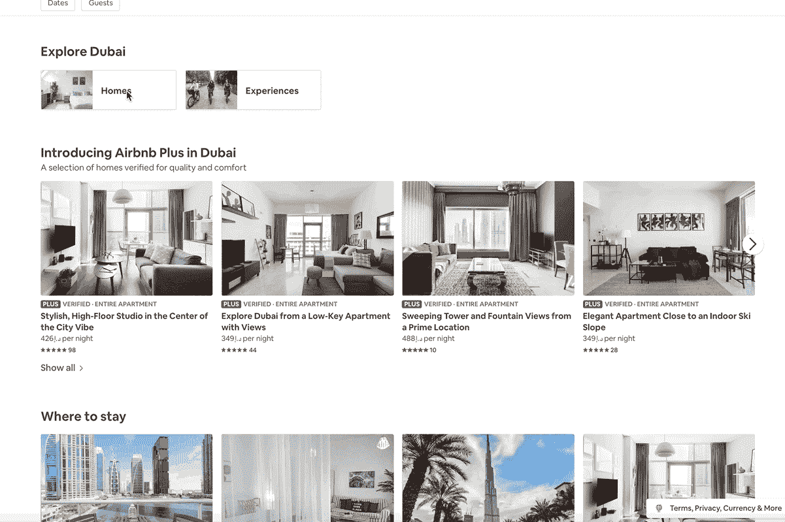

Airbnb — Checking Network Response

要指出的是，设置标题将是最相关的 Scrapy。Selenium 启动一个浏览器实例，然而，它的标题表明使用了自动化软件，尽管与常规浏览器非常相似。

Scrapy Settings for This Project

# 一步一步的刮刀

## **导航:搜索和加载**

抓取的支柱是 web 元素*选择器*。你可以选择使用 *css 选择器*或 *xpath* 的，我更喜欢后者，并将在本文中使用它们，这是出于习惯。如果你使用 Google Chrome 或 Firefox，获取 xpath 很容易:转到*元素> >右键单击> >选择“Inspect”*(就像我们在上面处理属性类型一样)。控制台将会打开，在这里你将会看到所选择的元素和更多的东西，所以如果你没有立即找到你需要的东西，或者如果你在寻找其他东西，你可以在“树”中上下移动。此搜索字段是一个示例:

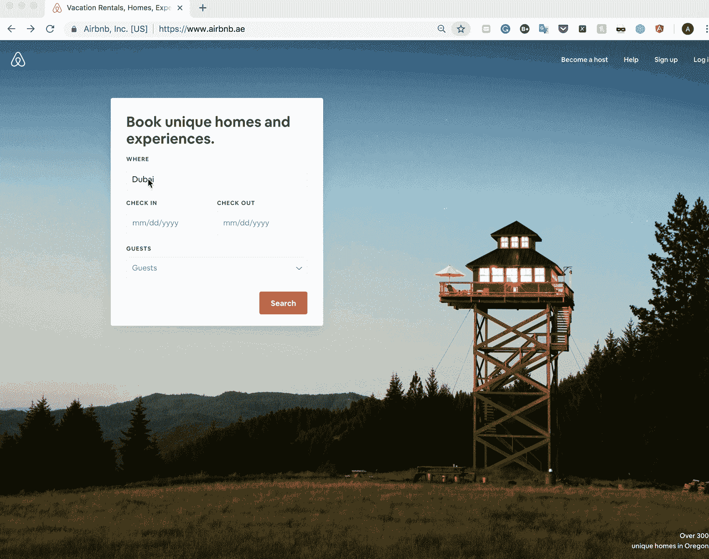

Airbnb — Search Field xpath

最终，我们希望我们的 scraper 浏览这个页面并进行搜索。现在我们已经了解了如何在页面上找到元素，让我们测试它是如何工作的。为了测试它，我们可以继续使用`ipython`。

Selenium 的一个很酷的特性是它能够再现用户在网站上的行为，包括填写表单、按按钮、按“Enter”和其他键、截图等。下面的代码片段启动 webdriver，进入 airbnb hime 页面，输入城市名(`Dubai`)，然后使用`h\ue007`点击“回车”。接下来，它停了一会儿——`sleep(0.8)`——并点击搜索按钮，通过`type = "submit"`找到 xpath 中的元素，并使用`click()`方法点击它。

然后，当您被重定向到下一页时，脚本暂停 8.7 秒。当它在下一页时，驱动程序将通过 xpath `data-veloute="explore-nav-card:/homes`搜索按钮“Homes”。

最后一个操作将最终把我们带到目录页面，这是一个无限滚动的页面，我们将使用`while`语句来滚动它。一旦我们完成了，就该为目录的元素提取选择器了。

Going Through the Search Menu on Airbnb

在导航部分被测试并按预期运行后，我们可以将这部分添加到`homes.py`文件中，只需稍作修改——每次调用驱动程序实例时，我们都需要在它前面调用`self.`(Corey 在这里解释了自我的直觉)。对于最后一块，进入 ***最后一块*** 部分。

## 获取数据:产品页面与目录详细信息

一般来说，如果以列表或网格的形式向您呈现一组项目，其中元素存在于相同的 xpath 中(例如，共享相同的*类、id、div、*等。)并在页面上重复出现，使用 for 循环很容易对它们进行迭代。如果您的元素是页面独有的，您可以直接在页面中找到它们。

回想一下 Airbnb，你可以通过进入*目录页面*或逐个访问*房屋的简介*来获得该网站的数据。但是，家庭数据点似乎更容易从家庭配置文件中访问，因为目录中的一些元素没有通用的结构。例如，您可以看到 span 中返回的所有****属性类型*** 标签(在页面中找到的)，同时迭代同一类的元素。有一个模式，但不幸的是，它不断打破，所以你不能依靠它来获得数据。从一个档案到另一个档案确实需要更长的时间，但是如果你需要从物业档案中获取物业类型或任何其他信息，请一个接一个地搜索“房屋”。*

## *获取主页的 URL:目录页面*

*虽然你当然可以从目录页面抓取 Airbnb，但是有些元素，比如属性类型，很难从那里获取。此外，并不是所有的信息都可以在目录视图中获得，要获得完整的信息需要访问个人资料页面。因此，当加载目录时，我们将获得这些家庭的配置文件 URL。出于本文的目的，我将“plus”房屋排除在等式之外，因此我们将选择常规的 Airbnb 房源。*

## *刮痧:“家”的页面*

*正如我在介绍中提到的，我注意到 Airbnb 不时改变目录布局，所以除了获得关于一个物业的更多细节，访问每个家庭的页面以获得细节的优势是相对容易地使用 Airbnb 为目录生成的不同布局。*

*一旦目录页面的 URL 列表出现，有几种方法可以到达产品页面，最简单的两种是:1) Scrapy 的`yield Request (url, callback = self.parse_home_page_function, ...)`，它在[官方文档中有描述](http://doc.scrapy.org/en/latest/topics/request-response.html)或 2) use `driver.get('url')`，它将直接带你到属性页面。两者各有利弊。Scrapy 的`Request`的一个巨大优势是它能够并行请求几个 URL(确切的数量可以在蜘蛛的 [settings.py](https://docs.scrapy.org/en/latest/topics/settings.html) 中更改，参见`CONCURRENT_REQUESTS`)。另一方面，发送并行请求会在一台机器上打开多个窗口，您可能会遇到资源分配问题。如果是你的机器，不管你在做什么，窗户很可能会被扔到你工作的窗户上，所以很难继续下去。第二，Scrapy 的请求有更高的几率被服务器拒绝，特别是当你攻击服务器的时候，或者只是不够频繁。说到 Selenium 的`driver.get`，它的*很慢，速度取决于你的连接，然而，它在一个窗口中打开页面，我从未遇到过它被阻塞的问题。**

*基于以上原因，我选择使用`driver.get('url')`来浏览概要文件。*

*在主页上，我们可以看到*酒店类型、名称、每晚价格、总体评分以及每个类别的分类、摘要以及对住宅和邻近地区的简要描述*。我想就此打住，但是我想起了*评论部分*。提取评论是一个很好的练习，原因有两个:1)评论为进一步的分析提供了有价值的信息，如 NLP 2)与目录相比，评论部分有不同的导航 3)从这个部分提取信息需要我沿着 HTML 树来回移动，直到我到达可以编写评论字典的地方，所以我决定分享关于它的想法。*

*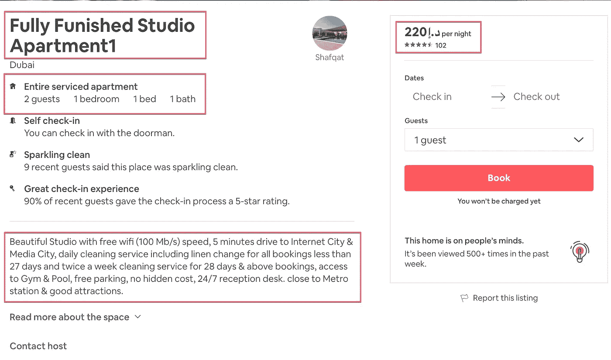*

*Airbnb : That’s Gonna Be Scraped*

*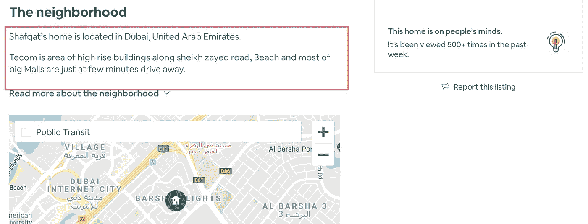*

*…and This*

*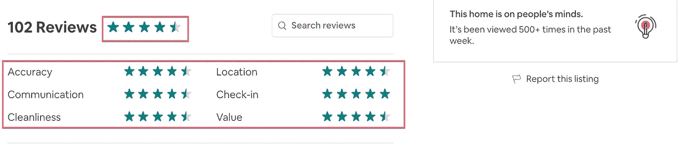*

*…and the Ratings*

*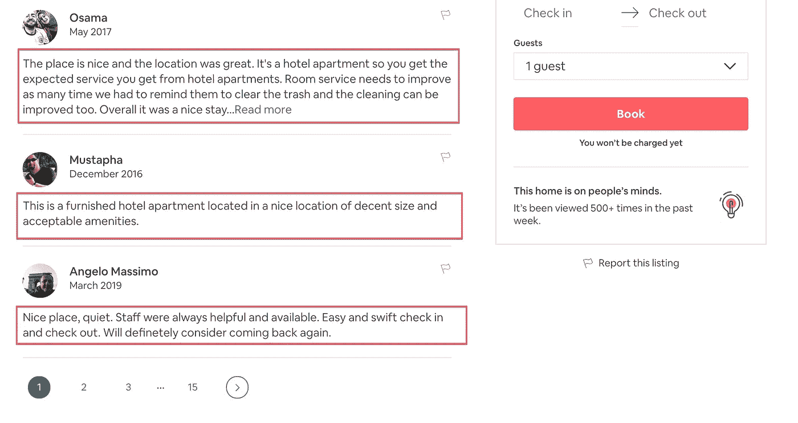*

*…and This Too*

*上面强调的每件事都有两个要点。我提供它们就好像它们是原始代码的一部分。如果您想在控制台中试用它们，不要忘记从。第一个就在下面，除了评论之外什么都有:它相当简单，非常类似于检索搜索和目录页面上的选择器。元素中， *link_to_home，property_type，property_name，price_night，rating_overall* 以字符串形式出现(使用`extract_first()`)； *summary，rating_categories，rating_stars，home_neighborhood_short* 是列表(顺便使用`extract()`，输出可子集化)；最后，rating_categories 和 rating_stars 被组织成一个字典， *rating_split* (带有一个键值对*rating _ categories:rating _ stars*)。*

*下面的要点通过点击“下一步”按钮导航评论部分。返回的对象是列表的*列表。列表中的每个列表都包含来自单个评论页面的字符串形式的评论。最初，我计划构建一个字典，用 reviewer 和 review date 作为键，用 review 作为值。我把我的实验留在了要点中，以防万一你需要一个基础来开始玩它或者有一个如何实现它的建议。为了这篇文章，我决定放弃它。如果你想在家里试一试，有两个提示:1)房主对评论的响应作为相同的类和目录存储在 HTML 树中，所以对评论的导航应该足够精确以区分这两种情况；2)一些评论是空的，但是评论者的名字在那里，留下没有值的潜在的键-值对。在要点的评论中，第一个问题已经解决，但是你仍然会碰到第二个问题。如果你对如何改进代码有好的想法，非常欢迎。**

*在这里，我首先到达该部分以确保它被加载，并获取`page_source`以确保该部分被捕获。在获得第一个评论页面后，我尝试单击“下一步”按钮(您也可以一个按钮一个按钮地前进)，如果它不可用，*

## *最后一块*

*这篇文章的这一部分仅仅是将所有的代码连接在一起。这是“蜘蛛”文件夹中 **homes.py** 文件的内容。有一点不同的是`yield`，它产生一个字典对象来形成输出。当您以`scrapy crawl homes -o output_file_name.json`或`.csv`运行刮刀时，yield 将被传递到输出文件。该文件将存储在您的项目根目录中(与 scrapy.cfg 所在的目录相同)。*

# *在结束语中*

## ***Airbnb 有什么不同***

*在这次 Airbnb 经历中，有两件事发人深省。*

**一个*，他们相当频繁地改变网站布局，可以想见维护刮刀是需要努力的。在完成当前版本的几周前，我完成了第一个版本的刮刀，我希望它能持续下去！*

**两个*，在一些章节中，像“评论”很多元素都嵌套在 HTML 树中相同的元素名称下，共享相同的类、id 等。，但表示逻辑上不同的内容(例如，评论与对评论的响应)。在这种情况下，高效地收集和存储数据成为爬虫的关键部分。*

## *更进一步*

*最后但同样重要的是，如果您想使用 Docker 将您的应用程序容器化，您可能想看看这篇博文，我发现这篇博文很全面，唯一的例外是作者使用了 R 而不是 Python。*

*最后， [Airbnb 有一个 API](https://www.airbnb.ae/partner) ，所以如果你的 API 获得批准并且符合你的目的，就使用它吧！*

*感谢你阅读这篇文章并走了这么远！希望这是有帮助的，如果你有任何意见，请在下面留下。你也可以在 LinkedIn 上联系我:[https://www.linkedin.com/in/areusova/](https://www.linkedin.com/in/areusova/)(说明你是从这个中等岗位过来的)。或者推特[https://twitter.com/khunreus](https://twitter.com/khunreus)。*