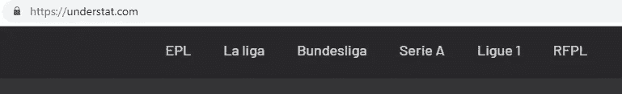
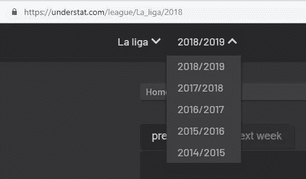
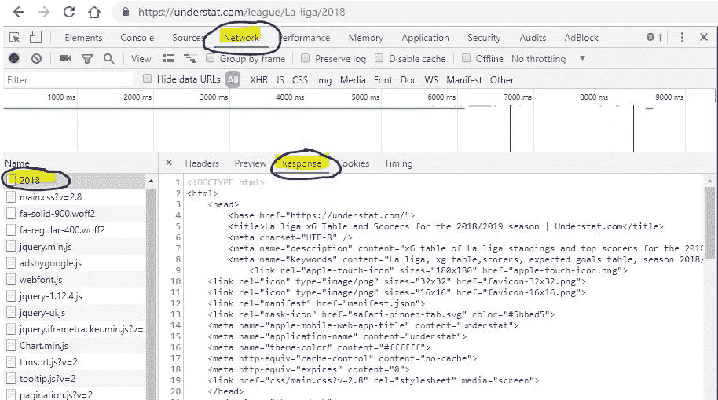
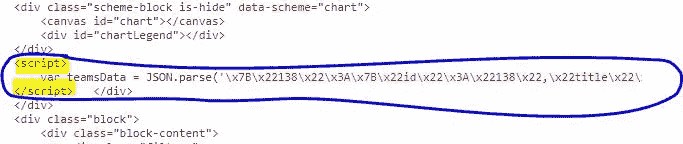
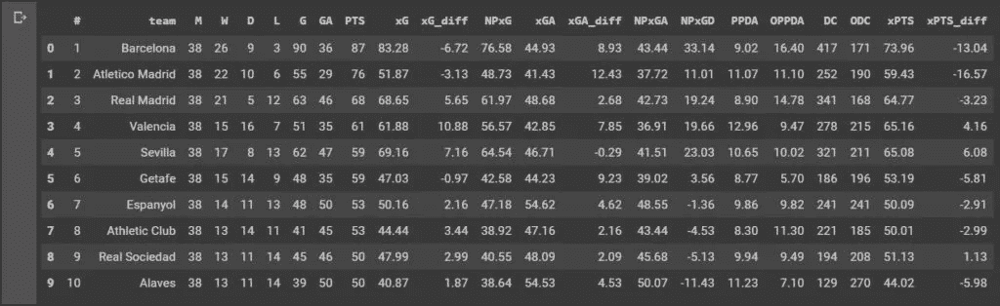
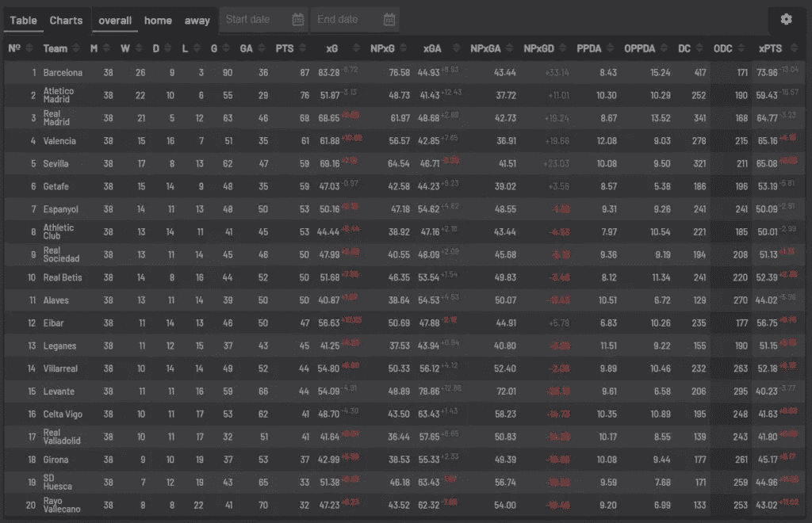

# 网页抓取高级足球统计

> 原文：<https://towardsdatascience.com/web-scraping-advanced-football-statistics-11cace1d863a?source=collection_archive---------3----------------------->


Photo by [Michael Lee](https://unsplash.com/@guoshiwushuang?utm_source=unsplash&utm_medium=referral&utm_content=creditCopyText) on [Unsplash](https://unsplash.com/search/photos/soccer-stadium?utm_source=unsplash&utm_medium=referral&utm_content=creditCopyText)

## 收集数据总是很有趣

最近我一直在争论运气在足球中的作用。又或许不是纯粹的运气，而是一种技能？球队赢得联赛是纯粹靠技术吗？还是运气的重要性相当巨大？谁幸运，谁不幸运？那个队应该降级吗？还有很多很多。

但是因为我是一个数据专家，所以我想，让我们收集数据并找出答案。虽然，你是怎么衡量运气的？你如何衡量技能？没有像国际足联或 PES 电脑游戏那样的单一指标。我们必须着眼于全局，着眼于具有多个变量的长期数据，并考虑到每一场比赛的背景。因为在某些时候，一个队的球员在完全控制对手后的最后几分钟没有足够的运气打进制胜一球，最终成为平局，两个队都得了 1 分，而显然第一个队应该获得胜利。一个团队是幸运的，另一个不是。是的，在这种情况下这是一种运气，因为一支球队做了一切，创造了足够多的危险时刻，但没有得分。它发生了。这就是我们热爱足球的原因。因为这里什么都有可能发生。

虽然你不能衡量运气，但你可以根据足球中一个相对较新的指标——xG，或预期进球，了解球队的表现。

> *xG——是创造和放弃机会质量的统计指标*

你可以在 understat.com 的[找到这个指标的数据。这就是我要废弃的网。](https://understat.com/)

# 理解数据

那么 xG 到底是什么，为什么它很重要。答案我们可以在 understat.com 的[主页找到。](https://understat.com)

> *预期目标(xG)是新的革命性足球指标，允许您评估球队和球员的表现。*
> 
> *在像足球这样的低分比赛中，最终比赛分数并不能提供清晰的表现画面。*
> 
> *这就是为什么越来越多的体育分析转向 xG 这样的高级模型，这是一种对创造和失球机会质量的统计测量。*
> 
> *我们的目标是创建最精确的拍摄质量评估方法。*
> 
> *对于这种情况，我们用大数据集(> 100，000 个镜头，每个镜头超过 10 个参数)训练神经网络预测算法。*

研究人员根据导致进球的情况训练神经网络，现在它给我们提供了一个在比赛中球队有多少真正机会的估计。因为你可以在比赛中有 25 次射门，但如果他们都是远距离或低角度射门，或者太弱，短-低质量的射门，他们不会导致进球。虽然一些没有看过比赛的“专家”会说球队占了上风，创造了大量的机会。这些机会的质量很重要。这就是 xG 度量变得非常方便的地方。有了这个指标，你现在明白梅西在很难进球的情况下创造进球，或者守门员在应该进球的地方做出扑救。所有这些事情加起来，我们看到冠军拥有技术娴熟的球员和一些运气，我们也看到失败者可能拥有优秀的球员，但运气不够好。我做这个项目的目的是理解并展示这些数字，以展示运气在当今足球中的作用。

# 我们开始吧

我们首先导入将在该项目中使用的库:

*   numpy——使用 Python 进行科学计算的基础包
*   pandas —提供高性能、易于使用的数据结构和数据分析工具的库
*   requests——是 Python 唯一的非转基因 HTTP 库，可供人们安全使用。(喜欢:D 官方文件中的这句话)
*   beautiful soup——一个从 HTML 和 XML 文件中提取数据的 Python 库。

```
import numpy as np*# linear algebra* 
import pandas as pd*# data processing, CSV file I/O (e.g. pd.read_csv)* 
import requests 
from bs4 import BeautifulSoup
```

# 网站研究和数据结构

在任何网络抓取项目中，你首先要做的是研究你想要抓取的网页，并理解它是如何工作的。这是根本。所以我们从那里开始。

在主页上，我们可以看到该网站有 6 个欧洲联赛的数据:



我们还看到，收集的数据是从 2014/2015 赛季开始的。我们提出的另一个概念是 URL 的结构。是'`https://understat.com/league'` + ' `/name_of_the_league` ' + ' 【T2 ' '



所以我们用这些数据创造变量来选择任何一个赛季或任何一个联赛。

```
*# create urls for all seasons of all leagues* 
base_url = 'https://understat.com/league' 
leagues = ['La_liga', 'EPL', 'Bundesliga', 'Serie_A', 'Ligue_1', 'RFPL'] 
seasons = ['2014', '2015', '2016', '2017', '2018']
```

下一步是理解数据在网页上的位置。为此，我们在 Chrome 中打开开发者工具，转到标签“网络”，找到包含数据的文件(在这种情况下是 2018 年)，并检查“响应”标签。这是我们运行 *requests.get(URL)* 后得到的结果



浏览完网页内容后，我们发现数据存储在“script”标签下，并且是 JSON 编码的。所以我们需要找到这个标签，从中获取 JSON，并将其转换成 Python 可读的数据结构。



```
*# Starting with latest data for Spanish league, because I'm a Barcelona fan* 
url = base_url+'/'+leagues[0]+'/'+seasons[4] 
res = requests.get(url) soup = BeautifulSoup(res.content, "lxml")*# Based on the structure of the webpage, I found that data is in the JSON variable, under 'script' tags* 
scripts = soup.find_all('script')
```

# 使用 JSON

我们发现我们感兴趣的数据存储在 teamsData 变量中，在创建了一大堆 html 标签之后，它就变成了一个字符串，所以我们找到那个文本并从中提取 JSON。

```
import json string_with_json_obj = '' *# Find data for teams* 
for el **in** scripts: 
    if 'teamsData' **in** el.text: 
        string_with_json_obj = el.text.strip()*# print(string_with_json_obj)**# strip unnecessary symbols and get only JSON data* 
ind_start = string_with_json_obj.index("('")+2 
ind_end = string_with_json_obj.index("')") 
json_data = string_with_json_obj[ind_start:ind_end] json_data = json_data.encode('utf8').decode('unicode_escape')
```

一旦我们得到了 JSON 并对它进行了清理，我们就可以将它转换成 Python 字典并检查它的外观(注释了 print 语句)。

# 使用 Python 理解数据

当我们开始研究`data`时，我们明白这是一本由三个关键词组成的字典: *id* 、*头衔*和*历史*。字典的第一层也使用*id*作为键。

从这里我们还可以了解到*历史*有关于球队在自己联赛中每一场比赛的数据(不包括联赛杯或冠军联赛)。

我们可以在查阅第一层字典后收集团队名称。

```
*# Get teams and their relevant ids and put them into separate dictionary* 
teams = {} 
for id **in** data.keys(): 
    teams[id] = data[id]['title']
```

*history* 是字典的数组，其中键是度量的名称(读取列名),值是值，不管这是多么的重复:d。

我们知道列名会反复出现，所以我们将它们添加到单独的列表中。同时检查样本值的外观。

```
*# EDA to get a feeling of how the JSON is structured
# Column names are all the same, so we just use first element* columns = []
*# Check the sample of values per each column* 
values = [] 
for id **in** data.keys(): 
    columns = list(data[id]['history'][0].keys()) 
    values = list(data[id]['history'][0].values()) 
    break
```

在输出几个打印语句后，我们发现 Sevilla 的 id=138，因此获取这支球队的所有数据能够为联盟中的所有球队复制相同的步骤。

```
sevilla_data = [] 
for row **in** data['138']['history']:
    sevilla_data.append(list(row.values())) df = pd.DataFrame(sevilla_data, columns=columns)
df.head(2)
```

为了保持本文的整洁，我不会添加已创建的 DataFrame 的内容，但最终您会在 Github 和 Kaggle 上找到 IPython 笔记本的链接，其中包含所有代码和输出。这里只是上下文的示例。

所以，wualya，恭喜你！我们有西甲 2018-2019 赛季塞维利亚所有比赛的数据！现在我们想得到所有西班牙球队的数据。让我们把这些咬过的东西循环一遍，宝贝！

```
*# Getting data for all teams* 
dataframes = {} 
for id, team **in** teams.items(): 
    teams_data = [] 
    for row **in** data[id]['history']:
        teams_data.append(list(row.values())) df = pd.DataFrame(teams_data, columns=columns) 
dataframes[team] = df 
print('Added data for**{}**.'.format(team))
```

这段代码运行完成后，我们有了一个数据帧字典，其中 key 是球队的名称，value 是该队所有比赛的数据帧。

# 使数据与原始数据一样的操作

当我们查看 DataFrame 的内容时，我们可以注意到，PPDA 和 OPPDA (ppda 和 ppda_allowed)等指标表示为攻击/防御动作的总量，但在原始表格中，它们显示为系数。让我们解决这个问题！

```
for team, df **in** dataframes.items(): 
    dataframes[team]['ppda_coef'] = dataframes[team]['ppda'].apply(lambda x: x['att']/x['def'] if x['def'] != 0 else 0)
    dataframes[team]['oppda_coef'] = dataframes[team]['ppda_allowed'].apply(lambda x: x['att']/x['def'] if x['def'] != 0 else 0)
```

现在我们有了所有的数字，但是每一场比赛。我们需要的是团队的总成绩。让我们找出需要汇总的列。为此，我们回到 understat.com[的原始表格](https://understat.com/league/La_liga/2018)，我们发现所有指标都应被汇总，最终只有 PPDA 和欧普达是平均值。

```
cols_to_sum = ['xG', 'xGA', 'npxG', 'npxGA', 'deep', 'deep_allowed', 'scored', 'missed', 'xpts', 'wins', 'draws', 'loses', 'pts', 'npxGD'] 
cols_to_mean = ['ppda_coef', 'oppda_coef']
```

我们准备计算我们的总数和平均数。为此，我们循环遍历字典*数据帧*并调用。sum()和。mean() DataFrame 方法返回 Series，这就是我们添加的原因。将()转置到这些调用中。我们把这些新的数据帧放到一个列表中。将它们连接成一个新的数据帧`full_stat`。

```
frames = [] 
for team, df **in** dataframes.items(): 
    sum_data = pd.DataFrame(df[cols_to_sum].sum()).transpose()
    mean_data = pd.DataFrame(df[cols_to_mean].mean()).transpose()
    final_df = sum_data.join(mean_data) 
    final_df['team'] = team
    final_df['matches'] = len(df) 
    frames.append(final_df) full_stat = pd.concat(frames)
```

接下来，我们重新排序列以提高可读性，根据点对行进行排序，重置索引并添加列'位置'。

```
full_stat = full_stat[['team', 'matches', 'wins', 'draws', 'loses', 'scored', 'missed', 'pts', 'xG', 'npxG', 'xGA', 'npxGA', 'npxGD', 'ppda_coef', 'oppda_coef', 'deep', 'deep_allowed', 'xpts']]full_stat.sort_values('pts', ascending=False, inplace=True)
full_stat.reset_index(inplace=True, drop=True)
full_stat['position'] = range(1,len(full_stat)+1)
```

同样，在原始表中，我们有预期指标和实际指标之间的差值。让我们把那些也加上。

```
full_stat['xG_diff'] = full_stat['xG'] - full_stat['scored'] full_stat['xGA_diff'] = full_stat['xGA'] - full_stat['missed'] full_stat['xpts_diff'] = full_stat['xpts'] - full_stat['pts']
```

在适当的时候将浮点数转换成整数。

```
cols_to_int = ['wins', 'draws', 'loses', 'scored', 'missed', 'pts', 'deep', 'deep_allowed'] 
full_stat[cols_to_int] = full_stat[cols_to_int].astype(int)
```

美化数据帧的输出和最终视图。

```
col_order = ['position','team', 'matches', 'wins', 'draws', 'loses', 'scored', 'missed', 'pts', 'xG', 'xG_diff', 'npxG', 'xGA', 'xGA_diff', 'npxGA', 'npxGD', 'ppda_coef', 'oppda_coef', 'deep', 'deep_allowed', 'xpts', 'xpts_diff'] full_stat = full_stat[col_order] 
full_stat.columns = ['#', 'team', 'M', 'W', 'D', 'L', 'G', 'GA', 'PTS', 'xG', 'xG_diff', 'NPxG', 'xGA', 'xGA_diff', 'NPxGA', 'NPxGD', 'PPDA', 'OPPDA', 'DC', 'ODC', 'xPTS', 'xPTS_diff'] pd.options.display.float_format = '**{:,.2f}**'.format full_stat.head(10)
```



原始表格:



现在，当我们从一个联盟获得一个赛季的数据时，我们可以复制代码并将其放入循环中，以获得所有联盟所有赛季的所有数据。我不会把这段代码放在这里，但是我会在我的 [Github](https://github.com/slehkyi/notebooks-for-articles/blob/master/web_scrapping_understatcom_for_xG_dataset.ipynb) 和 [Kaggle](https://www.kaggle.com/slehkyi/web-scraping-football-statistics-2014-now?scriptVersionId=16171675) 中留下一个完整的抓取解决方案的链接。

# 最终数据集

在循环了所有的联赛和所有的赛季以及一些使数据可以导出的操作步骤后，我得到了一个带有刮削数字的 CSV 文件。数据集可在[这里](https://www.kaggle.com/slehkyi/extended-football-stats-for-european-leagues-xg)获得。


# 结论

希望你觉得有用，并得到一些有价值的信息。无论如何，如果你读到这里，我只想说谢谢你的阅读，谢谢你为我的 5 分钱花了时间、精力和注意力，希望你有很多爱和幸福，你太棒了！

*原载于 2019 年 6 月 23 日*[*http://sergilehkyi.com*](http://sergilehkyi.com/web-scraping-advanced-football-statistics/)*。*