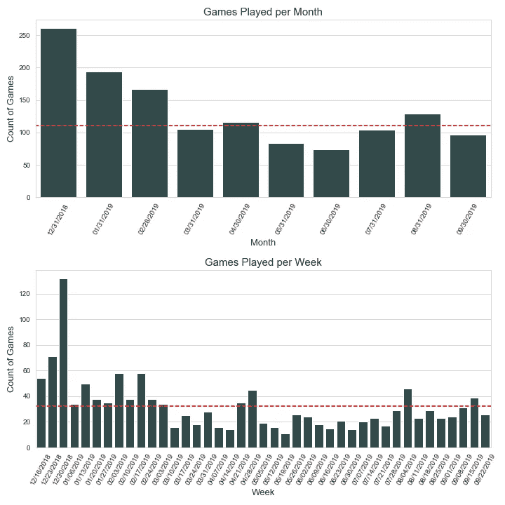

# 网络抓取和可视化象棋数据

> 原文：<https://towardsdatascience.com/web-scraping-and-visualizing-chess-data-af75f8f92354?source=collection_archive---------23----------------------->

# 动机

我一直在学习 web 抓取和数据可视化，主要是通过这个网站上发表的文章，虽然我已经找到了几十篇文章，对 web 抓取进行了快速介绍，但很少有人能超越这一点。我希望就如何在一个站点的 html 源代码中查找数据，如何抓取多个页面并收集数据，以及一旦一个人实际上拥有了她想要的数据后该做什么提供一些建议。

# 话题

我从 2018 年 11 月开始下棋，从那时起，我已经玩了 1，566 场不同速度的游戏，平均每天约 5 场。我使用 chess.com 的应用程序玩游戏，该应用程序除了维护每场游戏的完整历史记录之外，还跟踪每个用户的一些基本统计数据。


Screenshot of Chess.com’s stats page

虽然 chess.com 在 UX 做了令人难以置信的工作，但统计数据页面还有待改进。因为我一直在寻找项目来练习/学习更多关于网页抓取和数据可视化的知识，所以我决定收集我过去游戏的统计数据，并将收集到的一些见解可视化。

# 网站结构

“存档”页面允许用户查看她过去的所有游戏，如果她想回顾或分析它们的话。从 web 抓取的角度来看，可以看到关于每个游戏的各种信息整齐地存储在各行中，包括:

所玩游戏的类型
用户的棋子颜色、名称、elo 和国家
对手的棋子颜色、名称、elo 和国家
游戏结果(赢或输)
游戏中的棋步数
游戏日期


Screenshot of Chess.com’s game archive

首先要做的是检查页面(右键单击→检查)以查看其底层 HTML 源代码。点击左上角的选择器工具，然后点击游戏图标，就可以直接指向网站这部分的代码。


为了收集这些数据，我使用 Requests 库来获取站点的 HTML 代码，使用 BeautifulSoup 库来解析这些代码并获得我想要的数据。大致的想法如下所示:

```
page = requests.get('[https://www.chess.com/games/archive/eono619](https://www.chess.com/games/archive/eono619)')
text = page.textb = BeautifulSoup(text, 'html.parser')content = b.find('span', attrs={'class': re.compile("archive-games-game-time")})content.getText().strip()
```

在这段代码中，我:
1。抓取带有请求的页面
2。从它创建一个美丽的组对象
3。使用对象的。find()方法通过输入标签(' span ')和属性来查找包含我想要的数据的 html 代码。这就产生了下面这个有点乱的字符串:"<span class = " archive-games-game-time ">5 分钟< /span > "
4。最后用。getText()方法并用 string 方法清理它。条状()

每个数据点都有自己独特的 HTML 标签和属性，但这是从网页中提取数据的通用格式。因为我想要页面上的所有游戏，而不仅仅是一个，所以我使用 BeautifulSoup。findAll()方法获取页面上具有该标签和属性的所有元素。对于我想要的每个数据点，我创建了一个类似上面的助手函数，它为给定的页面提取所有这些数据点。

```
def pull_speed(Bsoup):
    times = []
    for i in b.findAll('span', attrs={'class': re.compile("archive-games-game-time")}):
        times.append((i.getText().strip()))

    return times
```

为了浏览多个页面，我转到了网址:

[https://www . chess . com/games/archive/eono 619？gameOwner=my_game &游戏类型%5B0%5D=chess960 &游戏类型% 5b 1% 5D =每日&游戏类型=直播&page = 2](https://www.chess.com/games/archive/eono619?gameOwner=my_game&gameTypes%5B0%5D=chess960&gameTypes%5B1%5D=daily&gameType=live&page=2)

通过更改最后一个参数中的页码，我可以遍历页面。我的总体抓取代码初始化空列表来存储结果，遍历每个页面并调用助手函数来抓取我想要的数据，然后收集 pandas dataframe 中的所有内容进行分析。

Full notebook and data on my GitHub ([https://github.com/eonofrey/chess_scrape_2](https://github.com/eonofrey/chess_scrape_2))

最后，我的数据帧有 9 列 1566 行，包含了我深入游戏所需的一切。

# 可视化

我做的第一个图只是看看我的 elo 如何随着时间的推移沿着 30 天移动平均线前进，以消除一些粒状数据固有的波动。很明显有一个上升的趋势，这让我很高兴看到，因为这表明我确实在学习这个游戏，尽管偶尔会遇到困难。


接下来，我使用 Seaborn 的 countplots 查看了与我对战的不同国家，这是一个非常有用的函数，它绘制了传递给它的变量的计数。


不幸的是，我在每个国家玩过的游戏列表有一个很长的尾巴，但是当我将 order 参数传递给 countplot 函数时，我只能传递我的数据帧中的一部分(order = speed _ games[' opposite _ country ']。【value _ counts().iloc[1:25] 。index)来解决这个问题。在这里，我只列出了前 25 个值，并排除了美国，因为它在这张图表中占了很大一部分。


在此之后，我决定通过对不同的字段进行分组并查看各种汇总统计数据来稍微处理一下我的数据框架。我发现两种最好的方法是。重新取样()和。group_by()方法。在这里，我按月和周对数据进行分组，以获得每个时间段玩游戏的数量，并添加一条水平线来显示每个频率下玩游戏的平均数量。



为了想象我和不同国家的玩家打得有多好，我需要做更多的预处理。我首先将数据按国家分组，得到游戏的数量以及结果的平均值(1 =赢，0 =输)，这相当于一个胜率。然后，我将国家栏上的两个数据框连接起来，这样我就可以将我的图表限制在我至少打过 15 场比赛的国家。


接下来，我调查了我的胜率是否随着一周的不同而变化。有趣的是，我似乎在周末打得更好。


最后，我调查了每种颜色的胜率。由于白棋先走，所以比黑棋略占优势，预计赢的几率更大。我的数据支持这一点，显示我用白棋比用黑棋多赢了大约 4%。

我还研究了我赢的游戏和输的游戏的平均移动次数。有趣的是，我赢的游戏比我输的游戏平均多走两步。


我本可以探究这些数据的某些方面，但是为了保持简洁，我将在这里删减这篇文章。通过开展这个项目，我提高了我的网络抓取和数据可视化技能，甚至最终获得了一些关于我的象棋比赛的见解，这是一个额外的好处。我最终的希望是，有人能使用这里的课程/代码片段来帮助他们完成自己的项目。对于那些感兴趣的人，我的完整脚本和数据集可以在我的 GitHub 页面[https://github.com/eonofrey/chess_scrape_2](https://github.com/eonofrey/chess_scrape_2)找到。要获得所有媒体文章的完整访问权限，请点击[此处](https://eonofrey.medium.com/membership)！