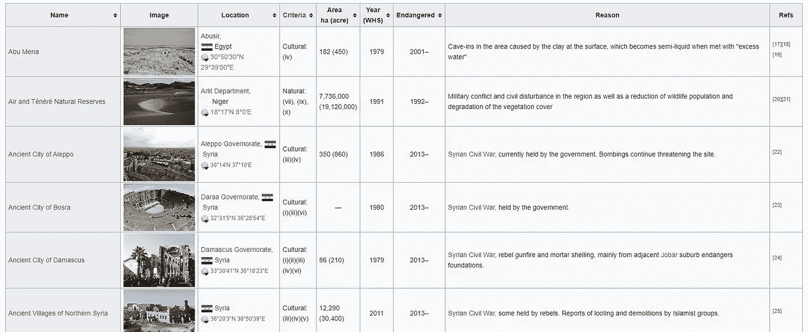
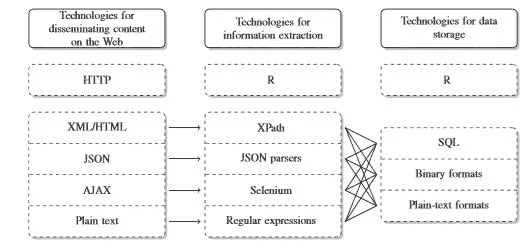

# 网页抓取基础知识

> 原文：<https://towardsdatascience.com/web-scraping-basics-3c0229653842?source=collection_archive---------28----------------------->

## 从网上收集数据的基础知识

联合国教科文组织是联合国内部的一个组织，致力于保护世界自然和文化遗产。世界上有许多遗产，包括包含自然现象的遗产，如大堡礁。不幸的是，一些获奖的地方受到了人为干预的威胁。我们可以用以下问题来解构这个人为干预的问题；

1-哪些地点受到威胁，它们位于哪里？

2-世界上有比其他地区更濒危的地方吗？

3-将网站置于风险中的原因是什么？

我们可以查看维基百科，找到进一步解决这些问题的地方列表。当我们去[https://www.wikipedia.org/](https://www.wikipedia.org/)搜索“濒危世界遗产名录”时，我们会看到[https://en . Wikipedia . org/wiki/List _ of _ World _ Heritage _ in _ Danger](https://en.wikipedia.org/wiki/List_of_World_Heritage_in_Danger)维基百科页面。在此页面中，我们可以看到一个表格，其中的列为我们提供了处于危险中的网站的功能信息。

在本文中，我们将使用 R 作为编程语言，从 web 上抓取数据并加载到数据帧中。请记住，这篇文章只提供了基本的网页抓取技术，给我们一个围绕过程和可能的网页抓取解决方案的想法。

我们找到了想要抓取的数据，下一步是使用 R 将所需的数据加载到 R 中。

我们有一个表，可以从前面安装的 XML 库中使用 readHTMLTable()函数加载到 R 中。

我们基本上是在告诉 R，导入的数据以 HTML 文档的形式出现。我们使用名为 htmlParse()的函数通过解析器实现了这一点。使用 readHTMLTable()函数，我们告诉 R 提取它在已解析的 heritage_parsed 对象中找到的所有 HTML 表格，并将它们存储在 heritage_tables 中。

现在让我们选择一个表，我们可以用它来更接近地回答我们最初建立的业务问题。我们要用的表格应该有遗址的名称、位置、文化或自然的分类变量、碑文年份和濒危年份。

我们能够获得包含我们之前定义的所需列的数据表。我们可以执行简单的数据清理。为了做到这一点，让我们看看数据帧的结构。

我们有 53 个地点和 9 个变量。我们可以看到每个变量的数据类型并不准确，例如，标准应该是自然或文化之间的分类变量，但是在这种情况下，我们有许多因素，数据类型被记录为字符串。我们可以对数据集应用基本的清理方法。

年份变量需要是数字，一些年份条目不明确，因为它们有几个年份附加或组合在一起。在这些值中，我们使用正则表达式选择最后一个给定的年份，比如[[:digit:]]4＄行

让我们看看位置变量，因为它看起来比年份变量要混乱得多。

这个变量实际上在一行中包含三个不同的值，它有几个不同的站点位置、国家和地理坐标。我们能做的就是得到地图的坐标。我们可以再次使用正则表达式来提取这些信息。

我们能够检索坐标和相应的世界遗产。这就完成了 web 抓取和数据准备过程，以供进一步分析。

web 抓取的过程总是包括使用一些工具，比如使用 R 或 Python 包从 web 上解析和抓取表格。如果我们想总结传播、提取和存储网络数据的技术，我们可以使用下图。

web 抓取最重要的阶段是初始阶段，在这个阶段我们定义数据需求。什么类型的数据最适合回答我们的业务问题？数据的质量是否足以回答我们的问题？信息是否存在系统性缺陷？

当我们从网上获取任何数据时，我们需要记住数据的来源。数据可能是作为第一方数据收集的一部分收集的，也可能是二手数据，如 Twitter 帖子或在离线环境中收集并手动在线发布的数据。然而，即使我们找不到数据的来源，我们使用网络上的数据也是完全有意义的。数据质量取决于用户的目的和数据的应用。

网络抓取基础有 5 个步骤，我们可以定义和遵循。

1-弄清楚你需要什么样的信息。

2-看看你是否能在网上找到能为你提供商业问题答案的数据源。

3-在试图找出数据来源时，创建数据生成过程的理论。(例如:数据集来自抽样计划或调查等……)

4-概述数据源的优点和缺点。(确定是合法的！)

5-制定决策，如果可行，从不同来源收集数据，以进一步整合。