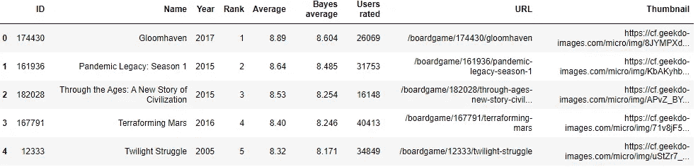
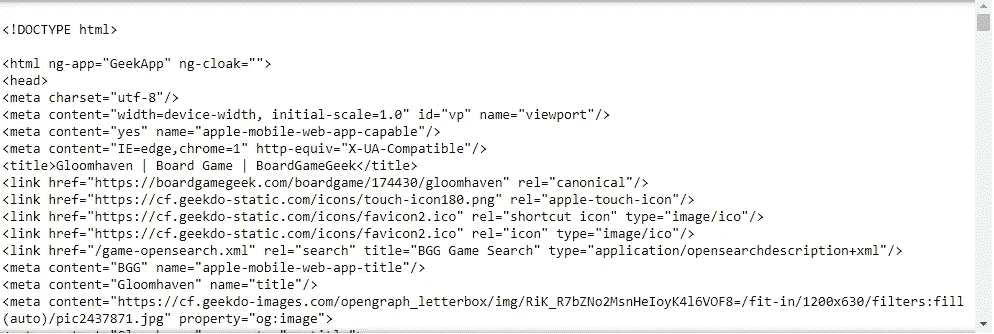
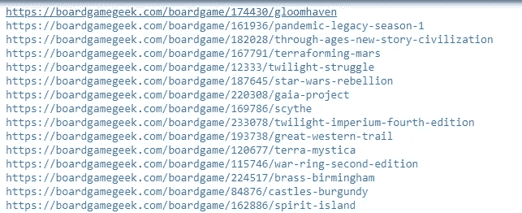
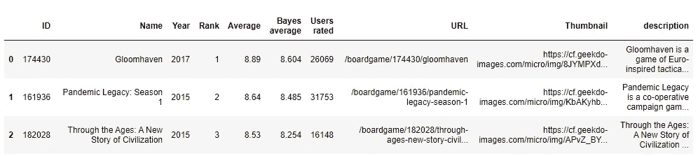

# 用 Python 编写的网页刮痧板游戏描述

> 原文：<https://towardsdatascience.com/web-scraping-board-game-descriptions-with-python-7b8f6a5be1f3?source=collection_archive---------22----------------------->


# 我喜欢收集数据！

我再说一遍，我爱收集数据！虽然通读 HTML 以找到您想要的标签有时会有点乏味，但是从网页中抓取数据提供了一个信息宝库。在[之前的一篇文章](https://medium.com/@erickleppen01/embracing-manual-data-collection-9ebccbac578d)中，我讨论了一些我用来手动收集网络数据的技术。本文将介绍如何使用 Python 库 BeautifulSoup，并请求从网站[棋盘游戏极客](https://boardgamegeek.com)那里收集棋盘游戏描述。如果你想看看我是如何把它们放在一起的，请滚动到文章的底部，复制并粘贴我的代码！

# 属国

为了让这个过程简单一点，我从[的“猛男”](https://github.com/beefsack)的 Github repo 中找到了一份超过 15000 款桌游的列表，用于[历史桌游极客排名](https://github.com/beefsack/bgg-ranking-historicals)。该文件是一个 CSV 文件，使得使用熊猫很容易。以下是数据在文件中如何格式化的示例:

```
ID,Name,Year,Rank,Average,Bayes average,Users rated,URL,Thumbnail
174430,Gloomhaven,2017,1,8.89,8.604,26069,/boardgame/174430/gloomhaven,[https://cf.geekdo-images.com/micro/img/8JYMPXdcBg_UHddwzq64H4NBduY=/fit-in/64x64/pic2437871.jpg](https://cf.geekdo-images.com/micro/img/8JYMPXdcBg_UHddwzq64H4NBduY=/fit-in/64x64/pic2437871.jpg)
```

使用这个文件，我构建了完整的 URL，可以从中抓取描述。我通过导入我的依赖项并加载 CSV 文件来开始这个过程:

```
import pandas as pd
import requests
from bs4 import BeautifulSoup
import sqlite3 as sql
from sqlite3 import Error#load the csv file
boardgames = pd.read_csv(r'board games\2019-07-08.csv')
boardgames.head()
```



Top 5 rows from boardgames


# 探索 HTML

在创建遍历所有 URL 并提取描述的循环之前，我研究了使用 Requests 和 BeautifulSoup 请求页面内容时返回的数据。这使得我更容易识别我需要找到的标签。

```
#explore the first board game page
url = r"[https://boardgamegeek.com/boardgame/174430/gloomhaven](https://boardgamegeek.com/boardgame/174430/gloomhaven)"
page_data = requests.get(url)
soup = BeautifulSoup(page_data.content, 'html.parser')
soup
```



The parsed html data

浏览数据，我看到描述被标记为带有属性 *og:description 的<*元内容* >。*我用 BeautifulSoup 的 find 方法提取数据。

```
description = soup.find("meta",  property="og:description")
print(description["content"])
```

# 在页面间循环

一旦我找到了我要找的东西，我就从 Pandas 数据框中取出 URL，并将它们分配给一个变量。然后我为 Loop 创建了一个简单的**来遍历每个 URL 并将棋盘游戏描述加载到一个列表中。在棋盘游戏没有描述的情况下，我使用一个 **IF ELSE** 语句来防止循环中断。**

```
#url part 1
up1 = r"[https://boardgamegeek.com](https://boardgamegeek.com)"#URLs from the data frame
urls = boardgames['URL']#index variable
n = 0#list of descriptions
desc = []#for loop
for u in urls:
    url = up1 + urls[n]
    print(url)
    d = requests.get(url)
    soup = BeautifulSoup(d.content, 'html.parser')
    description = soup.find("meta",  property="og:description")
    (desc.append(description["content"]) if description else desc.append("No Description"))
    n+=1
```



The loop prints the URL to indicate it is working


# 把所有的放在一起

循环完成后，我将描述添加到 *boardgames* 数据框中，并将数据框保存到 sqlite 数据库中。

```
#add the descriptions to the dataframe
boardgames['description'] = desc#create an sqlite database and connection
conn = sql.connect(r'Desktop\board games\bgdb')
c = conn.cursor()#load the data into the database
boardgames.to_sql('boardGames', conn)#query the data to verify
q = pd.read_sql('select * from boardGames', conn)
q.head()
```



The data frame with descriptions added

# 完整的代码

```
import pandas as pd
import requests
from bs4 import BeautifulSoup
import sqlite3 as sql
from sqlite3 import Error#load the csv file
boardgames = pd.read_csv(r'board games\2019-07-08.csv')
boardgames.head()#explore the first board game page
url = r"[https://boardgamegeek.com/boardgame/174430/gloomhaven](https://boardgamegeek.com/boardgame/174430/gloomhaven)"
page_data = requests.get(url)
soup = BeautifulSoup(page_data.content, 'html.parser')
soupdescription = soup.find("meta",  property="og:description")
print(description["content"])#url part 1
up1 = r"[https://boardgamegeek.com](https://boardgamegeek.com)"#URLs from the data frame
urls = boardgames['URL']#index variable
n = 0#list of descriptions
desc = []#for loop
for u in urls:
    url = up1 + urls[n]
    print(url)
    d = requests.get(url)
    soup = BeautifulSoup(d.content, 'html.parser')
    description = soup.find("meta",  property="og:description")
    (desc.append(description["content"]) if description else desc.append("No Description"))
    n+=1#add the descriptions to the dataframe
boardgames['description'] = desc#create an sqlite database and connection
conn = sql.connect(r'Desktop\board games\bgdb')
c = conn.cursor()#load the data into the database
boardgames.to_sql('boardGames', conn)#query the data to verify
q = pd.read_sql('select * from boardGames', conn)
q.head()
```

抓取网络数据是一项很棒的技能！如果 API 不可用，它为您提供了一种从 web 页面收集数据的简化方法。如果您想了解更多信息，请查看以下资源:

[](https://www.dataquest.io/blog/web-scraping-tutorial-python/) [## 教程:使用 BeautifulSoup 的 Python Web 抓取

### 在执行数据科学任务时，通常希望使用在互联网上找到的数据。你通常可以…

www.dataquest.io](https://www.dataquest.io/blog/web-scraping-tutorial-python/) 

[B](https://www.crummy.com/software/BeautifulSoup/bs4/doc/#)

# 谢谢大家！

*   *如果你喜欢这个，* [*跟我上 Medium*](https://medium.com/@erickleppen) *了解更多*
*   [*通过订阅*](https://erickleppen.medium.com/membership) 获得完全访问权限并帮助支持我的内容
*   *我们连线上*[*LinkedIn*](https://www.linkedin.com/in/erickleppen01/)
*   *用 Python 分析数据？查看我的* [*网站*](https://pythondashboards.com/)

[**—埃里克·克莱本**](http://pythondashboards.com/)