# 网络抓取 Craigslist:一个完整的教程

> 原文：<https://towardsdatascience.com/web-scraping-craigslist-a-complete-tutorial-c41cea4f4981?source=collection_archive---------2----------------------->

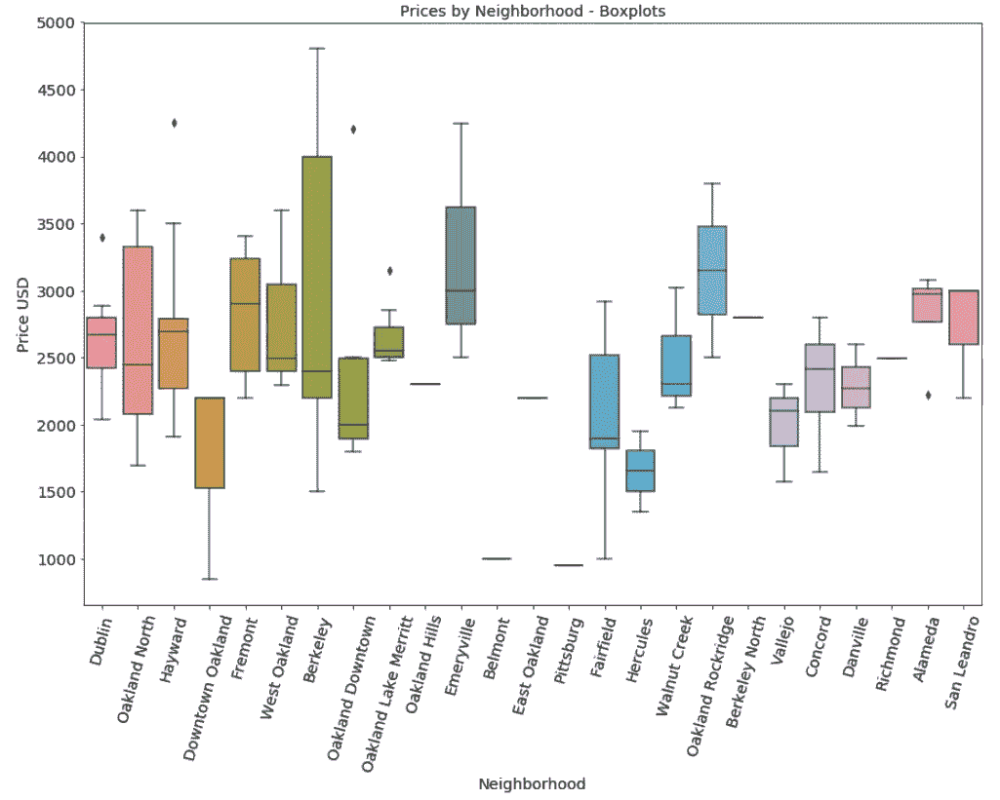

我最近一直想搬家。还有什么比从 Craigslist 上的房屋“人口”中取样更好的方式来知道我得到了一个好价格呢？听起来像是…Python 和 web 抓取的工作！

在本文中，我将带您浏览我的代码，该代码搜索东湾区 Craigslist 上的公寓。这里的代码，或者更确切地说是 URI 参数，可以被修改以从任何地区、类别、财产类型等中提取。很酷吧。

我要分享原 Jupyter 笔记本中每个单元格的 GitHub gists。如果你想一次性看到全部代码，[克隆回购](https://github.com/rileypredum/East-Bay-Housing-Web-Scrape)。否则，享受阅读和跟随！

## 获取数据

首先，我需要使用请求包中的 get 模块。然后我定义了一个变量 response，并把它赋给在基本 URL 上调用的 get 方法。我所说的基本 URL 是指你要从中提取数据的第一页的 URL，减去任何额外的参数。我去了东湾的公寓区，检查了“有图片”过滤器，缩小了搜索范围，所以这不是一个真正的基本网址。

然后我从 bs4 导入了 BeautifulSoup，这个模块实际上可以解析从服务器获取的 web 页面的 HTML。然后，我检查了该项目的类型和长度，以确保它与页面上的帖子数量相匹配(有 120 个)。您可以在下面找到我的导入语句和设置代码:

It prints out the length of posts which is 120, as expected.

在上面的代码中，对新创建的 html_soup 变量使用 find_all 方法，我找到了帖子。我需要检查网站的结构，以找到帖子的父标签。看下面的截图，可以看出是

*   。这是一篇文章的标签，实际上是包含我抓取的所有元素的盒子！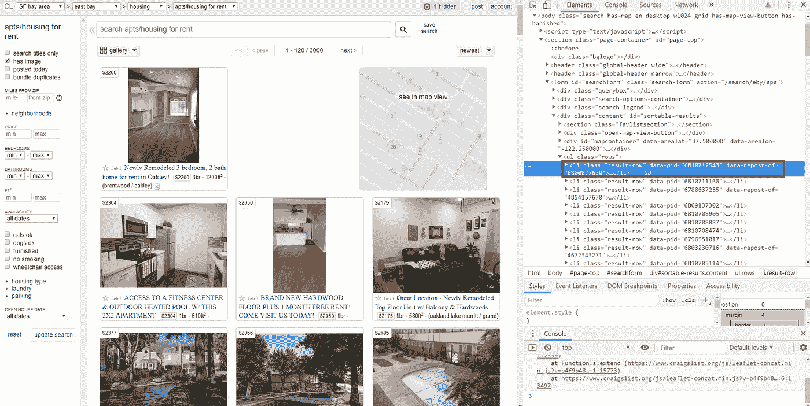

Element inspection with Chrome (Ctrl+Shift+C shortcut!)

为了实现这一点，请确保按照以下方式工作:获取第一篇文章和您想要从中获取的所有变量，确保您知道如何在循环整个页面之前访问一篇文章中的每个变量，最后，确保您在添加遍历所有页面的循环之前成功地抓取了一个页面。

类 bs4.element.ResultSet 是索引的，所以我通过索引`posts[0]`查看了第一个单元。惊喜，都是属于那个<李>标签的代码！

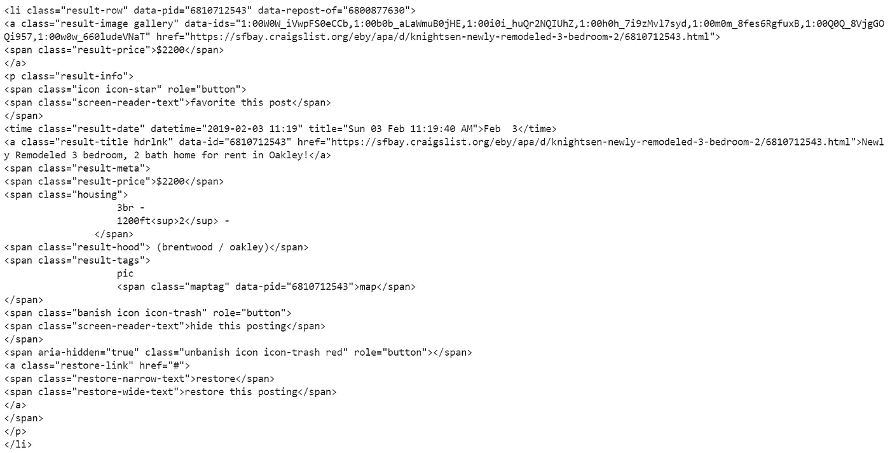

You should have this output for the first post in posts (posts[0]), assigned to post_one.

帖子的价格很好抢:

.strip() removes whitespace before and after a string

我通过在类“result-date”上指定属性“datetime”来获取日期和时间。通过指定“datetime”属性，我省去了数据清理的一个步骤，即不必将该属性从字符串转换为 datetime 对象。这也可以通过将`['datetime']`放在`.find()`调用的末尾而变成一行程序，但是为了清楚起见，我将它分成两行。

URL 和文章标题很简单，因为“href”属性是链接，通过指定该参数来获取。标题只是那个标签的文本。

卧室的数量和平方英尺在同一个标记中，所以我将这两个值分开，并按元素的方式各取一个。邻居是“结果社区”类的标签，所以我抓取了它的文本。

下一个块是东湾所有页面的循环。因为并不总是有关于平方英尺和卧室数量的信息，所以我在 for 循环中嵌入了一系列 if 语句来处理所有情况。

循环从第一页开始，对于该页中的每篇文章，它通过以下逻辑工作:

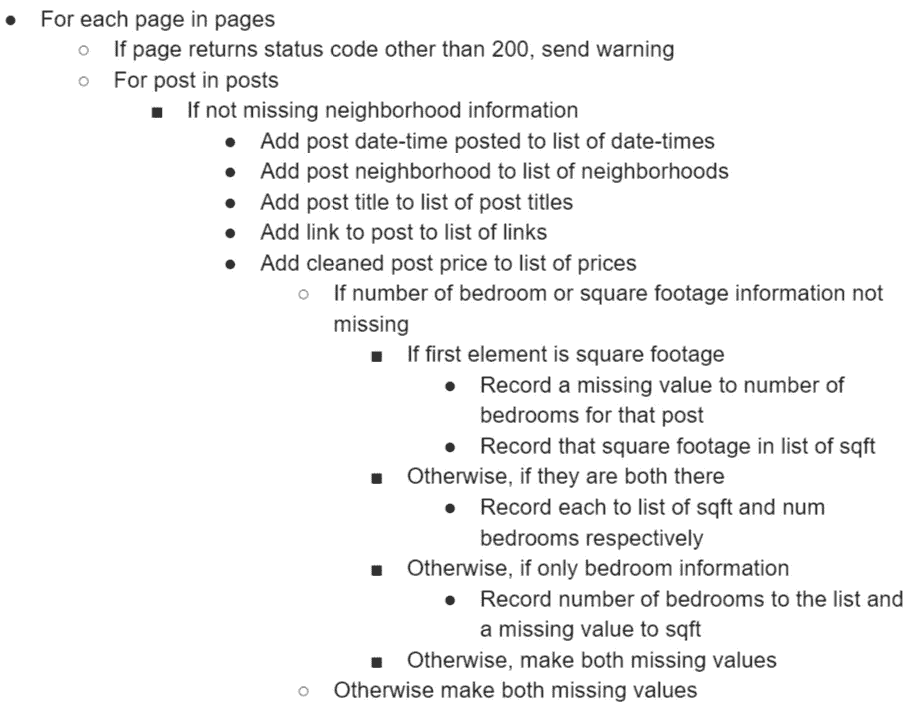

我在循环中包含了一些数据清理步骤，比如提取“datetime”属性，从平方英尺变量中删除“ft2 ”,并使该值成为一个整数。我把“br”从卧室的数量中去掉了，因为它也被删除了。这样，我开始清理一些已经完成的数据。优雅的代码是最好的！我想做更多的事情，但是代码会变得过于特定于这个区域，可能无法跨区域工作。

下面的代码从值列表中创建数据框架！

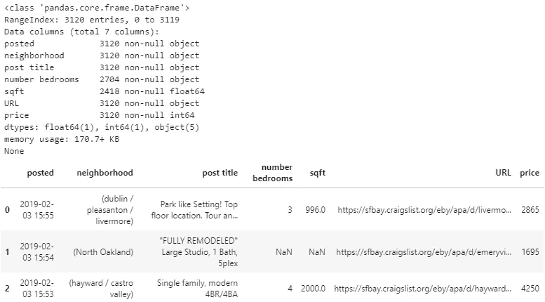

厉害！就在那里。不可否认，仍然有一些数据清理工作要做。我将快速浏览一遍，然后是研究数据的时候了！

## 探索性数据分析

可悲的是，删除重复的 URL 后，我发现只有 120 个实例。如果您运行代码，这些数字会有所不同，因为在不同的抓取时间会有不同的帖子。大约有 20 个帖子没有列出卧室或面积。出于统计原因，这不是一个令人难以置信的数据集，但我注意到了这一点，并继续向前推进。

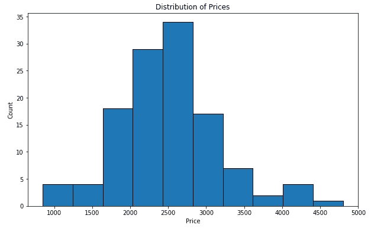

Descriptive statistics for the quantitative variables

我想看看东湾的价格分布，所以我画了上面的图。调用`.describe()`方法，我得到了更详细的观察。最便宜的地方 850 美元，最贵的 4800 美元。

下一个代码块生成一个散点图，其中的点用卧室的数量来着色。这显示了一个清晰和可以理解的分层:我们看到围绕特定价格和平方英尺的点的层次，随着价格和平方英尺的增加，卧室的数量也增加。

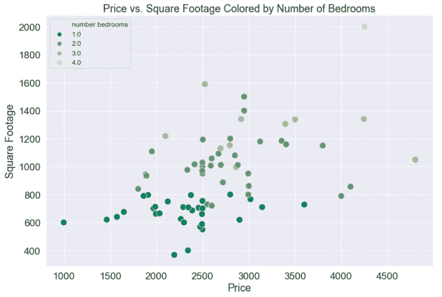

我们不要忘记数据科学的主力:线性回归。我们可以在这两个变量上调用一个`regplot()`来得到一条回归线，该回归线带有一个关于该线计算的 bootstrap 置信区间，并用下面的代码显示为一个阴影区域。如果你没有听说过 bootstrap 置信区间，这是一种非常酷的统计技术，值得一读。

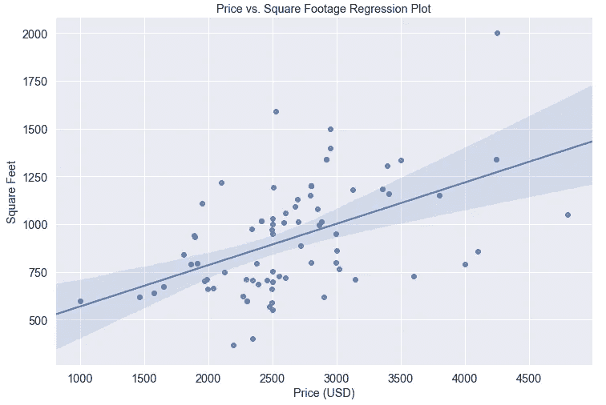

看起来我们对这两个变量有一个很好的拟合。让我们检查一下相关性。我打电话去拿这些:

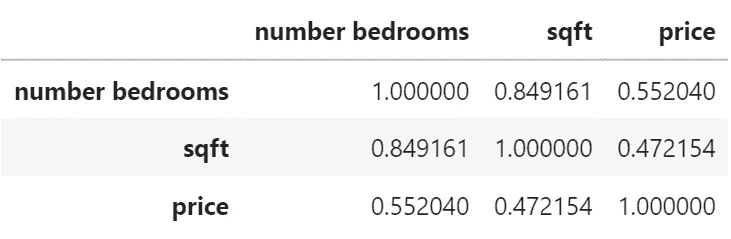

Correlation matrix for our variables

正如所怀疑的，卧室数量和面积之间有很强的相关性。这是有道理的，因为面积随着卧室数量的增加而增加。

## 继续按社区定价

我想了解位置如何影响价格，所以我按社区分组，并通过计算每个变量的平均值进行汇总。

下面是由这一行代码生成的:`eb_apts.groupby('neighborhood').mean()`其中“neighborhood”是“by=”参数，聚合函数是平均值。

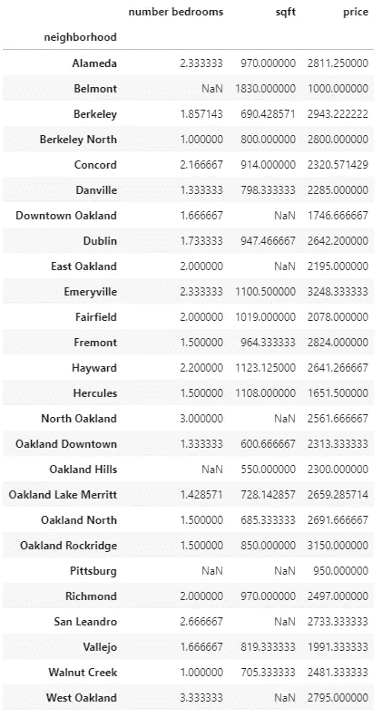

我注意到有两个北奥克兰:北奥克兰和北奥克兰，所以我将其中一个重新编码为另一个，如下所示:

`eb_apts['neighborhood'].replace('North Oakland', ‘Oakland North', inplace=True)`。

抓取价格，按升序排序，可以显示最便宜和最贵的居住地。现在整行代码是:`eb_apts.groupby('neighborhood').mean()['price'].sort_values()`，并产生以下输出:

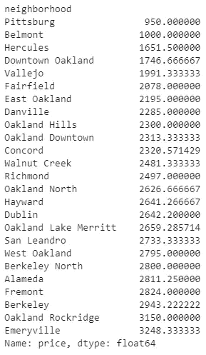

Average price by neighborhood sorted in ascending order

最后，我观察了每个街区的价格分布。通过这样做，我看到了邻近地区的价格是如何变化的，以及变化到什么程度。

下面是产生以下情节的代码。

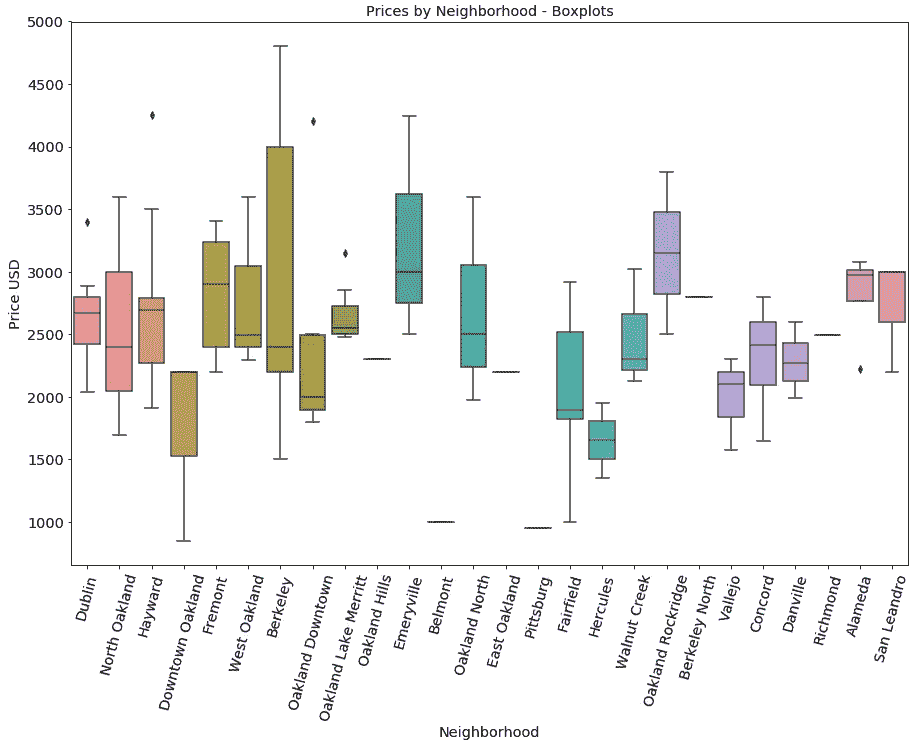

伯克利有很大的差距。这可能是因为它包括南伯克利、西伯克利和伯克利市中心。在这个项目的未来版本中，考虑改变每个变量的范围可能是重要的，这样它们可以更好地反映每个城市中不同社区之间的价格可变性。

好了，现在你知道了！下次你在市场上买房子的时候，看看这个，看看什么是好价格。请随意查看[回购](https://github.com/rileypredum/East-Bay-Housing-Web-Scrape)并亲自尝试，或者为您的城市完成该项目！让我知道你想出了什么！

[负责任的刮](https://www.scrapehero.com/how-to-prevent-getting-blacklisted-while-scraping/)。

如果你学到了新的东西，并想把它交给下一个学习者，[考虑捐赠](https://www.patreon.com/rileypredum)你觉得合适的任何数量，谢谢！

编码快乐！

奢侈的生活