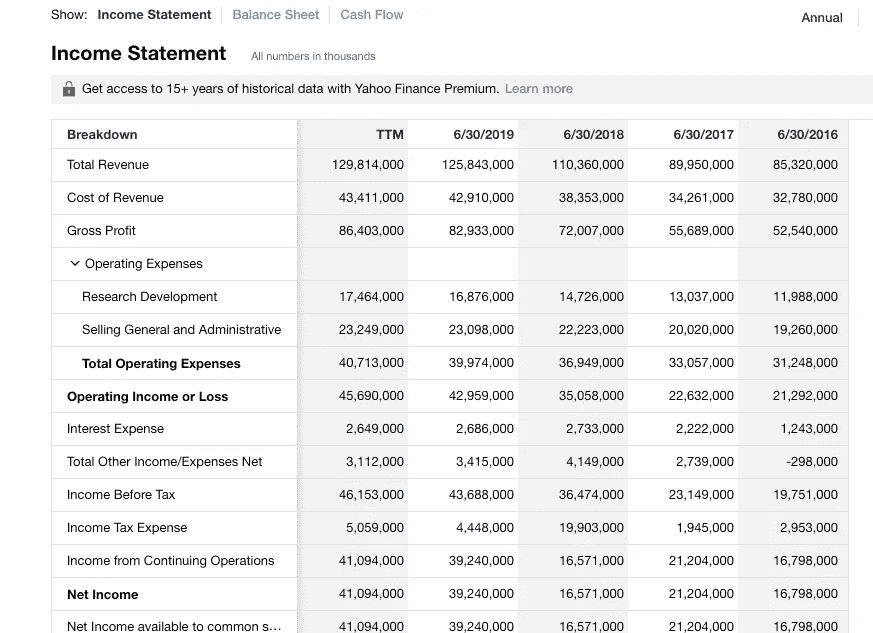
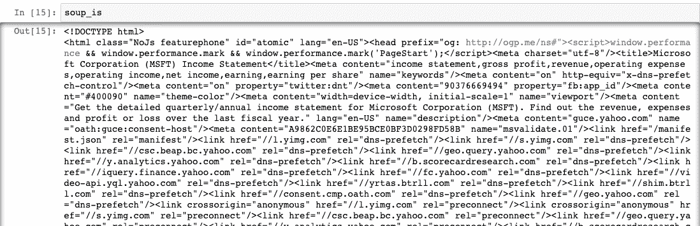
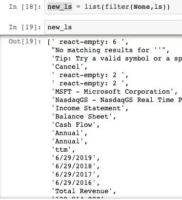
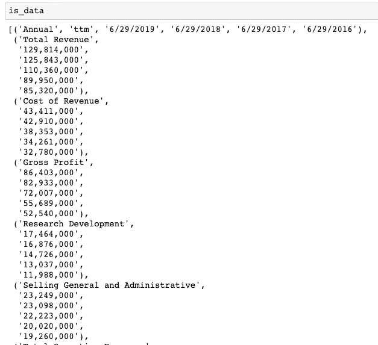
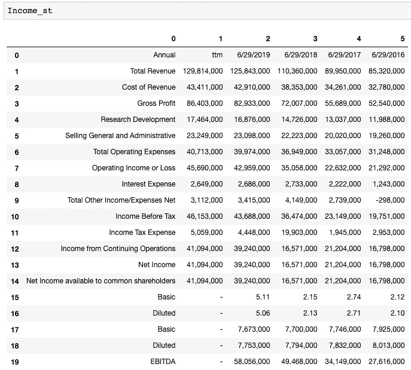
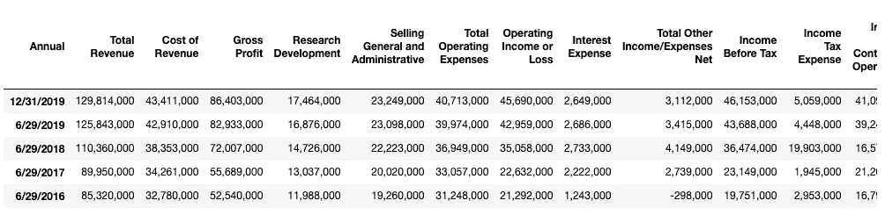
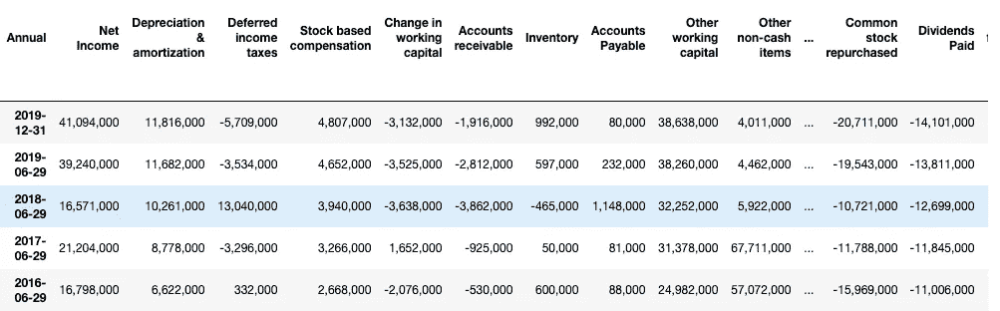
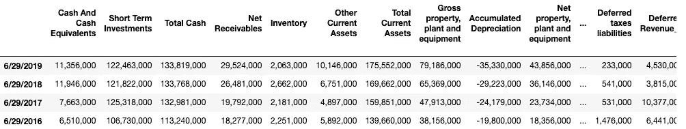

# 用 Python 实现财务报表的网络抓取— 1

> 原文：<https://towardsdatascience.com/web-scraping-for-accounting-analysis-using-python-part-1-b5fc016a1c9a?source=collection_archive---------3----------------------->

## 我复制了一个基于 Excel 的会计工作，以前我要花几个小时才能完成，现在这项任务可以在几秒钟内完成。

# **背景**

会计的数据科学用例并不多。然而，会计工作是需要自动化的繁琐类别之一。我曾经做过的一项任务是获取单个公司的财务报表，这样我就可以对照行业分析它们的表现。基本上，我会在雅虎财经上搜索他们的名字，并在 Excel 上收集关键指标。

操纵网络数据有时会很棘手，尤其是当网站更新时，但是掌握这几个步骤将会在将来为你节省大量的时间。这是一个**使用 Python 从雅虎财经**获取财务报表的例子。

## **导入库**

Urlib.request 是一个开源库，用于解析网页内容。当你调用它时，你基本上是要求网站从那个网站获取数据。如果感兴趣，这里有更多的信息。

[https://docs.python.org/3/library/urllib.request.html](https://docs.python.org/3/library/urllib.request.html)

另一个库叫做 **Beautiful Soup** ，它使得读取以 XML 格式存储的数据变得更加容易。XML 是一种类似于 HTML 的格式，在标记之间存储值。如果你打开它，它看起来有点乱。就像你拿到一个网页的源代码一样。

```
import pandas as pd
from bs4 import BeautifulSoup
import urllib.request as ur
```

## 处理

这里有一个简单的技巧，你可以灵活地调整股票代码，并将其插入网址链接。如果你想提取数百份公司财务报表，它会派上用场。

```
# Enter a stock symbol
index= ‘MSFT’# URL link 
url_is = ‘[https://finance.yahoo.com/quote/'](https://finance.yahoo.com/quote/') + index + ‘/financials?p=’ + index
url_bs = ‘[https://finance.yahoo.com/quote/'](https://finance.yahoo.com/quote/') + index +’/balance-sheet?p=’ + index
url_cf = ‘[https://finance.yahoo.com/quote/'](https://finance.yahoo.com/quote/') + index + ‘/cash-flow?p=’+ index
```

现在我们已经保存了 URL 链接。如果您在 Web 浏览器上手动打开它们，它将看起来像这样。



## 阅读网址

接下来，我们只需要打开链接，将它读入一个名为 lxml 的适当格式。很简单。

```
read_data = ur.urlopen(url_is).read() 
soup_is= BeautifulSoup(read_data,’lxml’)
```

嗯，如果你打开 soup_is，它看起来会很乱，因为元素最初是 HTML 格式的。所有元素都被系统地安排在类中。



# 数据操作

但是如何知道相关数据存储在哪个类中呢？

经过几次搜索，我们知道它们存储在“div”中，我们可以创建一个空列表并使用 for 循环来查找所有元素并将它们追加到列表中。

```
ls= [] # Create empty list
for l in soup_is.find_all(‘div’): 
  #Find all data structure that is ‘div’
  ls.append(l.string) # add each element one by one to the list

ls = [e for e in ls if e not in (‘Operating Expenses’,’Non-recurring Events’)] # Exclude those columns
```

你会发现 ls 里面有很多“none”元素，因为不是所有的“div”都有一个元素。我们只需要把那些过滤掉。

> `*new_ls = list(filter(None,ls))*`

现在看起来像这样。



如果我们更进一步，从第 12 个位置开始读列表。

> `new_ls = new_ls[12:]`

好吧，现在我们有一个名单。但是我们怎么把它变成一个数据框呢？首先，我们需要一次迭代 6 个项目，并将它们存储在元组中。然而，我们需要一个列表，以便熊猫图书馆可以将它读入数据框。

> `is_data = list(zip(*[iter(new_ls)]*6))`



太好了，这正是我们想要的。现在，我们只需将它读入数据框。

> `Income_st = pd.DataFrame(is_data[0:])`



# 数据清理

太好了。差不多完成了。我们只需要读取第一行作为列，第一列作为行索引。这里有一些清理。

```
Income_st.columns = Income_st.iloc[0] # Name columns to first row of dataframeIncome_st = Income_st.iloc[1:,] # start to read 1st rowIncome_st = Income_st.T # transpose dataframeIncome_st.columns = Income_st.iloc[0] #Name columns to first row of dataframeIncome_st.drop(Income_st.index[0],inplace=True) #Drop first index rowIncome_st.index.name = ‘’ # Remove the index nameIncome_st.rename(index={‘ttm’: ‘12/31/2019’},inplace=True) #Rename ttm in index columns to end of the yearIncome_st = Income_st[Income_st.columns[:-5]] # remove last 5 irrelevant columns
```

在对损益表、资产负债表和现金流使用相同的技术后，您的数据框架应该如下所示。



Income Statement



Balance Sheet



Cash flow statement

在对数据帧进行转置后，DateTime 被转换为行索引，而特性成为列名。

以下是一些事后思考的问题:

1.  这些特征如何与公司的股票价格相关联？你如何发现它们是否相关？
2.  如果是，哪些时间段的股票价格与我们财务报表的特征相关？
3.  在开发算法交易模型时，你还可以用提取的数据做什么？

欢迎在回复中留下你的答案和评论，看看你是否能想出一些独特的答案。

感谢您阅读本文，如果您觉得有用，请随意分享。[这里](https://medium.com/@dsjoench/replace-traditional-accounting-analysis-with-python-advanced-dupont-9b24f7719ee0)是另一篇关于利用新数据框架和用 Python 做进一步财务会计分析的文章。