# 金融分析师的网络抓取

> 原文：<https://towardsdatascience.com/web-scraping-for-beginners-beautifulsoup-scrapy-selenium-twitter-api-f5a6d0589ea6?source=collection_archive---------8----------------------->

# **简介**

我最近在学习网络抓取，并想分享我使用 beautifulsoup、scrapy、selenium 以及使用 Twitter API 和 pandas datareader 进行抓取的经验。网络抓取是有趣且非常有用的工具。Python 语言使得网络抓取变得更加容易。用不到 100 行代码就可以提取数据。网络抓取是数据分析专业人员需要掌握的一项重要技能。

例如，我们可以删除金融信息、宏观经济信息或股票研究分析师、风险资本家、财务经理、基金经理、对冲基金经理等使用的任何其他信息。通过抓取 Alexa.com 的网络流量，高盛资产管理公司(Goldman Sachs Asset Management)能够发现 Homedepot 网站的访问量大幅上升，这有助于该资产管理公司提前买入 HomeDepot 的股票。FlightAware.com 通过跟踪[帮助找出首席执行官的旅行模式，这反过来有助于发现并购活动。网络搜集在金融领域非常重要，因为网上有大量的金融信息。](https://flightaware.com/live/)

***什么是网刮*** ？

网络抓取是一种从网站上提取信息并进行处理的技术。

让我们看看如何简单和容易做网页抓取。

我将浏览下面的库和 API

*   ***美汤***
*   ***刺儿头***
*   ***硒***
*   ***Twitter API 提取推文***
*   ***熊猫 DataReader*** 阅读自谷歌财经

我们将使用 Jupyter 笔记本。请检查下面的链接并安装它。

[***Jupyter 安装***](https://www.anaconda.com/distribution/)

[***了解更多关于 jupyter***](https://www.datacamp.com/community/tutorials/tutorial-jupyter-notebook)

***美汤:***

Beautiful Soup 是一个 Python 库，用于从 HTML 和 XML 文件中提取数据。

***安装 BS4:***

*   pip 在命令提示符下安装 beautifulsoup4。
*   pip 安装请求

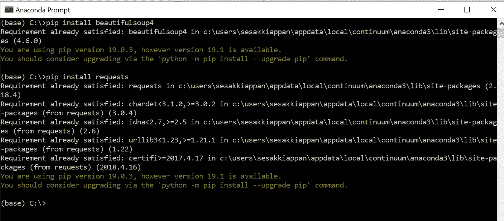

我已经安装了它，因此它说要求已经满足。

BS4 安装完成后，打开 juypter 笔记本。

只是为了演示的目的，我将从纳斯达克网站上删除数据

 [## 科技公司

### 使用公司列表工具在以下网址查找技术公司和纳斯达克、纽约证券交易所和美国证券交易所上市公司的完整列表…

www.nasdaq.com](https://www.nasdaq.com/screening/companies-by-industry.aspx?industry=Technology&sortname=marketcap&sorttype=1&page=1) 

我们将收集以下信息

1.  名字
2.  标志
3.  市值
4.  国家
5.  IPO 年份
6.  子部门

网页如下所示

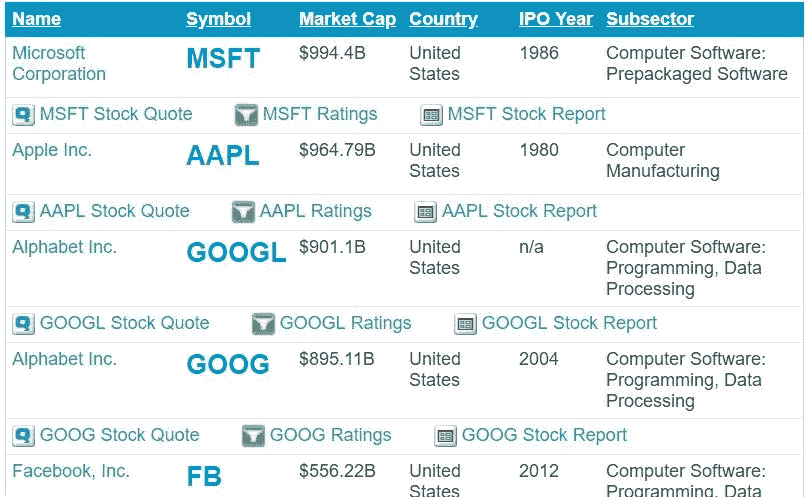

[***查美汤文档***](https://www.crummy.com/software/BeautifulSoup/bs4/doc/)

这些步骤是

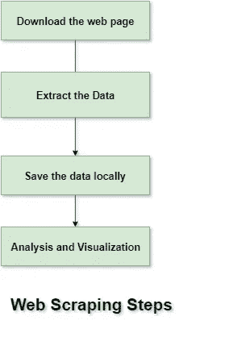

*   选择要废弃的网站 URL
*   最终确定需要从网站上搜集的信息
*   获取请求
*   检查网站——右击谷歌浏览器
*   美丽的汤— HTML 解析器
*   选择所需的数据并将其添加到列表中
*   将抓取的数据下载到一个 CSV 文件并存储在本地
*   将数据移动到 pandas 数据框或将 CSV 文件上传到数据框，并在 pandas 中进行进一步的分析和可视化。

下面的代码解释了这些步骤。现在打开 jupyter 笔记本，开始编码。

1.  导入所有必需的库。

2. ***获取请求:*** 首先我们需要下载网页。为此，我们将使用 get request。

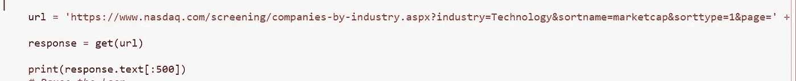

url = "给出您决定抓取数据的 URL "
response = get(URL)
[***获取有关 get 请求的更多信息***](https://2.python-requests.org//en/master/user/quickstart/#make-a-request)

3.**解析 HTML: 解析**

我们将使用上面的响应创建一个新的 beautifulsoup 对象，解析器方法为 html.parser。

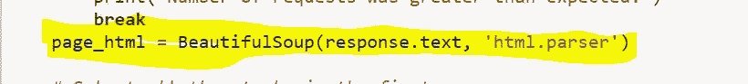

在 Chrome 中，我们可以通过以下方式快速找到元素的选择器

1.  右键单击该元素，然后在菜单中选择“检查”。开发人员工具打开，并突出显示我们右键单击的元素
2.  右键单击开发工具中的代码元素，将鼠标悬停在菜单中的“复制”上，然后单击“复制选择器”

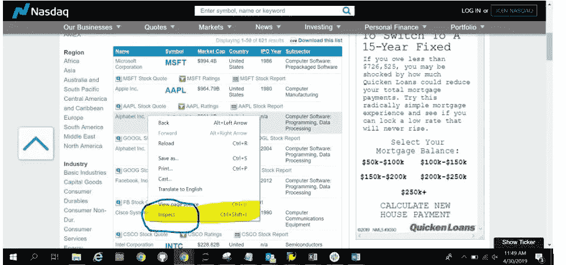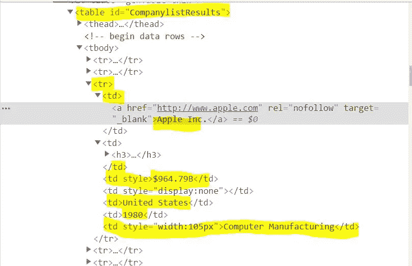

[***检查铬视工具使用***](https://developers.google.com/web/tools/chrome-devtools/dom/) 。

[***有关 html 和 xml 的信息，您可以查看***](http://2017.compciv.org/guide/topics/python-nonstandard-libraries/beautifulsoup.html)

在我们的例子中，整个列表保存在表“CompanylistResults”中。直接从表中删除数据。表的元素有

`[<table>](https://developer.mozilla.org/en-US/docs/Web/HTML/Element/table)`**HTML**`**<table>**`**元素**表示表格数据——也就是说，由包含数据的单元格的行和列组成的二维表格中呈现的信息。

`[<td>](https://developer.mozilla.org/en-US/docs/Web/HTML/Element/td)`**HTML**`**<td>**`**元素**定义了一个包含数据的表格单元格。它参与*表模型*。

`[<tr>](https://developer.mozilla.org/en-US/docs/Web/HTML/Element/tr)`HTML`**<tr>**`**元素**定义了表格中的一行单元格。然后可以混合使用`[<td>](https://developer.mozilla.org/en-US/docs/Web/HTML/Element/td)`(数据单元格)和`[<th>](https://developer.mozilla.org/en-US/docs/Web/HTML/Element/th)`(标题单元格)元素来建立行的单元格。HTML `**<tr>**`元素指定包含在`<tr>`块中的标记构成了一个表格的一行，其中`[<th>](https://developer.mozilla.org/en-US/docs/Web/HTML/Element/th)`和`[<td>](https://developer.mozilla.org/en-US/docs/Web/HTML/Element/td)`元素分别在该行中创建标题和数据单元格。

[***常见的 HTML 元素。查看更多信息***](https://developer.mozilla.org/en-US/docs/Web/HTML/Element)

整个列表存储在表“CompanylistResults”中

这些步骤是

1.  找到表 ID = "**company list results**"
2.  选择所有的' **tr** '(选择所有的行)
3.  循环遍历' **tr** '并找到 tr 中的所有**TD**(**TD**是单元格)

基于 HTML 代码，数据存储在 **< tr >之后..</tr>/。这是行信息。每一行都有一个对应的 **< td >..</TD>/或单元格数据信息。****

我将结果附加到一个列表中。当我打印这个列表时，我得到了如下结果

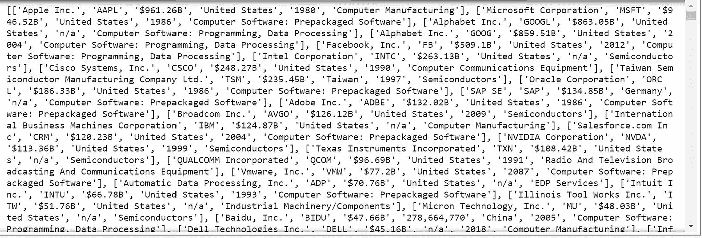

在这种情况下，我们只刮了第一页。我看到有 14 页。为了抓取多个页面，我们可以添加下面的逻辑

初始化一个名为 pages 的变量，范围在 1 到 14 之间。

对每个页面进行循环，并在 url 中分配页面值

URL = '[https://www . Nasdaq . com/screening/companies-by-industry . aspx？行业=技术&sort name = market cap&sort type = 1&page = '](https://www.nasdaq.com/screening/companies-by-industry.aspx?industry=Technology&sortname=marketcap&sorttype=1&page=')**+page**

对于第二页，url 将是

URL = '[https://www . Nasdaq . com/screening/companies-by-industry . aspx？industry = Technology&sort name = market cap&sort type = 1&page = 2](https://www.nasdaq.com/screening/companies-by-industry.aspx?industry=Technology&sortname=marketcap&sorttype=1&page=2)

并且整个提取逻辑被编码在每页的 for 循环中。

要提取数据:

现在你可以了

*   将数据加载到熊猫数据框架中
*   为数据帧指定列名，如名称、符号等。
*   将数据帧下载到 CSV 文件中。
*   进行分析和可视化

代码如下。

下载的 CSV 文件如下所示

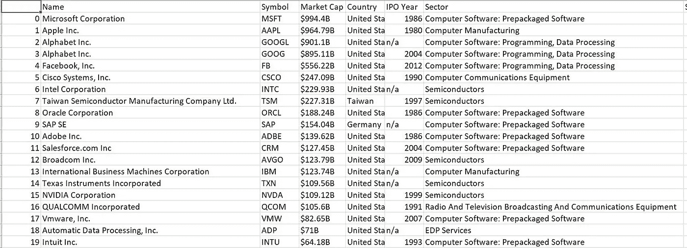

纳斯达克十大市值股票:

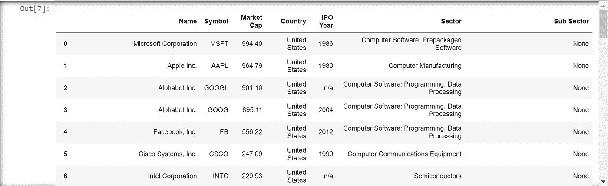

前 20 大市值股票

Top 20 Market Cap Stocks in NASDAQ

纳斯达克上市股票国家:

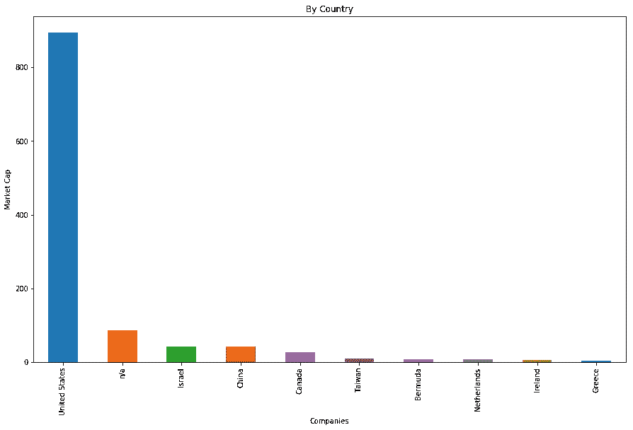

首次公开募股数量/年

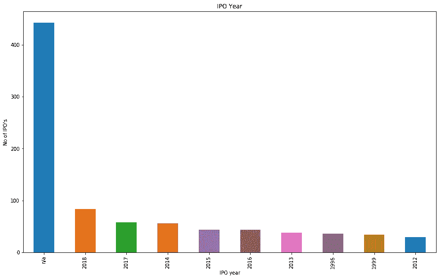

IPO Year

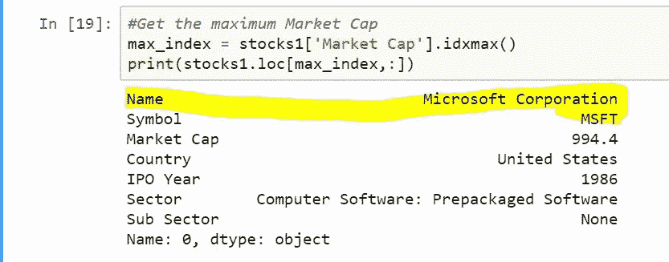

在纳斯达克上市的公司数量

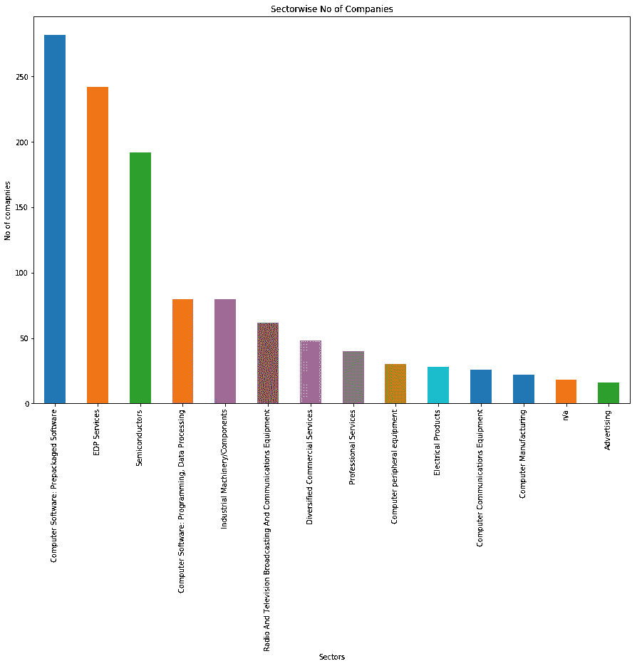

Sector wise breakup

公司在 2019 年进行 IPO(很惊讶没有在名单中看到 Lyft。检查了 NASADAQ 网站，Lyft 不在列表中-我想他们还没有更新他们的数据库。Pinterest 和 Zoom 都在)

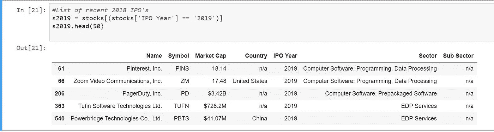

描述显示以下内容

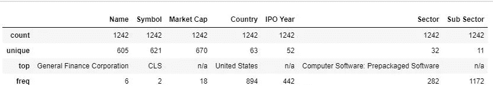

熊猫档案显示更多信息

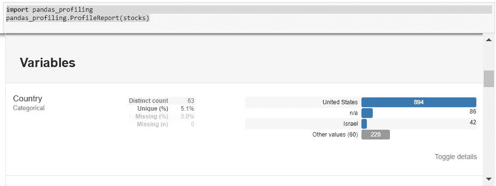

替代网络抓取的是 API。

[***流行的 API 看看这个 github 有用的 API***](https://github.com/toddmotto/public-apis)

在下一篇文章中，我将介绍 scrapy、selenium、Twitter API 和 DataRead。谢谢你看我的帖子。