# 用 RSelenium 抓取谷歌表单

> 原文：<https://towardsdatascience.com/web-scraping-google-sheets-with-rselenium-9001eda399b0?source=collection_archive---------9----------------------->


Photo by [freestocks.org](https://unsplash.com/photos/ZArDeAtxj0Q?utm_source=unsplash&utm_medium=referral&utm_content=creditCopyText) on [Unsplash](https://unsplash.com/search/photos/web-scraping?utm_source=unsplash&utm_medium=referral&utm_content=creditCopyText)

我喜欢学习新的东西，我学得最好的方法之一就是实践。也有人说[你永远不会完全理解一个话题，直到你能够解释它](https://kottke.org/17/06/if-you-cant-explain-something-in-simple-terms-you-dont-understand-it)，我认为博客是解释事情的一个低门槛。

我在蒙特利尔的一个当地数据科学会议上遇到的一个人想要帮助网络抓取，以从[puzzled point](http://www.puzzledpint.com/standings/)获得团队排名。我抓住了这个机会，因为我知道这将是我最终学习 [**硒的机会！**](https://github.com/ropensci/RSelenium)

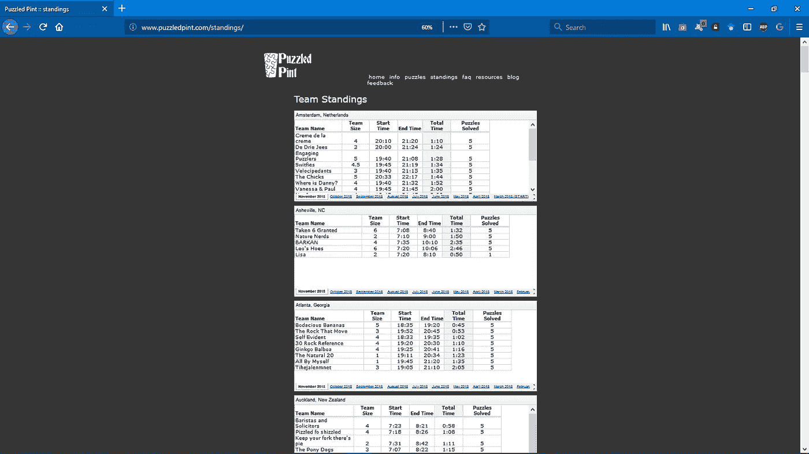

# 静态刮擦与动态刮擦

静态抓取忽略 JavaScript。它不需要浏览器的帮助就可以从服务器获取网页。你得到的正是你在“查看页面源代码”中看到的内容，然后你对它进行分割。如果你正在寻找的内容是可用的，你不需要再进一步。但是，如果内容类似于“iframe ”,就需要动态抓取。

动态抓取使用实际的浏览器(或无头浏览器),让 JavaScript 来完成它的工作。然后，它查询 DOM 来提取它正在寻找的内容。有时，您需要通过模拟用户来获得您需要的内容，从而使浏览器自动化。为了让我获得其余帖子的相同详细信息，我需要首先导航到下一页，这包括单击搜索结果页底部的 next 按钮。

# 用 Docker 设置 RSelenium

RSelenium 为 Selenium Webdriver API 提供了 **R** 绑定。Selenium 是一个专注于 web 浏览器自动化的项目。

您需要遵循 Windows 或 Ubuntu 上 Docker Toolbox 的[安装说明](https://docs.docker.com/toolbox/toolbox_install_windows/)。

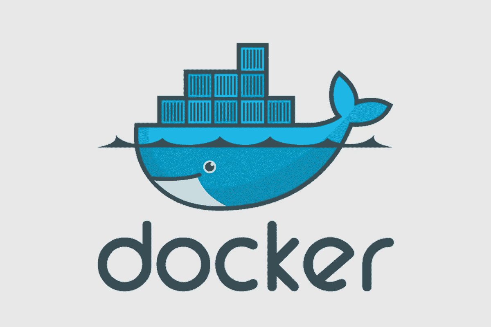

Docker 通过使用容器来运行应用程序。容器只是一个包中的一组库和其他依赖项。你可以把它想象成一个虚拟机，但它不是创建一个完整的操作系统，而是允许应用程序使用同一个 Linux 内核，只是没有在主机上运行。基本上，它显著提高了性能并减小了应用程序的大小。此外，您可以放心，应用程序将在任何其他 Linux 机器上运行，而不管该机器的任何定制设置可能与用于编写和测试代码的机器不同。

你还需要[安装 TightVNC](http://www.tightvnc.com/download.php) ，这将允许你看到你是如何用 RSelenium 实时操纵网页的。

接下来按照[的说明创建一个 Docker 容器，运行 selenium 服务器和它自己的 firefox](http://ropensci.github.io/RSelenium/articles/docker.html) 。

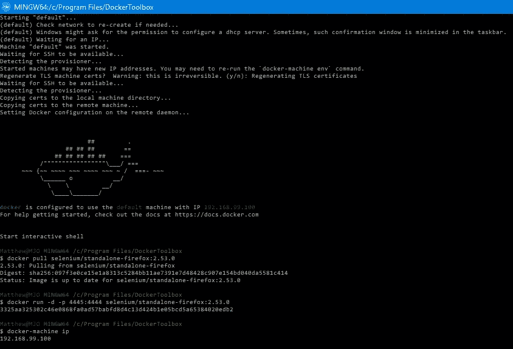

> *注意:一旦你设置了 docker 容器(并且每次你重新启动你的计算机或再次启动时),打开 Docker Quickstart 终端并运行下面的命令。*

```
docker run -d -p 4445:4444 selenium/standalone-firefox:2.53.0
```

现在你已经启动了你的 **Docker Quickstart 终端**进入 **R** 并连接到一个正在运行的服务器。

```
library(RSelenium)
remDr <- remoteDriver(
  remoteServerAddr = "192.168.99.100",
  port = 4445L
)
remDr$open()
```

使用 Rselenium 导航到页面。

```
# navigate to the website of interest
remDr$navigate("[http://www.puzzledpint.com/standings/](http://www.puzzledpint.com/standings/)")
# confirm you got there
remDr$getTitle()0
```

好了，让我们在 RStudio 的**查看器**选项卡中获取一个现场截图。

```
remDr$screenshot(display = TRUE)
```

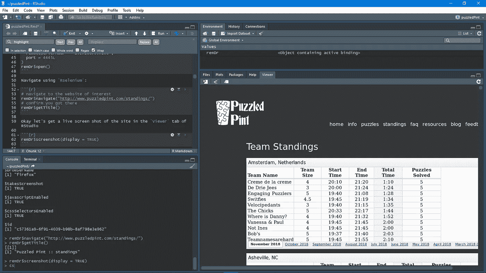

请记住，这只是一个静态的屏幕截图。在开发你的管道时，你需要使用 **TightVNC** 来实时查看你的互动，这样你就可以看到你是如何与网站互动的。

> 当你在你的`…$findElement()`和`…$switchToFrame()` / `…$clickElement()`命令之间使用`…$highlightElement()`时，注意 TightVNC 是很重要的，这样你实际上知道你选择了合适的东西！

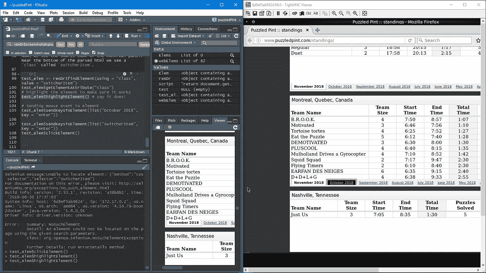

打开 **TighVNC 查看器**，输入端口号；在本例中为`192.168.99.100`，并在**远程主机:**字段中输入。点击**连接**，输入密码:`secret`。

> 注意:如果 TightVNC 停止工作(在 Windows 10 上经常如此)并给出错误消息:“由于目标机器主动拒绝，无法建立连接”，那么请按照[“使用 VNC 调试”的步骤进行操作。](http://ropensci.github.io/RSelenium/articles/docker.html)

# 访问 DOM 中的元素

网页是一组嵌套对象(统称为**文档对象模型**或 **DOM** )。它是一种跨平台和独立于语言的约定，用于表示 HTML、XHTML 和 XML 文档中的对象并与之交互。与 DOM 的互动对我们与硒元素的关系非常重要。

Hadley Wickham 建议使用 Chrome 扩展软件 [Selectorgadget](http://selectorgadget.com/) ，来帮助识别你需要的网页元素。他推荐[这一页](http://flukeout.github.io/)来学习更多关于选择器的知识。

例如，通过使用 SelectorGadget，您可以选择感兴趣的表。在这种情况下，它说这是一个 **iframe** 。为了仅隔离月度排名，我们将单击另一个框，仅选择感兴趣的一个:`iframe:nth-child(68)`。

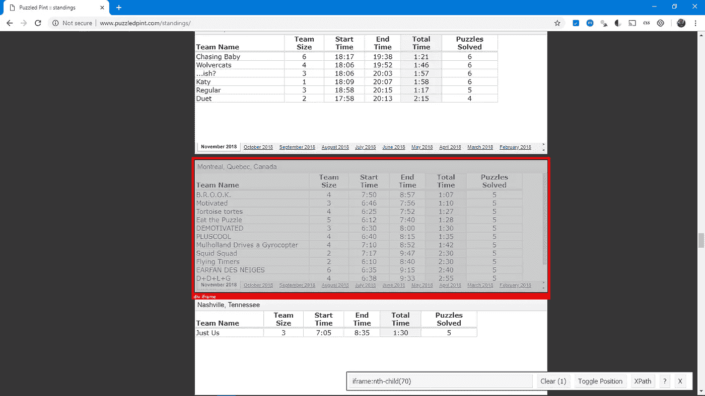

在 web 浏览器的上下文中，框架是网页或浏览器窗口的一部分，它独立于其容器显示内容，并具有独立加载内容的能力。在这种情况下，网站从另一个来源获取数据，在主排名页面之外以交互方式显示这些表格。对我来说幸运的是，它们都来自 Google Sheets，所以这将使我更加容易。遗憾的是，您无法使用“selectorgadget”找到这些工作表的链接。你需要在 Chrome 或 Firefox 中使用名为“Inspector”的开发者工具仔细查看源代码。如果你有 Windows 和 Firefox，你可以点击**打开菜单**然后点击`Web Developer > Inspector`或者直接点击`Ctrl+Shift+c`。然后我用搜索框寻找 Montréal 的链接(`src=`)。

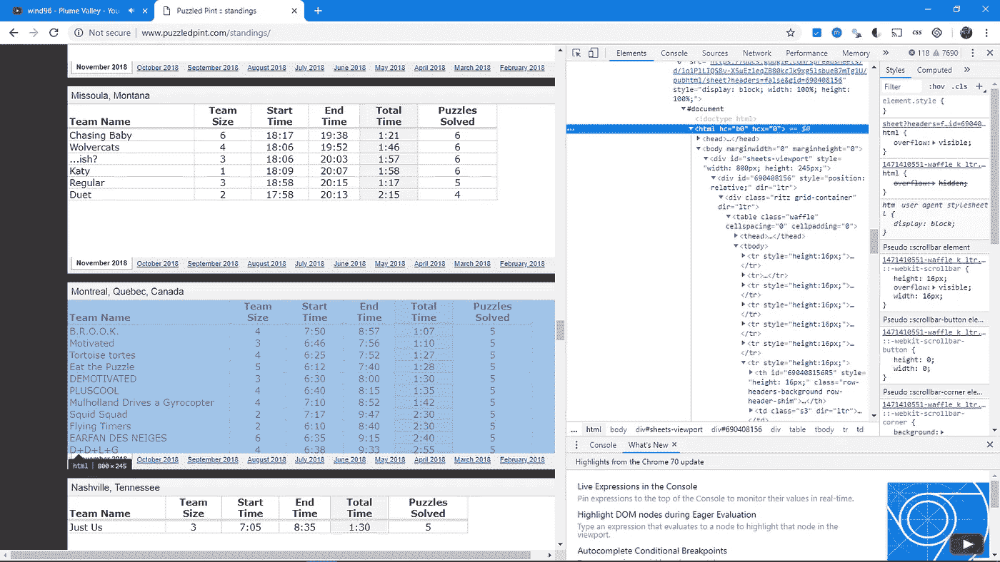

> 对我来说，找到我要找的东西是一件非常痛苦的事情，因为有时候高光看起来像你想要的，但实际上不是。例如:

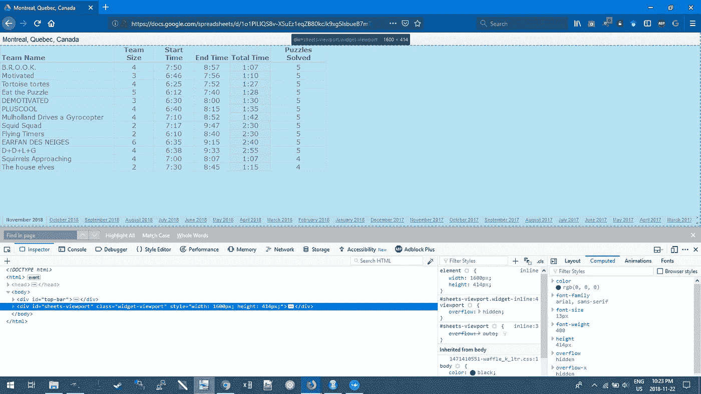

最后，我猜要弄清楚 HTML，它涉及到逐渐的“**拒绝和错误**”尝试。

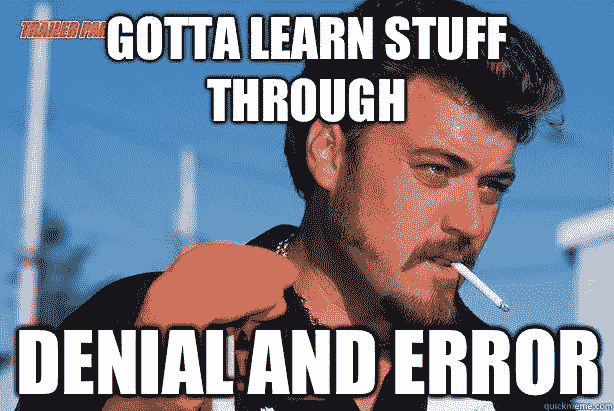

# 用 RSelenium 抓取 Google 表单

## 法律免责声明

值得一提的是，管理员可能出于多种原因[想要保护他们网站的某些部分](http://www.robotstxt.org/norobots-rfc.txt)，例如"*对未经宣布的站点进行索引、遍历需要大量服务器资源的站点部分、递归遍历无限 URL 空间等。*

因此，应该经常检查他们是否有许可。一种方法是使用 robotstxt 包来检查你的网络机器人是否有权限访问网页的某些部分。

```
# check permissions
library(robotstxt)
paths_allowed("[https://docs.google.com/spreadsheets/d/1o1PlLIQS8v-XSuEz1eqZB80kcJk9xg5lsbueB7mTg1U/pub?output=html&widget=true#gid=690408156](https://docs.google.com/spreadsheets/d/1o1PlLIQS8v-XSuEz1eqZB80kcJk9xg5lsbueB7mTg1U/pub?output=html&widget=true#gid=690408156)")
```

如果在特定的页面上写着**真**你就有权限。或者，只需转到主页 url 上的 robots.txt 文件，就可以更广泛地了解什么是允许的(什么是不允许的)。

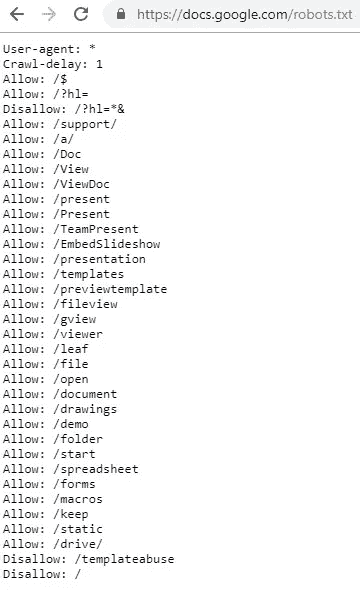

## 方法 1

有时候网站可以用框架来组成。这些实际上是被放在一个框架集中的独立网页。我们需要在这些帧之间来回跳转。

```
library(RSelenium)
library(XML)
library(janitor)
library(lubridate)
library(magrittr)
library(dplyr)remDr <- remoteDriver(
  remoteServerAddr = "192.168.99.100",
  port = 4445L
)
remDr$open()# Now open TightVNC to follow along with Selenium driving the browser. Set 192.168.99.100:5901 and password: secret# navigate to the main page
remDr$navigate("[https://docs.google.com/spreadsheets/d/1o1PlLIQS8v-XSuEz1eqZB80kcJk9xg5lsbueB7mTg1U/pub?output=html&widget=true#gid=690408156](https://docs.google.com/spreadsheets/d/1o1PlLIQS8v-XSuEz1eqZB80kcJk9xg5lsbueB7mTg1U/pub?output=html&widget=true#gid=690408156)")# [https://docs.google.com/spreadsheets/d/1o1PlLIQS8v-XSuEz1eqZB80kcJk9xg5lsbueB7mTg1U/pub?output=html&widget=true#gid=552987877](https://docs.google.com/spreadsheets/d/1o1PlLIQS8v-XSuEz1eqZB80kcJk9xg5lsbueB7mTg1U/pub?output=html&widget=true#gid=552987877)# look for table element
tableElem <- remDr$findElement(using = "id", "pageswitcher-content")# switch to table
remDr$switchToFrame(tableElem)
# parse html
doc <- htmlParse(remDr$getPageSource()[[1]])
table_tmp <- readHTMLTable(doc)
table_tmp <- table_tmp[[1]][-2,-1]
table_tmp <- table_tmp[-1,]
colnames(table_tmp) <- c("team_name", "team_size", "start_time", "end_time", "total_time", "puzzels_solved")
table_tmp$city <- rep("montreal", nrow(table_tmp))
table_tmp$date <- rep(Sys.Date()-5, nrow(table_tmp))
```

现在我们有了第一个月，我们可以为剩下的日期创建一个 for 循环。首先让我们切换回外部框架，并选择我们将要操作的元素。

```
# switch back to the main/outter frame
remDr$switchToFrame(NULL)# find the elements you'll manipulate with Inspector mode in a browser
webElems <- remDr$findElements(using = "css", ".switcherItem") # Month/Year tabs at the bottom
arrowElems <- remDr$findElements(using = "css", ".switcherArrows") # Arrows to scroll left and right at the bottom
tableElem <- remDr$findElement(using = "id", "pageswitcher-content") # The inner table frame
```

我知道会有很多桌子，但是到底有多少呢？我们可以通过`length(webElems)`来检查这个。

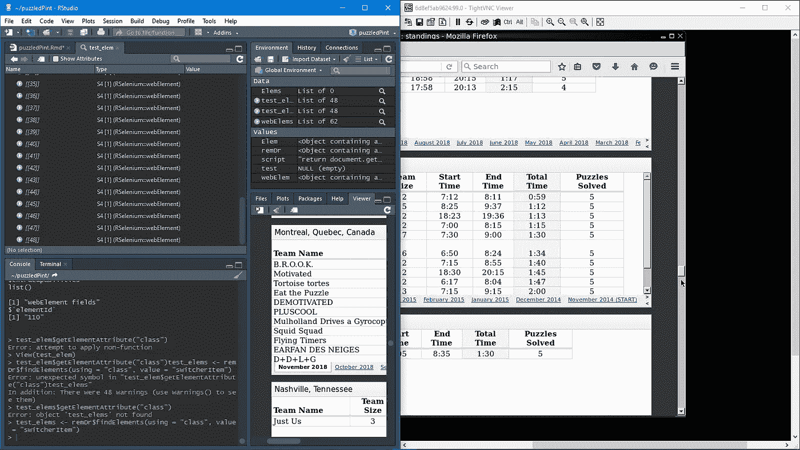

实际上总共有 49 个表，但是从上面的第一个表开始，只有 48 个链接。与其硬编码`1:48`,不如通过代码来实现，因为将来会添加更多的表。

```
# Create NULL object to be used in forloop
big_df <- NULL
for (i in seq(length(webElems))){ # for every 
check <- try(expression, silent = TRUE) # or suppressMessages(try(expression, silent = TRUE))
if (any(class(check) == "try-error")) {
        # choose the i'th Month/Year tab 
        webElem <- webElems[[i]]
        webElem$clickElement()# Find the tableElem again other wise you get a StaleElementReference 
## TO DO: look into WebDriverWait: [https://stackoverflow.com/questions/5709204/random-element-is-no-longer-attached-to-the-dom-staleelementreferenceexception](https://stackoverflow.com/questions/5709204/random-element-is-no-longer-attached-to-the-dom-staleelementreferenceexception) 
tableElem <- remDr$findElement(using = "id", "pageswitcher-content") # The inner table frame# switch to table frame
remDr$switchToFrame(tableElem)
Sys.sleep(3)
# parse html with XML package
doc <- htmlParse(remDr$getPageSource()[[1]])
Sys.sleep(3)
# Extract data from HTML table in HTML doucment
table_tmp <- readHTMLTable(doc)
Sys.sleep(3)
# put this into a format you can use
table <- table_tmp[[1]][-2,-1]
table <- table[-1,]
# rename the columns
colnames(table) <- c("team_name", "team_size", "start_time", "end_time", "total_time", "puzzels_solved")
# add city name to a column
table$city <- rep("Montreal", nrow(table))# add the Month/Year this table was extracted from
today <- Sys.Date() %m-% months(i + 1)
table$date <- today# concatenate each table together
big_df <- dplyr::bind_rows(big_df, table)# Switch back to the main frame
remDr$switchToFrame(NULL)arrowElem <- arrowElems[[1]]
# once you "click"" the element it is "held down" as far as I know there is no way to " unclick"
# to prevent it from scrolling too far I make sure not to take too long by setting the sleep short
arrowElem$clickElement()
# give it "just enough time" to scroll right
Sys.sleep(0.3)
# switch back to outer frame to re-start the loop
remDr$switchToFrame(NULL)
        }
}temp1 <- dplyr::bind_rows(table_tmp, big_df)
```

这里的问题是，当 for 循环试图单击右箭头时，它最终会失败，但它已经尽可能地向右了，因此它不会下载最后几个表(~5)。通常情况下，人们会这样处理这种情况:

```
check <- try(expression, silent = TRUE) # or suppressMessages(try(expression, silent = TRUE))
if (any(class(check) == "try-error")) {
  # do stuff
}
```

它通常运行良好，包括使用硒时。然而，这里遇到的问题是，单击一次箭头总是会将我带到最后一张*可见的工作表，跳过中间的所有内容。因此，我的工作是这样的:*

```
# ctrl+x from the google sheet then use the read.delim() to assign it to an object
march <- read.delim("clipboard")
february <- read.delim("clipboard")
january <- read.delim("clipboard")
december <- read.delim("clipboard")
november <- read.delim("clipboard")# add the city and date
january$city <- rep("montreal", nrow(january))
january$date <- rep("2015-01-30", nrow(january))february$city <- rep("montreal", nrow(february))
february$date <- rep("2015-02-15", nrow(february))march$city <- rep("montreal", nrow(march))
march$date <- rep("2015-03-15", nrow(march))december$city <- rep("montreal", nrow(december))
december$date <- rep("2014-12-15", nrow(december))november$city <- rep("montreal", nrow(november))
november$date <- rep("2014-11-15", nrow(november))# clean up the column names
january %<>% janitor::clean_names()
february %<>% janitor::clean_names()
march %<>% janitor::clean_names()
december %<>% janitor::clean_names()
november %<>% janitor::clean_names()# concatenate these five dataframes together
xyz <- bind_rows(march, february, january, december, november)# convert characters into actual dates
xyz$date <-as.Date(xyz$date)# reorder the columns
xyz %<>% dplyr::select(team_name, team_size, start_time, end_time, total_time, puzzles, city, date)# rename this column to match temp1
xyz <- rename(xyz, puzzels_solved = puzzles)# change to a character
xyz$puzzels_solved <- as.character(xyz$puzzels_solved)# add NA for team size
xyz$team_size <- rep(NA, nrow(xyz))# concatenate this onto the larger dataframe
temp2 <- bind_rows(temp1, xyz)# save the object
write_csv(temp2, "puzzeld_pint_raw.csv")
```

## 方法 2

非常感谢 Nate on SO 指出了一个替代方案，解决了*废弃表*的任务，但**没有解决上述意义上的**异常处理的任务。

```
remDr <- RSelenium::remoteDriver(
  remoteServerAddr = "192.168.99.100",
  port = 4445L
)
remDr$open(silent = TRUE)# navigate to the main page
# needs no be done once before looping, else content is not available
remDr$navigate("https://docs.google.com/spreadsheets/d/1o1PlLIQS8v-XSuEz1eqZB80kcJk9xg5lsbueB7mTg1U/pub?output=html&widget=true#gid=690408156")# I. Preliminaries:
# 
# 1\. build the links to all spreadsheets
# 2\. define the function create_table
# 
# 1.
# get page source
html <- remDr$getPageSource()[[1]]
# split it line by line
html <- unlist(strsplit(html, '\n'))
# restrict to script section
script <- grep('^\\s*var\\s+gidMatch', html, value = TRUE)
# split the script by semi-colon
script <- unlist(strsplit(script, ';'))
# retrieve information
sheet_months <- gsub('.*name:.{2}(.*?).{1},.*', '\\1', 
                     grep('\\{name\\s*\\:', script, value = TRUE), perl = TRUE)
sheet_gid <- gsub('.*gid:.{2}(.*?).{1},.*', '\\1', 
                  grep('\\gid\\s*\\:', script, value = TRUE), perl = TRUE)
sheet_url <- paste0('https://docs.google.com/spreadsheets/d/1o1PlLIQS8v-XSuEz1eqZB80kcJk9xg5lsbueB7mTg1U/pubhtml/sheet?headers%5Cx3dfalse&gid=',
                    sheet_gid)# 2.
# table yielding function
# just for readability in the loop
create_table <- function (remDr) {
  # parse html with XML package
  doc <- XML::htmlParse(remDr$getPageSource()[[1]])
  Sys.sleep(3)
  # Extract data from HTML table in HTML document
  table_tmp <- XML::readHTMLTable(doc)
  Sys.sleep(3)
  # put this into a format you can use
  table <- table_tmp[[1]][-2, -1]
  # add a check-up for size mismatch
  table_fields <- as.character(t(table[1,]))
  if (! any(grepl("size", tolower(table_fields)))) {
    table <- table[-1, ]
    # rename the columns
    colnames(table) <- c("team_name", "start_time", "end_time", "total_time", "puzzels_solved")
    table$team_size <- NA_integer_
    table <- table[,c("team_name", "team_size", "start_time", "end_time", "total_time", "puzzels_solved")]
  } else {
    table <- table[-1, ]
    # rename the columns
    colnames(table) <- c("team_name", "team_size", "start_time", "end_time", "total_time", "puzzels_solved")
  }
  # add city name to a column
  table$city <- rep("Montreal", nrow(table))

  # add the Month/Year this table was extracted from
  today <- Sys.Date()
  lubridate::month(today) <- lubridate::month(today)+1
  table$date <- today

  # returns the table
  table
}

# II. Scrapping the content
# 
# 1\. selenium to generate the pages
# 2\. use create_table to extract the table
# 
big_df <- NULL
for (k in seq_along(sheet_url)) {
  # 1\. navigate to the page
  remDr$navigate(sheet_url[k])
  # remDr$screenshot(display = TRUE) maybe one wants to see progress
  table <- create_table(remDr)

  # 2\. concatenate each table together
  big_df <- dplyr::bind_rows(big_df, table)

  # inform progress 
  cat(paste0('\nGathered table for: \t', sheet_months[k]))
}

# close session
remDr$close()
```

要执行这项任务，首先要生成文档中所有电子表格的链接。为此:

*   导航到文档一次
*   提取源代码
*   使用`regex`提取工作表月份和 URL(通过`gid`数字)
*   完成后，遍历 URL，收集并绑定表

有一个名为`create_table`的小函数，它以正确的格式返回最终的表格，并对列数进行安全度量(一些电子表格没有`team_size`字段——在这种情况下，我将其设置为`NA_integer`)。

如果你觉得这篇文章有用，请随意与他人分享或推荐这篇文章！😃

一如既往，如果您有任何问题或意见，请随时在下面留下您的反馈，或者您可以随时通过 [LinkedIn](https://www.linkedin.com/in/matthewoldach/) 联系我。在那之前，下一篇文章再见！😄