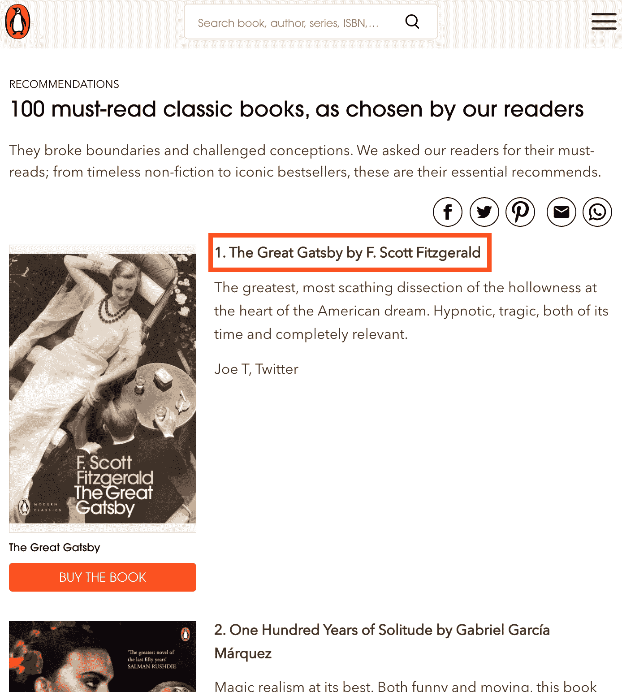
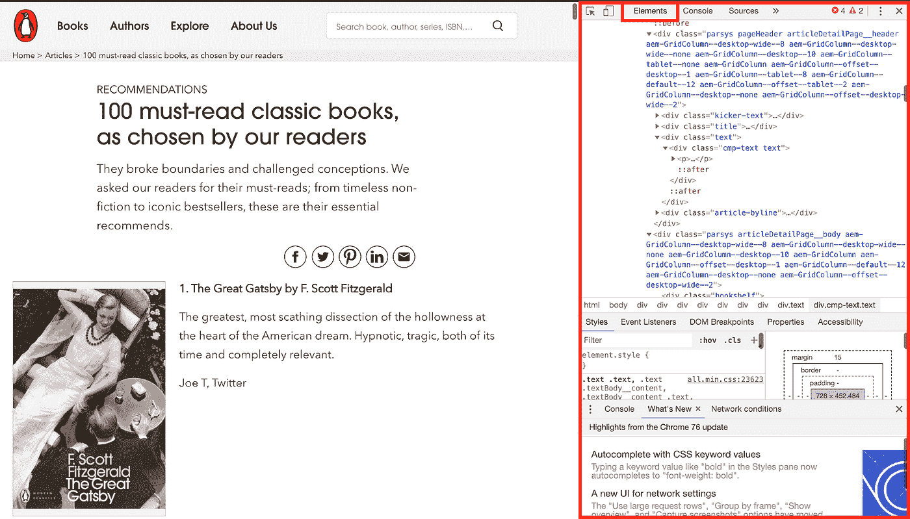
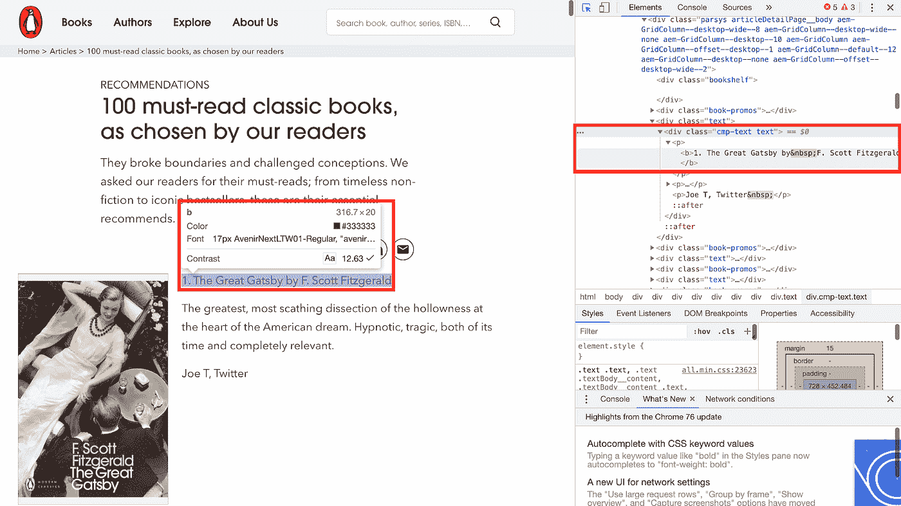
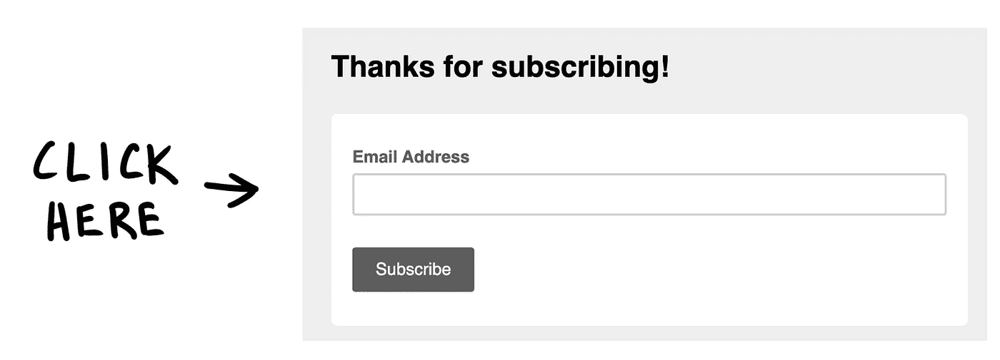

# 5 分钟后进行网页抓取:)

> 原文：<https://towardsdatascience.com/web-scraping-in-5-minutes-1caceca13b6c?source=collection_archive---------9----------------------->


## 如何从头开始构建一个基本的 web 刮刀

# 介绍

对于像我这样天真的人来说，做一些网络搜集是我们能找到的最相似的事情，感觉自己是世界级的黑客，从政府系统中提取一些秘密信息。

如果你想笑就笑吧，但是当你一无所有的时候，网络抓取可以给你一个数据集。当然，对于大多数情况——我们稍后将讨论例外情况……令人惊讶的是，并不是每个人都希望我们偷偷摸摸地浏览他们的网页——我们可以通过使用几个 Python 公共库来应对 web 抓取挑战:

*   ***【请求】*** 调用***导入请求***
*   ***BeautifulSoup'*** 调用 **' *从 bs4 导入 BeautifulSoup'***
*   我们可能还想使用***【tqdm _ notebook】***工具调用 ***【从 tqdm 导入 tqdm _ notebook】***，以防我们需要遍历一个有几个页面的站点。例如，假设我们在搜索“数据科学家”后，试图从[https://indeed.co.uk](https://indeed.co.uk)的所有职位中提取一些信息。我们可能会有几个结果页面。“bs4”库将允许我们以非常简单的方式浏览它们。我们也可以使用一个简单的 for 循环来实现，但是“tqdm_notebook”工具提供了过程演变的可视化，如果我们在一次运行中从一个站点抓取数百或数千个页面，这非常适合

但不管怎样，还是一步一步来吧。在这篇文章中，我们将搜集企鹅出版社的 100 本必读经典书籍。我们将尽力只得到每本书的标题和作者。这个简单的笔记本和其他的可以在我的 [GitHub 简介](https://github.com/gonzaferreiro)中找到(包括整个关于抓取和运行分类模型的项目)。

# 实践应用

当我们抓取一个网站时，基本上我们是从 Python 发出一个请求，并解析每个页面返回的 HTML。如果你在想:HTML 到底是什么？或者如果你在想:废话，我不是网页设计师，我不能处理这个！不要担心，除了如何获取网页 HTML 代码和找到您想要的任何内容之外，您不需要知道任何其他内容。记住，为了这个例子，我们将寻找每本书的标题和作者:



我们可以通过以下方式访问网页 HTML 代码:

*   右键单击>检查
*   或者在 Mac 中按 Command+shift+c

屏幕右侧应该会打开一个窗口。确保站在窗口上部的“元素”选项卡上:



打开此窗口后，如果您站在网页的任何元素上，HTML 代码将自动移动，直到代码的特定部分。看看如果我把我的指针移到第一本书的标题(' 1。F. Scott Fitzgerald 的《了不起的盖茨比》(The Great Gatsby)，HTML 突出了属于网页的该部分的元素:



在这种情况下，文本似乎包含在***'<div class = " CMP-text text ">'*' 中。< div >标签只不过是一个容器单元，它封装了其他页面元素并将 HTML 文档分成几个部分。我们可能会在这个或另一个标签下找到我们的数据。例如，<李>标签用于表示列表中的一项，< h2 >标签表示 HTML 文档中的二级标题(HTML 包含 6 级标题，按重要性排序)。**

理解这一点很重要，因为我们必须指定我们的数据在哪个标签下才能被废弃。但是首先，我们必须实例化一个“请求”对象。这将是一个 get，带有您希望通过请求传递的 URL 和可选参数。

```
url = ‘https://www.penguin.co.uk/articles/2018/100-must-read-classic-books/'r = requests.get(url)
```

现在我们发出了请求，我们必须创建 BeautifulSoup 对象来通过它的 HTML 解析器传递请求文本:

```
soup = BeautifulSoup(r.text,’html.parser’)
```

在这种情况下，我们在 URL 中没有任何特殊的参数。但是让我们回到之前刮 Indeed.co.uk 的例子。在这种情况下，正如我们之前提到的，我们必须使用 tqdm_notebook。该工具作为 for 循环在不同的页面中迭代:

```
for start in tqdm_notebook(range(0, 1000 10)): url = “https://www.indeed.co.uk/jobs?q=datascientist&start{}".format(start) r = requests.get(url) soup = BeautifulSoup(r.text,’html.parser’)
```

请注意我们是如何指定从第 0 页跳到第 100 页，从第 10 页跳到第 10 页，然后使用 ***start={}”将“开始”参数插入到 url 中的。格式(开始)。*** 惊艳！我们已经有了格式良好的 HTML 代码。现在让我们获取数据吧！有几种方法可以做到这一点，但对我来说，最简洁的方法是编写一个简单的函数，在创建 BeautifulSoup 对象后立即执行。

之前我们看到我们的数据(标题+作者信息)位于以下位置:***'<div class = " CMP-text text ">'***。所以我们要做的是分解代码序列，以便找到代码中所有的“cmp-text 文本”元素。为此，我们将使用我们的 BeautifulSoup 对象:

```
for book in soup.find_all(‘div’, attrs={‘class’:’cmp-text text’})
```

这样，我们的 soup 对象将遍历所有代码，找到所有的***【CMP-text text】***元素，并给出每个元素的内容。理解我们在每次迭代中得到什么的一个好方法是打印名为“book.text”的文本。在这种情况下，我们会看到以下内容:

> 1.菲茨杰拉德的《了不起的盖茨比》
> 
> 对美国梦核心空洞的最伟大、最尖刻的剖析。催眠，悲剧，它的时间和完全相关。
> 
> 乔·T，推特

在这里我们可以看到的是，我们的***‘CMP-text text’***元素下的文本包含了书名+作者，同时也包含了书的简要描述。我们可以用几种方法来解决这个问题。为了这个例子，我使用了[正则表达式](https://en.wikipedia.org/wiki/Regular_expression)来调用‘import re’。Regex 本身是一个庞大的主题，但是在这种情况下，我使用了一个非常简单的工具，它总是很方便，您可以很容易地学习。

```
pattern = re.compile(r’(?<=. ).+(?=\n)’)
```

使用我们的“re”对象，我们可以使用 regex lookahead 和 lookahead 工具创建一个模式。指定(？<=behind_text) we can look for whatever **跟随**我们的‘match _ text’。而且用(？=ahead_text)我们表示任何跟在**后面的‘match _ text’，’。一旦 regex 找到我们的代码，我们可以告诉它给我们任何数字，只有字母，特殊字符，一些特定的单词或字母，甚至所有这些的组合。在我们的例子中。+'的表达在中间基本上就是‘把什么都给我拿来’。所以我们会找到介于两者之间的一切。(列表中图书位置后的点和空格)和一个' \n '，这是跳到下一行。**

现在我们只需要向我们的“re”对象传递模式和文本:

```
appender = re.findall(pattern,text)
```

这将为我们提供一个列表，例如，具有以下内容:

```
[‘The Great Gatsby by F. Scott Fitzgerald’]
```

很容易解决调用列表中的文本并在“by”处将其拆分，以便在不同的列表中存储标题和作者。让我们把所有东西放在一个函数里，就像我们之前说的那样:

```
def extract_books_from_result(soup):
 returner = {‘books’: [], ‘authors’: []}
 for book in soup.find_all(‘div’, attrs={‘class’:’cmp-text text’}):

 text = book.text
 pattern = re.compile(r’(?<=. ).+(?=\n)’)
 appender = re.findall(pattern,text)[0].split(‘ by’) # Including a condition just to avoid anything that’s not a book
 # Each book should consist in a list with two elements: 
 # [0] = title and [1] = author

 if len(appender) > 1:
  returner[‘books’].append(appender[0])
  returner[‘authors’].append(appender[1])

 returner_df = pd.DataFrame(returner, columns=[‘books’,’authors’]) 

 return returner_df
```

最后，让我们一起跑吧:

```
url = ‘https://www.penguin.co.uk/articles/2018/100-must-read-classic-books/'r = requests.get(url)soup = BeautifulSoup(r.text,’html.parser’)results = extract_books_from_result(soup)
```

恭喜你！您已经完成了第一次抓取，并且在一个数据帧中拥有了所有数据。现在就看你怎么做了。).

不幸的是，网络抓取并不总是那么容易，因为有几个网站不希望我们偷偷摸摸。在某些情况下，他们会有一个非常复杂的 HTML 来避免新手，但在许多情况下，他们会阻止像我们这样的好人试图获得一些体面的数据。有几种不被发现的方法，但可悲的是，这篇文章已经远离了我和我在五分钟内学会网络抓取的承诺。但是不要担心，在不久的将来我会写更多关于这个的东西。所以敬请期待；)

最后，请记住:这个简单的笔记本和其他的可以在我的 [GitHub 简介](https://github.com/gonzaferreiro)中找到(包括关于抓取和运行分类模型的整个项目)。此外，不要忘了查看我的上一篇文章，关于我在使用火车测试分裂时犯的 [6 个业余错误，以及在我的](/6-amateur-mistakes-ive-made-working-with-train-test-splits-916fabb421bb?source=friends_link&sk=328f48f56ce8b889506a1b55f3e97968)[作者简介](https://towardsdatascience.com/@g.ferreiro.volpi)中的更多关于数据科学的内容。如果你喜欢这篇文章，别忘了关注我，**如果你想直接在你的电子邮件上收到我的最新文章，就订阅我的时事通讯吧:)**

[](https://gmail.us3.list-manage.com/subscribe?u=8190cded0d5e26657d9bc54d7&id=3e942158a2)

感谢阅读！